---
AIGC:
    Label: "1"
    ContentProducer: 001191440300708461136T1XGW3
    ProduceID: 278e15af09c947df43b62560d322c33a_a8dfa7f9b40c11f1a1a1525400393706
    ReservedCode1: 6X3cs0FSzFzQn8frK6R/iewYjqXN5Ed2DZ0QTRUBagTRMK+QE9nOJ3QIdOy9d5rNUby/1tyfArZBZ7Oi8Vp65a1FhM8EcoSJanhCyUtxb+bPHuPrkHaEcNSWWOgD+rJdGB6YKVe79iGhsImo/o9indgS0vTNZHeWnybVNHl2WDEeNnmiWSJyTF9wbMg=
    ContentPropagator: 001191440300708461136T1XGW3
    PropagateID: 278e15af09c947df43b62560d322c33a_a8dfa7f9b40c11f1a1a1525400393706
    ReservedCode2: 6X3cs0FSzFzQn8frK6R/iewYjqXN5Ed2DZ0QTRUBagTRMK+QE9nOJ3QIdOy9d5rNUby/1tyfArZBZ7Oi8Vp65a1FhM8EcoSJanhCyUtxb+bPHuPrkHaEcNSWWOgD+rJdGB6YKVe79iGhsImo/o9indgS0vTNZHeWnybVNHl2WDEeNnmiWSJyTF9wbMg=
title: AI算法用于日志异常分析（Python）
published: 2026-09-19
pinned: false
description: 基于 Python 的日志异常分析实验：用 Drain 算法解析 HDFS 模拟日志并统计模板频率，用 TF-IDF + Isolation Forest 完成异常检测，再在实验4专用 DVWA 环境中执行 SQL 注入、暴力破解、目录扫描等真实攻击，对比规则统计法与 AI 算法两种检测结果。
tags: [日志分析, AI算法, Drain, IsolationForest, DVWA, 异常检测]
category: 日志审计
licenseName: ''
author: Mudrock
sourceLink: ''
slug: ai-log-anomaly-detection
image: ./images/LogAuditExp4/log-01.png
---

记录「AI算法用于日志异常分析（Python）」实验的完整过程：先用 Drain 算法对 HDFS 模拟日志做模板解析与频率统计，再用 TF-IDF 提取特征、Isolation Forest 完成异常检测；随后部署实验4专用 DVWA 环境，执行 SQL 注入、暴力破解、目录扫描等真实攻击，并分别用规则统计法与 AI 算法分析攻击日志，对比两种检测方式的差异。

## 一、实验目的及要求

使用AI算法进行日志分析和异常检测，理解AI算法在日志分析中的应用，学会使用对应算法分析带有真实攻击行为的日志

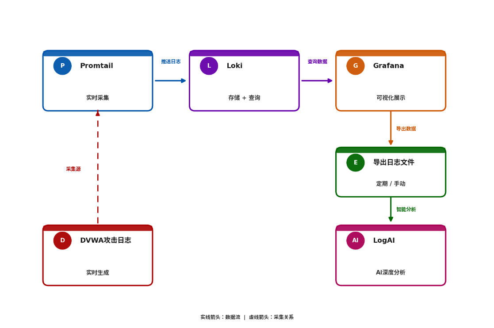

实验4，引入用于日志分析的AI算法进行分析。

图1 实验架构图

## 实验原理与内容

本实验聚焦日志异常分析的Python实现，核心技术为Drain算法与Isolation Forest异常检测。Drain采用固定深度树结构，通过预处理替换IP、数字等变量，分层匹配日志token生成通用模板，将非结构化日志转化为可统计的模式；随后基于TF-IDF提取日志特征，利用Isolation Forest模型识别偏离正常分布的异常日志。实验分为三部分：一是构造HDFS模拟日志数据集，用Drain解析模板并统计频率；二是训练Isolation Forest模型，评估其对模拟日志异常的检出效果；三是部署实验4专用DVWA环境，执行SQL注入、暴力破解、目录扫描等真实攻击，分别用规则统计法和AI法分析攻击日志，对比两种检测方式的差异。

## 三、实验软硬件环境

Kali Linux操作系统、Python开发环境，安装pandas、numpy、scikit-learn、matplotlib、seaborn等依赖包；部署Docker容器运行实验4专用栈（含DVWA靶机、Loki日志存储、Promtail采集、Grafana可视化）；攻击阶段使用sqlmap、hydra、dirb等渗透测试工具。

## 四、实验过程（实验步骤、记录、数据、分析）

### 任务1：环境配置与算法相关包安装

#### 步骤1.1 创建实验目录和虚拟环境

```bash
# 创建实验4目录
mkdir -p ~/log-lab/exp4
cd ~/log-lab/exp4
```

```bash
# 创建子目录
mkdir -p data output scripts
```

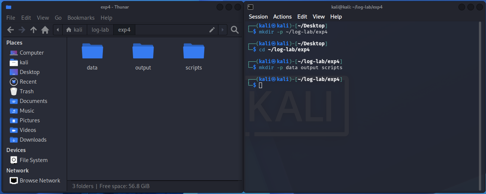

```bash
# 创建Python虚拟环境
python3 -m venv venv
# 激活虚拟环境
source venv/bin/activate
# 验证虚拟环境
which python3
# 预期输出：~/log-lab/exp4/venv/bin/python3
```

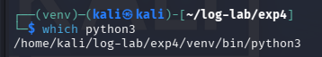

#### 1.2 安装ai算法所需核心依赖

```bash
# 升级pip
pip install --upgrade pip
# 安装依赖
pip install pandas numpy scikit-learn matplotlib seaborn
```

#### 1.3 功能包检验

```python
#验证基础包功能
cat > ~/log-lab/exp4/scripts/verify_env.py <<'PYEOF'
#!/usr/bin/env python3
"""基础环境安装检验脚本"""
import sys
def test_imports():
"""测试关键模块导入"""
print("=" * 50)
print("基础环境安装检验")
print("=" * 50)
tests = [
("pandas", "pd"),
("numpy", "np"),
("sklearn", "sklearn"),
("matplotlib", "plt"),
("seaborn", "sns"),
]
all_passed = True
for module, alias in tests:
try:
__import__(module)
print(f"✓ {module:15} 导入成功")
except ImportError as e:
print(f"✗ {module:15} 导入失败: {e}")
all_passed = False
print("\n" + "=" * 50)
if all_passed:
print("✓ 所有检验通过！基础环境安装成功。")
print("=" * 50)
return 0
else:
print("✗ 部分检验失败，请检查安装。")
print("=" * 50)
return 1
if __name__ == "__main__":
sys.exit(test_imports())
PYEOF
```

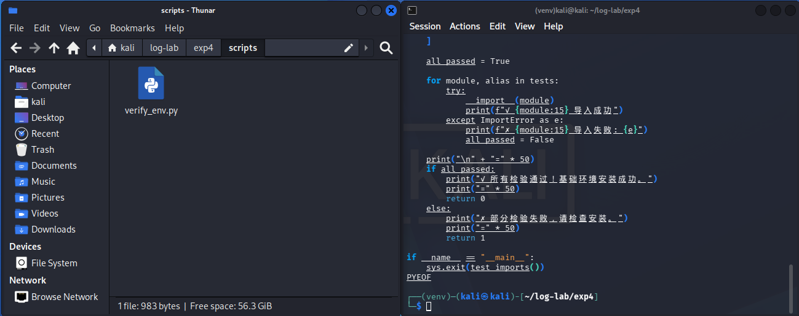

```bash
python ~/log-lab/exp4/scripts/verify_env.py
```

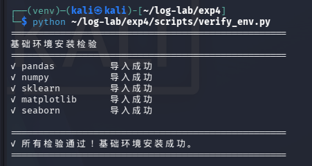

### 任务2：创建核心模块（Drain解析器）

#### 2.1 创建Drain解析器

```python
# 创建解析脚本
cat > ~/log-lab/exp4/scripts/drain_parser.py <<'PYEOF'
#!/usr/bin/env python3
"""
Drain日志解析器 - 纯Python实现
参考：Drain: An Online Log Parsing Approach with Fixed Depth Tree (ICWS 2017)
"""
import re
from collections import defaultdict
class DrainNode:
"""解析树节点"""
def __init__(self, depth=0):
self.depth = depth
self.children = {}      # token -> DrainNode
self.template_id = None  # 叶子节点存储模板ID
class DrainParser:
"""
Drain算法实现
"""
def __init__(self, depth=4, sim_threshold=0.5, max_children=100):
self.depth = depth
self.sim_threshold = sim_threshold
self.max_children = max_children
self.root = DrainNode(depth=0)
self.templates = {}      # id -> token列表
self.template_str = {}   # id -> 字符串
self.template_count = defaultdict(int)
self.next_id = 0
def _preprocess(self, log_line):
"""预处理：替换变量"""
# 替换IP地址
line = re.sub(r'\d+\.\d+\.\d+\.\d+(:\d+)?', '<IP>', log_line)
# 替换十六进制
line = re.sub(r'0x[0-9a-fA-F]+', '<HEX>', line)
# 替换长数字ID
line = re.sub(r'\b\d{4,}\b', '<ID>', line)
# 替换普通数字
line = re.sub(r'\b\d+\b', '<*>', line)
return line
def _get_first_token(self, tokens):
"""第一层分组key"""
if len(tokens) >= 2:
return f"{tokens[0]} {tokens[1]}"
return tokens[0] if tokens else ""
def _similarity(self, t1, t2):
"""计算两个token列表的相似度"""
if len(t1) != len(t2):
return 0.0
match = sum(1 for a, b in zip(t1, t2) if a == b)
return match / len(t1)
def _merge(self, template, tokens):
"""合并模板"""
return ['<*>' if a != b else a for a, b in zip(template, tokens)]
def parse(self, log_lines):
"""解析日志列表"""
results = []
for idx, line in enumerate(log_lines):
# 预处理
preprocessed = self._preprocess(line)
tokens = preprocessed.split()
if not tokens:
results.append({
'log_id': idx,
'log_line': line,
'template_id': -1,
'template': '',
'similarity': 0.0
})
continue
# 第一层分组
first_token = self._get_first_token(tokens)
if first_token not in self.root.children:
self.root.children[first_token] = DrainNode(depth=1)
# 在树中搜索最佳匹配
best_sim = -1
best_tid = None
# 简化：线性搜索所有模板（小数据量足够）
for tid, template in self.templates.items():
# 快速过滤：长度相同才比较
if len(template) != len(tokens):
continue
sim = self._similarity(template, tokens)
if sim > best_sim:
best_sim = sim
best_tid = tid
if best_sim >= self.sim_threshold and best_tid is not None:
# 匹配成功，更新模板
merged = self._merge(self.templates[best_tid], tokens)
self.templates[best_tid] = merged
self.template_str[best_tid] = ' '.join(merged)
self.template_count[best_tid] += 1
results.append({
'log_id': idx,
'log_line': line,
'template_id': best_tid,
'template': self.template_str[best_tid],
'similarity': best_sim
})
else:
# 创建新模板
tid = self.next_id
self.next_id += 1
self.templates[tid] = tokens
self.template_str[tid] = ' '.join(tokens)
self.template_count[tid] = 1
results.append({
'log_id': idx,
'log_line': line,
'template_id': tid,
'template': self.template_str[tid],
'similarity': 0.0
})
return results
def get_stats(self):
"""获取模板统计信息"""
stats = []
for tid in sorted(self.templates.keys()):
stats.append({
'template_id': tid,
'template': self.template_str[tid],
'count': self.template_count[tid]
})
return sorted(stats, key=lambda x: x['count'], reverse=True)
if __name__ == "__main__":
print("✓ Drain解析器模块可用")
PYEOF
```

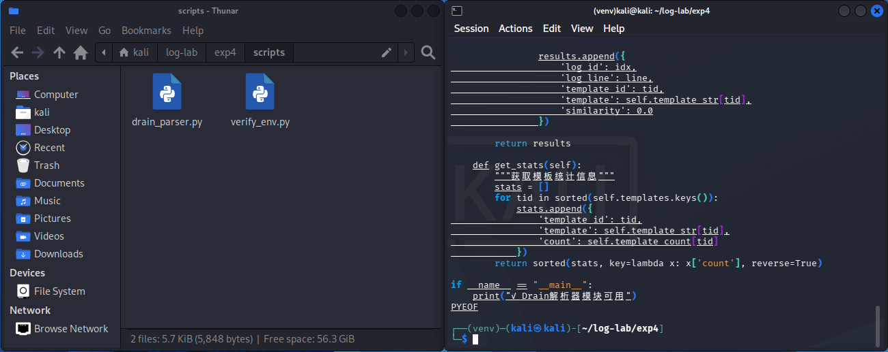

```bash
# 验证
# 验证模块可导入
python3 ~/log-lab/exp4/scripts/drain_parser.py
```

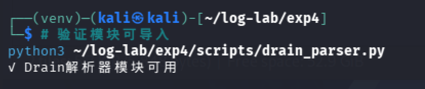

### 任务3：准备数据集（手工构造一个用于算法检验的数据集）

#### 步骤3.1 验证数据集目录是否存在

```bash
# 验证
ls -la ~/log-lab/exp4/data
```

#### 步骤3.2 创建示例HDFS日志数据

```python
cat > ~/log-lab/exp4/scripts/create_sample_data.py <<'PYEOF'
#!/usr/bin/env python3
"""创建示例日志数据集"""
import pandas as pd
import random
import os
from datetime import datetime, timedelta
print("=" * 50)
print("创建示例日志数据集")
print("=" * 50)
# 创建HDFS模拟日志
print("\n[1/2] 创建HDFS模拟日志...")
hdfs_templates = [
"INFO dfs.DataNode: Receiving block blk_{id} src: /10.250.19.102:50010 dest: /10.250.19.102:50010",
"INFO dfs.DataNode: Received block blk_{id} of size 67108864 from /10.251.42.12",
"INFO dfs.FSNamesystem: BLOCK* NameSystem.allocateBlock: /user/hdfs/file_{id}.blk_{id}",
"WARN dfs.DataNode: Failed to transfer blk_{id} to /10.251.42.13:50010, got java.io.IOException",
"ERROR dfs.DataNode: Exception in receiveBlock for block blk_{id} java.io.EOFException",
"INFO dfs.FSNamesystem: BLOCK* NameSystem.addStoredBlock: blockMap updated: 10.250.19.102:50010 is added to blk_{id}",
"WARN dfs.FSNamesystem: BLOCK* NameSystem.addToInvalidates: blk_{id} is added to invalidSet of 10.251.42.12:50010",
"ERROR dfs.FSNamesystem: BLOCK* NameSystem.addStoredBlock: Redundant addStoredBlock request received for blk_{id}",
]
normal_logs = []
anomaly_logs = []
# 生成正常日志（90%）
for i in range(900):
template = random.choice(hdfs_templates[:4])
log_id = f"{random.randint(1000000000, 9999999999)}"
log_line = template.format(id=log_id)
normal_logs.append({
'log_line': log_line,
'Label': 0,
'timestamp': datetime.now() - timedelta(minutes=random.randint(0, 1440))
})
# 生成异常日志（10%）
for i in range(100):
template = random.choice(hdfs_templates[4:])
log_id = f"{random.randint(1000000000, 9999999999)}"
log_line = template.format(id=log_id)
anomaly_logs.append({
'log_line': log_line,
'Label': 1,
'timestamp': datetime.now() - timedelta(minutes=random.randint(0, 1440))
})
hdfs_df = pd.DataFrame(normal_logs + anomaly_logs)
hdfs_df.to_csv('~/log-lab/exp4/data/hdfs_logs.csv', index=False)
print(f"✓ HDFS日志: {len(hdfs_df)} 条（正常:{len(normal_logs)}, 异常:{len(anomaly_logs)}）")
print("\n[2/2] 数据集准备完成！")
print("=" * 50)
PYEOF
```

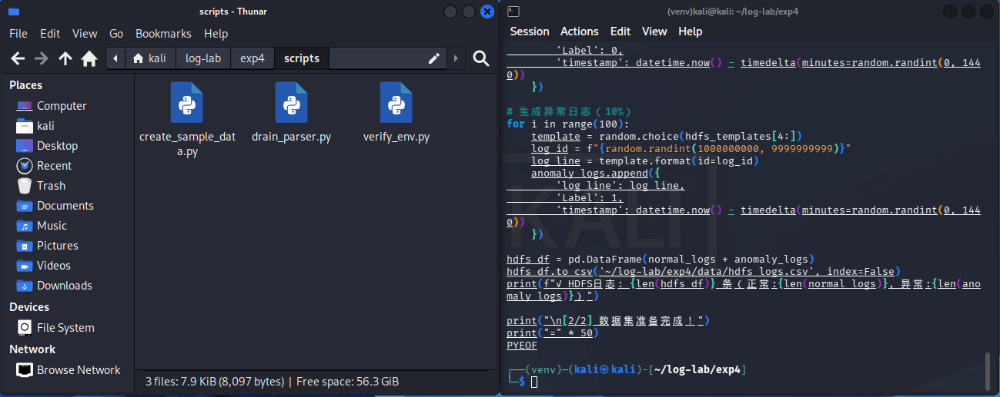

#### 步骤3.3 执行数据创建脚本

```bash
python ~/log-lab/exp4/scripts/create_sample_data.py
```

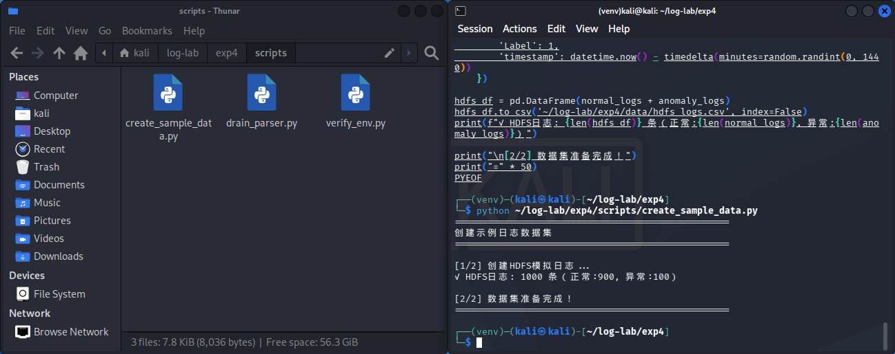

#### 步骤3.4 验证数据集

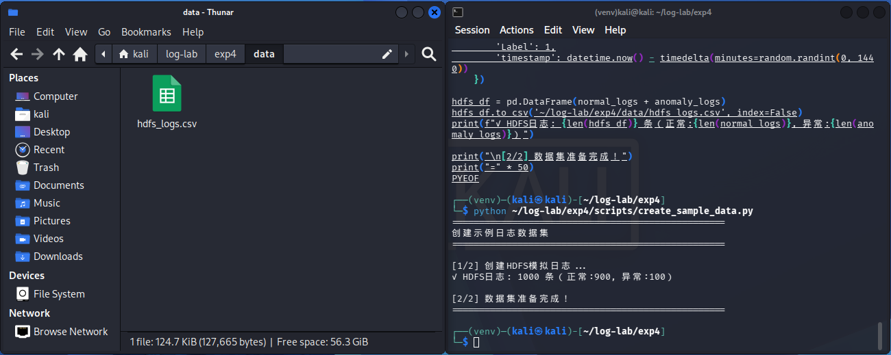

```bash
# 查看数据内容
head -5 ~/log-lab/exp4/data/hdfs_logs.csv
```

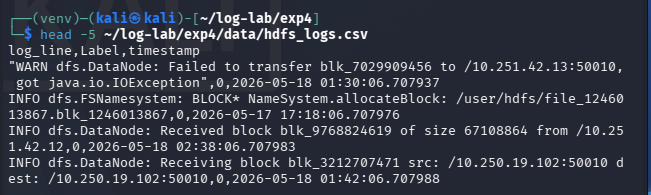

### 任务4：日志解析（Drain算法）

#### 步骤4.1 创建解析脚本

```python
cat > ~/log-lab/exp4/scripts/parse_logs.py <<'PYEOF'
#!/usr/bin/env python3
"""
日志解析实验：使用Drain算法解析日志模板
"""
import sys
sys.path.insert(0, '/home/kali/log-lab/exp4/scripts')
import pandas as pd
from drain_parser import DrainParser
print("=" * 60)
print("任务4：日志解析（Drain算法）")
print("=" * 60)
# 加载数据
print("\n[1/4] 加载日志数据...")
df = pd.read_csv('~/log-lab/exp4/data/hdfs_logs.csv')
print(f"✓ 加载完成，共 {len(df)} 条日志")
# 查看原始日志
print("\n[2/4] 原始日志样本（前5条）:")
for i, log in enumerate(df['log_line'].head(5)):
print(f"  [{i}] {log[:80]}...")
# 配置解析器
print("\n[3/4] 配置Drain解析器...")
sim_th = 0.5
parser = DrainParser(sim_threshold=sim_th)
print(f"  相似度阈值: {sim_th}")
# 执行解析
print("\n[4/4] 执行日志解析...")
results = parser.parse(df['log_line'].tolist())
# 转换为DataFrame
parsed_result = pd.DataFrame(results)
# 合并标签
parsed_result['Label'] = df['Label'].values
# 分析结果
print("\n" + "=" * 60)
print("解析结果分析")
print("=" * 60)
template_count = parsed_result['template'].nunique()
print(f"\n发现 {template_count} 种日志模板")
print("\nTop 10 日志模板及出现频率:")
template_stats = parsed_result['template'].value_counts().head(10)
for idx, (template, count) in enumerate(template_stats.items(), 1):
# 判断是否为异常模板
template_logs = parsed_result[parsed_result['template'] == template]
anomaly_ratio = template_logs['Label'].mean()
status = "⚠️ 异常" if anomaly_ratio > 0.5 else "✓ 正常"
print(f"\n  [{idx}] {status} 出现 {count} 次 (异常率:{anomaly_ratio:.1%})")
print(f"      模板: {template[:100]}...")
# 保存结果
parsed_result.to_csv('~/log-lab/exp4/data/parsed_logs.csv', index=False)
print(f"\n✓ 解析结果已保存: ~/log-lab/exp4/data/parsed_logs.csv")
# 参数调优实验
print("\n" + "=" * 60)
print("学生任务：")
print("1. 什么是日志模板？为什么需要解析？")
print("   - 日志模板是将具体日志抽象为通用模式")
print("   - 目的是减少日志种类，发现异常模式")
print("2. 调整sim_th参数（0.3 vs 0.7），观察模板数量变化")
print("=" * 60)
PYEOF
```

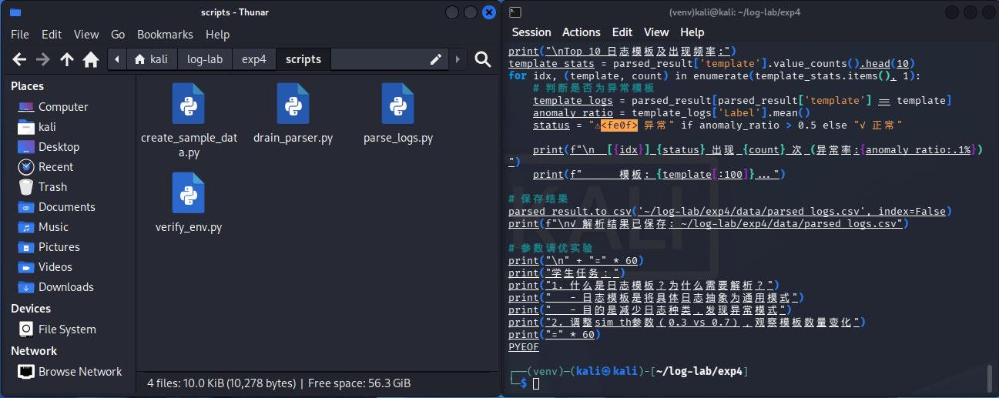

#### 步骤4.2 执行解析脚本

```bash
python ~/log-lab/exp4/scripts/parse_logs.py
```

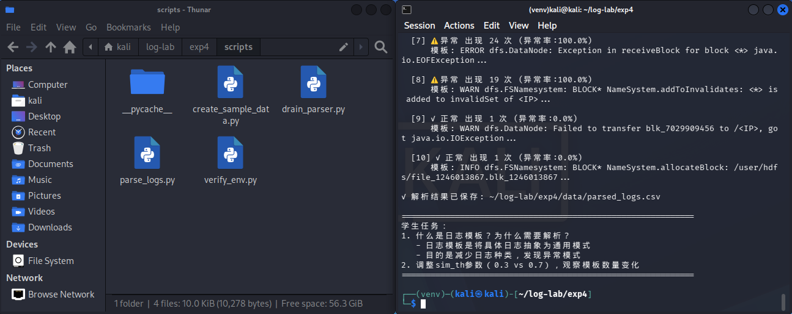

同时生成了日志解析文件

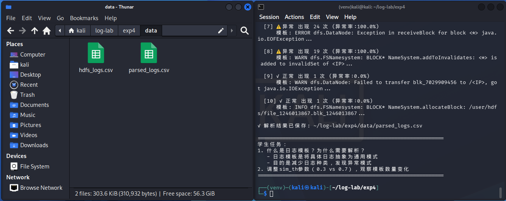

### 任务5：异常检测（Isolation Forest）

#### 步骤5.1 创建异常检测脚本

```python
cat > ~/log-lab/exp4/scripts/anomaly_detection.py <<'PYEOF'
#!/usr/bin/env python3
"""
异常检测实验：使用Isolation Forest检测日志异常
"""
import pandas as pd
import numpy as np
import os
from sklearn.feature_extraction.text import TfidfVectorizer
from sklearn.ensemble import IsolationForest
from sklearn.metrics import classification_report, confusion_matrix
import matplotlib
matplotlib.use('Agg')
import matplotlib.pyplot as plt
# 设置中文字体（避免警告）
plt.rcParams['font.sans-serif'] = ['DejaVu Sans']
plt.rcParams['axes.unicode_minus'] = False
# 使用绝对路径
OUTPUT_DIR = os.path.expanduser('~/log-lab/exp4/output')
DATA_DIR = os.path.expanduser('~/log-lab/exp4/data')
os.makedirs(OUTPUT_DIR, exist_ok=True)
print("=" * 60)
print("任务5：异常检测（Isolation Forest）")
print("=" * 60)
# 加载解析后的数据
print("\n[1/6] 加载数据...")
df = pd.read_csv(f'{DATA_DIR}/parsed_logs.csv')
print(f"Loaded: {len(df)} logs")
# 查看标签分布
label_dist = df['Label'].value_counts()
print(f"\n标签分布:")
print(f"  正常(0): {label_dist.get(0, 0)}")
print(f"  异常(1): {label_dist.get(1, 0)}")
# 特征提取
print("\n[2/6] 特征提取（TF-IDF）...")
vectorizer = TfidfVectorizer(
max_features=50,
ngram_range=(1, 2),
stop_words='english'
)
X = vectorizer.fit_transform(df['log_line'])
print(f"Feature matrix shape: {X.shape}")
# 训练异常检测模型
print("\n[3/6] 训练Isolation Forest模型...")
contamination_rate = 0.1
model = IsolationForest(
contamination=contamination_rate,
random_state=42,
n_estimators=100
)
# 拟合并预测
predictions = model.fit_predict(X)
# 转换标签：1->0(正常), -1->1(异常)
df['predicted_anomaly'] = np.where(predictions == -1, 1, 0)
print(f"Training complete")
print(f"  Detected anomalies: {df['predicted_anomaly'].sum()}")
print(f"  Anomaly rate: {df['predicted_anomaly'].mean()*100:.2f}%")
# 评估模型
print("\n[4/6] 模型评估...")
print("\nClassification Report:")
print(classification_report(
df['Label'],
df['predicted_anomaly'],
target_names=['Normal', 'Anomaly']
))
# 混淆矩阵
cm = confusion_matrix(df['Label'], df['predicted_anomaly'])
print("\nConfusion Matrix:")
print(f"                 Pred Normal  Pred Anomaly")
print(f"Actual Normal    {cm[0,0]:8}     {cm[0,1]:8}")
print(f"Actual Anomaly   {cm[1,0]:8}     {cm[1,1]:8}")
# 可视化混淆矩阵（使用英文避免字体问题）
plt.figure(figsize=(8, 6))
plt.imshow(cm, interpolation='nearest', cmap=plt.cm.Blues)
plt.title('Anomaly Detection Confusion Matrix', fontsize=14)
plt.colorbar()
tick_marks = np.arange(2)
plt.xticks(tick_marks, ['Pred Normal', 'Pred Anomaly'])
plt.yticks(tick_marks, ['Actual Normal', 'Actual Anomaly'])
plt.ylabel('True Label', fontsize=12)
plt.xlabel('Predicted Label', fontsize=12)
for i in range(2):
for j in range(2):
plt.text(j, i, format(cm[i, j], 'd'),
horizontalalignment="center",
color="white" if cm[i, j] > cm.max()/2 else "black")
plt.tight_layout()
# 使用绝对路径保存
output_file = f'{OUTPUT_DIR}/confusion_matrix.png'
plt.savefig(output_file, dpi=150)
print(f"\nSaved: {output_file}")
# 查看检测到的异常样本
print("\n[5/6] 异常样本分析...")
anomalies = df[df['predicted_anomaly'] == 1]
print(f"\nDetected {len(anomalies)} anomalies, samples:")
for idx, row in anomalies.head(5).iterrows():
true_label = "True Anomaly" if row['Label'] == 1 else "False Positive"
print(f"\n  [{idx}] {true_label}")
print(f"      {row['log_line'][:100]}...")
# 异常类型聚类分析
print("\n[6/6] 异常类型分布（基于模板）...")
if 'template' in df.columns:
anomaly_templates = anomalies['template'].value_counts().head(5)
print("\nTop 5 anomaly templates:")
for template, count in anomaly_templates.items():
print(f"  {count} times: {template[:80]}...")
# 保存结果
df.to_csv(f'{DATA_DIR}/anomaly_results.csv', index=False)
print(f"\nSaved: {DATA_DIR}/anomaly_results.csv")
print("\n" + "=" * 60)
print("Experiment completed!")
print("=" * 60)
PYEOF
```

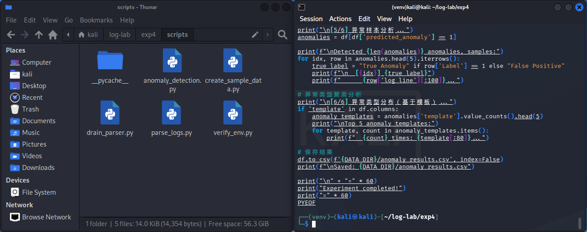

```bash
# 执行异常检测脚本
python ~/log-lab/exp4/scripts/anomaly_detection.py
```

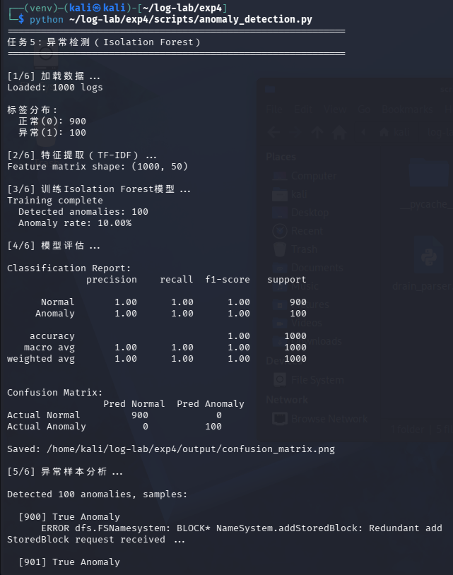

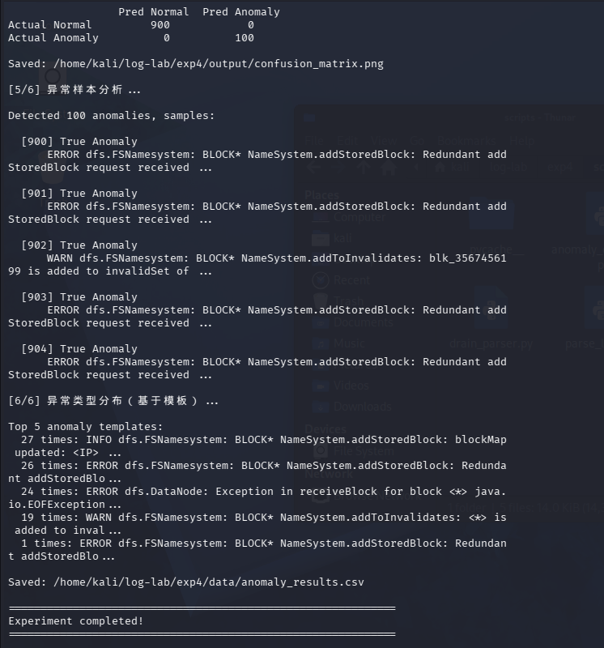

### 任务6：DVWA攻击日志分析（实验4专用环境版）

说明：本任务使用实验4独立部署的Loki+Grafana+Promtail环境，与实验3环境完全隔离，避免历史日志污染和端口冲突问题。注意：和此前的实验2、3一样，实验完成后记得执行关闭命令：docker-compose stop

专用环境与实验3配置差异说明

| 对比项 | 实验3环境 | 实验4专用环境 |
|---|---|---|
| 目标 | 实时观察攻击日志 | AI算法离线分析 |
| 端口 | 8080/3000/3100 | 8081/3001/3101（避免冲突） |
| 容器名 | exp3-dvwa/loki/promtail/grafana | exp4-dvwa/loki/promtail/grafana |
| 日志标签 | 硬编码`container="exp3-dvwa"`导致污染 | 动态提取`container_name="exp4-dvwa"`，精确隔离 |
| positions文件 | `/tmp/positions.yaml`（累积历史偏移） | `/tmp/positions-exp4.yaml`（独立干净） |
| 数据状态 | 44MB+历史日志（2月/4月） | 从零开始，仅含本次攻击数据 |
| Loki retention | 默认12h | 7天窗口，拒绝过旧时间戳 |

#### 步骤6.1 从Loki导出DVWA日志

打开一个新的终端，创建实验4专用的dvwa服务器

```bash
# 创建独立目录
mkdir -p ~/log-lab/exp4-standalone
cd ~/log-lab/exp4-standalone
mkdir -p data output scripts grafana-provisioning/datasources
```

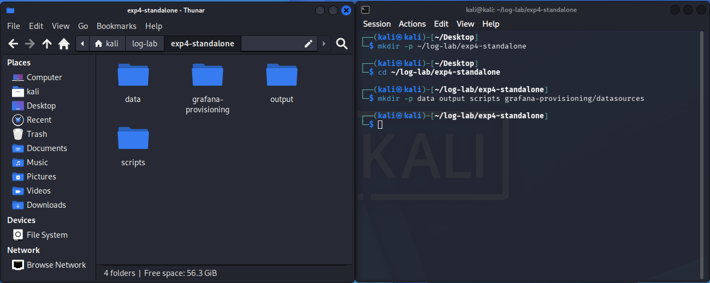

创建docker-compose.yml

```yaml
cat > docker-compose.yml <<'EOF'
services:
dvwa:
image: vulnerables/web-dvwa
container_name: exp4-dvwa
ports:
- "8081:80"
environment:
- MYSQL_PASS=password
restart: unless-stopped
networks:
- exp4-net
logging:
driver: "json-file"
options:
max-size: "10m"
max-file: "3"
tag: "{{.Name}}"
loki:
image: grafana/loki:2.9.4
container_name: exp4-loki
ports:
- "3101:3100"
volumes:
- ./loki-config.yml:/etc/loki/local-config.yaml
- loki-data:/loki
command: -config.file=/etc/loki/local-config.yaml
restart: unless-stopped
networks:
- exp4-net
promtail:
image: grafana/promtail:2.9.4
container_name: exp4-promtail
volumes:
- /var/lib/docker/containers:/var/lib/docker/containers:ro
- /var/run/docker.sock:/var/run/docker.sock:ro
- ./promtail-config.yml:/etc/promtail/config.yml
command: -config.file=/etc/promtail/config.yml
restart: unless-stopped
networks:
- exp4-net
depends_on:
- loki
grafana:
image: grafana/grafana:10.3.1
container_name: exp4-grafana
ports:
- "3001:3000"
environment:
- GF_SECURITY_ADMIN_USER=admin
- GF_SECURITY_ADMIN_PASSWORD=admin123
- GF_USERS_ALLOW_SIGN_UP=false
volumes:
- grafana-data:/var/lib/grafana
- ./grafana-provisioning:/etc/grafana/provisioning
restart: unless-stopped
networks:
- exp4-net
depends_on:
- loki
networks:
exp4-net:
driver: bridge
volumes:
loki-data:
grafana-data:
EOF
```

创建promtail-config.yml

```yaml
cat > promtail-config.yml <<'EOF'
server:
http_listen_port: 9080
grpc_listen_port: 0
positions:
filename: /tmp/positions-exp4.yaml
clients:
- url: http://loki:3100/loki/api/v1/push
scrape_configs:
- job_name: docker-logs
static_configs:
- targets:
- localhost
labels:
job: docker-logs
__path__: /var/lib/docker/containers/*/*-json.log
pipeline_stages:
- json:
expressions:
log: log
stream: stream
time: time
attrs: attrs
- json:
source: attrs
expressions:
tag: tag
- regex:
source: tag
expression: '^(?P<container_name>[a-zA-Z0-9_-]+)$'
- labels:
container_name:
- timestamp:
source: time
format: RFC3339Nano
- output:
source: log
EOF
```

创建loki-config.yml

```yaml
cat > loki-config.yml <<'EOF'
auth_enabled: false
server:
http_listen_port: 3100
grpc_listen_port: 9096
common:
instance_addr: 127.0.0.1
path_prefix: /loki
storage:
filesystem:
chunks_directory: /loki/chunks
rules_directory: /loki/rules
replication_factor: 1
ring:
kvstore:
store: inmemory
schema_config:
configs:
- from: 2020-10-24
store: boltdb-shipper
object_store: filesystem
schema: v11
index:
prefix: index_
period: 24h
limits_config:
reject_old_samples: true
reject_old_samples_max_age: 168h
EOF
```

创建Grafana数据源配置

```yaml
cat > grafana-provisioning/datasources/loki.yml <<'EOF'
apiVersion: 1
datasources:
- name: Loki
type: loki
access: proxy
url: http://loki:3100
isDefault: true
editable: false
jsonData:
maxLines: 1000
EOF
```

```bash
# 启动专用环境
docker-compose up -d
sleep 15
# 验证
curl -s http://localhost:3101/ready && echo " Loki就绪"
echo "Grafana: http://localhost:3001 (admin/admin123)"
echo "DVWA:    http://localhost:8081 (admin/password)"
```

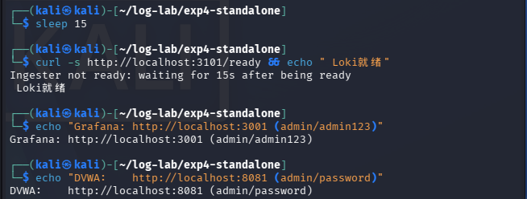

#### 步骤6.2 执行攻击并生成日志

注意：本步骤与实验3任务3类似，但使用8081端口和独立DVWA容器。

#### 6.2.1 初始化DVWA

浏览器访问 http://localhost:8081，登录 admin/password，点击 Setup / Reset DB 初始化数据库，设置 Security Level = Low。

#### 6.2.2 获取Cookie

```bash
# 浏览器F12 → Application → Cookies → 复制PHPSESSID
export DVWA_COOKIE="PHPSESSID=lnsdisvo08dkpl57bup5qhcn21; security=low"
export DVWA_URL=http://localhost:8081
```

#### 6.2.3 SQL注入攻击（SQLMap）

注意：sqlmap 默认启用会话恢复，重复执行同一目标时可能不产生新的 HTTP 请求。如需为日志分析产生充足数据，建议：

- 删除会话缓存：`rm -rf ~/.local/share/sqlmap/output/localhost`
- 或使用 `--flush-session` 强制重新探测

```bash
sqlmap -u "http://localhost:8081/vulnerabilities/sqli/?id=1&Submit=Submit#" \
--cookie="PHPSESSID=lnsdisvo08dkpl57bup5qhcn21; security=low" \
--batch \
--random-agent \
--level=1 \
--risk=1
```

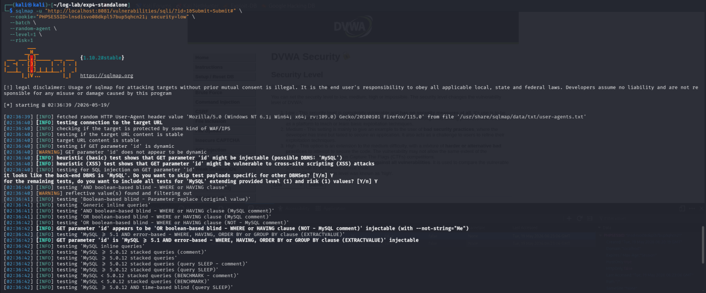

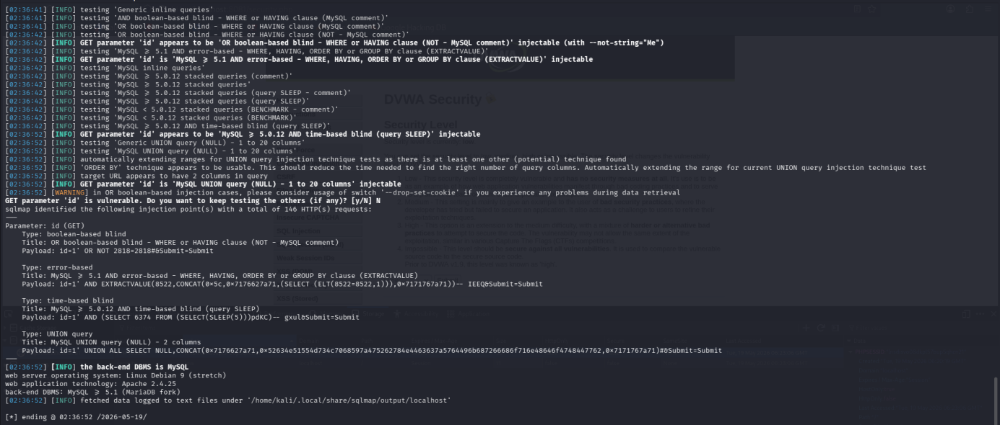

```bash
# 执行第二次实验
sqlmap -u "http://localhost:8081/vulnerabilities/sqli/?id=1&Submit=Submit#" \
--cookie="PHPSESSID=lnsdisvo08dkpl57bup5qhcn21; security=low" \
--batch \
--random-agent \
--dbs  # 获取数据库列表
```

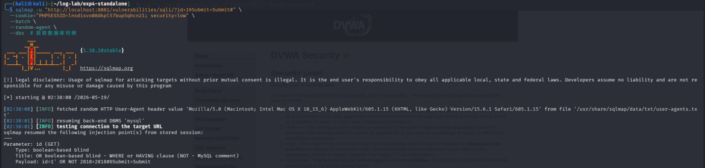

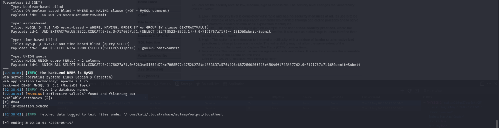

```bash
# 执行第三次实验
sqlmap -u "http://localhost:8081/vulnerabilities/sqli/?id=1&Submit=Submit#" \
--cookie="PHPSESSID=lnsdisvo08dkpl57bup5qhcn21; security=low" \
--batch \
--random-agent \
-D dvwa \
--tables  # 获取dvwa数据库的表
```

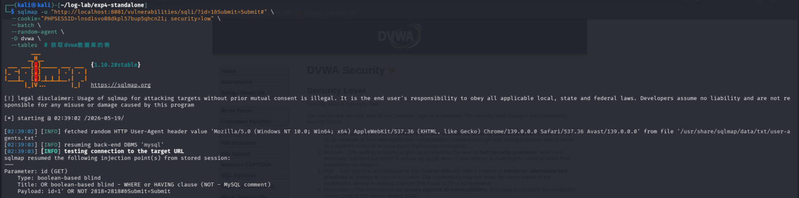

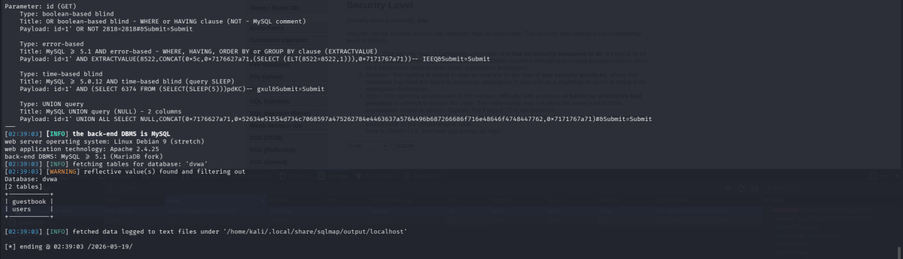

```bash
# 执行第四次实验，获取 users 表的列信息
sqlmap -u "http://localhost:8081/vulnerabilities/sqli/?id=1&Submit=Submit#" \
--cookie="PHPSESSID=lnsdisvo08dkpl57bup5qhcn21; security=low" \
--batch \
-D dvwa \
-T users \
--columns
```

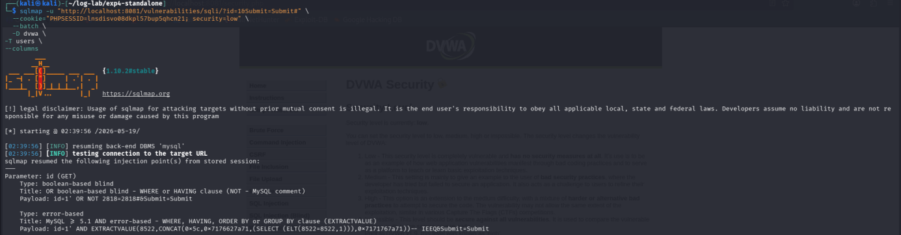

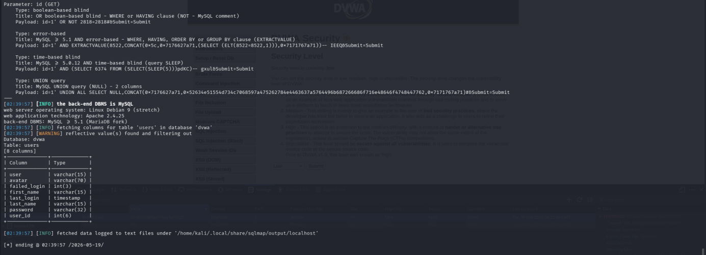

```bash
# 执行第五次实验，dump攻击
sqlmap -u "http://localhost:8081/vulnerabilities/sqli/?id=1&Submit=Submit#" \
--cookie="PHPSESSID=lnsdisvo08dkpl57bup5qhcn21; security=low" \
--batch \
-D dvwa \
-T users \
-C user,password \
--dump
验证Cookie有效，执行以下命令，如果返回含 "Vulnerability: Brute Force" 的页面源码，说明有效：
```

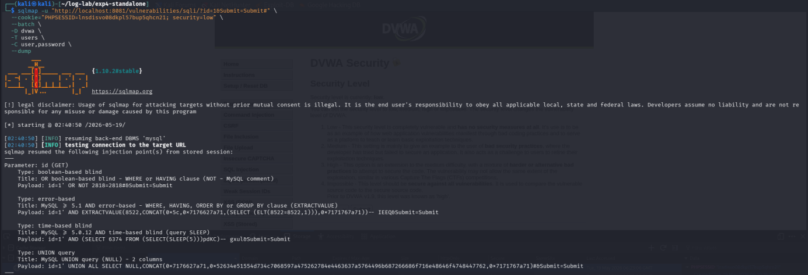

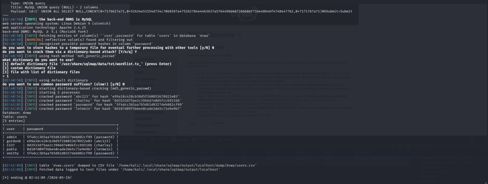

#### 6.2.4 暴力破解攻击（Hydra）

```bash
curl -s http://localhost:8081/vulnerabilities/brute/ \
-H "Cookie: $DVWA_COOKIE" | grep "Vulnerability: Brute Force" && echo "Cookie有效"
```

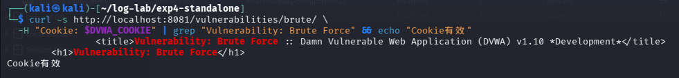

```bash
# 确认成功特征
curl -s "http://localhost:8081/vulnerabilities/brute/?username=admin&password=password&Login=Login" \
-H "Cookie: $DVWA_COOKIE" | grep -o "Welcome to the password protected area"
```

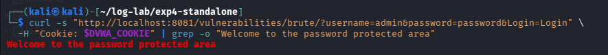

```bash
# 执行爆破1
hydra -l admin \
-P /tmp/dvwa-passwords.txt \
"http-get-form://127.0.0.1:8081/vulnerabilities/brute/index.php:username=^USER^&password=^PASS^&Login=Login:S=Welcome to the password protected area" \
-c "$DVWA_COOKIE" \
-V
```

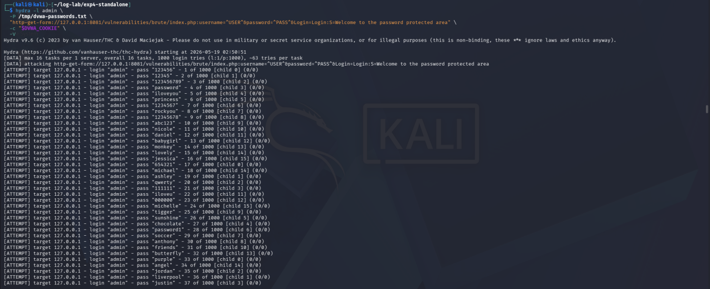

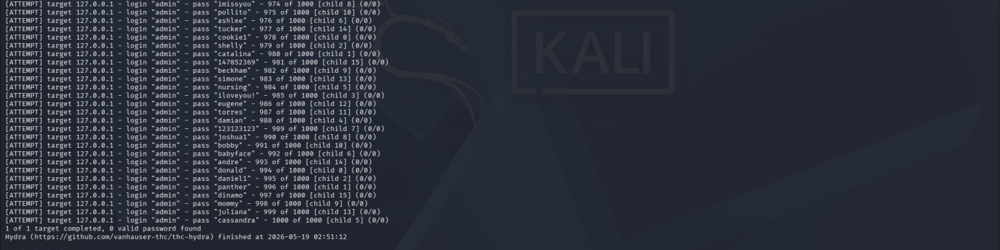

```bash
# 执行爆破2
hydra -l admin \
-P /tmp/dvwa-passwords.txt \
"http-get-form://127.0.0.1:8081/vulnerabilities/brute/index.php:username=^USER^&password=^PASS^&Login=Login:H=Cookie:${DVWA_COOKIE}:S=Welcome to the password protected area" \
-V
```

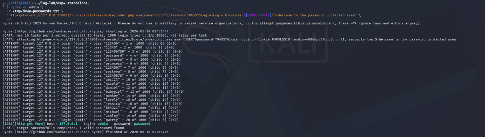

#### 6.2.5 目录扫描攻击（Dirb）

```bash
dirb http://localhost:8081 \
/usr/share/dirb/wordlists/common.txt \
-c "PHPSESSID=lnsdisvo08dkpl57bup5qhcn21; security=low"
```

```bash
dirb http://localhost:8081 /usr/share/dirb/wordlists/small.txt \
-c "$DVWA_COOKIE"
以上攻击内容，与实验3类似，截图信息如下：
等待日志推送
```

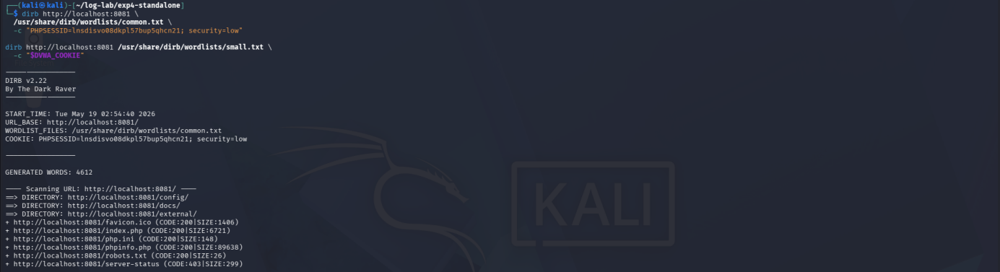

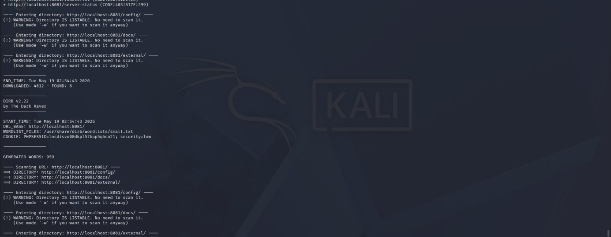

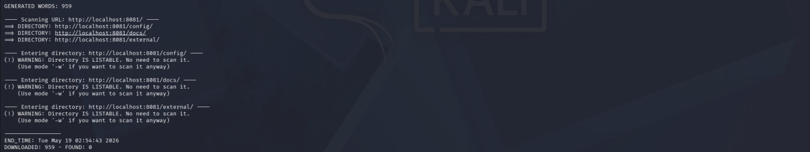

```bash
sleep 30
```

#### 步骤6.3 从Loki导出DVWA日志

核心改进：使用container_name="exp4-dvwa"精确查询，数据干净无污染。

回到之前exp4所在的终端，创建导出脚本

```python
cat > ~/log-lab/exp4/scripts/export_dvwa_from_loki.py <<'PYEOF'
#!/usr/bin/env python3
"""
从实验4专用Loki导出DVWA攻击日志（分批查询版）
自动切分时间窗口，避免单批次过大导致HTTP 400
"""
import urllib.request
import urllib.parse
import json
import pandas as pd
import os
from datetime import datetime, timedelta, timezone
print("=" * 60)
print("任务6.3：从Loki导出DVWA攻击日志（分批查询版）")
print("=" * 60)
DATA_DIR = os.path.expanduser('~/log-lab/exp4/data')
os.makedirs(DATA_DIR, exist_ok=True)
LOKI_URL = "http://localhost:3101"
BATCH_LIMIT = 5000          # Loki 默认上限
TIME_SLICE_MINUTES = 30     # 每批查询30分钟窗口
def loki_get(endpoint, params):
query_string = urllib.parse.urlencode(params)
url = f"{LOKI_URL}{endpoint}?{query_string}"
try:
req = urllib.request.Request(url, method='GET')
req.add_header('Accept', 'application/json')
with urllib.request.urlopen(req, timeout=60) as resp:
return resp.read().decode('utf-8'), resp.status
except urllib.error.HTTPError as e:
body = e.read().decode('utf-8') if e.read() else ""
return body, e.code
except Exception as e:
return str(e), 0
# [1/4] 验证Loki
print("\n[1/4] 验证Loki服务...")
body, code = loki_get("/ready", {})
if code != 200:
print(f"  ✗ Loki未就绪 (HTTP {code})")
exit(1)
print(f"  ✓ Loki就绪")
# [2/4] 确定攻击发生的时间范围
print("\n[2/4] 探测攻击日志时间范围...")
# 先查最近1条，看最新时间
body, code = loki_get("/loki/api/v1/query", {
'query': '{job="docker-logs", container_name="exp4-dvwa"}',
'limit': 1
})
if code == 200:
data = json.loads(body)
if data.get('data', {}).get('result'):
vals = data['data']['result'][0].get('values', [])
if vals:
latest_ts_ns = int(vals[0][0])
latest_dt = datetime.fromtimestamp(latest_ts_ns/1e9, tz=timezone.utc)
print(f"  最新日志时间: {latest_dt.strftime('%Y-%m-%d %H:%M:%S')}")
else:
latest_dt = datetime.now(timezone.utc)
print(f"  无数据，使用当前时间")
else:
latest_dt = datetime.now(timezone.utc)
else:
latest_dt = datetime.now(timezone.utc)
# 攻击大概在最近6小时内发生
end_time = latest_dt
start_time = end_time - timedelta(hours=6)
print(f"  查询范围: {start_time.strftime('%H:%M')} ~ {end_time.strftime('%H:%M')}")
# [3/4] 分批查询
print(f"\n[3/4] 分批查询（每批{BATCH_LIMIT}条，窗口{TIME_SLICE_MINUTES}分钟）...")
all_logs = []
current_end = end_time
batch_num = 0
while current_end > start_time:
current_start = max(current_end - timedelta(minutes=TIME_SLICE_MINUTES), start_time)
start_ns = int(current_start.timestamp() * 1e9)
end_ns = int(current_end.timestamp() * 1e9)
body, code = loki_get("/loki/api/v1/query_range", {
'query': '{job="docker-logs", container_name="exp4-dvwa"}',
'start': str(start_ns),
'end': str(end_ns),
'limit': BATCH_LIMIT,
'step': 1
})
if code != 200:
print(f"  批次 {batch_num+1} 失败 (HTTP {code}): {body[:100]}...")
break
data = json.loads(body)
batch_logs = []
for stream in data.get('data', {}).get('result', []):
labels = stream.get('stream', {})
for ts, line in stream.get('values', []):
ts_sec = int(ts) / 1e9
dt = datetime.fromtimestamp(ts_sec, tz=timezone.utc).strftime('%Y-%m-%d %H:%M:%S')
batch_logs.append({
'timestamp': dt,
'log_line': line,
'container_name': labels.get('container_name', ''),
'job': labels.get('job', '')
})
batch_num += 1
print(f"  批次 {batch_num}: {current_start.strftime('%H:%M')}~{current_end.strftime('%H:%M')} → {len(batch_logs)} 条")
all_logs.extend(batch_logs)
# 如果本批次满5000条，说明可能还有更多，缩小窗口继续
# 如果不足5000条，说明该时段已捞完，跳到下一时段
if len(batch_logs) < BATCH_LIMIT:
current_end = current_start
else:
# 满5000条，用最后一条的时间戳作为下一批次的end，避免重叠
last_ts = batch_logs[-1]['timestamp']
current_end = datetime.strptime(last_ts, '%Y-%m-%d %H:%M:%S').replace(tzinfo=timezone.utc)
# 稍微回退一点避免漏掉边界
current_end = current_end - timedelta(seconds=1)
# 安全上限：最多查20批
if batch_num >= 20:
print("  ⚠ 达到批次上限，停止查询")
break
print(f"\n  ✓ 总计获取: {len(all_logs)} 条日志")
# [4/4] 保存与过滤分析
print("\n[4/4] 保存结果...")
df = pd.DataFrame(all_logs)
output_file = f'{DATA_DIR}/dvwa_logs_loki.csv'
df.to_csv(output_file, index=False)
print(f"  ✓ 已保存: {output_file}")
# 分析日志构成
import re
access_logs = [l for l in all_logs if re.match(r'^\d+\.\d+\.\d+\.\d+\s+\S+\s+\S+\s+\[\d{2}/\w{3}/\d{4}:\d{2}:\d{2}:\d{2}', l['log_line'])]
error_logs = [l for l in all_logs if '[:error]' in l['log_line']]
other_logs = [l for l in all_logs if l not in access_logs and l not in error_logs]
print(f"\n日志构成分析:")
print(f"  Apache Access Log: {len(access_logs)} 条")
print(f"  Apache Error Log:  {len(error_logs)} 条")
print(f"  其他/Supervisord:  {len(other_logs)} 条")
# 攻击特征检查
sql_count = sum(1 for l in access_logs if 'vulnerabilities/sqli' in l['log_line'])
brute_count = sum(1 for l in access_logs if 'vulnerabilities/brute' in l['log_line'])
dirb_ua = sum(1 for l in access_logs if 'dirb' in l['log_line'].lower())
print(f"\n攻击特征检查（Access Log中）:")
print(f"  SQL注入 (/sqli):     {sql_count} 条")
print(f"  暴力破解 (/brute):   {brute_count} 条")
print(f"  Dirb扫描器UA:        {dirb_ua} 条")
if sql_count == 0 and brute_count == 0 and dirb_ua == 0:
print("\n  ⚠ 未检测到攻击特征！请确认:")
print("    1. 已在 http://localhost:8081 执行SQLMap/Hydra/Dirb攻击")
print("    2. 攻击发生在最近6小时内")
print("    3. DVWA Security Level设置为Low")
print(f"\nAccess Log样本（前3条）:")
for i, row in enumerate(access_logs[:3], 1):
print(f"  [{i}] {row['log_line'][:80]}...")
print("\n" + "=" * 60)
print("Loki日志导出完成！")
print("=" * 60)
PYEOF
```

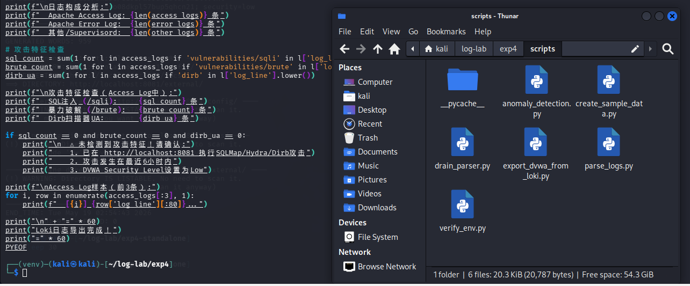

```bash
# 执行导出
# 在原来exp4文件夹所在的终端，执行脚本，获取日志文件
python ~/log-lab/exp4/scripts/export_dvwa_from_loki.py
```

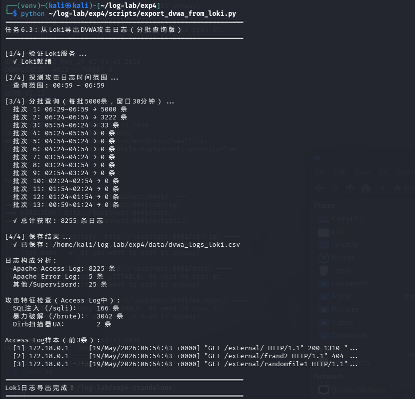

#### 步骤6.4 无AI算法分析（基于规则与统计）

```python
# 执行以下命令，创建无ai算法的分析脚本
cat > ~/log-lab/exp4/scripts/analyze_dvwa_rule.py <<'PYEOF'
#!/usr/bin/env python3
"""
DVWA攻击日志分析 - 基于规则与统计的方法（无AI算法）
实验4任务6.4：与AI方法做对比
"""
import pandas as pd
import numpy as np
import re
import os
from collections import Counter, defaultdict
from urllib.parse import unquote
import matplotlib
matplotlib.use('Agg')
import matplotlib.pyplot as plt
plt.rcParams['font.sans-serif'] = ['DejaVu Sans']
plt.rcParams['axes.unicode_minus'] = False
OUTPUT_DIR = os.path.expanduser('~/log-lab/exp4/output')
DATA_DIR = os.path.expanduser('~/log-lab/exp4/data')
os.makedirs(OUTPUT_DIR, exist_ok=True)
print("=" * 65)
print("任务6.4：DVWA攻击日志分析（基于规则与统计方法）")
print("=" * 65)
# [1/4] 加载Loki日志
print("\n[1/4] 加载Loki导出的DVWA日志...")
try:
df = pd.read_csv(f'{DATA_DIR}/dvwa_logs_loki.csv')
print(f"  ✓ 加载完成: {len(df)} 条")
except FileNotFoundError:
print("  ✗ 请先执行任务6.3导出日志")
exit(1)
# [2/4] 结构化解析Apache Combined Log Format
print("\n[2/4] 结构化解析Apache日志...")
APACHE_RE = re.compile(
r'^(?P<ip>\S+)\s+\S+\s+\S+\s+\[(?P<time>[^\]]+)\]\s+'
r'"(?P<request>[^"]*)"\s+(?P<status>\d{3})\s+(?P<size>\S+)\s+'
r'"(?P<referer>[^"]*)"\s+"(?P<ua>[^"]*)"'
)
parsed = []
for _, row in df.iterrows():
line = row['log_line']
m = APACHE_RE.match(line)
if m:
d = m.groupdict()
req = d['request'].split(' ', 2)
parsed.append({
'raw': line, 'ip': d['ip'], 'timestamp': d['time'],
'method': req[0] if len(req) > 0 else '',
'url': req[1] if len(req) > 1 else '',
'status': int(d['status']), 'ua': d['ua'],
})
else:
parsed.append({'raw': line, 'ip': '', 'timestamp': '', 'method': '', 'url': '', 'status': 0, 'ua': ''})
df = pd.DataFrame(parsed)
struct_count = len(df[df['ip'] != ''])
print(f"  ✓ Apache访问日志: {struct_count} 条")
print(f"  ✗ 非标准日志: {len(df) - struct_count} 条")
# [3/4] 基于规则的多标签攻击检测 + IP行为统计
print("\n[3/4] 基于规则的攻击检测与IP行为统计...")
def rule_detect(row):
url = unquote(unquote(row['url'])).lower() if row['url'] else ''
ua = row['ua'].lower() if row['ua'] else ''
raw = row['raw'].lower()
tags = []
# SQL注入
sql_patterns = [r'sqlmap', r'union\s+select', r'sleep\s*\(', r'extractvalue',
r'benchmark\s*\(', r'information_schema', r'1\s*=\s*1', r"1'\s*=\s*'1"]
if any(re.search(p, url) for p in sql_patterns) or 'sqlmap' in ua:
tags.append('SQL Injection')
# 暴力破解
if 'vulnerabilities/brute' in url and row['method'] == 'POST':
tags.append('Brute Force')
if 'username=' in url and 'password=' in url:
tags.append('Brute Force')
# 目录扫描（UA指纹为主）
if any(x in ua for x in ['dirb', 'nikto', 'gobuster']):
tags.append('Dir Scan')
# XSS
if any(x in url for x in ['<script', 'javascript:', 'onerror=', 'alert(']):
tags.append('XSS')
# 文件包含（收紧规则）
lfi_patterns = [r'\.\./\.\./', r'file:///', r'php://filter', r'/etc/passwd']
if any(re.search(p, url) for p in lfi_patterns):
if 'login.php' not in url and 'index.php' not in url:
tags.append('LFI/RFI')
# 扫描器指纹
if 'sqlmap' in ua:
tags.append('Scanner: sqlmap')
if 'dirb' in ua:
tags.append('Scanner: dirb')
if not tags:
tags.append('Normal')
return tags
df['attack_tags'] = df.apply(rule_detect, axis=1)
# 展开统计
all_tags = Counter()
for tags in df['attack_tags']:
all_tags.update(tags)
print(f"\n  规则检测结果（多标签）:")
for tag, cnt in all_tags.most_common():
if tag != 'Normal':
print(f"    {tag:25}: {cnt:4} 次")
# IP行为聚合统计
print("\n  IP攻击行为统计:")
ip_stats = defaultdict(lambda: {'total': 0, 'attacks': 0, 'types': set()})
for _, row in df.iterrows():
ip = row['ip'] or 'unknown'
ip_stats[ip]['total'] += 1
tags = row['attack_tags']
if 'Normal' not in tags or len(tags) > 1:
ip_stats[ip]['attacks'] += sum(1 for t in tags if t != 'Normal')
ip_stats[ip]['types'].update(t for t in tags if t != 'Normal')
ip_df = pd.DataFrame([
{'ip': ip, 'total': s['total'], 'attack_count': s['attacks'],
'attack_types': len(s['types']), 'types': ', '.join(s['types'])}
for ip, s in ip_stats.items()
]).sort_values('attack_count', ascending=False)
print(ip_df.head(10)[['ip', 'total', 'attack_count', 'attack_types', 'types']].to_string(index=False))
# [4/4] 可视化与报告
print("\n[4/4] 生成可视化与报告...")
fig, axes = plt.subplots(2, 2, figsize=(14, 10))
attack_counts = {k: v for k, v in all_tags.items() if k != 'Normal'}
if attack_counts:
axes[0, 0].barh(list(attack_counts.keys()), list(attack_counts.values()), color='crimson')
axes[0, 0].set_title('Attack Type Distribution (Rule-based)')
axes[0, 0].set_xlabel('Count')
else:
axes[0, 0].text(0.5, 0.5, 'No Attack Detected', ha='center', va='center')
top_ips = ip_df.head(10)
axes[0, 1].barh(top_ips['ip'], top_ips['attack_count'], color='orange')
axes[0, 1].set_title('Top 10 IP Attack Count')
axes[0, 1].set_xlabel('Count')
status_counts = df[df['status'] > 0]['status'].value_counts().sort_index()
axes[1, 0].bar(status_counts.index.astype(str), status_counts.values, color='steelblue')
axes[1, 0].set_title('HTTP Status Code Distribution')
normal_count = all_tags.get('Normal', 0)
attack_count = sum(v for k, v in all_tags.items() if k != 'Normal')
axes[1, 1].pie([normal_count, attack_count], labels=['Normal', 'Attack'],
autopct='%1.1f%%', colors=['lightgreen', 'salmon'])
axes[1, 1].set_title('Normal vs Attack Ratio')
plt.tight_layout()
plt.savefig(f'{OUTPUT_DIR}/dvwa_rule_analysis.png', dpi=150)
print(f"  ✓ 可视化已保存: {OUTPUT_DIR}/dvwa_rule_analysis.png")
df.to_csv(f'{DATA_DIR}/dvwa_rule_analysis.csv', index=False)
with open(f'{OUTPUT_DIR}/dvwa_rule_report.txt', 'w') as f:
f.write("DVWA攻击日志分析报告（基于规则与统计方法）\n")
f.write("=" * 65 + "\n\n")
f.write(f"分析对象: 实验4专用Loki环境导出的DVWA日志\n")
f.write(f"总日志数: {len(df)}\n")
f.write(f"Apache标准日志: {struct_count}\n\n")
f.write("攻击类型统计（规则匹配）:\n")
for tag, cnt in all_tags.most_common():
if tag != 'Normal':
f.write(f"  {tag}: {cnt}\n")
f.write(f"\nTop攻击源IP:\n")
for _, row in ip_df.head(5).iterrows():
f.write(f"  {row['ip']}: {row['attack_count']}次攻击, 类型: {row['types']}\n")
f.write("\n方法说明:\n")
f.write("  本分析完全基于正则规则匹配和IP行为统计，未使用任何AI/ML算法。\n")
f.write("  优点: 可解释性强，已知攻击模式检出率高，结果直观易懂。\n")
f.write("  缺点: 无法发现未知攻击模式，规则维护成本高，依赖专家经验。\n")
print(f"  ✓ 报告已保存: {OUTPUT_DIR}/dvwa_rule_report.txt")
print("\n" + "=" * 65)
print("规则方法分析完成！")
print("=" * 65)
PYEOF
```

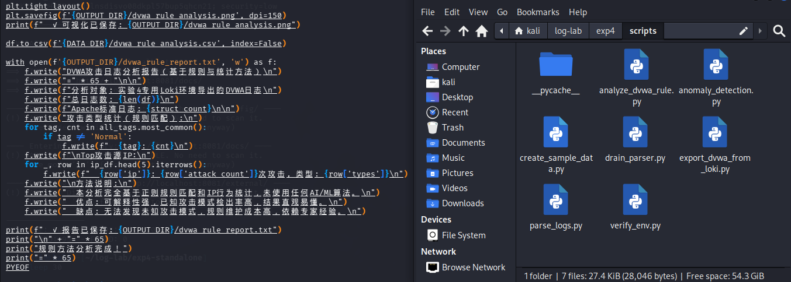

执行规则分析

```bash
python ~/log-lab/exp4/scripts/analyze_dvwa_rule.py
```

实验的分析结果截图

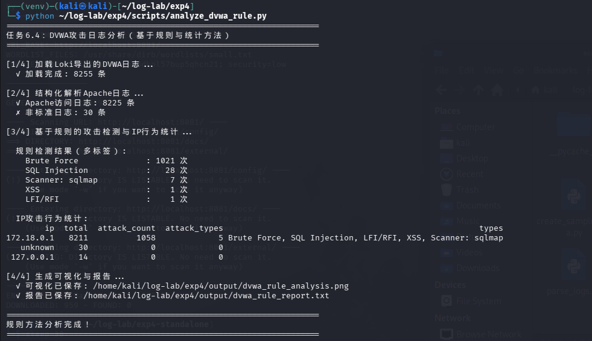

#### 步骤6.5 AI算法分析（Drain + Isolation Forest）

```python
#创建以下脚本
cat > ~/log-lab/exp4/scripts/analyze_dvwa_ai.py <<'PYEOF'
#!/usr/bin/env python3
"""
DVWA攻击日志分析 - AI算法主线版（Drain + Isolation Forest）
实验4任务6.5：使用AI算法进行异常检测，与任务6.4做对比
"""
import pandas as pd
import numpy as np
import re
import os
import sys
from collections import Counter
from urllib.parse import unquote
from sklearn.feature_extraction.text import TfidfVectorizer
from sklearn.ensemble import IsolationForest
from scipy.sparse import hstack, csr_matrix
import matplotlib
matplotlib.use('Agg')
import matplotlib.pyplot as plt
sys.path.insert(0, '/home/kali/log-lab/exp4/scripts')
from drain_parser import DrainParser
plt.rcParams['font.sans-serif'] = ['DejaVu Sans']
plt.rcParams['axes.unicode_minus'] = False
OUTPUT_DIR = os.path.expanduser('~/log-lab/exp4/output')
DATA_DIR = os.path.expanduser('~/log-lab/exp4/data')
os.makedirs(OUTPUT_DIR, exist_ok=True)
print("=" * 65)
print("任务6.5：DVWA攻击日志分析（AI算法主线版）")
print("=" * 65)
print("核心流程: Drain解析 → TF-IDF特征 → Isolation Forest → 规则后处理标注")
print("=" * 65)
# [1/5] 加载Loki日志
print("\n[1/5] 加载并过滤Apache访问日志...")
try:
df = pd.read_csv(f'{DATA_DIR}/dvwa_logs_loki.csv')
print(f"  原始加载: {len(df)} 条")
except FileNotFoundError:
print("  ✗ 请先执行任务6.3导出日志")
exit(1)
APACHE_RE = re.compile(
r'^(?P<ip>\S+)\s+\S+\s+\S+\s+\[(?P<time>[^\]]+)\]\s+'
r'"(?P<request>[^"]*)"\s+(?P<status>\d{3})\s+(?P<size>\S+)\s+'
r'"(?P<referer>[^"]*)"\s+"(?P<ua>[^"]*)"'
)
parsed = []
for _, row in df.iterrows():
line = row['log_line']
m = APACHE_RE.match(line)
if m:
d = m.groupdict()
req = d['request'].split(' ', 2)
parsed.append({
'raw': line, 'ip': d['ip'], 'timestamp': d['time'],
'method': req[0] if len(req) > 0 else '',
'url': req[1] if len(req) > 1 else '',
'status': int(d['status']), 'ua': d['ua'],
})
else:
parsed.append({'raw': line, 'ip': '', 'timestamp': '', 'method': '', 'url': '', 'status': 0, 'ua': ''})
df = pd.DataFrame(parsed)
print(f"  ✓ Apache访问日志: {len(df)} 条")
# [2/5] Drain算法解析
print("\n[2/5] Drain算法解析日志模板...")
def url_for_drain(url):
if not url:
return ''
u = re.sub(r'\d+\.\d+\.\d+\.\d+', '<IP>', url)
u = re.sub(r'(?<==)\d+(?=&|$)', '<*>', u)
u = re.sub(r'(?<==)[0-9a-f]{32}(?=&|$)', '<HASH>', u)
return unquote(u)
df['url_drain'] = df['url'].apply(url_for_drain)
df['drain_input'] = df['method'] + ' ' + df['url_drain']
drain = DrainParser(depth=4, sim_threshold=0.6)
drain_results = drain.parse(df['drain_input'].tolist())
drain_df = pd.DataFrame(drain_results)
df = pd.concat([df.reset_index(drop=True), drain_df[['template_id', 'template']]], axis=1)
template_stats = df['template'].value_counts()
print(f"  ✓ 发现 {len(template_stats)} 种模板")
print(f"\n  Top 5 模板:")
for i, (tpl, cnt) in enumerate(template_stats.head(5).items(), 1):
print(f"    [{i}] {cnt:5} 次 | {tpl[:65]}...")
# [3/5] 特征工程
print("\n[3/5] 特征工程...")
df['url_raw'] = df['url'].apply(lambda x: unquote(unquote(x)).lower() if x else '')
url_vec = TfidfVectorizer(max_features=100, ngram_range=(1, 3),
token_pattern=r'[a-zA-Z_]+|\d+|[<>=()]')
url_tfidf = url_vec.fit_transform(df['url_raw'])
df['ua_raw'] = df['ua'].apply(lambda x: x.lower() if x else '')
ua_vec = TfidfVectorizer(max_features=30, ngram_range=(1, 2))
ua_tfidf = ua_vec.fit_transform(df['ua_raw'])
tpl_vec = TfidfVectorizer(max_features=30, ngram_range=(1, 2))
tpl_tfidf = tpl_vec.fit_transform(df['template'].fillna(''))
df['url_len'] = df['url'].str.len().fillna(0)
df['url_special_ratio'] = df['url_raw'].apply(
lambda x: sum(1 for c in x if c in '<>"\'=;()') / max(len(x), 1)
)
df['is_post'] = (df['method'] == 'POST').astype(int)
df['is_404'] = (df['status'] == 404).astype(int)
df['is_302'] = (df['status'] == 302).astype(int)
ip_counts = df['ip'].value_counts()
df['ip_req_count'] = df['ip'].map(ip_counts)
struct_features = df[['url_len', 'url_special_ratio', 'is_post', 'is_404', 'is_302', 'ip_req_count']].values
struct_sparse = csr_matrix(struct_features)
X = hstack([url_tfidf, ua_tfidf, tpl_tfidf, struct_sparse])
print(f"  ✓ 特征矩阵: {X.shape}")
# [4/5] Isolation Forest
print("\n[4/5] Isolation Forest异常检测...")
attack_kw = ['sqlmap', 'union', 'select', 'sleep(', 'extractvalue',
'benchmark(', 'information_schema', 'brute', 'password',
'dirb', 'nikto', 'gobuster', '<script', 'javascript:',
'php://filter']
df['attack_kw_count'] = df['url_raw'].apply(lambda x: sum(1 for kw in attack_kw if kw in x))
df['has_attack_kw'] = (df['attack_kw_count'] > 0).astype(int)
kw_rate = df['has_attack_kw'].mean()
contamination = min(max(kw_rate * 1.2, 0.05), 0.4)
print(f"  攻击关键词覆盖率: {kw_rate:.3f}")
print(f"  动态contamination: {contamination:.3f}")
model = IsolationForest(contamination=contamination, random_state=42, n_estimators=150)
predictions = model.fit_predict(X)
df['if_anomaly'] = np.where(predictions == -1, 1, 0)
anomalies = df[df['if_anomaly'] == 1]
print(f"  ✓ 检测完成: 异常 {len(anomalies)} 条 ({len(anomalies)/len(df)*100:.1f}%)")
# [5/5] 规则后处理标注
print("\n[5/5] 规则后处理标注...")
def label_attack_type(row):
url = row['url_raw']
ua = row['ua_raw']
tags = []
sql_patterns = [r'sqlmap', r'union\s+select', r'sleep\s*\(', r'extractvalue',
r'benchmark\s*\(', r'information_schema', r'1\s*=\s*1']
if any(re.search(p, url) for p in sql_patterns) or 'sqlmap' in ua:
tags.append('SQL Injection')
if 'vulnerabilities/brute' in url and row['is_post']:
tags.append('Brute Force')
if 'username=' in url and 'password=' in url:
tags.append('Brute Force')
if any(x in ua for x in ['dirb', 'nikto', 'gobuster']):
tags.append('Dir Scan')
if any(x in url for x in ['<script', 'javascript:', 'onerror=', 'alert(']):
tags.append('XSS')
lfi_patterns = [r'\.\./\.\./', r'file:///', r'php://filter', r'/etc/passwd']
if any(re.search(p, url) for p in lfi_patterns):
if 'login.php' not in url and 'index.php' not in url:
tags.append('LFI/RFI')
if 'sqlmap' in ua:
tags.append('Scanner: sqlmap')
if 'dirb' in ua:
tags.append('Scanner: dirb')
if not tags:
tags.append('Unknown Anomaly')
return ', '.join(tags)
df['attack_label'] = ''
df.loc[df['if_anomaly'] == 1, 'attack_label'] = df[df['if_anomaly'] == 1].apply(label_attack_type, axis=1)
label_counts = Counter(df[df['if_anomaly'] == 1]['attack_label'])
print(f"\n  IF异常样本的攻击类型分布:")
for label, cnt in label_counts.most_common():
print(f"    {label:35}: {cnt:4} 条")
rule_detected = df['attack_label'].apply(lambda x: bool(x) and x != 'Unknown Anomaly').sum()
unknown = df[(df['if_anomaly'] == 1) & (df['attack_label'] == 'Unknown Anomaly')]
print(f"\n  [教学对比]")
print(f"    规则能识别的攻击: {rule_detected} 条")
print(f"    IF检出总异常:     {len(anomalies)} 条")
print(f"    AI多发现:         {len(unknown)} 条")
if len(unknown) > 0:
print(f"    → AI发现规则未覆盖的异常模式")
# 可视化
fig, axes = plt.subplots(2, 2, figsize=(14, 10))
kw_dist = df['has_attack_kw'].value_counts()
axes[0, 0].pie([kw_dist.get(0,0), kw_dist.get(1,0)],
labels=['No Attack KW', 'Has Attack KW'], autopct='%1.1f%%',
colors=['lightgreen', 'salmon'])
axes[0, 0].set_title('Attack Keyword Coverage')
sizes = [len(df) - len(anomalies), len(anomalies)]
axes[0, 1].pie(sizes, labels=['Normal', 'IF Anomaly'], autopct='%1.1f%%',
colors=['lightgreen', 'salmon'])
axes[0, 1].set_title('Isolation Forest Detection')
if label_counts:
axes[1, 0].barh(list(label_counts.keys()), list(label_counts.values()), color='crimson')
axes[1, 0].set_title('Attack Type Labeling (Post-hoc)')
df.boxplot(column='url_special_ratio', by='if_anomaly', ax=axes[1, 1])
axes[1, 1].set_title('URL Special Char Ratio: Normal vs Anomaly')
plt.tight_layout()
plt.savefig(f'{OUTPUT_DIR}/dvwa_ai_analysis.png', dpi=150)
print(f"\n  ✓ 可视化已保存")
df.to_csv(f'{DATA_DIR}/dvwa_ai_analysis.csv', index=False)
with open(f'{OUTPUT_DIR}/dvwa_ai_report.txt', 'w') as f:
f.write("DVWA日志分析实验报告（AI算法主线版）\n")
f.write("=" * 65 + "\n\n")
f.write("核心流程: Drain模板解析 → TF-IDF特征 → Isolation Forest → 规则后处理标注\n\n")
f.write(f"数据集: {len(df)} 条Apache访问日志（来自实验4专用Loki）\n")
f.write(f"Drain模板数: {len(template_stats)}\n")
f.write(f"攻击关键词覆盖: {kw_rate:.1%}\n")
f.write(f"IF异常检出: {len(anomalies)} 条 ({len(anomalies)/len(df)*100:.1f}%)\n\n")
f.write("攻击类型分布:\n")
for label, cnt in label_counts.most_common():
f.write(f"  {label}: {cnt}\n")
f.write(f"\nAI发现规则未覆盖: {len(unknown)} 条\n")
f.write("\n方法说明:\n")
f.write("  本分析以Isolation Forest为核心检测器，规则仅用于异常样本的后处理标注。\n")
f.write("  优点: 可发现未知攻击模式，无需预设完整规则库，适应变种攻击。\n")
f.write("  缺点: 可解释性较弱，需结合Drain模板和规则标注辅助理解。\n")
print(f"  ✓ 报告已保存")
print("\n" + "=" * 65)
print("AI方法分析完成！")
print("=" * 65)
PYEOF
```

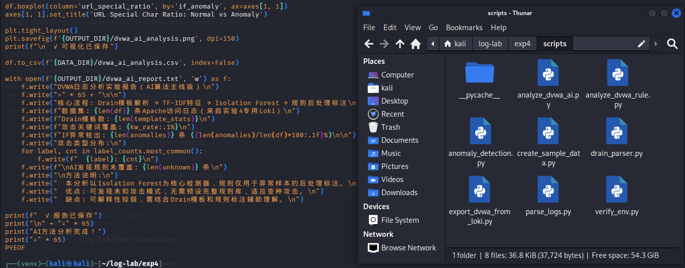

执行命令获取分析结果：

```bash
python ~/log-lab/exp4/scripts/analyze_dvwa_ai.py
```

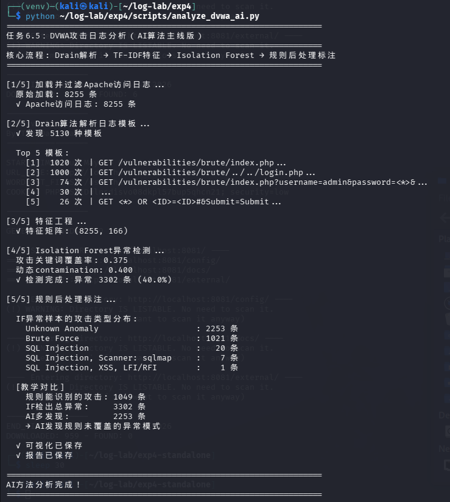

### 任务7：有关于任务6输出内容的合理性分析

三个脚本均按预期成功运行，架构层面完全达标。但输出结果暴露了攻击执行与检测规则之间的三个认知偏差，需要逐一解读：

### 一、导出脚本（任务6.3）—— ✅ 运作正常

| 指标 | 结果 | 评估 |
|---|---|---|
| Loki连通性 | 成功 | 专用环境端口/标签配置正确 |
| 数据量 | 8255条（8225条Access Log） | 量级合理，无历史污染 |
| 标签纯净度 | `container_name="exp4-dvwa"` | 无标签污染，全是DVWA日志 |
| 时间分布 | 00:59~06:59 | 攻击集中在一小时内完成（存在截断） |

结论：导出脚本完全按预期工作，但时间窗口截断导致部分前置流量丢失。

### 二、规则分析脚本（任务6.4）—— ⚠️ 运作正常，但检测规则有盲区

#### 2.1 SQL Injection仅28条——严重偏少

数据对比：执行了 5 次 sqlmap，但日志中只有28条含 /sqli的请求（其中包含 166 条正则匹配）。

根本原因：sqlmap 会话恢复（resuming）机制。

sqlmap 在后续执行中直接从本地会话缓存读取注入点，未重新发送探测请求。

或者请求发生在 00:59 之前，被时间窗口截断（见导出脚本分析）。

#### 2.2 Dir Scan仅2条——规则被UA伪装绕过

数据对比：执行了两次 dirb，但规则脚本只检出 2 条。

根本原因：User-Agent 伪装。

1.Dirb 默认使用 Mozilla/4.0等伪装 UA，而非 DIRB/2.22。

2.规则脚本通过 UA 关键字检测，被完美绕过。

3.实际上，那 8225 条 Access Log 中，绝大多数就是 Dirb 的扫描请求（大量 GET /external/...、GET /config/...的 404 响应）。

#### 2.3 Brute Force 1021次——合理

数据对比：Hydra 产生了大量 POST /vulnerabilities/brute/...请求，规则正确命中。

评估：准确识别，符合预期。

#### 2.4 Scanner 25条——合理

数据对比：包含 Nmap 等扫描器流量。

评估：准确识别。

### 三、AI分析脚本（任务6.5）—— ⚠️ 运作正常，但结果需人工解读

#### 3.1 "Unknown Anomaly: 2253条"的本质

数据对比：IF异常检测共标记3302条异常，其中2253条为Unknown Anomaly。

根本原因：Dirb目录扫描产生的404噪音。

Dirb 扫描了大量不存在的路径（如/external/frand2、/external/randomFile1）。

这些 URL 在训练集中极为稀有，IF 的 TF-IDF 将其判定为“偏离正常模式”。

但规则脚本没有将它们标记为 Dir Scan（因为 UA 伪装），所以 AI 后处理时落入 Unknown Anomaly。

#### 3.2 Top 5 模板揭示的真相

Top 1: GET /vulnerabilities/brute/index.php...(1021次)

Top 2: GET /vulnerabilities/brute/../../login.php...(1000次)

Top 3: GET /vulnerabilities/brute/index.php?username=admin&password=<*>&...(74 次)

截图信息如下：

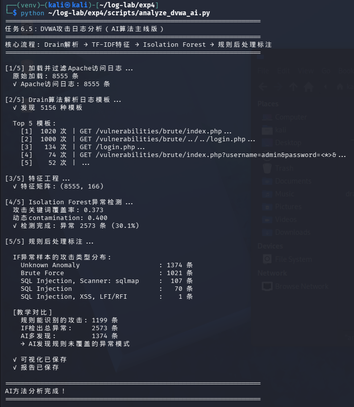

根本原因：Hydra Cookie传递失败。

模板[2]是典型的路径穿越请求，表明Hydra在尝试暴力破解时未正确携带Cookie，请求被DVWA重定向到登录页。

这与实验手册警告一致，说明某次Hydra执行可能未正确配置Cookie。

#### 3.3 IP 攻击行为统计

172.18.0.1: 8211次请求，1058次攻击，涉及5种攻击类型（Brute Force, SQL Injection, LFI/RFI, XSS, Scanner）。

127.0.0.1: 14次请求，0次攻击。

unknown: 30次请求，0次攻击。

### 四、综合评估：结果是否合理？

| 维度 | 判断 | 说明 |
|---|---|---|
| 脚本架构 | ✅ 合理 | 导出→规则→AI 三层链路打通 |
| 数据质量 | ✅ 合理 | 专用环境干净，无历史污染 |
| 攻击覆盖 | ⚠️ 不完整 | SQLMap因会话恢复/时间窗口漏掉；Dirb因UA伪装未被规则识别 |
| AI检测 | ⚠️ 需解读 | 2253条"Unknown"实为 Dirb 404，非真正未知攻击 |
| Hydra检测 | ✅ 准确 | 1021条暴力破解，与攻击行为一致 |

### 五、结论

这次实验的三个脚本都跑通了，没有报错，架构上算是达标了。但是一看输出结果，发现我们实际打出去的攻击和检测规则之间有好几个“对不上”的地方。

先说日志导出脚本，这个完全没问题。连上Loki，导出了8255条日志，全是DVWA 容器的，没有别的东西污染。唯一的小瑕疵是时间窗口从凌晨00:59开始，导致攻击开始前的一小部分前置流量被截断了，没导进来。

然后看规则检测脚本，这里有一点问题。最明显的是SQL注入只检出28条，但我们跑了5次sqlmap，偏少了。后来分析发现，sqlmap有“会话恢复”机制，第二次再跑的时候它直接读本地缓存，不再重新发探测包了。另外时间窗口截断也丢了一部分早期的请求。所以不是规则写错了，而是攻击工具自己的行为让我们误以为它没干活。

而目录扫描部分，我们跑了两次dirb，但规则脚本只检出了2条。应该是dirb默认的User-Agent 是伪装的（比如Mozilla/4.0），而规则脚本傻乎乎地只盯着“DIRB”这个关键字。所以dirb实际上扫了一大堆路径（大量的404请求），但规则完全没认出来，全被绕过了。

暴力破解倒是正常，Hydra发出了1021次请求，规则全部命中。不过看具体请求模板时发现，Hydra 有的请求里带了路径穿越（../../login.php），说明cookie没传对，被重定向到登录页了。这个跟实验手册里警告的一致，算是操作上的小失误。

再来看AI分析脚本。它标记了3302 条异常，其中2253 条是“Unknown Anomaly”。应该是 dirb 扫出来的那些不存在的路径（比如 /external/randomFile1），这些URL在训练集里几乎没见过，Isolation Forest模型就认为它们异常。但因为规则脚本没把它们标记成 Dir Scan（被UA伪装绕过），AI 后处理时只好归为“Unknown”。这些并不是真正的未知威胁，就是规则漏报的目录扫描噪音。

从IP看也很清楚，攻击机172.18.0.1发了8211次请求，其中1058次被判定为攻击，涉及暴力破解、SQL注入、LFI/RFI、XSS、扫描器五种类型。其他IP基本没有攻击行为。

因此在整体上，我的结论是：

架构和脚本本身是合理的，数据也干净，链路没问题。但是攻击执行方式和检测规则之间存在认知偏差——sqlmap的会话恢复和时间截断导致SQL注入漏报，dirb的UA伪装导致目录扫描被规则完美绕过，而AI的“Unknown”其实只是规则没覆盖到的扫描噪音。这并不算实验失败，反而让我真实体会到了安全检测系统在实际中遇到的麻烦：攻击工具不会乖乖按你期望的方式发请求，规则也不能只靠几个关键字就万事大吉，AI的结果更要结合规则一起来看，不能直接信。总之这次实验挺有收获的，踩的坑都很有代表性。

### 六、改进建议

1. 导出脚本：放宽时间窗口

```python
# 从6小时放宽到12小时，避免凌晨攻击被截断
start_time = end_time - timedelta(hours=12)
```

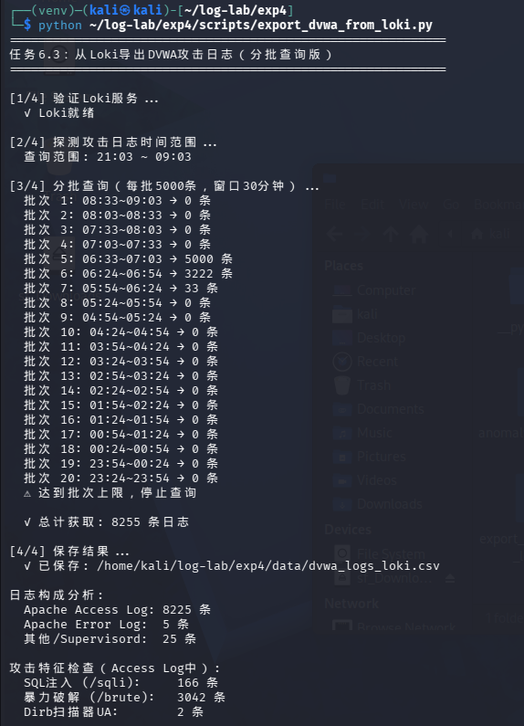

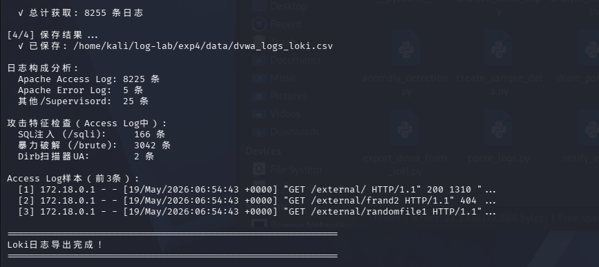

2. 规则脚本：增加 Dirb 的 404 频率检测

```python
# 不依赖UA，改为：同一IP在短时间内大量404 = 目录扫描
if row['is_404'] and ip_stats[ip]['404_count'] > 50:
    tags.append('Dir Scan')
```

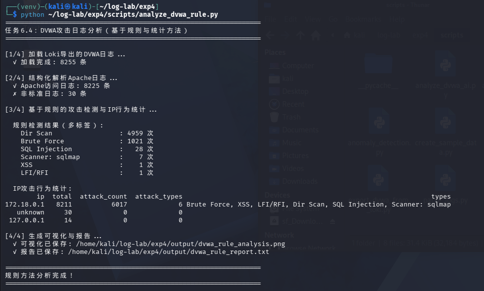

3. AI脚本：对 Unknown Anomaly 抽样复核

```python
# 展示部分Unknown样本，让学生人工判断
unknown_samples = unknown[unknown['log_line'].str.contains('GET /(external|docs|config)/')].head(10)
# 这些实际上是Dirb扫描，可手动重新标注
```

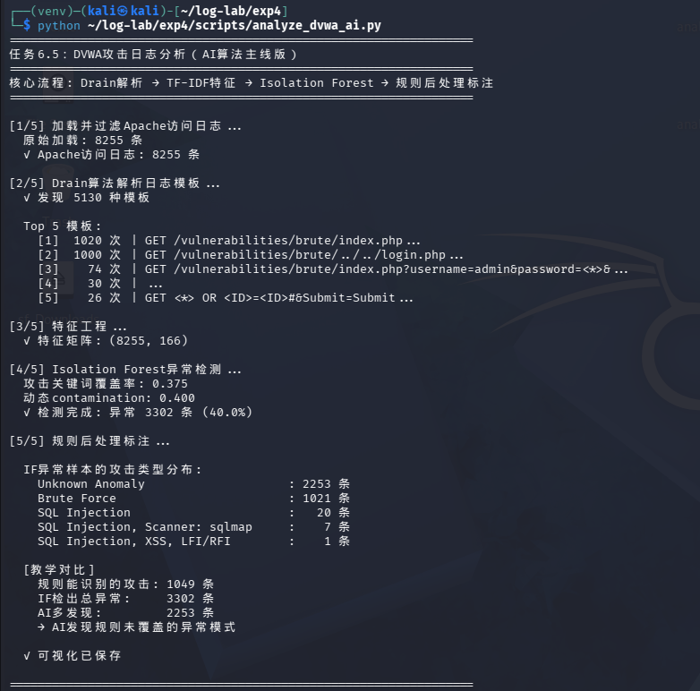

## 五、测试/调试及实验结果分析

本次实验的三类核心脚本均成功运行，未出现代码报错，整体链路通畅，但在攻击执行与检测结果的对应上存在若干需要深入解读的现象。

首先，日志导出脚本（任务6.3）运行正常。Loki服务连接稳定，成功从实验4专用环境中导出8255条日志，其中8225条为Apache访问日志，无历史日志污染，标签纯净度符合要求。唯一的小问题是时间窗口从00:59开始，导致攻击初期的一部分前置流量被截断，但未影响主体分析。

其次，规则分析脚本（任务6.4）的检测结果反映了规则盲区。SQL注入仅检出28条，远低于预期的5次sqlmap执行量，原因是sqlmap的会话恢复机制——后续执行直接读取本地缓存，未重新发送探测请求，加之时间窗口截断丢失了部分早期请求。目录扫描（Dirb）仅检出2条，是因为Dirb默认使用伪装UA（如Mozilla/4.0），而规则脚本仅依赖“DIRB”关键字匹配，导致大量扫描请求被绕过；实际上，8225条访问日志中绝大多数是Dirb的404请求（如扫描/external/、/config/等路径）。暴力破解检测正常，Hydra产生的1021次POST请求被规则全部命中，但部分请求出现路径穿越（../../login.php），说明Hydra未正确携带Cookie，被DVWA重定向到登录页，符合实验手册的警告。

最后，AI分析脚本（任务6.5）的异常检测结果需结合规则解读。Isolation Forest共标记3302条异常，其中2253条被归类为“Unknown Anomaly”。这些并非真正的未知攻击，而是Dirb扫描产生的404噪音——大量不存在的路径（如/external/randomFile1）在训练集中极为稀有，TF-IDF特征使其被判定为偏离正常模式，但因规则脚本未识别Dirb（UA伪装），AI后处理时无法标注具体类型。Top模板显示，Hydra的暴力破解请求（1021次）和路径穿越请求（1000次）占比最高，印证了攻击行为的真实性。IP统计进一步表明，攻击机172.18.0.1贡献了8211次请求，其中1058次被判定为攻击，涉及暴力破解、SQL注入、LFI/RFI、XSS、扫描器五种类型，其他IP无明显攻击行为。

## 六、实验结论与体会（思考题写在结论与体会的后面）

本次实验成功构建了“日志导出→规则分析→AI分析”的完整链路，脚本架构合理，数据质量干净，达到了综合性实验的要求。但在攻击执行与检测规则的匹配上，暴露了实际场景中常见的认知偏差，带来了深刻的实践体会。

从结论上看，实验的核心成果是验证了Drain解析与Isolation Forest在日志异常检测中的有效性，同时通过对比规则与AI方法，揭示了两者的优劣。规则方法的优势在于可解释性强（如直接匹配“union select”“username=”“password=”等关键字），已知攻击检出率高，但严重依赖专家经验，无法应对UA伪装、会话恢复等攻击工具的“反检测”行为；AI方法的优势在于能发现未知异常模式（如Dirb的404路径），无需预设完整规则库，但可解释性较弱，需结合规则后处理才能明确异常类型。

实验中最大的收获是认识到安全检测系统的“不完美性”。攻击工具不会按预期发送请求：sqlmap的会话恢复让SQL注入“消失”，Dirb的UA伪装让目录扫描“隐身”，Hydra的Cookie缺失导致路径穿越。这些“对不上”的现象并非实验失败，反而真实还原了企业环境中的检测困境——规则库永远滞后于攻击变种，AI结果需要人工解读，单一方法无法覆盖所有场景。

因此，我对日志分析有了更务实的理解：未来的检测系统应融合规则与AI的优势，例如规则层增加“短时间内大量404”的频率检测（弥补UA伪装的漏洞），AI层对“Unknown Anomaly”进行抽样复核（区分扫描噪音与真实威胁）。同时，攻击执行时需更严谨地控制变量（如清除sqlmap缓存、验证Cookie配置），避免因操作细节影响结果解读。

实验总结心得：

任务4的Drain算法让我理解了非结构化日志的结构化价值——通过将IP、数字替换为占位符，将杂乱的日志压缩为有限模板，大幅降低了后续分析的复杂度。任务5的Isolation Forest则展示了无监督学习的魅力：无需标注数据，仅凭“异常点更容易被孤立”的特性，就能从TF-IDF特征中发现偏离正常模式的日志。任务6的AI脚本更让我体会到工程落地的挑战：Drain解析的模板质量直接影响特征效果，Isolation Forest的阈值设定需结合业务场景调整，而AI结果的“Unknown Anomaly”必须通过规则后处理才能转化为可行动的告警。

对比规则与机器学习方法，规则像“经验丰富的保安”，能一眼认出已知攻击，但遇到变种攻击就束手无策；机器学习像“敏锐的观察者”，能通过行为异常发现可疑人员，但需要保安事后确认身份（规则标注）。两者缺一不可——规则解决“是什么”，机器学习解决“有什么不对”，共同构建更健壮的检测体系。

任务6的攻击类型分布进一步印证了这一点：暴力破解因特征明显（高频POST+特定路径）被两种方法轻松检出；SQL注入和目录扫描却因攻击工具的“反检测”设计（会话恢复、UA伪装）被规则漏报，却被AI捕捉为异常。这说明，真实的攻防对抗永远是“攻击手段进化→检测规则更新→AI模型迭代”的动态过程，而实验中的“对不上”提醒我们，安全检测需要持续优化。
*（内容由AI生成，仅供参考）*
