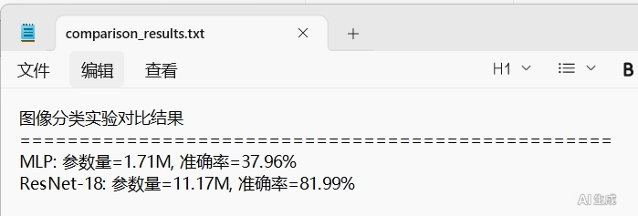
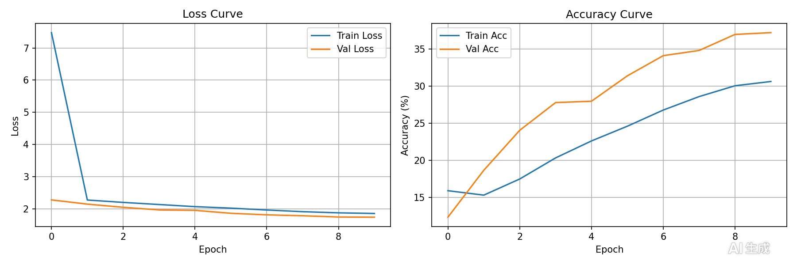
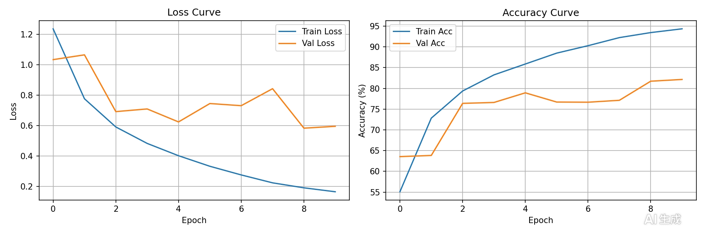
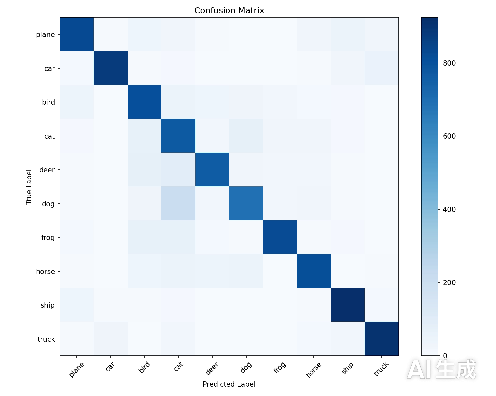
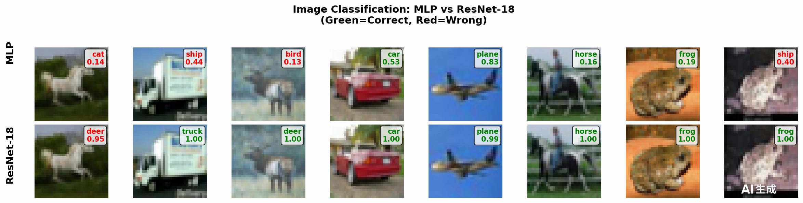
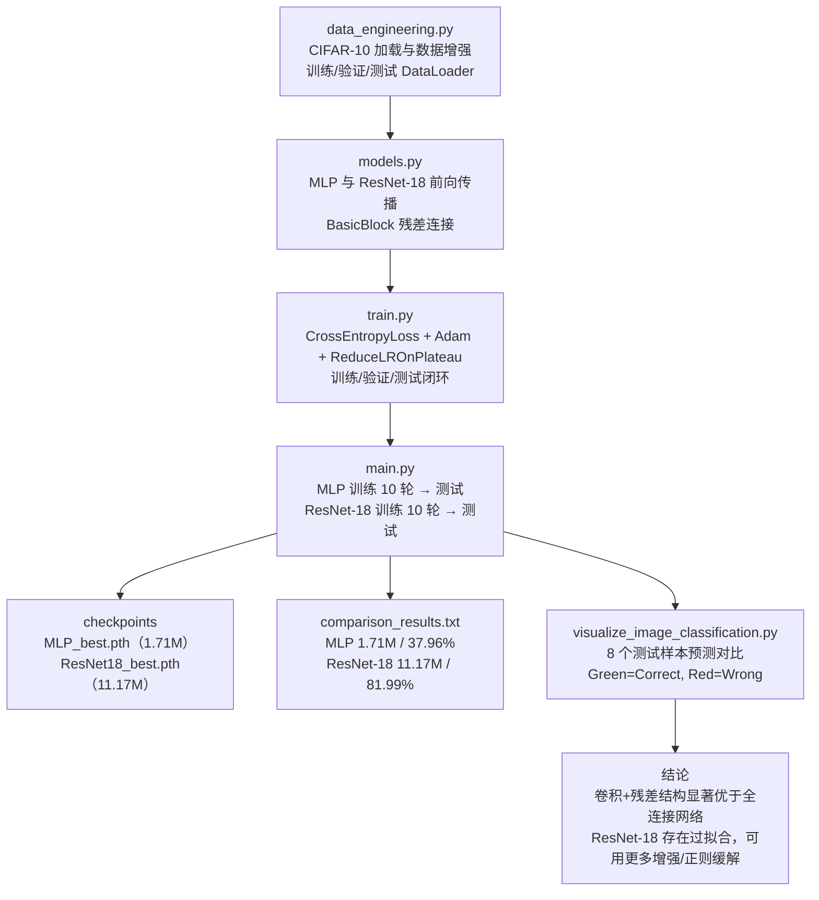

---
AIGC:
    Label: "1"
    ContentProducer: 001191440300708461136T1XGW3
    ProduceID: 278e15af09c947df43b62560d322c33a_b22ba832b41711f1812e525400248c00
    ReservedCode1: 3UstoPOaNpLsUL1e55CmKE915wyDcDShomfUbMtKDMBYFwAmmZ0//pLoLxNvHV7AF3Xn6NxuZ0SeWA5tPztpF72qadtKzJCIVa/tZDSzyBPJoCy6hxhiJ8wHz3EFL4tYmrP/kUdtBXE4sfkDkMuc77WBEseD7wQSlw1NkMfmcpdwbzQzz6gqkmgcUpE=
    ContentPropagator: 001191440300708461136T1XGW3
    PropagateID: 278e15af09c947df43b62560d322c33a_b22ba832b41711f1812e525400248c00
    ReservedCode2: 3UstoPOaNpLsUL1e55CmKE915wyDcDShomfUbMtKDMBYFwAmmZ0//pLoLxNvHV7AF3Xn6NxuZ0SeWA5tPztpF72qadtKzJCIVa/tZDSzyBPJoCy6hxhiJ8wHz3EFL4tYmrP/kUdtBXE4sfkDkMuc77WBEseD7wQSlw1NkMfmcpdwbzQzz6gqkmgcUpE=
title: CIFAR-10图像分类实验
published: 2026-09-19
pinned: false
description: 基于 PyTorch 的 CIFAR-10 图像分类实验：围绕 CIFAR-10 数据集搭建「数据工程 → 模型定义 → 训练与测试 → 可视化对比」完整流程，分别用多层感知机（MLP）与 ResNet-18 完成 10 类彩色图像分类，并对比两种模型的参数量、测试准确率、训练曲线、混淆矩阵与预测结果。
tags: [深度学习, 图像分类, CIFAR-10, MLP, ResNet-18, PyTorch]
category: 深度学习
licenseName: ''
author: kilolo
sourceLink: ''
slug: cifar10-image-classification
image: ./images/DSExp1/ds-01.png
---


本文是《数据科学与数学建模》实验一的完整记录：在 PyTorch 框架下围绕 CIFAR-10 数据集搭建「数据工程 → 模型定义 → 训练与测试 → 可视化对比」的完整流程，分别用多层感知机（MLP）与 ResNet-18 完成 10 类彩色图像的分类，并对两种模型的参数量、测试准确率、训练曲线、混淆矩阵与预测结果做对比分析。

## 一、实验目的及要求

1. 掌握 PyTorch 数据加载与预处理流程。
2. 理解并实现两种神经网络模型（MLP 和 ResNet-18）的前向传播。
3. 掌握模型训练、验证和测试的完整流程。
4. 对比分析不同模型在图像分类任务上的性能差异。

## 二、实验原理与内容

### 2.1 两种模型的原理

**MLP（多层感知机）**：全连接网络，将图像展平后通过三层线性层 + ReLU + Dropout 完成分类，无法捕捉空间结构信息。

**ResNet-18**：基于残差连接的卷积神经网络，通过 BasicBlock 解决深层网络梯度消失问题，有效提取图像局部与全局特征。

| 对比项 | MLP | ResNet-18 |
| --- | --- | --- |
| 网络类型 | 全连接网络 | 残差卷积网络 |
| 输入处理 | 先 Flatten 展平为 3072 维向量，丢失空间结构 | 保持 3×32×32 特征图，逐层提取局部与全局特征 |
| 主要结构 | Flatten → FC(3072,512) → ReLU → Dropout → FC(512,256) → ReLU → Dropout → FC(256,10) | Conv1 → 4 个残差层（每层 2 个 BasicBlock，通道 64→128→256→512）→ 全局平均池化 → FC(512,10) |
| 关键机制 | Dropout(0.3) 抑制过拟合，Kaiming 初始化 | BasicBlock 的恒等/投影 shortcut 残差连接，缓解梯度消失 |
| 参数量 | 1.71M | 11.17M |
| 测试准确率 | 37.96% | 81.99% |

### 2.2 实验内容与脚本顺序

1. 依次完成 `data_engineering.py`、`models.py`、`train.py` 中的代码补全。
2. 分别运行上述三个文件，确认各自能够正常执行。
3. 运行 `python main.py` 完成完整实验。
4. 运行 `python visualize_image_classification.py` 生成可视化结果。

| 顺序 | 脚本文件 | 类型 | 是否需编写代码 | 验证方式 |
| :---: | :--- | :--- | :---: | :--- |
| 1 | `data_engineering.py` | 数据工程 | 是 | 直接运行，确认数据加载与迭代器创建无误 |
| 2 | `models.py` | 模型定义 | 是 | 直接运行，观察模拟输入的输出形状 |
| 3 | `train.py` | 训练与测试 | 是 | 直接运行，观察各测试环节输出 |
| 4 | `main.py` | 主程序 | 否（阅读并理解） | 前三者测试通过后运行，完成完整实验 |
| 5 | `visualize_image_classification.py` | 可视化 | 否（阅读并理解） | `main.py` 生成权重后运行，输出对比图 |

## 三、实验软硬件环境

| 类别 | 配置 |
| --- | --- |
| 操作系统 | Windows 11 |
| 开发工具 | PyCharm 2024.2 |
| 编程语言 | Python 3 |
| 深度学习框架 | PyTorch 2.7.1 + torchvision |
| 依赖库 | matplotlib、scikit-learn、tqdm、numpy |
| 数据集 | CIFAR-10（50000 张训练 + 10000 张测试，10 类 32×32 彩色图） |
| 模型 | MLP、ResNet-18 |

## 四、实验过程

### 4.1 data_engineering.py — 数据工程模块

**总体任务**：补全代码，使程序能够加载 CIFAR-10 数据集，并将其封装为可供模型训练和验证使用的数据迭代器。

实现要点：

- 训练集 transform 使用 `RandomCrop(32, padding=4)` + `RandomHorizontalFlip(0.5)` 做数据增强，再 `ToTensor()` 与 `Normalize(mean, std)` 标准化；测试集只保留 `ToTensor()` + `Normalize()`，去掉随机增强。
- 用 `datasets.CIFAR10(root, train=True/False, download=True, transform=...)` 分别加载训练集与测试集。
- 用 `random_split` 按 9:1 划分训练/验证子集，并用 `generator=torch.Generator().manual_seed(42)` 固定随机种子保证可复现。
- `random_split` 返回的是 Subset，需要把验证集的 `transform` 改回 `test_transform`，避免验证阶段带随机增强。
- 三个 DataLoader 中训练集 `shuffle=True`、验证/测试集 `shuffle=False`；`pin_memory` 依据 `torch.cuda.is_available()` 决定。

```python
"""
数据工程模块：负责数据加载、预处理和划分

学生任务：
创建 DataLoader
"""

import torch
from torchvision import transforms, datasets
from torch.utils.data import DataLoader, random_split


class CIFAR10Data:
    """
    CIFAR-10 数据管理类

    学生任务：
    创建 DataLoader
    """

    def __init__(self, data_dir='./data', batch_size=64, num_workers=2):
        """
        初始化数据管理器

        Args:
            data_dir: 数据存储路径
            batch_size: 批次大小
            num_workers: 数据加载线程数
        """
        self.data_dir = data_dir
        self.batch_size = batch_size
        self.num_workers = num_workers

        # CIFAR-10 的均值和标准差（预计算）
        self.mean = (0.4914, 0.4822, 0.4465)
        self.std = (0.2023, 0.1994, 0.2010)

        # 定义训练集的 transform（需包含数据增强）
        #   1. 使用 transforms.Compose 将多个变换组合在一起
        #   2. 数据增强是为了提高模型的泛化能力，防止过拟合
        #   3. 建议的数据增强操作：
        #      - transforms.RandomCrop(32, padding=4)：随机裁剪，padding=4 表示先在图像四周填充 4 个像素
        #      - transforms.RandomHorizontalFlip(p=0.5)：以 50% 的概率水平翻转图像
        #      - transforms.ToTensor()：将 PIL Image 转为 Tensor，并把像素值从 [0,255] 归一化到 [0,1]
        #      - transforms.Normalize(mean, std)：用预计算的均值和标准差进行标准化
        #   4. 注意：数据增强只应在训练时使用，测试时不需要
        self.train_transform = transforms.Compose([
            # 提示：考虑使用 RandomCrop、RandomHorizontalFlip、ColorJitter
            transforms.RandomCrop(32, padding=4),
            transforms.RandomHorizontalFlip(p=0.5),
            transforms.ToTensor(),
            transforms.Normalize(self.mean, self.std)
        ])

        # 定义测试集的 transform（只需归一化，无需增强）
        #   1. 测试/验证时不需要数据增强，只做必要的预处理即可
        #   2. 必须包含 ToTensor() 和 Normalize()，保持与训练时相同的预处理流程
        #   3. 不要加入 RandomCrop、RandomHorizontalFlip 等随机增强操作

        self.test_transform = transforms.Compose([
            transforms.ToTensor(),
            transforms.Normalize(self.mean, self.std)
        ])

    def load_data(self):
        """
        加载 CIFAR-10 数据集

        Returns:
            full_train: 完整训练集（含验证集）
            test_dataset: 测试集
        """
        # [学生填空]
        # TODO : 使用 datasets.CIFAR10 加载训练集和测试集
        # 提示：
        #   1. datasets.CIFAR10 是 torchvision 内置的数据集类
        #   2. 参数说明：
        #      - root: 数据存放目录（self.data_dir）
        #      - train=True: 加载训练集（50000张）；train=False: 加载测试集（10000张）
        #      - download=True: 如果本地没有数据，自动从网络下载
        #      - transform: 数据预处理管道（训练集用 self.train_transform，测试集用 self.test_transform）
        #   3. 注意：训练集和测试集要分别设置不同的 transform

        # 去掉下面代码的注释，并补全代码
        full_train = datasets.CIFAR10(
            root=self.data_dir,
            train=True,
            download=True,
            transform=self.train_transform
        )

        test_dataset = datasets.CIFAR10(
            root=self.data_dir,
            train=False,
            download=True,
            transform=self.test_transform
        )

        print(f"训练集大小: {len(full_train)}")
        print(f"测试集大小: {len(test_dataset)}")

        return full_train, test_dataset

    def split_data(self, full_train, val_ratio=0.1):
        """
        将训练集划分为训练集和验证集

        Args:
            full_train: 完整训练集
            val_ratio: 验证集比例

        Returns:
            train_dataset: 训练子集
            val_dataset: 验证子集（需重新设置 transform 为 test_transform）
        """
        total_size = len(full_train)
        val_size = int(total_size * val_ratio)
        train_size = total_size - val_size

        # 使用 random_split 划分数据集
        #   1. random_split(dataset, lengths) 可以将数据集按比例切分
        #   2. lengths 是一个列表，表示每份子集的大小，如 [train_size, val_size]
        #   3. 为了保证实验可复现，需要设置随机种子：
        #      generator=torch.Generator().manual_seed(42)
        #   4. random_split 返回的是 Subset 对象，验证集需要去掉数据增强：
        #      val_dataset.dataset.transform = self.test_transform
        #      （因为 Subset 不复制数据，修改的是原数据集的 transform）

        train_dataset, val_dataset = random_split(
            full_train,
            [train_size, val_size],
            generator=torch.Generator().manual_seed(42)
        )

        # 重要：验证集需要重新设置 transform（去掉数据增强）
        # 因为 random_split 返回的是 Subset，需要修改其 dataset 的 transform
        val_dataset.dataset.transform = self.test_transform

        print(f"训练子集大小: {len(train_dataset)}")
        print(f"验证子集大小: {len(val_dataset)}")

        return train_dataset, val_dataset

    def get_loaders(self, val_ratio=0.1):
        """
        获取三个 DataLoader

        Returns:
            train_loader, val_loader, test_loader
        """
        full_train, test_dataset = self.load_data()
        train_dataset, val_dataset = self.split_data(full_train, val_ratio)

        # [学生填空]
        # TODO : 创建三个 DataLoader
        # 提示：
        #   1. DataLoader 用于将 Dataset 包装成可迭代的数据加载器
        #   2. 参数说明：
        #      - dataset: 数据集对象
        #      - batch_size: 每批加载的样本数（从 self.batch_size 获取）
        #      - shuffle: 是否打乱数据。训练集设为 True，验证集和测试集设为 False
        #      - num_workers: 加载数据的子进程数（从 self.num_workers 获取）
        #      - pin_memory: 是否将数据固定在 CUDA 内存中，可加速 GPU 训练
        #        判断条件：pin_memory=True if torch.cuda.is_available() else False
        #   3. 需要分别创建 train_loader、val_loader、test_loader

        # 去掉下面代码的注释，并补全代码
        train_loader = DataLoader(
            train_dataset,
            batch_size=self.batch_size,
            shuffle=True,
            num_workers=self.num_workers,
            pin_memory=True if torch.cuda.is_available() else False
        )

        val_loader = DataLoader(
            val_dataset,
            batch_size=self.batch_size,
            shuffle=False,
            num_workers=self.num_workers,
            pin_memory=True if torch.cuda.is_available() else False
        )

        test_loader = DataLoader(
            test_dataset,
            batch_size=self.batch_size,
            shuffle=False,
            num_workers=self.num_workers,
            pin_memory=True if torch.cuda.is_available() else False
        )

        return train_loader, val_loader, test_loader


# 测试代码，不要改动此部分的代码
if __name__ == '__main__':
    data_manager = CIFAR10Data(batch_size=64)
    train_loader, val_loader, test_loader = data_manager.get_loaders()

    # 测试一个 batch
    images, labels = next(iter(train_loader))
    print(f"图像 batch 形状: {images.shape}")  # 应为 [64, 3, 32, 32]
    print(f"标签 batch 形状: {labels.shape}")  # 应为 [64]
    print(f"图像数值范围: [{images.min():.2f}, {images.max():.2f}]")
```


### 4.2 models.py — 模型定义模块

**总体任务**：补全代码，使两种神经网络模型能够完成从输入图像到分类结果的前向传播计算。

实现要点：

- MLP 的 `forward`：`flatten → fc1 → ReLU → dropout1 → fc2 → ReLU → dropout2 → fc3`，最后一层不加 ReLU 也不加 Softmax，直接把 logits 交给 `CrossEntropyLoss`。
- BasicBlock 的 `forward`：记录 `identity = self.shortcut(x)`，主干走 `conv1 → bn1 → ReLU → conv2 → bn2`，再与 identity 相加后过 ReLU，完成残差连接。
- ResNet-18 整体结构（`_make_layer`、全局平均池化、FC）由任务提供，阅读并理解即可。

```python
"""
模型定义模块：MLP 和 ResNet-18

学生任务：
1. 完成 MLP 的前向传播函数 forward
2. 完成 ResNet 基础残差块的前向传播函数 forward
3. 理解 ResNet 残差结构（不用完成代码填空）
"""

import torch
import torch.nn as nn
import torch.nn.functional as F


class MLP(nn.Module):
    """
    多层感知机（全连接网络）

    结构：Flatten -> FC(3072, 512) -> ReLU -> Dropout
                     -> FC(512, 256) -> ReLU -> Dropout
                     -> FC(256, 10)

    学生任务：完成 forward 函数
    """

    def __init__(self, num_classes=10, dropout=0.3):
        super(MLP, self).__init__()

        self.flatten = nn.Flatten()
        self.fc1 = nn.Linear(32 * 32 * 3, 512)
        self.dropout1 = nn.Dropout(dropout)
        self.fc2 = nn.Linear(512, 256)
        self.dropout2 = nn.Dropout(dropout)
        self.fc3 = nn.Linear(256, num_classes)

        # 权重初始化
        self._initialize_weights()

    def _initialize_weights(self):
        for m in self.modules():
            if isinstance(m, nn.Linear):
                nn.init.kaiming_normal_(m.weight, mode='fan_out', nonlinearity='relu')
                if m.bias is not None:
                    nn.init.constant_(m.bias, 0)

    def forward(self, x):
        """
        前向传播

        Args:
            x: 输入图像 [batch_size, 3, 32, 32]

        Returns:
            logits: 未归一化的分类分数 [batch_size, num_classes]
        """
        # [学生填空]
        # TODO : 实现 MLP 的前向传播
        # 提示：
        #   1. MLP 的处理流程是线性的：展平 -> 全连接 -> 激活 -> Dropout -> 输出
        #   2. 步骤分解：
        #      a. 用 self.flatten(x) 将 [batch, 3, 32, 32] 展平为 [batch, 3072]
        #      b. 通过第一层全连接 self.fc1，再用 F.relu 激活
        #      c. 通过 self.dropout1 进行随机失活（防止过拟合）
        #      d. 通过第二层全连接 self.fc2，再用 F.relu 激活
        #      e. 通过 self.dropout2 进行随机失活
        #      f. 通过第三层全连接 self.fc3，输出 10 维的 logits（不激活，不 softmax）
        #   3. 注意：最后一层不要加 ReLU，也不要加 Softmax
        #      - 不加 ReLU：避免截断负值，保留完整的分类分数
        #      - 不加 Softmax：CrossEntropyLoss 内部会自动计算 softmax
        #   4. Dropout 在训练时随机丢弃部分神经元（rate=0.3），在 eval 模式下自动关闭

        x = self.flatten(x)  # 展平
        # 去掉下面代码的注释，并补全代码
        x = F.relu(self.fc1(x))
        x = self.dropout1(x)
        x = F.relu(self.fc2(x))
        x = self.dropout2(x)
        x = self.fc3(x)
        return x


class BasicBlock(nn.Module):
    """
    ResNet 基础残差块

    结构：Conv3x3 -> BN -> ReLU -> Conv3x3 -> BN -> (+shortcut) -> ReLU
    """

    def __init__(self, in_channels, out_channels, stride=1):
        super(BasicBlock, self).__init__()

        # 第一个卷积层，可能下采样
        self.conv1 = nn.Conv2d(
            in_channels, out_channels, kernel_size=3,
            stride=stride, padding=1, bias=False
        )
        self.bn1 = nn.BatchNorm2d(out_channels)

        # 第二个卷积层，不下采样
        self.conv2 = nn.Conv2d(
            out_channels, out_channels, kernel_size=3,
            stride=1, padding=1, bias=False
        )
        self.bn2 = nn.BatchNorm2d(out_channels)

        # shortcut 连接
        self.shortcut = nn.Sequential()
        if stride != 1 or in_channels != out_channels:
            self.shortcut = nn.Sequential(
                nn.Conv2d(in_channels, out_channels, kernel_size=1,
                          stride=stride, bias=False),
                nn.BatchNorm2d(out_channels)
            )

    def forward(self, x):
        """
        残差块前向传播

        Args:
            x: 输入特征图 [batch_size, in_channels, H, W]

        Returns:
            out: 输出特征图 [batch_size, out_channels, H', W']
        """
        # [学生填空]
        # TODO : 实现 ResNet 基础残差块的前向传播
        # 按照上面的基础残差块构造函数提供的成员以及残差块的定义，完成下面的代码
        # 去掉下面代码的注释，并补全代码
        identity = self.shortcut(x)
        out = self.conv1(x)
        out = self.bn1(out)
        out = F.relu(out)
        out = self.conv2(out)
        out = self.bn2(out)
        out += identity
        out = F.relu(out)
        return out


class ResNet18(nn.Module):
    """
    ResNet-18 for CIFAR-10

    结构：Conv1 -> [Layer1 x2] -> [Layer2 x2] -> [Layer3 x2] -> [Layer4 x2]
         -> GlobalAvgPool -> FC(512, 10)

    学生任务：理解残差结构，完成构建（已在 __init__ 中完成）
    """

    def __init__(self, num_classes=10):
        super(ResNet18, self).__init__()

        # 初始卷积层（针对 32x32 小图像调整）
        self.conv1 = nn.Conv2d(3, 64, kernel_size=3, stride=1, padding=1, bias=False)
        self.bn1 = nn.BatchNorm2d(64)

        # 4 个残差层，通道数变化：64 -> 128 -> 256 -> 512
        # 空间尺寸变化：32 -> 32 -> 16 -> 8 -> 4
        self.layer1 = self._make_layer(64, 64, num_blocks=2, stride=1)  # 32x32
        self.layer2 = self._make_layer(64, 128, num_blocks=2, stride=2)  # 16x16
        self.layer3 = self._make_layer(128, 256, num_blocks=2, stride=2)  # 8x8
        self.layer4 = self._make_layer(256, 512, num_blocks=2, stride=2)  # 4x4

        self.avg_pool = nn.AdaptiveAvgPool2d((1, 1))
        self.fc = nn.Linear(512, num_classes)

        self._initialize_weights()

    def _make_layer(self, in_channels, out_channels, num_blocks, stride):
        """
        构建残差层

        Args:
            in_channels: 输入通道数
            out_channels: 输出通道数
            num_blocks: 残差块数量
            stride: 第一个块的步长

        提示：
            1. 每个残差层由多个 BasicBlock 组成
            2. 第一个 BasicBlock 可能下采样（stride 可能大于 1）
            3. 后续 BasicBlock 不下采样（stride=1）
            4. 使用 nn.Sequential(*layers) 将列表转换为顺序容器
        """
        layers = []
        # 第一个块可能下采样
        layers.append(BasicBlock(in_channels, out_channels, stride))
        # 后续块不下采样
        for _ in range(1, num_blocks):
            layers.append(BasicBlock(out_channels, out_channels, stride=1))
        return nn.Sequential(*layers)

    def _initialize_weights(self):
        for m in self.modules():
            if isinstance(m, nn.Conv2d):
                nn.init.kaiming_normal_(m.weight, mode='fan_out', nonlinearity='relu')
            elif isinstance(m, nn.BatchNorm2d):
                nn.init.constant_(m.weight, 1)
                nn.init.constant_(m.bias, 0)

    def forward(self, x):
        """
        前向传播

        Args:
            x: 输入图像 [batch_size, 3, 32, 32]

        Returns:
            logits: 分类分数 [batch_size, num_classes]
        """
        x = F.relu(self.bn1(self.conv1(x)))
        x = self.layer1(x)
        x = self.layer2(x)
        x = self.layer3(x)
        x = self.layer4(x)
        x = self.avg_pool(x)
        x = x.view(x.size(0), -1)
        x = self.fc(x)
        return x


# 测试代码
if __name__ == '__main__':
    # 测试 MLP
    mlp = MLP(num_classes=10)
    x = torch.randn(2, 3, 32, 32)
    out = mlp(x)
    print(f"MLP 输出形状: {out.shape}")  # 正确答案应该是输出[2, 10]
    print(f"MLP 参数量: {sum(p.numel() for p in mlp.parameters()) / 1e6:.2f}M")

    # 测试 ResNet-18
    resnet = ResNet18(num_classes=10)
    out = resnet(x)
    print(f"ResNet 输出形状: {out.shape}")  # 正确答案应该是输出[2, 10]
    print(f"ResNet 参数量: {sum(p.numel() for p in resnet.parameters()) / 1e6:.2f}M")
```


### 4.3 train.py — 训练与测试模块

**总体任务**：补全代码，实现模型训练、验证、测试的完整流程。

实现要点：

- 损失函数 `nn.CrossEntropyLoss()`，优化器 `optim.Adam(lr=0.001, weight_decay=1e-4)`；学习率调度器 `ReduceLROnPlateau(mode='max', factor=0.5, patience=3)`，注意 PyTorch 2.7.1 已移除 `verbose` 参数，需要手动比较前后学习率并打印。
- 单轮训练循环按「梯度清零 → 前向传播 → 计算损失 → 反向传播 → 参数更新」五步实现，顺序不可颠倒。
- 验证流程在 `model.eval()` + `torch.no_grad()` 下推理，仅统计损失与准确率，不做梯度计算。
- 完整训练流程逐轮调用 `train_epoch()` 与 `validate()`，记录 history、按验证准确率保存最优权重，最后保存 history json 并绘制损失/准确率双曲线。
- `test()` 先加载权重，再在测试集上推理，打印测试准确率与 `classification_report`，并绘制混淆矩阵保存为 `confusion_matrix.png`。

```python
"""
训练与测试模块 - 兼容 PyTorch 2.7.1

学生任务：
1. 完成损失函数、优化器和学习率调度器的配置
2. 实现一个 epoch 的训练循环（梯度清零、前向传播、反向传播、参数更新）
3. 实现验证流程（模型评估、准确率统计）
4. 实现完整训练流程（训练-验证循环、保存最佳模型、绘制曲线）
5. 实现模型测试流程（加载权重、推理、生成分类报告和混淆矩阵）
"""

import torch
import torch.nn as nn
import torch.optim as optim
from tqdm import tqdm
import json
import os
import matplotlib.pyplot as plt
from sklearn.metrics import confusion_matrix, classification_report
import numpy as np


class Trainer:
    """
    模型训练器 - 修复 PyTorch 2.7.1 兼容性问题

    学生任务：
    1. 配置损失函数和优化器
    2. 实现训练循环的核心步骤
    3. 实现验证和测试流程
    4. 绘制训练曲线并保存最佳模型
    """

    def __init__(self, model, train_loader, val_loader, device,
                 lr=0.001, weight_decay=1e-4, model_name='model'):
        self.model = model.to(device)
        self.train_loader = train_loader
        self.val_loader = val_loader
        self.device = device
        self.model_name = model_name

        # [学生填空]
        # TODO : 配置损失函数和优化器
        # 提示：
        #   1. 分类任务通常使用交叉熵损失 nn.CrossEntropyLoss()
        #   2. 优化器选用 Adam，需要传入模型参数 model.parameters()
        #   3. 学习率 lr 和权重衰减 weight_decay 已从函数参数传入，需要设置在optim.Adam函数当中

        self.criterion = nn.CrossEntropyLoss()
        self.optimizer = optim.Adam(self.model.parameters(), lr=lr, weight_decay=weight_decay)

        # 配置学习率调度器
        #   1. 使用 optim.lr_scheduler.ReduceLROnPlateau
        #   2. 监控指标是验证准确率，所以 mode='max'（越大越好）
        #   3. factor=0.5 表示学习率衰减为原来的一半
        #   4. patience=3 表示验证准确率连续 3 轮不提升就降低学习率
        #   5. 注意：PyTorch 2.7.1 已移除 verbose 参数，需手动打印学习率变化

        self.scheduler = optim.lr_scheduler.ReduceLROnPlateau(
            self.optimizer,
            mode='max',  # 监控准确率（最大化）
            factor=0.5,  # 学习率衰减因子
            patience=3,  # 等待轮数
            # verbose=True        # 移除！PyTorch 2.7.1 不支持
        )

        # 训练历史
        self.history = {
            'train_loss': [], 'train_acc': [],
            'val_loss': [], 'val_acc': []
        }
        self.best_acc = 0.0
        self.current_lr = lr  # 记录当前学习率

    def train_epoch(self):
        """
        训练一个 epoch

        学生任务：完成训练循环的核心步骤
        提示：梯度清零 -> 前向传播 -> 计算损失 -> 反向传播 -> 参数更新
        """
        self.model.train()
        total_loss = 0.0
        correct = 0
        total = 0

        pbar = tqdm(self.train_loader, desc='Training')
        for inputs, labels in pbar:
            inputs, labels = inputs.to(self.device), labels.to(self.device)

            # [学生填空]
            # TODO : 梯度清零
            # 提示：
            #   1. 每个 batch 开始前必须清零梯度，否则梯度会累加
            #   2. 调用优化器的 zero_grad() 方法

            self.optimizer.zero_grad()

            # [学生填空]
            # TODO : 前向传播 + 计算损失
            # 提示：
            #   1. 将 inputs 输入模型，得到 outputs（未归一化的分类分数 logits）
            #   2. 使用 self.criterion 计算 outputs 和 labels 之间的损失
            #   3. 注意：CrossEntropyLoss 内部会自动做 softmax，不需要额外处理

            outputs = self.model(inputs)
            loss = self.criterion(outputs, labels)

            # [学生填空]
            # TODO : 反向传播和参数更新
            # 提示：
            #   1. 反向传播计算梯度
            #   2. 更新模型参数
            #   3. 这两步的顺序不能颠倒

            loss.backward()
            self.optimizer.step()

            # 统计
            total_loss += loss.item()
            _, predicted = outputs.max(1)
            total += labels.size(0)
            correct += predicted.eq(labels).sum().item()

            # 更新进度条
            pbar.set_postfix({
                'loss': f'{loss.item():.4f}',
                'acc': f'{100. * correct / total:.2f}%',
                'lr': f'{self.optimizer.param_groups[0]["lr"]:.6f}'
            })

        avg_loss = total_loss / len(self.train_loader)
        accuracy = 100. * correct / total
        return avg_loss, accuracy

    def validate(self):
        """
        验证一个 epoch

        学生任务：在验证模式下进行前向推理
        提示：使用 torch.no_grad() 关闭梯度计算
        """
        self.model.eval()
        total_loss = 0.0
        correct = 0
        total = 0

        with torch.no_grad():
            pbar = tqdm(self.val_loader, desc='Validating')
            for inputs, labels in pbar:
                inputs, labels = inputs.to(self.device), labels.to(self.device)

                # [学生填空]
                # TODO : 前向传播 + 计算损失
                # 提示：
                #   1. 验证阶段不需要计算梯度（已在 torch.no_grad() 上下文中）
                #   2. 与训练阶段相同：inputs -> model -> outputs -> criterion -> loss
                #   3. 注意：模型已在 eval 模式，Dropout 和 BatchNorm 行为会自动调整

                outputs = self.model(inputs)
                loss = self.criterion(outputs, labels)

                # 统计验证损失和准确率
                #   1. 累加当前 batch 的 loss.item() 到 total_loss
                #   2. 使用 outputs.max(1) 获取预测类别（返回最大值和索引，取索引）
                #   3. 累加 batch 样本数到 total
                #   4. 统计预测正确的样本数：predicted.eq(labels).sum().item()

                total_loss += loss.item()
                _, predicted = outputs.max(1)
                total += labels.size(0)
                correct += predicted.eq(labels).sum().item()

                pbar.set_postfix({'acc': f'{100. * correct / total:.2f}%'})

        avg_loss = total_loss / len(self.val_loader)
        accuracy = 100. * correct / total
        return avg_loss, accuracy

    def train(self, epochs=20, save_dir='./checkpoints'):
        """
        完整训练流程

        学生任务：实现训练-验证循环
        提示：
        1. 每轮先训练再验证
        2. 记录训练和验证的 loss / acc
        3. 调用 scheduler.step(val_acc) 调整学习率
        4. 当验证准确率最高时保存模型权重
        """
        os.makedirs(save_dir, exist_ok=True)
        best_model_path = os.path.join(save_dir, f'{self.model_name}_best.pth')

        print(f"\n开始训练 {self.model_name}")
        print(f"设备: {self.device}")
        print(f"初始学习率: {self.optimizer.param_groups[0]['lr']}")
        print(f"总轮数: {epochs}")
        print("=" * 50)

        for epoch in range(epochs):
            print(f"\nEpoch [{epoch + 1}/{epochs}]")

            # [学生填空]
            # TODO : 训练一个 epoch
            # 提示：
            #   1. 调用 self.train_epoch() 完成当前 epoch 的训练
            #   2. 返回值：train_loss（平均损失）, train_acc（准确率）

            train_loss, train_acc = self.train_epoch()

            # [学生填空]
            # TODO : 验证一个 epoch
            # 提示：
            #   1. 调用 self.validate() 完成当前 epoch 的验证
            #   2. 返回值：val_loss（平均损失）, val_acc（准确率）

            val_loss, val_acc = self.validate()

            # 记录训练历史
            #   1. self.history 是一个字典，包含四个列表：
            #      'train_loss', 'train_acc', 'val_loss', 'val_acc'
            #   2. 将当前 epoch 的指标 append 到对应列表中
            #   3. 这些历史数据后续用于绘制训练曲线

            self.history['train_loss'].append(train_loss)
            self.history['train_acc'].append(train_acc)
            self.history['val_loss'].append(val_loss)
            self.history['val_acc'].append(val_acc)

            # 学习率调整 - 手动监控变化
            #   1. 调用 self.scheduler.step(val_acc) 让调度器根据验证准确率决定是否降低学习率
            #   2. 调度器会修改 self.optimizer.param_groups[0]['lr']
            #   3. 比较调整前后的 lr，如果发生变化则打印提示信息

            old_lr = self.optimizer.param_groups[0]['lr']
            self.scheduler.step(val_acc)
            new_lr = self.optimizer.param_groups[0]['lr']

            if new_lr != old_lr:
                print(f"! 学习率调整: {old_lr:.6f} -> {new_lr:.6f}")

            # 打印结果
            print(f"Train Loss: {train_loss:.4f}, Acc: {train_acc:.2f}%")
            print(f"Val   Loss: {val_loss:.4f}, Acc: {val_acc:.2f}%")
            print(f"LR: {new_lr:.6f}")

            # 保存最佳模型
            #   1. 比较当前验证准确率 val_acc 和历史最佳准确率 self.best_acc
            #   2. 如果当前更高，更新 self.best_acc 并保存模型权重
            #   3. 使用 torch.save(model.state_dict(), path) 保存参数
            #   4. best_model_path 已在函数开头定义好

            if val_acc > self.best_acc:
                self.best_acc = val_acc
                torch.save(self.model.state_dict(), best_model_path)
                print(f"[OK] 保存最佳模型，准确率: {val_acc:.2f}%")

        # 保存训练历史
        history_path = os.path.join(save_dir, f'{self.model_name}_history.json')
        with open(history_path, 'w') as f:
            json.dump(self.history, f, indent=2)

        # 绘制曲线
        self.plot_history(save_dir)

        return self.history

    def plot_history(self, save_dir):
        """
        绘制训练曲线

        使用 matplotlib 绘制损失曲线和准确率曲线
        创建 1x2 的子图，分别绘制 loss 和 accuracy
        """
        fig, axes = plt.subplots(1, 2, figsize=(12, 4))

        # 绘制损失曲线（训练集 + 验证集）
        #   1. 在左侧子图 axes[0] 上绘制两条曲线
        #   2. self.history['train_loss'] 是训练损失列表
        #   3. self.history['val_loss'] 是验证损失列表
        #   4. 设置 xlabel='Epoch', ylabel='Loss', title='Loss Curve'
        #   5. 调用 legend() 显示图例，grid(True) 显示网格

        axes[0].plot(self.history['train_loss'], label='Train Loss')
        axes[0].plot(self.history['val_loss'], label='Val Loss')
        axes[0].set_xlabel('Epoch')
        axes[0].set_ylabel('Loss')
        axes[0].set_title('Loss Curve')
        axes[0].legend()
        axes[0].grid(True)

        # 绘制准确率曲线（训练集 + 验证集）
        #   1. 在右侧子图 axes[1] 上绘制两条曲线
        #   2. self.history['train_acc'] 是训练准确率列表
        #   3. self.history['val_acc'] 是验证准确率列表
        #   4. 设置 xlabel='Epoch', ylabel='Accuracy (%)', title='Accuracy Curve'
        #   5. 调用 legend() 显示图例，grid(True) 显示网格

        axes[1].plot(self.history['train_acc'], label='Train Acc')
        axes[1].plot(self.history['val_acc'], label='Val Acc')
        axes[1].set_xlabel('Epoch')
        axes[1].set_ylabel('Accuracy (%)')
        axes[1].set_title('Accuracy Curve')
        axes[1].legend()
        axes[1].grid(True)

        plt.tight_layout()
        plt.savefig(os.path.join(save_dir, f'{self.model_name}_curves.png'), dpi=150)
        plt.close()


def test(model, test_loader, device, model_path=None, num_classes=10):
    """
    测试模型
    1. 如有 model_path，先加载保存的权重
    2. 在 eval 模式下进行推理，统计总体准确率
    3. 收集所有预测和真实标签，生成分类报告和混淆矩阵
    """

    # 加载模型权重（如果提供）
    #   1. 当 model_path 不为 None 时，说明需要从文件加载训练好的权重
    #   2. 使用 torch.load(model_path, map_location=device) 加载权重字典
    #   3. 使用 model.load_state_dict() 将权重载入模型
    #   4. map_location=device 确保在不同设备（CPU/GPU）间都能正常加载

    if model_path is not None:
        model.load_state_dict(torch.load(model_path, map_location=device))
        print(f"加载模型: {model_path}")

    model = model.to(device)
    model.eval()

    all_preds = []
    all_labels = []
    correct = 0
    total = 0

    # 在测试集上进行推理并收集预测结果
    #   1. 使用 torch.no_grad() 包裹推理过程，节省显存并加速
    #   2. 遍历 test_loader，每次获取一个 batch 的 inputs 和 labels
    #   3. 将数据移到 device（GPU/CPU）
    #   4. 前向传播得到 outputs，用 max(1) 取预测类别
    #   5. 累加 total（总样本数）和 correct（正确数）
    #   6. 将预测和标签转为 numpy 数组，分别存入 all_preds 和 all_labels
    #      （后续用于生成混淆矩阵和分类报告）

    with torch.no_grad():
        for inputs, labels in tqdm(test_loader, desc='Testing'):
            inputs, labels = inputs.to(device), labels.to(device)
            outputs = model(inputs)
            _, predicted = outputs.max(1)

            total += labels.size(0)
            correct += predicted.eq(labels).sum().item()

            all_preds.extend(predicted.cpu().numpy())
            all_labels.extend(labels.cpu().numpy())

    # 计算并打印测试准确率
    #   1. 准确率 = 正确预测样本数 / 总样本数 * 100
    #   2. 使用已统计的 correct 和 total 计算
    #   3. 打印格式：测试准确率: xx.xx%

    accuracy = 100. * correct / total
    print(f"\n测试准确率: {accuracy:.2f}%")

    # 打印详细分类报告
    #   1. 使用 sklearn.metrics.classification_report 生成分类报告
    #   2. 需要传入 all_labels（真实标签）、all_preds（预测标签）
    #   3. target_names 是 10 个类别的名称，已定义在 classes 变量中
    #   4. digits=4 表示保留 4 位小数

    classes = ('plane', 'car', 'bird', 'cat', 'deer',
               'dog', 'frog', 'horse', 'ship', 'truck')
    print("\n分类报告:")
    print(classification_report(all_labels, all_preds, target_names=classes, digits=4))

    # 绘制混淆矩阵并保存为图片
    #   1. 使用 sklearn.metrics.confusion_matrix(all_labels, all_preds) 计算混淆矩阵
    #   2. 使用 matplotlib 绘制热力图：plt.imshow(cm, interpolation='nearest', cmap=plt.cm.Blues)
    #   3. 设置标题、colorbar、坐标轴刻度和标签
    #   4. plt.tight_layout() 自动调整布局
    #   5. 保存为 confusion_matrix.png，dpi=150，然后 plt.close() 释放内存

    cm = confusion_matrix(all_labels, all_preds)
    plt.figure(figsize=(10, 8))
    plt.imshow(cm, interpolation='nearest', cmap=plt.cm.Blues)
    plt.title('Confusion Matrix')
    plt.colorbar()
    tick_marks = np.arange(num_classes)
    plt.xticks(tick_marks, classes, rotation=45)
    plt.yticks(tick_marks, classes)
    plt.ylabel('True Label')
    plt.xlabel('Predicted Label')
    plt.tight_layout()
    plt.savefig('confusion_matrix.png', dpi=150)
    plt.close()

    return accuracy


# 测试代码
if __name__ == '__main__':
    from models import MLP, ResNet18
    from torch.utils.data import TensorDataset, DataLoader

    # 创建模拟数据（用于快速测试，无需下载真实数据集）
    batch_size = 16
    num_samples = 64
    x = torch.randn(num_samples, 3, 32, 32)
    y = torch.randint(0, 10, (num_samples,))

    dataset = TensorDataset(x, y)
    train_loader = DataLoader(dataset, batch_size=batch_size, shuffle=True)
    val_loader = DataLoader(dataset, batch_size=batch_size, shuffle=False)
    test_loader = DataLoader(dataset, batch_size=batch_size, shuffle=False)

    device = torch.device('cuda' if torch.cuda.is_available() else 'cpu')
    print(f"使用设备: {device}\n")

    # 测试 MLP 训练器初始化和一个 epoch 训练
    print("=" * 50)
    print("测试 1: MLP Trainer 初始化与单 epoch 训练")
    print("=" * 50)
    mlp = MLP(num_classes=10)
    trainer_mlp = Trainer(mlp, train_loader, val_loader, device, model_name='MLP_test')
    train_loss, train_acc = trainer_mlp.train_epoch()
    print(f"训练 Loss: {train_loss:.4f}, Acc: {train_acc:.2f}%")
    val_loss, val_acc = trainer_mlp.validate()
    print(f"验证 Loss: {val_loss:.4f}, Acc: {val_acc:.2f}%")

    # 测试 ResNet18 训练器初始化和一个 epoch 训练
    print("\n" + "=" * 50)
    print("测试 2: ResNet18 Trainer 初始化与单 epoch 训练")
    print("=" * 50)
    resnet = ResNet18(num_classes=10)
    trainer_resnet = Trainer(resnet, train_loader, val_loader, device, model_name='ResNet18_test')
    train_loss, train_acc = trainer_resnet.train_epoch()
    print(f"训练 Loss: {train_loss:.4f}, Acc: {train_acc:.2f}%")
    val_loss, val_acc = trainer_resnet.validate()
    print(f"验证 Loss: {val_loss:.4f}, Acc: {val_acc:.2f}%")

    # 测试完整训练流程（仅 2 个 epoch，快速验证）
    print("\n" + "=" * 50)
    print("测试 3: MLP 完整训练流程（2 epochs）")
    print("=" * 50)
    mlp2 = MLP(num_classes=10)
    trainer_full = Trainer(mlp2, train_loader, val_loader, device, model_name='MLP_full')
    history = trainer_full.train(epochs=2, save_dir='./checkpoints_test')
    print(f"训练历史记录键: {list(history.keys())}")
    print(f"最佳验证准确率: {trainer_full.best_acc:.2f}%")

    # 测试 test 函数
    print("\n" + "=" * 50)
    print("测试 4: test 函数（使用刚保存的模型）")
    print("=" * 50)
    model_path = './checkpoints_test/MLP_full_best.pth'
    mlp3 = MLP(num_classes=10)
    acc = test(mlp3, test_loader, device, model_path=model_path)
    print(f"test 函数返回准确率: {acc:.2f}%")

    # 清理测试文件
    import shutil

    if os.path.exists('./checkpoints_test'):
        shutil.rmtree('./checkpoints_test')
    print("\n所有测试通过！")
```


### 4.4 main.py — 主程序

**总体任务**：阅读并理解代码，明确整个实验的执行流程。运行命令：`python main.py`。

执行流程：

1. 配置计算设备（CUDA 可用则用 GPU，否则回退 CPU 并给出提示）。
2. 数据准备：`CIFAR10Data(batch_size=128, num_workers=0)`（Windows 下 `num_workers=0`），按 9:1 划分验证集。
3. 构建 MLP（dropout=0.3），学习率 0.001 训练 10 个 epoch，保存最优权重后在测试集评估。
4. 构建 ResNet-18，学习率 0.001 训练 10 个 epoch，保存最优权重后在测试集评估。
5. 对比两个模型的参数量与测试准确率，把结果写入 `comparison_results.txt`。

```python
"""
主程序：运行对比实验 - PyTorch 2.7.1 兼容版
"""

import torch
import os
from data_engineering import CIFAR10Data
from models import MLP, ResNet18
from train import Trainer, test


def main():
    # 设备配置
    device = torch.device('cuda' if torch.cuda.is_available() else 'cpu')
    print(f"使用设备: {device}")
    
    if not torch.cuda.is_available():
        print("警告: 未检测到CUDA，将使用CPU训练（速度较慢）")
        print("建议: 检查GPU驱动或安装CUDA版本的PyTorch")
    
    # 数据准备
    print("\n" + "=" * 50)
    print("步骤1: 数据工程")
    print("=" * 50)
    
    try:
        data_manager = CIFAR10Data(batch_size=128, num_workers=0)  # Windows用0
        train_loader, val_loader, test_loader = data_manager.get_loaders(val_ratio=0.1)
    except FileNotFoundError as e:
        print(e)
        print("\n请先准备CIFAR-10数据！")
        return
    
    # 实验1: MLP
    print("\n" + "=" * 50)
    print("步骤2: MLP模型训练与测试")
    print("=" * 50)
    mlp = MLP(num_classes=10, dropout=0.3)
    mlp_params = sum(p.numel() for p in mlp.parameters()) / 1e6
    print(f"MLP参数量: {mlp_params:.2f}M")
    
    trainer_mlp = Trainer(
        mlp, train_loader, val_loader, device, 
        lr=0.001, model_name='MLP'
    )
    trainer_mlp.train(epochs=10)
    
    test_acc_mlp = test(mlp, test_loader, device, 
                       model_path='./checkpoints/MLP_best.pth')
    
    # 实验2: ResNet-18
    print("\n" + "=" * 50)
    print("步骤3: ResNet-18模型训练与测试")
    print("=" * 50)
    resnet = ResNet18(num_classes=10)
    resnet_params = sum(p.numel() for p in resnet.parameters()) / 1e6
    print(f"ResNet-18参数量: {resnet_params:.2f}M")
    
    trainer_resnet = Trainer(
        resnet, train_loader, val_loader, device,
        lr=0.001, model_name='ResNet18'
    )
    trainer_resnet.train(epochs=10)
    
    test_acc_resnet = test(resnet, test_loader, device,
                          model_path='./checkpoints/ResNet18_best.pth')
    
    # 对比总结
    print("\n" + "=" * 50)
    print("步骤4: 实验结果对比")
    print("=" * 50)
    print(f"{'模型':<15} {'参数量':<10} {'测试准确率':<10}")
    print("-" * 50)
    print(f"{'MLP':<15} {mlp_params:<10.2f} {test_acc_mlp:<10.2f}%")
    print(f"{'ResNet-18':<15} {resnet_params:<10.2f} {test_acc_resnet:<10.2f}%")
    print("=" * 50)
    
    # 保存对比结果
    with open('comparison_results.txt', 'w') as f:
        f.write("图像分类实验对比结果\n")
        f.write("=" * 50 + "\n")
        f.write(f"MLP: 参数量={mlp_params:.2f}M, 准确率={test_acc_mlp:.2f}%\n")
        f.write(f"ResNet-18: 参数量={resnet_params:.2f}M, 准确率={test_acc_resnet:.2f}%\n")
    
    print("\n结果已保存到 comparison_results.txt")


if __name__ == '__main__':
    main()
```


### 4.5 visualize_image_classification.py — 可视化模块

**总体任务**：阅读并理解代码，明确可视化脚本的用途与运行条件。运行命令：`python visualize_image_classification.py`。

实现要点：先检查 `./checkpoints/MLP_best.pth` 与 `./checkpoints/ResNet18_best.pth` 是否存在，缺失则直接退出并提示先运行 `main.py`；随后从测试集随机抽取 8 个样本，用两个模型分别推理，`softmax` 后取最大概率作为置信度，用 2×8 的子图上下对照展示（绿色表示预测正确、红色表示预测错误），并打印两个模型在这 8 个样本上的正确率。

```python
# visualize_image_classification.py - 实验1可视化演示

import torch
import matplotlib.pyplot as plt
from torchvision import transforms
from torch.utils.data import DataLoader, Subset
import numpy as np
import random
import os

from data_engineering import CIFAR10Data
from models import MLP, ResNet18


def denormalize(tensor, mean=(0.4914, 0.4822, 0.4465), std=(0.2023, 0.1994, 0.2010)):
    """反归一化，用于显示图片"""
    for t, m, s in zip(tensor, mean, std):
        t.mul_(s).add_(m)
    return torch.clamp(tensor, 0, 1)


def visualize_comparison(num_samples=8, save_path='visualization_image.png'):
    """
    对比可视化：MLP vs ResNet-18
    上面一行：MLP预测结果
    下面一行：ResNet-18预测结果
    """
    
    # 设备
    device = torch.device('cuda' if torch.cuda.is_available() else 'cpu')
    print(f"使用设备: {device}")
    
    # 类别名称
    classes = ('plane', 'car', 'bird', 'cat', 'deer', 
              'dog', 'frog', 'horse', 'ship', 'truck')
    
    # 加载数据（只加载测试集）
    print("加载数据...")
    data_manager = CIFAR10Data(batch_size=1, num_workers=0)
    _, _, test_loader = data_manager.get_loaders(val_ratio=0.1)
    
    # 随机选择样本
    test_size = len(test_loader.dataset)
    random_indices = random.sample(range(test_size), num_samples)
    
    # 创建子集加载器
    subset = Subset(test_loader.dataset, random_indices)
    subset_loader = DataLoader(subset, batch_size=1, shuffle=False)
    
    # 加载模型
    print("加载模型...")
    
    # MLP
    mlp = MLP(num_classes=10).to(device)
    mlp.load_state_dict(torch.load('./checkpoints/MLP_best.pth', map_location=device))
    mlp.eval()
    
    # ResNet-18
    resnet = ResNet18(num_classes=10).to(device)
    resnet.load_state_dict(torch.load('./checkpoints/ResNet18_best.pth', map_location=device))
    resnet.eval()
    
    # 收集预测结果
    images = []
    labels_true = []
    preds_mlp = []
    preds_resnet = []
    conf_mlp = []
    conf_resnet = []
    
    print("进行预测...")
    with torch.no_grad():
        for images_batch, labels_batch in subset_loader:
            images_batch = images_batch.to(device)
            
            # MLP预测
            outputs_mlp = mlp(images_batch)
            probs_mlp = torch.softmax(outputs_mlp, dim=1)
            pred_mlp = torch.argmax(probs_mlp, dim=1).item()
            conf_mlp_val = torch.max(probs_mlp).item()
            
            # ResNet预测
            outputs_resnet = resnet(images_batch)
            probs_resnet = torch.softmax(outputs_resnet, dim=1)
            pred_resnet = torch.argmax(probs_resnet, dim=1).item()
            conf_resnet_val = torch.max(probs_resnet).item()
            
            # 保存结果
            img = denormalize(images_batch[0].cpu())
            images.append(img)
            labels_true.append(labels_batch.item())
            preds_mlp.append(pred_mlp)
            preds_resnet.append(pred_resnet)
            conf_mlp.append(conf_mlp_val)
            conf_resnet.append(conf_resnet_val)
    
    # 创建可视化图
    fig, axes = plt.subplots(2, num_samples, figsize=(num_samples * 2, 4))
    
    for i in range(num_samples):
        # 上面一行：MLP结果
        ax_mlp = axes[0, i]
        ax_mlp.imshow(images[i].permute(1, 2, 0).numpy())
        ax_mlp.axis('off')
        
        # 标注预测结果（右上角）
        pred_label = classes[preds_mlp[i]]
        true_label = classes[labels_true[i]]
        is_correct = preds_mlp[i] == labels_true[i]
        
        color = 'green' if is_correct else 'red'
        text = f"{pred_label}\n{conf_mlp[i]:.2f}"
        
        ax_mlp.text(0.95, 0.95, text, transform=ax_mlp.transAxes,
                   fontsize=10, color=color, weight='bold',
                   ha='right', va='top',
                   bbox=dict(boxstyle='round', facecolor='white', alpha=0.8))
        
        # 下面一行：ResNet结果
        ax_res = axes[1, i]
        ax_res.imshow(images[i].permute(1, 2, 0).numpy())
        ax_res.axis('off')
        
        pred_label = classes[preds_resnet[i]]
        is_correct = preds_resnet[i] == labels_true[i]
        
        color = 'green' if is_correct else 'red'
        text = f"{pred_label}\n{conf_resnet[i]:.2f}"
        
        ax_res.text(0.95, 0.95, text, transform=ax_res.transAxes,
                   fontsize=10, color=color, weight='bold',
                   ha='right', va='top',
                   bbox=dict(boxstyle='round', facecolor='white', alpha=0.8))
    
    # 添加行标签
    fig.text(0.02, 0.75, 'MLP', ha='center', va='center', 
            fontsize=14, weight='bold', rotation=90)
    fig.text(0.02, 0.25, 'ResNet-18', ha='center', va='center',
            fontsize=14, weight='bold', rotation=90)
    
    plt.suptitle('Image Classification: MLP vs ResNet-18\n(Green=Correct, Red=Wrong)', 
                fontsize=14, weight='bold')
    plt.tight_layout(rect=[0.03, 0, 1, 0.95])
    plt.savefig(save_path, dpi=150, bbox_inches='tight')
    plt.close()
    
    print(f"\n✓ 可视化结果已保存: {save_path}")
    
    # 打印统计
    correct_mlp = sum(1 for p, t in zip(preds_mlp, labels_true) if p == t)
    correct_resnet = sum(1 for p, t in zip(preds_resnet, labels_true) if p == t)
    
    print(f"\n统计（{num_samples}个样本）:")
    print(f"  MLP正确率: {correct_mlp}/{num_samples} ({100*correct_mlp/num_samples:.1f}%)")
    print(f"  ResNet正确率: {correct_resnet}/{num_samples} ({100*correct_resnet/num_samples:.1f}%)")
    
    return save_path


if __name__ == '__main__':
    # 检查模型文件
    if not os.path.exists('./checkpoints/MLP_best.pth'):
        print("错误：找不到 MLP_best.pth，请先运行 main.py 训练模型")
        exit(1)
    
    if not os.path.exists('./checkpoints/ResNet18_best.pth'):
        print("错误：找不到 ResNet18_best.pth，请先运行 main.py 训练模型")
        exit(1)
    
    # 生成可视化
    visualize_comparison(num_samples=8)
```


## 五、测试/调试及实验结果分析

### 5.1 模块自测

`data_engineering.py`、`models.py`、`train.py` 补充完代码后均能够正常运行：数据工程模块可正确输出一个 batch 的形状与数值范围，模型模块输出两种模型的输出形状与参数量，训练模块用模拟数据跑通了单轮训练、单轮验证、两轮完整训练与测试流程。

### 5.2 两模型对比结果

```text
图像分类实验对比结果
==================================================
MLP: 参数量=1.71M, 准确率=37.96%
ResNet-18: 参数量=11.17M, 准确率=81.99%
```

| 模型 | 参数量 | 测试准确率 | 相对 MLP |
| --- | --- | --- | --- |
| MLP | 1.71M | 37.96% | — |
| ResNet-18 | 11.17M | 81.99% | +44.03 个百分点（约为 MLP 的 2.16 倍） |



ResNet-18 的参数量约为 MLP 的 6.5 倍，但测试准确率从 37.96% 提升到 81.99%，说明卷积结构与残差连接带来的特征提取能力提升，远超过参数规模增加本身的收益。

### 5.3 训练曲线分析

MLP 的训练曲线（10 个 epoch）：



- 训练损失从第 1 轮的 7.4761 快速降到第 2 轮的 2.2705，随后缓慢下降至 1.8523；训练准确率从 15.91% 升到 30.62%。
- 验证损失由 2.2745 降到 1.7372，验证准确率由 12.34% 升到 37.20%，与训练准确率差距不大。
- 两条曲线始终没有明显分叉，说明 MLP 的瓶颈是**模型容量不足导致的欠拟合**，而不是过拟合。

ResNet-18 的训练曲线（10 个 epoch）：



- 训练损失从 1.2363 一路降到 0.1641，训练准确率从 55.10% 升到 94.33%。
- 验证准确率从 63.56% 提升到 82.14%，但验证损失在第 6~8 轮出现回升（0.6236 → 0.7447 → 0.7305 → 0.8423），而训练损失仍在持续下降，训练集与验证集的差距逐渐拉大，ResNet 在训练过程中出现了**过拟合现象**。
- 第 6~8 轮验证准确率连续三轮未超过第 5 轮的 78.92%，推测是触发了 `ReduceLROnPlateau`（patience=3）把学习率折半，第 9 轮验证准确率随即跃升到 81.72%，第 10 轮达到 82.14%——这也体现了学习率调度对收敛的调节作用。
- 数据增强（RandomCrop + RandomHorizontalFlip）、Dropout 与权重衰减（1e-4）都是为缓解过拟合而设置的工程手段。

逐轮验证准确率对比：

| Epoch | MLP 验证准确率 | ResNet-18 验证准确率 | 差值 |
| :---: | :---: | :---: | :---: |
| 1 | 12.34% | 63.56% | +51.22 |
| 2 | 18.66% | 63.84% | +45.18 |
| 3 | 24.04% | 76.38% | +52.34 |
| 4 | 27.78% | 76.60% | +48.82 |
| 5 | 27.96% | 78.92% | +50.96 |
| 6 | 31.38% | 76.70% | +45.32 |
| 7 | 34.10% | 76.66% | +42.56 |
| 8 | 34.80% | 77.12% | +42.32 |
| 9 | 36.96% | 81.72% | +44.76 |
| 10 | 37.20% | 82.14% | +44.94 |

### 5.4 混淆矩阵



`main.py` 中两个模型都会调用 `test()` 并把混淆矩阵覆盖写入同一个 `confusion_matrix.png`，因此最终保存的是后执行的 ResNet-18 的结果（测试准确率 81.99%）。矩阵对角线（正确预测）颜色明显最深，每类约 1000 张测试样本中平均有 820 张左右落在对角线上；少量的误判则分布在对角线附近、视觉特征相近的类别之间（如 cat → dog 这类外观接近的动物类别），说明模型的主要残余误差来自「长得像」的类别。

### 5.5 MLP vs ResNet-18 预测对比可视化



该图从测试集中随机抽取 8 个样本，上行是 MLP 的预测、下行是 ResNet-18 的预测，标签颜色绿色表示预测正确、红色表示预测错误：

- MLP 只判对了其中 5 个样本，且预测置信度普遍偏低（多处低于 0.5），出现把鹿判成鸟一类的明显错误。
- ResNet-18 8 个样本全部判对，且置信度基本都在 0.99 以上。

这说明 ResNet-18 不只是总体准确率更高，对单个样本的判断也更有把握、更稳定。

## 六、实验结论与体会

本次实验基于 PyTorch 框架完成了 CIFAR-10 图像分类任务，构建了涵盖数据工程、模型搭建、训练验证、测试评估及可视化对比的完整闭环流程；实验结果表明，ResNet-18 最终准确率达 81.99%，远高于多层感知机（MLP）的 37.96%，有力印证了卷积神经网络结合残差结构在图像特征提取与分类任务中相较全连接网络的显著优势。通过亲手实现 MLP 前向传播、ResNet 残差块构建与训练循环等核心代码，我将神经网络前向传播、反向传播、残差连接、梯度下降等抽象理论转化为实践操作，深化了对深度学习核心原理的理解，同时显著提升了 PyTorch 框架的工程落地能力。在实验过程中，我深刻认识到数据预处理、数据增强、数据集划分、BatchNorm、Dropout 及学习率调度等工程策略的关键价值——合理的设计不仅能有效提升模型收敛速度，更能增强泛化能力、缓解过拟合问题，是保障模型性能的核心环节。此外，采用模块化思路设计代码使项目结构清晰、调试与复用效率大幅提升，让我切实体会到规范编程在深度学习项目中的实用意义；而在解决设备兼容性冲突、张量维度不匹配、预训练权重加载失败等实际问题的过程中，我的问题排查与程序调试能力也得到了实质性锻炼。整体而言，本次实验完整覆盖了深度学习图像分类的全流程，既巩固了专业基础，又强化了实践操作与结果分析能力，更让我深刻理解了模型结构选型、数据处理质量与训练策略配置对最终效果的决定性影响，为后续开展更复杂的深度学习研究与落地应用奠定了扎实基础。

2026年5月21日

## 七、实验材料下载

本次实验的完整材料（含 CIFAR-10 数据集、两个模型的最优权重、训练曲线与 history、全部脚本源码、实验任务书）已打包放在博客静态资源目录（`public/files/ds-exp1/`，约 205.7 MB），可直接下载：

**下载入口**：[ds-exp1-materials.zip](/files/ds-exp1/ds-exp1-materials.zip)（点击下载 / 右键另存为）

若站点已配置自定义域名，也可直接用完整地址下载：`https://<你的博客域名>/files/ds-exp1/ds-exp1-materials.zip`

压缩包根目录为 `202308764620+李文峰+数据科学与数学建模 实验1/`，解压后的主要材料如下（均可直接用于复现本实验）：

| 材料 | 说明 |
| --- | --- |
| `exp1_stu/data/cifar-10-batches-py/` | CIFAR-10 原始数据集（data_batch_1~5、test_batch、batches.meta） |
| `exp1_stu/checkpoints/MLP_best.pth` | MLP 最优权重（验证准确率最高时保存） |
| `exp1_stu/checkpoints/ResNet18_best.pth` | ResNet-18 最优权重 |
| `exp1_stu/checkpoints/*_curves.png`、`*_history.json` | 训练曲线与逐 epoch 训练历史 |
| `exp1_stu/*.py` | 数据工程、模型定义、训练与测试、主程序、可视化五个脚本 |
| `exp1_stu/实验1任务书.md` | 实验任务书与代码完成优先级说明 |
| `exp1_stu/comparison_results.txt` | 模型对比结果文本 |

> 运行方式：把材料解压到本地，进入 `exp1_stu` 目录，先依次运行 `data_engineering.py`、`models.py`、`train.py` 自测，再执行 `python main.py` 与 `python visualize_image_classification.py`。

## 附：实验整体流程


*（内容由AI生成，仅供参考）*
