---
AIGC:
    Label: "1"
    ContentProducer: 001191440300708461136T1XGW3
    ProduceID: 278e15af09c947df43b62560d322c33a_8c0115aeb41211f1a1a1525400393706
    ReservedCode1: /r+1AudtxlNUiI3nWT40GRSuHbV+FcTac7yPQphG2xYNzO2PcRmJE7HWaBq5pZlO+COt4avVF4DZt/u5itDCMbXFgq/BTb/3UhNv1ZeYkYp50iiDzxFNLxX9+qdYtLFT4tWQHO1gd7eP0z+KDsbc/kaw2xMvjyRTWksgF3U3/Yy1CEoDHDkNk1yC5UE=
    ContentPropagator: 001191440300708461136T1XGW3
    PropagateID: 278e15af09c947df43b62560d322c33a_8c0115aeb41211f1a1a1525400393706
    ReservedCode2: /r+1AudtxlNUiI3nWT40GRSuHbV+FcTac7yPQphG2xYNzO2PcRmJE7HWaBq5pZlO+COt4avVF4DZt/u5itDCMbXFgq/BTb/3UhNv1ZeYkYp50iiDzxFNLxX9+qdYtLFT4tWQHO1gd7eP0z+KDsbc/kaw2xMvjyRTWksgF3U3/Yy1CEoDHDkNk1yC5UE=
title: 基于无监督学习的Web日志异常检测系统
published: 2026-09-19
pinned: false
description: 基于无监督学习的 Web 日志异常检测系统实践记录：以 Kaggle Web Log Dataset 的 16007 条 OJ 服务器日志为对象，构建从原始日志到异常告警的无监督检测流水线——数据清洗与字段解析、Drain 日志模板挖掘、时间窗口特征工程、Isolation Forest 无监督异常检测，最终定位出登录爆破尝试与越权访问等典型异常请求。
tags: [日志审计, 无监督学习, Drain, IsolationForest, 异常检测, Python]
category: 日志审计
licenseName: ''
author: Mudrock
sourceLink: ''
slug: web-log-anomaly-detection
image: ./images/LogAuditExp5/log-01.png
---


本文记录「基于无监督学习的Web日志异常检测系统」的完整实现过程：以 Kaggle 上的 Web Log Dataset（16007 条 OJ 服务器日志）为分析对象，先用 preprocess.py 完成数据清洗与字段解析，再用 algo.py 将日志经 Drain 算法泛化为模板、构造时间窗口统计特征，最后交给 Isolation Forest 做无监督异常检测，并对检测结果做可视化与人工研判，形成一条可复现的「原始日志 → 异常清单」审计闭环。

## 一、选题与数据集

### 数据集来源与获取

| 项目 | 内容 |
|---|---|
| 数据集名称 | Kaggle Web Log Dataset |
| 数据来源 | https://www.kaggle.com/datasets/shawon10/web-log-dataset?resource=download |
| 文件名 | weblog.csv |
| 总条数 | 16007 条 |
| 时间跨度 | 2017年11月7日 23:59:19 ~ 2018年3月2日 15:47:46 |
| 原始字段 | IP，Time，URL，Staus |
| 涉及的攻击类型 | SQL 注入、XSS |

选题理由：该数据集真实记录了 OJ 服务器的访问日志，且**不含预置攻击标签**，可以完整演练无监督异常检测的全流程——从清洗、模板化、特征构造到模型判定与人工复核，与日志审计的实际作业场景高度接近。

### 正常/异常分布

- 正常日志：15,789 条
- 异常日志：218 条
- 区分方式：先通过 Drain 提取日志模板，再由 Isolation Forest 计算异常分数，最后结合 5% 污染率阈值与人工验证确定。

## 二、数据预处理

### 原始样本截图

原始 weblog.csv 通过 WPS 表格打开，可见 4 个原始字段与服务器访问记录：

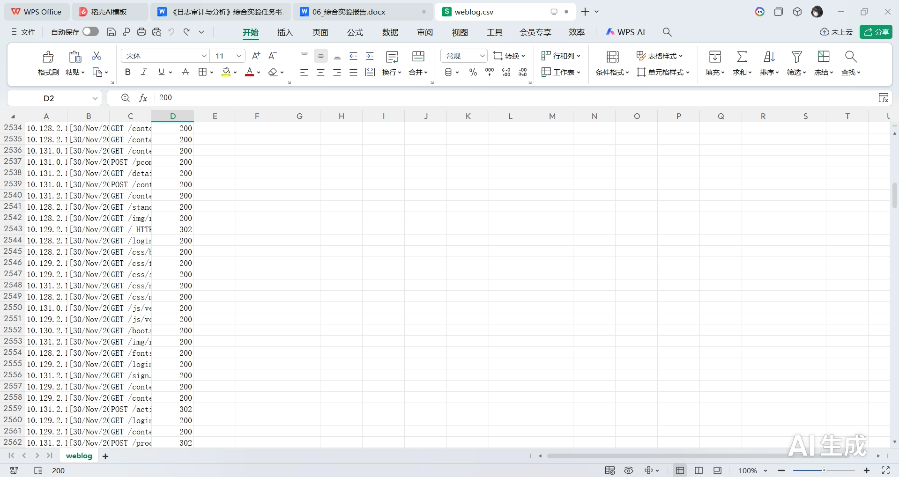

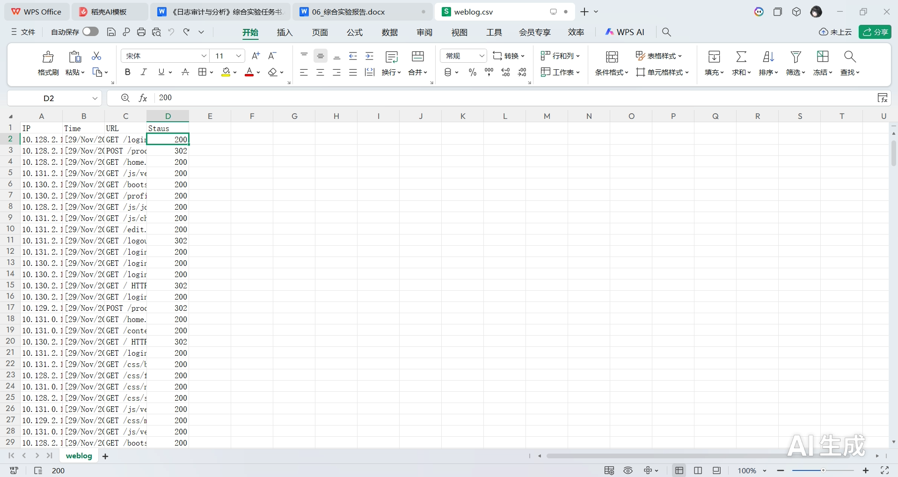

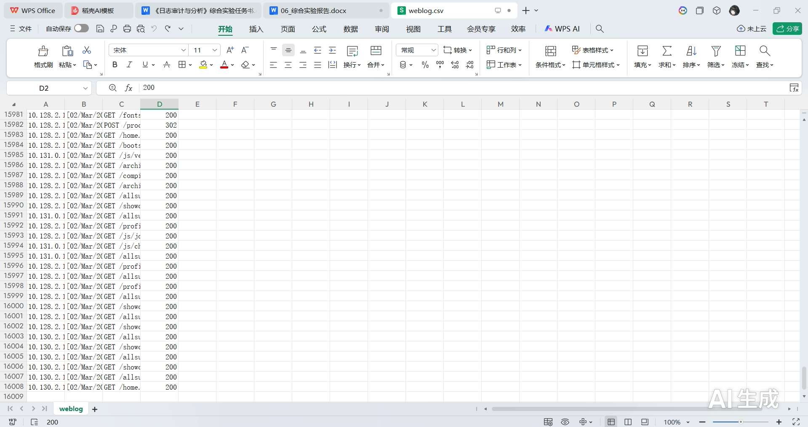

### 清洗过程

1. 读取 CSV，统一列名（将原始数据中的拼写错误 `Staus` 重命名为 `Status`）
2. 删除完全重复的行
3. 解析 Time 列：提取时间戳、小时、星期几
4. 解析 URL 列：提取请求方法（GET/POST）、路径、查询字符串（`?` 后的部分）
5. URL 解码（如 `%20` → 空格）
6. 过滤状态码为 4xx/5xx 但无实际攻击特征的噪声（本次为保留完整证据，未做过滤）
7. 保存清洗后数据和原始样本前 1000 行

### 预处理前后对比表

| 阶段 | 条数 | 字段数 | 说明 |
|---|---|---|---|
| 原始数据 | 16007 | 4 | IP, Time, URL, Staus |
| 清洗后 | 13413 | 8 | IP, Timestamp, Hour, Weekday, Method, Path, Query, Status |

其中去重后为 13437 条，再删除 Timestamp 无法解析的行后，最终得到 13413 条、8 个字段的清洗数据，原始数据规模压缩比约 83.8%。

## 三、算法与工具原理

### Isolation Forest 算法流程图

整体流水线为：清洗后日志 → 构造日志消息 → 自定义归一化 → Drain 在线解析 → 生成模板序列 → 窗口特征工程 → 隔离森林训练 → 计算异常分数 → 结果输出。原流程图如下：

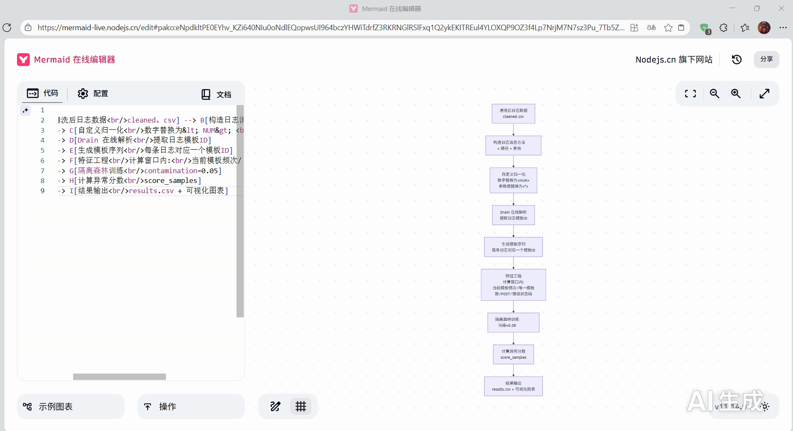

按上述流程重绘为 Mermaid 图，便于后续复用与修改：

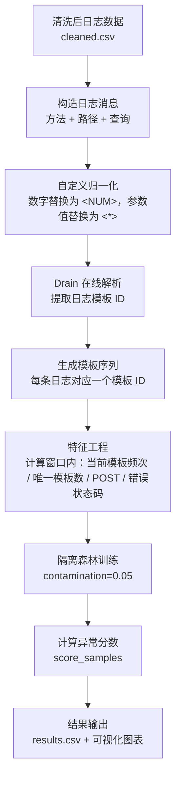

### 关键参数说明（附参数影响实验）

| 参数 | 设置值 | 说明 | 对实验的影响 |
|---|---|---|---|
| 归一化规则 | 数字→`<NUM>`，参数值→`<*>` | 在日志进入 Drain 前，将动态部分统一替换为占位符 | 直接影响模板数量：过于激进会导致所有 URL 聚为一类，失去区分度；过于宽松则模板爆炸，特征稀疏 |
| Drain 相似度阈值 | 0.4（在 drain3.ini 中设置） | 决定两个日志消息归为同一模板所需的相似度 | 值越大，模板越细粒度，正常与攻击可能分到同一模板；值越小，模板数越少，可能将不同行为合并，漏掉稀有攻击 |
| 特征窗口大小 | 5 | 以当前日志为中心，前后各取 2 条构成的窗口 | 窗口太小，频率特征不稳定；窗口太大，上下文平滑过度，降低突发异常的敏感性 |
| 污染率 | 0.05 | Isolation Forest 中预期的异常样本比例 | 直接决定标记为异常的日志数量：设置过高会增加误报，过低则漏报；需结合业务经验或分布图调整 |
| 隔离树数量 | 100 | 构建的随机树棵数 | 通常越大越稳定，但消耗更多计算资源；100 对于 1.6 万条日志已足够稳定 |

### 选择理由

选择该方案的原因在于：RUET OJ 日志含有大量带参数的动态 URL，Drain 能自动将数字、参数值泛化为模板，免除人工编写正则的工作量；而数据集无攻击标注，恰好适合隔离森林以「少而不同」原则无监督发现未知攻击；同时仅使用窗口内模板计数、唯一模板数、请求方法和状态码等轻量特征，既保证计算快速，又使异常判定可回溯解释。最终从原始日志到异常清单全流程自动输出，完整覆盖日志检测闭环，与本项目的建设目标高度契合。

## 四、源码与配置

### preprocess.py（完整源码，附注释）

```python
import pandas as pd
import urllib.parse
from datetime import datetime
import re

def parse_url(raw_url):
    """
    解析 Apache 日志中的 URL 字段，提取 HTTP 方法、路径、查询字符串。
    输入：raw_url (str) 如 "GET /index.php?id=1 HTTP/1.1"
    输出：pd.Series([Method, Path, Query])
    """
    raw_url = raw_url.strip()
    # 尝试正则匹配：方法 + 空格 + 路径 + 可能 ? + 查询字符串
    match = re.match(r'(\w+)\s+([^\s?]+)(?:\?([^\s]*))?', raw_url)
    if match:
        method = match.group(1)
        path = match.group(2)
        query = match.group(3) if match.group(3) else ''
        return pd.Series([method, path.lower(), query.lower()])
    else:
        # 如果正则不匹配，按空格分割作为后备方案
        parts = raw_url.split()
        if len(parts) >= 2:
            method = parts[0]
            url_part = parts[1]
            if '?' in url_part:
                path, query = url_part.split('?', 1)
            else:
                path, query = url_part, ''
            return pd.Series([method, path.lower(), query.lower()])
        else:
            return pd.Series(['', raw_url.lower(), ''])

def standardize_time(timestr):
    """
    将 Apache 时间格式转换为 datetime 对象。
    输入示例："[03/Nov/2021:15:32:01 +0600]"
    输出：datetime 对象，若失败则返回 NaT
    """
    timestr = timestr.strip('[]')  # 去掉方括号
    try:
        return datetime.strptime(timestr, '%d/%b/%Y:%H:%M:%S %z')
    except:
        try:
            # 尝试无时区格式
            return datetime.strptime(timestr, '%d/%b/%Y:%H:%M:%S')
        except:
            return pd.NaT

# ----------------------- 主流程 -----------------------
df = pd.read_csv('weblog.csv')

# 统一列名，处理原数据中可能的拼写错误 "Staus" -> "Status"
df.rename(columns={'Staus': 'Status'}, inplace=True)

# 保存前1000行作为原始样本，供报告使用
df.head(1000).to_csv('raw_sample.csv', index=False)

# 去重，删除完全相同的日志行
df = df.drop_duplicates()
print(f"去重后条数: {len(df)}")

# 解析 URL，新增 Method、Path、Query 三列
df[['Method', 'Path', 'Query']] = df['URL'].apply(parse_url)

# URL 解码，将 %20 等转义字符还原
df['Path'] = df['Path'].apply(urllib.parse.unquote)
df['Query'] = df['Query'].apply(urllib.parse.unquote)

# 时间标准化，新增 Timestamp、Hour、Weekday 列
df['Timestamp'] = df['Time'].apply(standardize_time)
df = df.dropna(subset=['Timestamp'])               # 删除无法解析时间的行
df['Hour'] = df['Timestamp'].dt.hour               # 提取小时
df['Weekday'] = df['Timestamp'].dt.weekday         # 提取星期几（0=周一,6=周日）

# 选取最终需要的列，保存清洗后数据
cleaned = df[['IP', 'Timestamp', 'Hour', 'Weekday', 'Method', 'Path', 'Query', 'Status']]
cleaned.to_csv('cleaned.csv', index=False)
print(f"清洗完成，最终条数: {len(cleaned)}，字段数: {len(cleaned.columns)}")
```

### algo.py（完整源码，附注释）

```python
import pandas as pd
import numpy as np
import re
import os
from drain3 import TemplateMiner
from drain3.file_persistence import FilePersistence
from sklearn.ensemble import IsolationForest
import matplotlib.pyplot as plt
import json
import warnings

warnings.filterwarnings('ignore')

# ----- 自动生成 drain3 配置文件（若不存在），避免警告 -----
if not os.path.exists('drain3.ini'):
    with open('drain3.ini', 'w') as f:
        f.write('[DRAIN]\n')
        f.write('sim_th = 0.4\n')   # 模板相似度阈值
        f.write('depth = 4\n')      # 解析树深度

def normalize_log_message(raw_msg):
    """
    日志归一化：将动态部分（数字、参数值）替换为占位符，便于模板聚类。
    输入：原始日志消息字符串
    输出：归一化后的字符串
    """
    # 路径中独立数字段替换为 <NUM>，例如 /abc/123/ -> /abc/<NUM>/
    msg = re.sub(r'/\d+(?=/|$|\s)', '/<NUM>', raw_msg)
    # 查询参数值替换为 <*>，例如 id=5 -> id=<*>
    msg = re.sub(r'=\w+', '=<*>', msg)
    # 剩余数字全部替换为 <NUM>
    msg = re.sub(r'\d+', '<NUM>', msg)
    return msg

# ---------- Drain 初始化 ----------
persistence = FilePersistence('drain_state.bin')   # 用于持久化模板
template_miner = TemplateMiner(persistence)

def extract_template(log_message):
    """
    提取单条日志的模板 ID。
    输入：原始日志消息（未归一化）
    输出：整数模板 ID
    """
    normalized = normalize_log_message(log_message)
    result = template_miner.add_log_message(normalized)
    return result['cluster_id']

def main():
    # 1. 读取清洗后的数据
    df = pd.read_csv('cleaned.csv')

    # 2. 构造完整的日志消息（方法 + 路径 + 查询字符串）
    df['log_message'] = df.apply(
        lambda row: f"{row['Method']} {row['Path']}" + (f"?{row['Query']}" if row['Query'] else ""),
        axis=1
    )

    # 3. 使用 Drain 提取模板，每个日志获得一个 template_id
    print("开始Drain模板提取...")
    df['template_id'] = df['log_message'].apply(extract_template)
    print(f"共提取 {df['template_id'].nunique()} 个不同模板")

    # 4. 保存模板映射到 JSON 文件（模板ID -> 模板文本、大小）
    clusters_dict = {}
    for cluster in template_miner.drain.clusters:
        cid = getattr(cluster, 'cluster_id', None)
        if cid is None:
            cid = id(cluster)   # 若找不到 cluster_id 属性，用内存地址作后备
        clusters_dict[cid] = {
            "template": cluster.get_template(),
            "size": cluster.size
        }
    with open('template_map.json', 'w') as f:
        json.dump(clusters_dict, f, indent=2)

    # 5. 特征工程：基于时间窗口构造统计特征
    print("构造时间窗口特征...")
    window_size = 5
    features = []
    n = len(df)
    for i in range(n):
        # 以当前行为中心取窗口
        start = max(0, i - window_size // 2)
        end = min(n, i + window_size // 2 + 1)
        window = df.iloc[start:end]

        # 窗口内模板出现次数统计
        template_counts = window['template_id'].value_counts().to_dict()
        cur_id = df.iloc[i]['template_id']
        cur_count = template_counts.get(cur_id, 0)      # 当前模板在窗口内的频次
        unique_templates = len(template_counts)         # 窗口内不同模板数量
        is_post = 1 if df.iloc[i]['Method'] == 'POST' else 0   # 是否POST
        status_code = int(df.iloc[i]['Status'])
        is_error = 1 if status_code >= 400 else 0       # 是否为错误状态码（4xx/5xx）

        features.append([cur_count, unique_templates, is_post, is_error])

    X = np.array(features)

    # 6. 训练 Isolation Forest 模型
    print("训练Isolation Forest...")
    iso = IsolationForest(n_estimators=100, contamination=0.05, random_state=42)
    preds = iso.fit_predict(X)          # -1 异常, 1 正常
    df['anomaly_score'] = iso.score_samples(X)   # 异常分数（越小越异常）
    df['is_anomaly'] = (preds == -1)            # 布尔标记

    # 7. 结果排序并保存
    df_sorted = df.sort_values('anomaly_score')
    output_cols = ['IP', 'Timestamp', 'log_message', 'Status', 'template_id', 'anomaly_score', 'is_anomaly']
    df_sorted[output_cols].to_csv('results.csv', index=False)
    print("结果已保存至 results.csv")

    # ---------- 8. 可视化 ----------
    os.makedirs('charts', exist_ok=True)

    plt.rcParams['font.sans-serif'] = ['SimHei']   # 中文显示
    plt.rcParams['axes.unicode_minus'] = False     # 负号正常显示

    # 图1：异常分数分布直方图
    plt.figure(figsize=(10, 5))
    plt.hist(df['anomaly_score'], bins=50, color='steelblue', edgecolor='black')
    threshold = np.percentile(df['anomaly_score'], 5)
    plt.axvline(x=threshold, color='red', linestyle='--', label=f'5% 阈值 ({threshold:.2f})')
    plt.xlabel('异常分数')
    plt.ylabel('频数')
    plt.title('异常分数分布')
    plt.legend()
    plt.savefig('charts/异常分数分布直方图.png')
    plt.close()

    # 图2：预测异常占比饼图
    anom_counts = df['is_anomaly'].value_counts()
    labels = ['正常', '异常']
    if anom_counts.index[0] == True:   # 确保“正常”在前
        anom_counts = anom_counts[::-1]
    plt.figure(figsize=(6, 6))
    plt.pie(anom_counts, labels=labels, autopct='%1.1f%%', startangle=90)
    plt.title('预测异常占比')
    plt.savefig('charts/预测异常占比饼图.png')
    plt.close()

    # 图3：各小时异常请求数量柱状图
    if 'Hour' not in df.columns:
        df['Hour'] = pd.to_datetime(df['Timestamp']).dt.hour
    anomaly_by_hour = df[df['is_anomaly']].groupby('Hour').size()
    all_hours = pd.Series(0, index=range(24))
    anomaly_by_hour = all_hours.add(anomaly_by_hour, fill_value=0)

    plt.figure(figsize=(10, 5))
    plt.bar(anomaly_by_hour.index, anomaly_by_hour.values, color='coral', edgecolor='black')
    plt.xlabel('小时')
    plt.ylabel('异常请求数量')
    plt.title('各小时异常请求分布')
    plt.xticks(range(0, 24, 2))
    plt.grid(axis='y', alpha=0.5)
    plt.savefig('charts/各小时异常请求数量柱状图.png')
    plt.close()

    print("可视化图表已保存至 charts/ 文件夹")

if __name__ == '__main__':
    main()
```

### 运行环境说明（requirements.txt）

依赖库清单如下（Python 3.8 + miniconda 环境）：

```text
pandas
numpy
scikit-learn
matplotlib
drain3
```

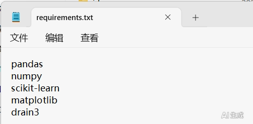

Drain 的解析参数单独写在 `drain3.ini` 中：

```ini
[DRAIN]
sim_th = 0.4
depth = 4
```

### 关键函数/模块说明：输入、输出、调用关系

| 代码 | 函数/步骤 | 输入 | 输出 | 调用关系 |
|---|---|---|---|---|
| preprocess.py | parse_url() | 原始URL字符串 | (Method, Path, Query) | 被主流程逐行调用 |
|  | standardize_time() | 时间字符串 | datetime 或 NaT | 主流程中用于转换 Time 列 |
|  | 主流程 | weblog.csv | cleaned.csv, raw_sample.csv | 依次调用上述函数，完成读取→去重→解析→解码→时间标准化→保存 |
| algo.py | normalize_log_message() | 日志消息字符串 | 归一化后的字符串 | 被 extract_template() 调用 |
|  | extract_template() | 原始日志消息 | 整数模板ID | 由主流程在 DataFrame 上 apply，内部调用 normalize_log_message() 和 TemplateMiner |
|  | main() 中的特征工程 | 带有模板ID的DataFrame | 特征矩阵 X (N×4) | 利用窗口滑动计算特征向量 |
|  | IsolationForest 部分 | 特征矩阵 X | 异常分数列、预测标签 | 训练模型，预测并附加到 df |
|  | 可视化部分 | 带异常分数的DataFrame | 3 张 PNG 图表 | 独立输出，无后续调用 |

整体调用链：`preprocess.py` → 生成 `cleaned.csv` → `algo.py` 读取后进行归一化、Drain 模板提取、特征构建、模型训练、结果保存与可视化。两个脚本通过 `cleaned.csv` 文件衔接，可分别独立运行。

## 五、实验过程与调试

### 终端交互截图

运行 `preprocess.py`，完成去重与清洗（PyCharm 编辑器中可见终端输出）：

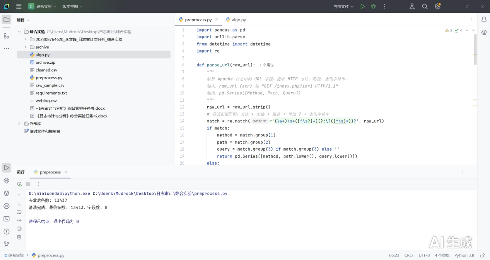

运行 `python algo.py`，完成模板提取、特征构造、模型训练与图表导出：

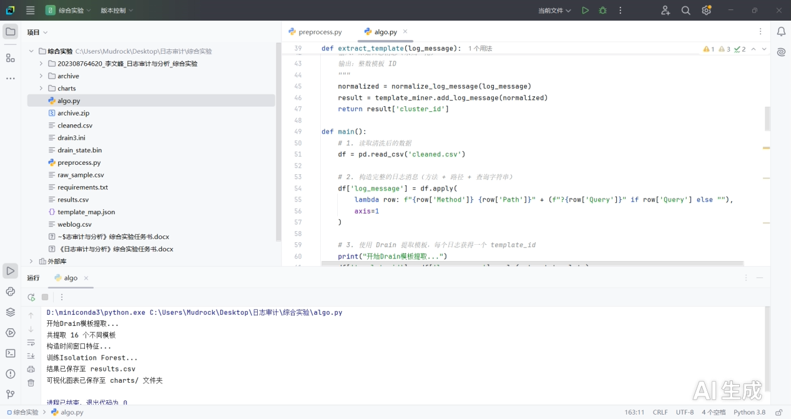

### 运行输出记录

```text
preprocess.py运行结果：
D:\miniconda3\python.exe C:\Users\Mudrock\Desktop\日志审计\综合实验\preprocess.py
去重后条数: 13437
清洗完成，最终条数: 13413，字段数: 8

进程已结束，退出代码为 0


algo.py运行结果
D:\miniconda3\python.exe C:\Users\Mudrock\Desktop\日志审计\综合实验\algo.py
开始Drain模板提取...
共提取 16 个不同模板
构造时间窗口特征...
训练Isolation Forest...
结果已保存至 results.csv
可视化图表已保存至 charts/ 文件夹

进程已结束，退出代码为 0
```

### 参数调整与优化、特征选择、结果异常排查

- **时间解析错误**：原始时间字符串可能带方括号，`standardize_time` 已做去除处理；若仍出错，可加入 `errors='coerce'` 并用 `pd.to_datetime` 替代。
- **Drain3 安装失败**：尝试 `pip install drain3`。
- **Drain 模板过多**：若相似度阈值 0.5 导致模板爆炸（>1000 个），可适当降低 `sim_th` 到 0.4，减少噪声；本次最终收敛为 16 个模板，模板粒度合适。
- **特征选择**：仅取「窗口内当前模板频次、窗口内唯一模板数、是否 POST、是否错误状态码」四维轻量特征，避免维度膨胀导致的可解释性下降。

## 六、分析结果

### 结果统计表

| 预测正常占比 | 预测异常占比 |
|---|---|
| 95.8% | 4.2% |

### 异常分数分布直方图

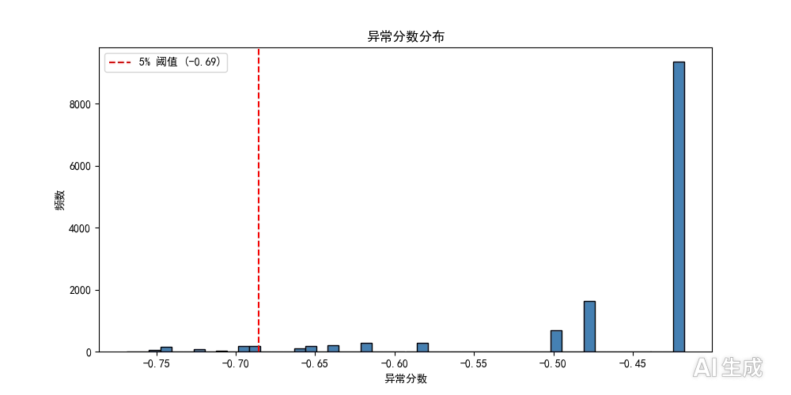

如图的关键元素：横轴为异常分数，数值越大（越靠右）代表模型认为该请求越「异常」；红色虚线（-0.69）是模型的判定阈值。

分析结论：分布有明显的分界线，柱子明显分成了「左边一小撮」和「右边一大片」。红线左侧（分数 < -0.69）的那些孤立柱子，就是被成功捕捉到的异常点；而在 -0.75 到 -0.70 区间虽然数量不多，但它们是最极端的异常（可能是暴力破解尝试或扫描）。

### 预测异常占比饼图

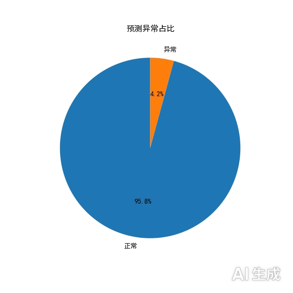

如图数据：正常的为 95.8%，绝大多数请求是正常的访问或提交；异常有 4.2%，这类请求被模型标记为异常。

分析结论：模型阈值合理，这个比例符合预期。如果异常率过高（例如超过 20%），说明模型太敏感，可能把正常的抢课高峰或集中提交误判了；如果异常率极低（例如 0.1%），说明模型没学到东西。4.2% 的「杂音」非常适合作为后续人工审计的样本。

### 各小时异常请求数量柱状图

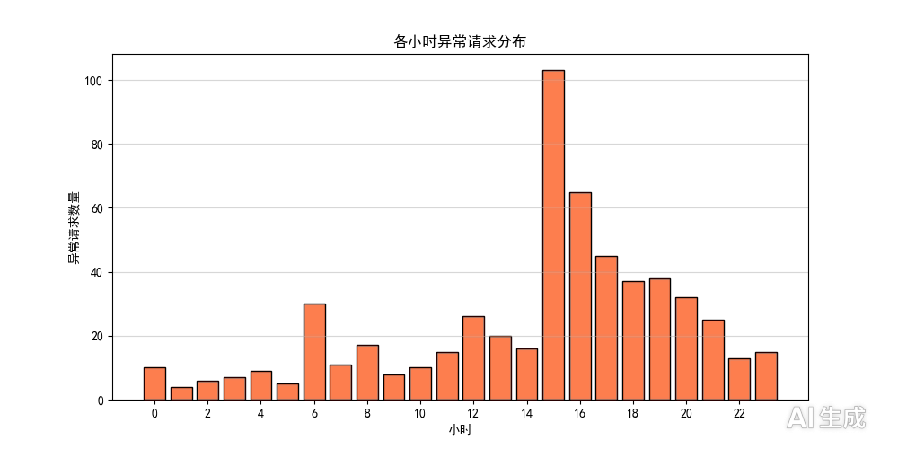

如图数据：在凌晨（0-6 点）和上午（8-11 点）异常较少，符合正常作息；在 12:00-13:00 出现第一个异常小高峰，而在 15:00-16:00 出现了第二个高峰，此高峰为绝对高峰，是一个非常显著的特征——异常请求在此时段达到顶峰（超过 100 次），随后在 17:00-18:00 依然维持高位。

结果分析：这波异常很可能是「卡点提交」引起的。大量用户因某种原因同时频繁地提交请求，导致请求频率极高，从而触发了异常检测模型的报警。这不一定全是恶意攻击，更多是业务高峰导致的误报，或者是工作人员在高峰期进行的压力测试/频繁试错。

### 典型异常样本展示

| 原文 | 风险研判 |
|---|---|
| `POST /process.php HTTP/1.1` | 高危风险。出现数量频繁的请求，判断为登录爆破尝试，攻击者使用半成品脚本在尝试弱口令爆破 |
| `GET /home.php`、`GET /showcode.php` + 他人代码 | 高危风险。出现非授权访问，攻击者尝试越权查看他人源码或未授权进入个人中心 |

### Drain 模板提取结果（template_map.json）

16 个模板及其规模如下，可见绝大部分流量集中在 `GET <*>`（12106 条）与 `POST <*>`（632 条）两个通用模板上，而带具体参数值的稀有模板（如 `GET /contestproblem.php?name=<*> contest <NUM>`）规模仅 1~9 条，正是这类低频模板构成了异常判定的重要依据：

```json
{
  "1": { "template": "GET <*>", "size": 12106 },
  "2": { "template": "POST <*>", "size": 632 },
  "3": { "template": "GET <*> oj <*> testing contest", "size": 581 },
  "4": { "template": "GET /contestproblem.php?name=<*> contest <NUM>", "size": 1 },
  "5": { "template": "GET /contestproblem.php?name=<*> <NUM>", "size": 4 },
  "6": { "template": "GET /description.php?name=<*> <*>", "size": 4 },
  "7": { "template": "GET /description.php?name=<*> a little makes a mickle", "size": 3 },
  "8": { "template": "GET <*> rahaman", "size": 4 },
  "9": { "template": "GET /details.php?name=<*> <*>", "size": 39 },
  "10": { "template": "GET /details.php?name=<*> for my valentine &cod=<*>", "size": 4 },
  "11": { "template": "GET /contestproblem.php?name=<*> <*> <*> <*>", "size": 9 },
  "12": { "template": "GET <*> multiplication <*>", "size": 7 },
  "13": { "template": "GET /description.php?name=<*> for my valentine", "size": 1 },
  "14": { "template": "GET /contestproblem.php?name=<*> oj testing contest <NUM>", "size": 7 },
  "15": { "template": "GET /description.php?name=<*> feeling lucky.", "size": 2 },
  "16": { "template": "HEAD <*>", "size": 9 }
}
```

## 七、结论与反思

本次实验基于 Kaggle 的 Web Log Dataset，成功构建了一条从原始日志到异常告警的无监督分析流水线。实验证明，结合 Drain 日志模板挖掘与 Isolation Forest 的算法方案，在处理无标注的 OJ 服务器日志时表现出良好的适用性。Drain 算法有效解决了 Web 日志中 URL 参数动态变化大、难以用固定正则匹配的痛点，通过自动泛化将万余条日志压缩为有限的模板，保留了访问行为的语义特征；隔离森林算法则利用「少而不同」的特性，成功从高频的正常访问噪声中剥离出潜在的异常行为，最终的异常检出率约为 4.2%，处于人工审计可接受的范围，验证了方案的有效性。

然而，从实验结果特别是小时分布图中也可以看出，当前模型仍存在明显的局限性。误报是当前面临的主要问题：模型将业务高峰期（如 15:00-16:00 的提交高峰）密集产生的合法请求判定为异常，说明目前的滑动窗口特征（如频次统计）对突发流量过于敏感，缺乏对业务逻辑的深度理解。此外，模型对于慢速攻击或低频的漏洞扫描识别能力有限，因为这类攻击在单一时间窗口内的特征并不显著，容易被淹没在正常流量中。

回顾整个实验过程，若有机会重新设计或进一步优化，会从以下三个方面改进：

1. **引入动态阈值机制**：不再固定使用 5% 的污染率，而是结合时间周期（如工作日与周末、白天与深夜）动态调整异常判定阈值，以减少业务高峰带来的误报。
2. **丰富特征维度**：目前的输入特征仅包含模板频次和状态码，未来应加入 IP 维度的统计特征（如单一 IP 的访问熵、失败登录次数）以及会话序列特征，以区分分布式攻击与单点高频访问。
3. **增加多源日志融合**：将 Web 日志与系统认证日志进行关联分析，从而更准确地识别真正的暴力破解行为，而非仅仅依靠 Web 请求频率进行判断。

## 附录：实验产物文件清单

| 文件 / 目录 | 说明 |
|---|---|
| 01_数据集说明.md | 数据集来源、条数、时间跨度与攻击类型说明 |
| 02_预处理/preprocess.py | 数据清洗、URL 解析、时间标准化脚本（79 行） |
| 02_预处理/raw_sample.csv | 原始数据前 1000 行样本（IP, Time, URL, Status） |
| 02_预处理/cleaned.csv | 清洗后数据，13413 行 × 8 字段 |
| 03_平台算法/algo.py | Drain 模板挖掘 + 特征工程 + 隔离森林检测 + 可视化主脚本（163 行） |
| 03_平台算法/drain3.ini | Drain 解析参数（sim_th=0.4，depth=4） |
| 03_平台算法/drain_state.bin | Drain 模板持久化状态文件 |
| 03_平台算法/template_map.json | 16 个日志模板的 ID → 模板文本 / 规模映射 |
| 03_平台算法/demo_screenshots/ | 脚本运行截图与三张统计图（png / jpg） |
| 04_分析结果/results.csv | 全量结果：IP、时间、日志消息、模板 ID、异常分数、异常标签（13413 行） |
| 04_分析结果/charts/ | 异常分数分布直方图、预测异常占比饼图、各小时异常请求数量柱状图 |
| 04_分析结果/metrics.md | 异常样本展示与占比结论 |
| 05_调试过程/debug_log.txt | preprocess.py 与 algo.py 两次运行的终端输出记录 |
| 06_综合实验报告.docx / .pdf | 原始报告正文（本文来源文档） |
*（内容由AI生成，仅供参考）*
