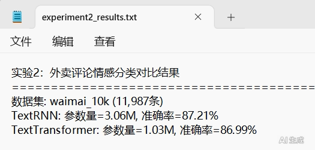
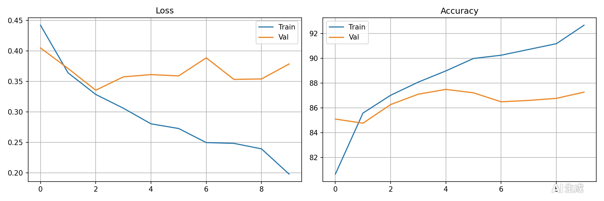
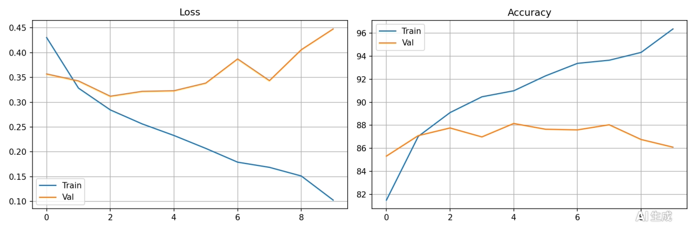
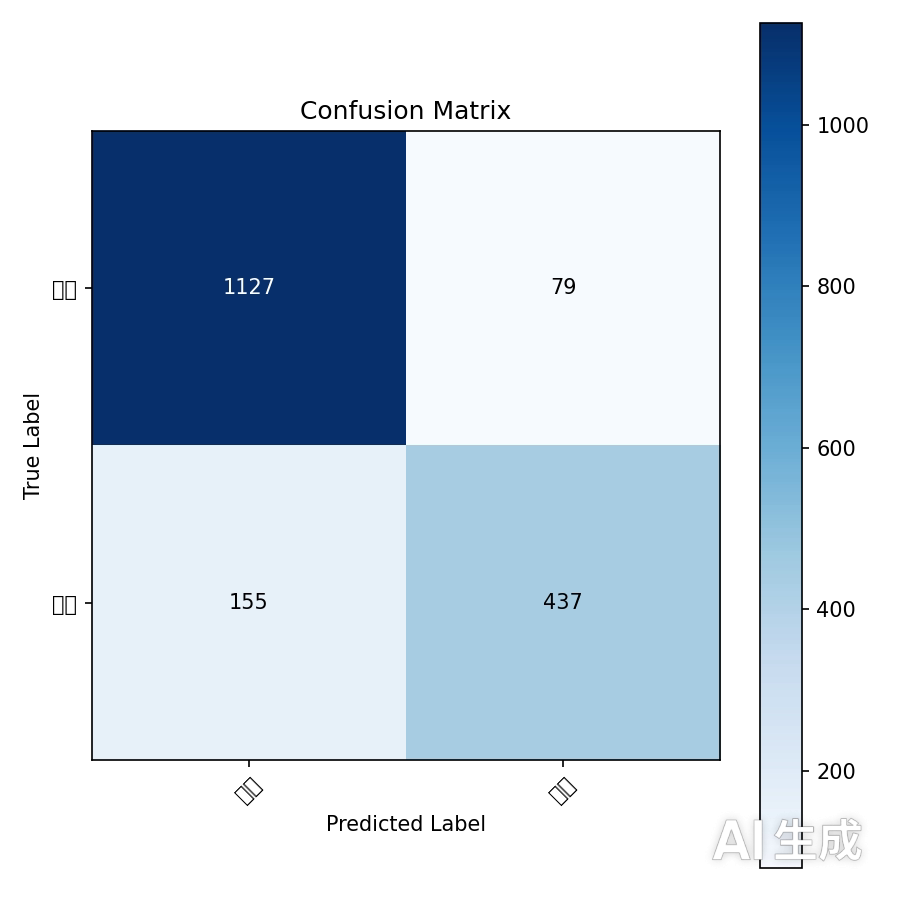
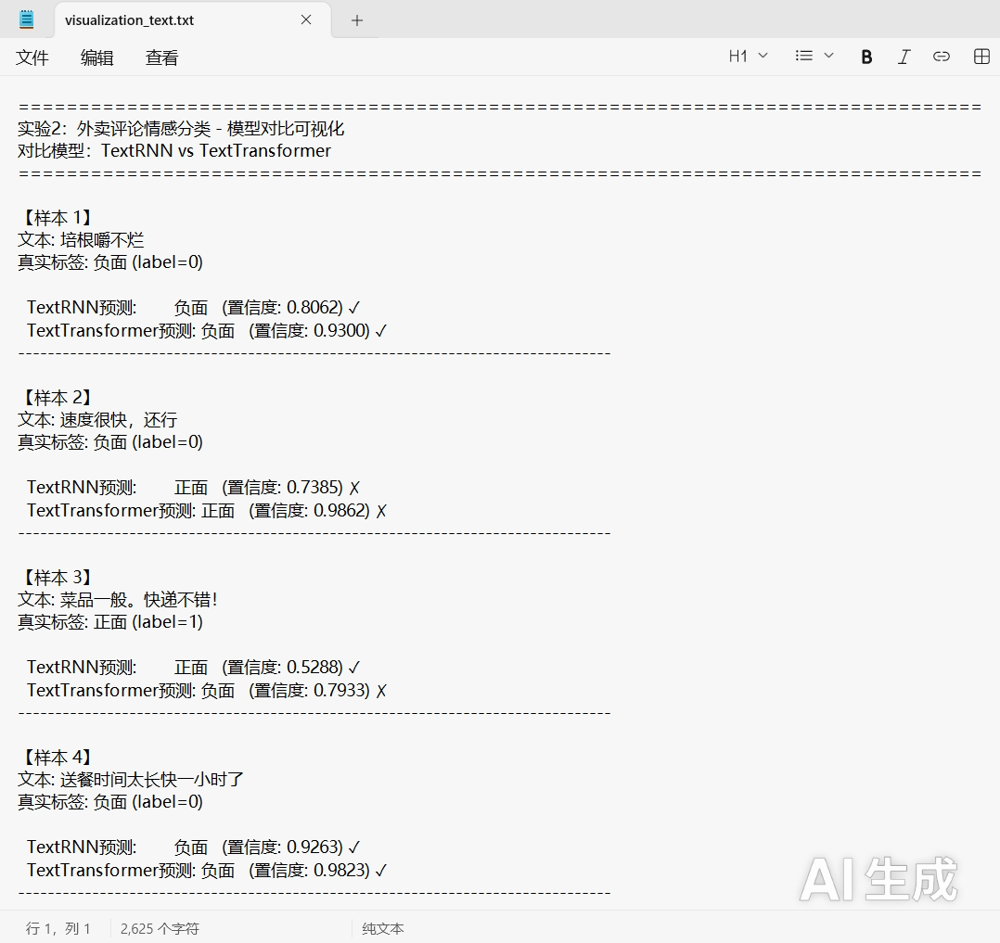
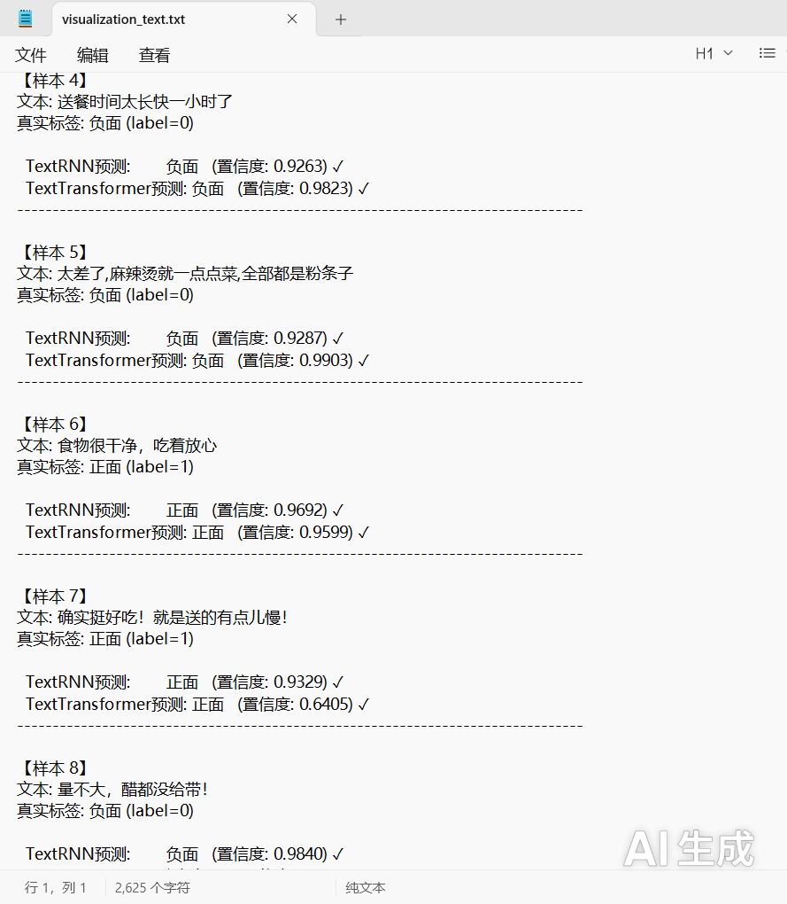
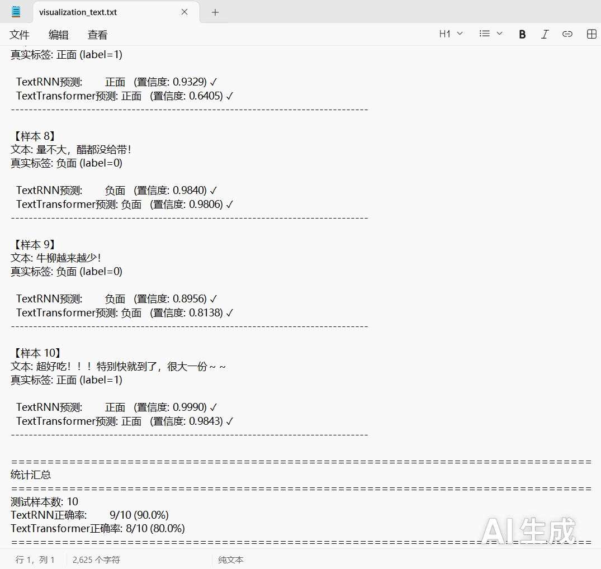
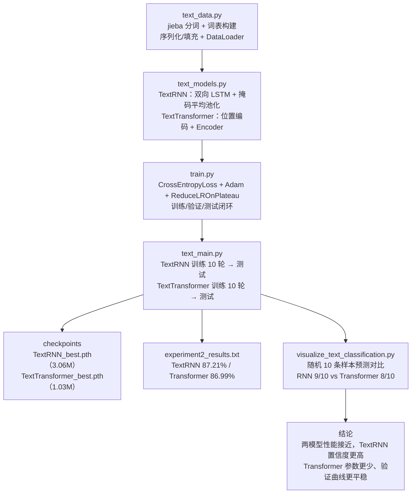

---
AIGC:
    Label: "1"
    ContentProducer: 001191440300708461136T1XGW3
    ProduceID: 278e15af09c947df43b62560d322c33a_973aa65ab41b11f1a1a1525400393706
    ReservedCode1: zCFARygmUJ6ByU61i1DIAJt2bmz88L10HwhjpqV0wJSkrZZGPwWXW6+TpESTgkF2pfh5y5QuD8b5t/QN2yVGKVQiWYjWULohoyFtYQR2sKeM3c5lWUE/hsOG5cL0YX90qUM1W/N8YURM8v++KaG5HwR56MY8YJMvpNThDPQgSk5PXAJapMDceep6kT4=
    ContentPropagator: 001191440300708461136T1XGW3
    PropagateID: 278e15af09c947df43b62560d322c33a_973aa65ab41b11f1a1a1525400393706
    ReservedCode2: zCFARygmUJ6ByU61i1DIAJt2bmz88L10HwhjpqV0wJSkrZZGPwWXW6+TpESTgkF2pfh5y5QuD8b5t/QN2yVGKVQiWYjWULohoyFtYQR2sKeM3c5lWUE/hsOG5cL0YX90qUM1W/N8YURM8v++KaG5HwR56MY8YJMvpNThDPQgSk5PXAJapMDceep6kT4=
title: 外卖评论情感分类实验
published: 2026-09-19
pinned: false
description: 基于 PyTorch 完成外卖评论情感分类实验：以 waimai_10k 中文评论数据集为对象，搭建「中文分词与词表构建 → 序列化与填充 → 模型定义 → 训练与测试 → 可视化对比」的完整流程，分别用双向 LSTM 的 TextRNN 与 Transformer 编码器的 TextTransformer 完成负面/正面二分类，并对两种模型的参数量、测试准确率、训练曲线、混淆矩阵与预测结果做对比分析。
tags: [深度学习, 文本分类, 情感分析, TextRNN, Transformer, PyTorch]
category: 深度学习
licenseName: ''
author: kilolo
sourceLink: ''
slug: waimai-sentiment-classification
image: ./images/DSExp2/ds2-01.png
---

本文是《数据科学与数学建模》实验二的完整记录：在 PyTorch 框架下围绕 waimai_10k 中文外卖评论数据集搭建「数据工程 → 模型定义 → 训练与测试 → 可视化对比」的完整流程，分别用双向 LSTM 的 TextRNN 与基于 Transformer 编码器的 TextTransformer 完成「负面 / 正面」二分类情感识别，并对两种模型的参数量、测试准确率、训练曲线、混淆矩阵与预测结果做对比分析。

## 一、实验目的及要求

1. 掌握中文文本数据的预处理流程，包括分词、词表构建、序列化与填充。
2. 理解并实现两种神经网络模型（TextRNN 和 TextTransformer）的前向传播。
3. 掌握模型训练、验证和测试的完整流程，并理解掩码（mask）机制在变长序列中的作用。
4. 对比分析不同模型在文本情感分类任务上的性能差异。

## 二、实验原理与内容

### 2.1 两种模型的原理

**TextRNN**：词嵌入层（`padding_idx=0`，使 `<PAD>` 的向量为 0）将词索引映射为 128 维向量，再送入 2 层双向 LSTM（隐藏层 256 维，双向拼接后为 512 维）；由于评论长度不齐、尾部用 0 填充，前向传播中用 `mask = (x != 0)` 屏蔽填充位置后做全局平均池化，再做 Dropout 与两层全连接输出 2 类。

**TextTransformer**：词嵌入乘以 $\sqrt{d_{model}}$ 后叠加正弦位置编码（sin/cos 交替），送入 2 层 Transformer 编码器层（4 头自注意力、前馈维度 512）；前向传播中生成 `src_key_padding_mask = (x == 0)` 交给编码器忽略填充位，最后同样用掩码平均池化得到句向量分类。

| 对比项 | TextRNN | TextTransformer |
| --- | --- | --- |
| 网络类型 | 双向 LSTM 循环网络 | Transformer 编码器 |
| 输入处理 | 词嵌入（padding_idx=0）→ 128 维向量，保留词序 | 词嵌入 × √128 后叠加正弦位置编码 |
| 主要结构 | Embedding → 2 层双向 LSTM（hidden=256）→ 掩码平均池化 → Linear(512,256) → ReLU → Dropout → Linear(256,2) | Embedding → 位置编码 → 2 层 TransformerEncoder（heads=4、FFN=512）→ 掩码平均池化 → Linear(128,512) → ReLU → Dropout → Linear(512,2) |
| 长程依赖建模 | 依靠 LSTM 的门控与双向信息传递，序列较长时衰减明显 | 自注意力直接建模任意两位置的关联，路径长度为 1 |
| 关键机制 | padding mask 参与池化，`clamp(min=1)` 防止除零；Dropout 0.5 | `src_key_padding_mask` 屏蔽 `<PAD>`，避免填充位被注意力关注；Dropout 0.3 |
| 参数量 | 3.06M | 1.03M |
| 测试准确率 | 87.21% | 86.99% |

### 2.2 实验内容与脚本顺序

1. 依次完成 `text_data.py`、`text_models.py`、`train.py` 中的代码补全。
2. 分别运行上述三个文件，确认各自能够正常执行。
3. 运行 `python text_main.py` 完成完整实验。
4. 运行 `python visualize_text_classification.py` 生成可视化结果。

| 顺序 | 脚本文件 | 类型 | 是否需编写代码 | 验证方式 |
| :---: | :--- | :--- | :---: | :--- |
| 1 | `text_data.py` | 数据工程 | 是 | 直接运行，确认数据加载、词表构建与迭代器创建无误 |
| 2 | `text_models.py` | 模型定义 | 是 | 直接运行，观察模拟输入的输出形状 |
| 3 | `train.py` | 训练与测试 | 是 | 直接运行，观察各测试环节输出 |
| 4 | `text_main.py` | 主程序 | 否（阅读并理解） | 前三者测试通过后运行，完成完整实验 |
| 5 | `visualize_text_classification.py` | 可视化 | 否（阅读并理解） | `text_main.py` 生成权重后运行，输出预测对比 |

## 三、实验软硬件环境

| 类别 | 配置 |
| --- | --- |
| 操作系统 | Windows 11 |
| 开发工具 | PyCharm 2024.2 |
| 编程语言 | Python 3.8（工程内 `__pycache__` 为 cpython-38） |
| 深度学习框架 | PyTorch 2.7.1（`torch`，无 CUDA 时自动回退 CPU 训练） |
| 依赖库 | jieba、pandas、scikit-learn、matplotlib、tqdm、numpy |
| 数据集 | waimai_10k 中文外卖评论（11,987 条，0=负面 / 1=正面） |
| 模型 | TextRNN（双向 LSTM）、TextTransformer（Transformer 编码器） |

## 四、实验过程

本次实验共 5 个脚本：前三个脚本需要补全 `[学生填空]` / `TODO` 标记处的代码，后两个脚本阅读并理解其实现即可。以下按脚本顺序给出补全后的完整代码。

### 4.1 text_data.py — 数据工程模块

**总体任务**：补全代码，使程序能够加载外卖评论数据集，完成中文分词、词表构建、文本序列化，并将其封装为可供模型训练和验证使用的数据迭代器。

**具体任务**：

- 在词表构建函数中，完成对原始文本的分词处理与词频统计。
- 在词表构建函数中，根据最低词频过滤条件构建词到索引的映射。
- 在数据加载器创建函数中，完成训练集、验证集和测试集对应迭代器的创建，并思考不同集合的 `shuffle` 参数应如何设置。

```python
"""
文本数据工程模块 - waimai_10k 外卖评论数据集
"""

import torch
from torch.utils.data import Dataset, DataLoader, random_split
import jieba
import pickle
import os
import pandas as pd


class WaimaiDataset(Dataset):
    """
    外卖评论数据集类
    
    数据格式：
    - review: 评论文本
    - label: 0=负面, 1=正面
    """
    
    def __init__(self, texts, labels, vocab=None, max_len=128, build_vocab=False):
        self.texts = texts
        self.labels = labels
        self.max_len = max_len
        
        # 根据 build_vocab 参数决定是构建新词表还是使用传入的词表
        # 如果 build_vocab 为 True，调用 self._build_vocab(texts) 构建词表
        # 否则，将传入的 vocab 赋值给 self.vocab
        if build_vocab:
            self.vocab = self._build_vocab(texts)
        else:
            self.vocab = vocab
        
        self.word2idx = self.vocab if vocab else {}
    
    def _build_vocab(self, texts, min_freq=2):
        """构建词表"""
        from collections import Counter
        
        word_counter = Counter()
        
        # [学生填空] 对每条文本进行分词并统计词频
        # TODO: 请补充上述代码
        # 提示：1. 使用 jieba.lcut() 对文本进行中文分词
        #       2. 使用 word_counter.update() 更新词频统计
        #       3. 注意处理空值（NaN）的情况
        for text in texts:
            # 确保是字符串
            text = str(text) if not pd.isna(text) else ""
            words = jieba.lcut(text)
            word_counter.update(words)
        
        # 特殊token
        vocab = {'<PAD>': 0, '<UNK>': 1}
        idx = 2
        
        # [学生填空] 过滤低频词并构建词表映射
        # TODO: 请补充上述代码
        # 提示：1. 遍历 word_counter 中的 (word, freq)
        #       2. 只保留出现次数 >= min_freq 的词
        #       3. 为每个保留的词分配一个递增的索引（从2开始）
        for word, freq in word_counter.items():
            if freq >= min_freq and word not in vocab:
                vocab[word] = idx
                idx += 1
        
        print(f"词表大小: {len(vocab)} (高频词>={min_freq})")
        return vocab
    
    def _text_to_sequence(self, text):
        """文本转id序列"""
        # 处理空值
        text = str(text) if not pd.isna(text) else ""
        words = jieba.lcut(text)
        
        # 将分词后的单词列表转换为索引序列
        #  1. 使用 self.word2idx.get(w, 1) 查询每个词的索引
        #  2. 如果词不在词表中，使用 1（<UNK> 的索引）
        sequence = [self.word2idx.get(w, 1) for w in words]  # 1=<UNK>
        
        # 对序列进行填充(padding)或截断(truncation)
        #  1. 如果序列长度 < self.max_len，在末尾填充 0（<PAD>）
        #  2. 如果序列长度 >= self.max_len，截断到 self.max_len
        #  3. 思考：为什么需要填充/截断？
        if len(sequence) < self.max_len:
            sequence += [0] * (self.max_len - len(sequence))  # 0=<PAD>
        else:
            sequence = sequence[:self.max_len]
        
        return sequence
    
    def __len__(self):
        return len(self.texts)
    
    def __getitem__(self, idx):
        text = self.texts[idx]
        label = self.labels[idx]
        
        sequence = self._text_to_sequence(text)
        return torch.tensor(sequence, dtype=torch.long), torch.tensor(label, dtype=torch.long)


class WaimaiDataProcessor:
    """外卖评论数据处理器"""
    
    def __init__(self, data_path='./data/waimai_10k.csv', batch_size=64, max_len=128):
        self.data_path = data_path
        self.batch_size = batch_size
        self.max_len = max_len
    
    def load_data(self):
        """加载数据"""
        if not os.path.exists(self.data_path):
            raise FileNotFoundError(
                f"\n{'='*60}\n"
                f"错误：找不到数据文件！\n"
                f"{'='*60}\n"
                f"请运行: python download_waimai_10k.py\n"
                f"或从以下链接下载：\n"
                f"  https://raw.githubusercontent.com/SophonPlus/ChineseNlpCorpus/master/datasets/waimai_10k/waimai_10k.csv\n"
                f"{'='*60}"
            )
        
        df = pd.read_csv(self.data_path)
        print(f"加载数据: {len(df)} 条")
        print(f"列名: {df.columns.tolist()}")
        print(f"标签分布:\n{df['label'].value_counts().sort_index()}")
        
        # 使用 review 列作为文本
        texts = df['review'].tolist()
        labels = df['label'].tolist()
        
        return texts, labels
    
    def get_loaders(self, val_ratio=0.15, test_ratio=0.15):
        """获取数据加载器"""
        texts, labels = self.load_data()
        
        # 划分数据集
        total_size = len(texts)
        test_size = int(total_size * test_ratio)
        val_size = int(total_size * val_ratio)
        train_size = total_size - val_size - test_size
        
        # 随机划分
        indices = torch.randperm(total_size).tolist()
        
        train_idx = indices[:train_size]
        val_idx = indices[train_size:train_size+val_size]
        test_idx = indices[train_size+val_size:]
        
        train_texts = [texts[i] for i in train_idx]
        train_labels = [labels[i] for i in train_idx]
        
        # 构建词表（只用训练集）
        # 思考：为什么要只用训练集构建词表？
        # 提示：如果测试集也参与构建词表，会导致什么问题？（数据泄露）
        print("\n构建词表...")
        temp_dataset = WaimaiDataset(train_texts, train_labels, max_len=self.max_len, build_vocab=True)
        vocab = temp_dataset.vocab
        
        # 保存词表
        with open('./data/vocab.pkl', 'wb') as f:
            pickle.dump(vocab, f)
        
        # 创建数据集
        # 使用同一个 vocab 创建训练集、验证集和测试集
        # 提示：三个数据集必须使用同一个词表，否则索引含义不一致
        train_dataset = WaimaiDataset(train_texts, train_labels, vocab, self.max_len)
        val_dataset = WaimaiDataset([texts[i] for i in val_idx], [labels[i] for i in val_idx], vocab, self.max_len)
        test_dataset = WaimaiDataset([texts[i] for i in test_idx], [labels[i] for i in test_idx], vocab, self.max_len)
        
        # 创建DataLoader
        # [学生填空] 思考：训练集与验证/测试集 的shuffle应该分别设置成什么？
        # TODO: 请补充上述代码
        train_loader = DataLoader(train_dataset, batch_size=self.batch_size, shuffle=True, num_workers=0)
        val_loader = DataLoader(val_dataset, batch_size=self.batch_size, shuffle=False, num_workers=0)
        test_loader = DataLoader(test_dataset, batch_size=self.batch_size, shuffle=False, num_workers=0)
        
        print(f"\n数据划分:")
        print(f"  训练集: {len(train_dataset)} ({train_size})")
        print(f"  验证集: {len(val_dataset)} ({val_size})")
        print(f"  测试集: {len(test_dataset)} ({test_size})")
        
        return train_loader, val_loader, test_loader, vocab


# 测试
if __name__ == '__main__':
    processor = WaimaiDataProcessor(batch_size=32)
    train_loader, val_loader, test_loader, vocab = processor.get_loaders()
    
    sequences, labels = next(iter(train_loader))
    print(f"\n测试batch:")
    print(f"  序列形状: {sequences.shape}")
    print(f"  标签形状: {labels.shape}")
```

### 4.2 text_models.py — 模型定义模块

**总体任务**：补全代码，使两种神经网络模型能够完成从输入文本序列到分类结果的前向传播计算，并正确处理变长序列的填充问题。

**具体任务**：

- 完成 TextRNN 模型前向传播函数中，从词索引到嵌入向量的转换步骤。
- 完成 TextRNN 模型前向传播函数中，基于掩码的全局平均池化，确保填充位置不参与均值计算。
- 完成 TextTransformer 模型前向传播函数中，基于掩码的全局平均池化。
- 阅读并理解正弦位置编码、Transformer 编码器层以及分类头的构建方式（此部分代码已提供，无需修改）。

```python
"""
文本分类模型：TextRNN 和 TextTransformer
"""

import torch
import torch.nn as nn
import math


class TextRNN(nn.Module):
    """基于双向LSTM的文本分类"""
    
    def __init__(self, vocab_size, embed_dim=128, hidden_dim=256, 
                 num_classes=2, num_layers=2, dropout=0.5, max_len=128):
        super(TextRNN, self).__init__()
        
        self.hidden_dim = hidden_dim
        self.num_layers = num_layers
        
        # 定义词嵌入层 (Embedding Layer)
        # 1. 使用 nn.Embedding(vocab_size, embed_dim, padding_idx=0)
        # 2. padding_idx=0 表示索引为0的位置是填充位，其嵌入向量会被置为0
        # 3. 思考：为什么需要 padding_idx？
        self.embedding = nn.Embedding(vocab_size, embed_dim, padding_idx=0)
        
        # 定义双向LSTM层
        # 1. input_size = embed_dim（输入特征维度）
        # 2. hidden_size = hidden_dim（隐藏层维度）
        # 3. batch_first=True 表示输入形状为 [batch, seq, feature]
        # 4. bidirectional=True 表示双向LSTM
        # 5. 思考：双向LSTM的输出维度是多少？
        self.lstm = nn.LSTM(
            input_size=embed_dim,
            hidden_size=hidden_dim,
            num_layers=num_layers,
            batch_first=True,
            bidirectional=True,
            dropout=dropout if num_layers > 1 else 0
        )
        
        # 定义分类头（全连接层）
        # 1. 由于使用了双向LSTM，输入维度应为 hidden_dim * 2
        # 2. 可以先用一个 Linear + ReLU 做特征变换，再接输出层
        # 3. 思考：为什么双向LSTM的输出维度要乘2？
        self.dropout = nn.Dropout(dropout)
        self.fc = nn.Sequential(
            nn.Linear(hidden_dim * 2, hidden_dim),
            nn.ReLU(),
            nn.Dropout(dropout),
            nn.Linear(hidden_dim, num_classes)
        )
    
    def forward(self, x):
        # [学生填空] 将输入的单词索引转换为嵌入向量
        # TODO: 请补充上述代码
        # 提示：1. 输入 x 的形状: [batch_size, seq_len]
        #       2. 经过 embedding 后形状: [batch_size, seq_len, embed_dim]

        embedded = self.embedding(x)
        
        # LSTM
        lstm_out, (hidden, cell) = self.lstm(embedded)  # [batch, seq_len, hidden*2]
        
        # [学生填空] 实现全局平均池化（需考虑padding mask）
        # TODO: 请补充上述代码
        # 提示：1. mask = (x != 0) 找出非填充位置
        #       2. 将 mask 转为 float 并 unsqueeze 到 [batch, seq_len, 1]
        #       3. 用 lstm_out * mask 屏蔽填充位置的影响
        #       4. 对 seq_len 维度求和，再除以实际长度（防止除0用 clamp(min=1)）

        mask = (x != 0).float().unsqueeze(-1)  # [batch, seq_len, 1]
        sum_out = torch.sum(lstm_out * mask, dim=1)  # [batch, hidden*2]
        avg_out = sum_out / torch.sum(mask, dim=1).clamp(min=1)
        
        # 分类
        out = self.dropout(avg_out)
        out = self.fc(out)
        return out


class PositionalEncoding(nn.Module):
    """正弦位置编码"""
    
    def __init__(self, d_model, max_len=5000):
        super().__init__()
        
        # 实现正弦位置编码（Positional Encoding）
        #       1. 位置编码公式（来自论文 "Attention Is All You Need"）：
        #          PE(pos, 2i)   = sin(pos / 10000^(2i/d_model))
        #          PE(pos, 2i+1) = cos(pos / 10000^(2i/d_model))
        #       2. position: [max_len, 1] 的位置索引
        #       3. div_term: 用于计算频率的衰减项
        #       4. 偶数列用 sin，奇数列用 cos
        #       5. 思考：为什么位置编码要用 sin/cos 而不是简单的递增数字？
        pe = torch.zeros(max_len, d_model)
        position = torch.arange(0, max_len, dtype=torch.float).unsqueeze(1)
        div_term = torch.exp(torch.arange(0, d_model, 2).float() * (-math.log(10000.0) / d_model))
        
        pe[:, 0::2] = torch.sin(position * div_term)
        pe[:, 1::2] = torch.cos(position * div_term)
        
        pe = pe.unsqueeze(0)
        self.register_buffer('pe', pe)
    
    def forward(self, x):
        return x + self.pe[:, :x.size(1)]


class TextTransformer(nn.Module):
    """基于Transformer编码器的文本分类"""
    
    def __init__(self, vocab_size, embed_dim=128, num_heads=4, 
                 num_layers=2, dim_feedforward=512, num_classes=2,
                 dropout=0.3, max_len=128):
        super(TextTransformer, self).__init__()
        
        self.embed_dim = embed_dim
        
        # 词嵌入 + 位置编码
        self.embedding = nn.Embedding(vocab_size, embed_dim, padding_idx=0)
        self.pos_encoder = PositionalEncoding(embed_dim, max_len)
        
        # 定义 Transformer 编码器
        #       1. 先创建一个 nn.TransformerEncoderLayer 作为基础层
        #       2. 再使用 nn.TransformerEncoder 堆叠 num_layers 层
        #       3. batch_first=True 表示输入形状为 [batch, seq, feature]
        #       4. 思考：num_heads 需要满足什么条件？（embed_dim 必须能被 num_heads 整除）
        encoder_layer = nn.TransformerEncoderLayer(
            d_model=embed_dim,
            nhead=num_heads,
            dim_feedforward=dim_feedforward,
            dropout=dropout,
            batch_first=True
        )
        self.transformer_encoder = nn.TransformerEncoder(encoder_layer, num_layers=num_layers)
        
        # 分类头
        self.dropout = nn.Dropout(dropout)
        self.fc = nn.Sequential(
            nn.Linear(embed_dim, dim_feedforward),
            nn.ReLU(),
            nn.Dropout(dropout),
            nn.Linear(dim_feedforward, num_classes)
        )
    
    def forward(self, x):
        # 生成 padding mask，告诉 Transformer 哪些位置是填充的
        #       1. 填充位置在输入 x 中的值为 0（<PAD> 的索引）
        #       2. src_key_padding_mask 的形状应为 [batch, seq_len]
        #       3. True 表示该位置是填充，会被忽略
        src_key_padding_mask = (x == 0)  # [batch, seq_len]
        
        # 词嵌入后乘以 sqrt(embed_dim)，再加上位置编码
        #       1. 论文 "Attention Is All You Need" 中的缩放操作：乘以 sqrt(d_model)
        #       2. 为什么需要缩放？（平衡 embedding 和 positional encoding 的量级）
        embedded = self.embedding(x) * math.sqrt(self.embed_dim)
        embedded = self.pos_encoder(embedded)
        
        # Transformer编码
        encoded = self.transformer_encoder(embedded, src_key_padding_mask=src_key_padding_mask)
        
        # [学生填空] 对 Transformer 输出做全局平均池化（考虑 mask）
        # TODO: 请补充上述代码
        # 提示：1. 与 TextRNN 类似，只计算非填充位置的平均值

        mask = (~src_key_padding_mask).float().unsqueeze(-1)
        sum_encoded = torch.sum(encoded * mask, dim=1)
        avg_encoded = sum_encoded / torch.sum(mask, dim=1).clamp(min=1)
        
        # 分类
        out = self.dropout(avg_encoded)
        out = self.fc(out)
        return out


# 测试
if __name__ == '__main__':
    vocab_size = 5000
    
    # 测试TextRNN
    rnn = TextRNN(vocab_size)
    x = torch.randint(0, vocab_size, (4, 128))
    out = rnn(x)
    print(f"TextRNN: {out.shape}")  # TextRNN: torch.Size([4, 2])
    
    # 测试TextTransformer
    trans = TextTransformer(vocab_size)
    out = trans(x)
    print(f"TextTransformer: {out.shape}")  # TextTransformer: torch.Size([4, 2])
```

### 4.3 train.py — 训练与测试模块

**总体任务**：补全代码，实现模型训练、验证、测试的完整流程。

**具体任务**：

- 在训练器的初始化函数中，配置适合文本分类任务的损失函数和优化器。
- 完成单轮训练函数中的核心训练步骤。
- 阅读并理解单轮验证函数、完整训练函数、训练曲线绘制函数和模型测试函数的实现（此部分代码已提供，无需修改）。

```python
"""
训练与测试模块 - 兼容PyTorch 2.7.1
"""

import torch
import torch.nn as nn
import torch.optim as optim
from tqdm import tqdm
import json
import os
import matplotlib.pyplot as plt
from sklearn.metrics import confusion_matrix, classification_report
import numpy as np


class Trainer:
    """模型训练器"""
    
    def __init__(self, model, train_loader, val_loader, device, 
                 lr=0.001, weight_decay=1e-4, model_name='model'):
        self.model = model.to(device)
        self.train_loader = train_loader
        self.val_loader = val_loader
        self.device = device
        self.model_name = model_name
        
        # [学生填空] 定义损失函数和优化器
        # TODO: 请补充上述代码
        # 提示：1. 分类任务常用 nn.CrossEntropyLoss()（自动包含 Softmax）
        #       2. 优化器可以尝试 optim.Adam 或 optim.SGD
        #       3. weight_decay 是L2正则化系数，用于防止过拟合
        #       4. 思考：如果数据类别不平衡，应该如何调整损失函数？

        self.criterion = nn.CrossEntropyLoss()
        self.optimizer = optim.Adam(self.model.parameters(), lr=lr, weight_decay=weight_decay)
        
        # 学习率调度 - PyTorch 2.7.1修复：移除verbose
        # 学习率调度器：当验证指标停止提升时自动降低学习率
        #       1. mode='max' 表示监控的指标越大越好（如准确率）
        #       2. factor=0.5 表示学习率乘以 0.5
        #       3. patience=3 表示连续3个epoch没有提升才调整
        self.scheduler = optim.lr_scheduler.ReduceLROnPlateau(
            self.optimizer, mode='max', factor=0.5, patience=3
        )
        
        self.history = {
            'train_loss': [], 'train_acc': [],
            'val_loss': [], 'val_acc': []
        }
        self.best_acc = 0.0
    
    def train_epoch(self):
        """训练一个epoch"""
        # 将模型设置为训练模式
        #       1. model.train() 会启用 Dropout 和 BatchNorm 的训练行为
        #       2. 与之对应的是 model.eval()，用于验证/测试
        self.model.train()
        total_loss = 0.0
        correct = 0
        total = 0
        
        pbar = tqdm(self.train_loader, desc='Training')
        for inputs, labels in pbar:
            inputs, labels = inputs.to(self.device), labels.to(self.device)
            
            # [学生填空] 完成一个标准的训练步骤（前向+反向+更新）
            # TODO: 请补充上述代码
            # 提示：1. zero_grad()：清空上一轮梯度
            #       2. forward：模型前向传播得到 outputs
            #       3. backward()：反向传播计算梯度
            #       4. step()：优化器更新参数
            #       顺序不能错！

            self.optimizer.zero_grad()
            outputs = self.model(inputs)
            loss = self.criterion(outputs, labels)
            loss.backward()
            self.optimizer.step()
            
            total_loss += loss.item()
            _, predicted = outputs.max(1)
            total += labels.size(0)
            correct += predicted.eq(labels).sum().item()
            
            pbar.set_postfix({
                'loss': f'{loss.item():.4f}',
                'acc': f'{100.*correct/total:.2f}%',
                'lr': f'{self.optimizer.param_groups[0]["lr"]:.6f}'
            })
        
        return total_loss / len(self.train_loader), 100. * correct / total
    
    def validate(self):
        """验证"""
        # 将模型设置为评估模式，并禁用梯度计算
        #       1. model.eval() 会关闭 Dropout，固定 BatchNorm 的统计量
        #       2. torch.no_grad() 可以节省显存、加速计算（验证不需要梯度）
        #       3. 思考：如果忘记写 eval() 或 no_grad() 会发生什么？
        self.model.eval()
        total_loss = 0.0
        correct = 0
        total = 0
        
        with torch.no_grad():
            for inputs, labels in tqdm(self.val_loader, desc='Validating'):
                inputs, labels = inputs.to(self.device), labels.to(self.device)
                outputs = self.model(inputs)
                loss = self.criterion(outputs, labels)
                
                total_loss += loss.item()
                _, predicted = outputs.max(1)
                total += labels.size(0)
                correct += predicted.eq(labels).sum().item()
        
        return total_loss / len(self.val_loader), 100. * correct / total
    
    def train(self, epochs=10, save_dir='./checkpoints'):
        """完整训练"""
        os.makedirs(save_dir, exist_ok=True)
        best_path = os.path.join(save_dir, f'{self.model_name}_best.pth')
        
        print(f"\n训练 {self.model_name}")
        print(f"设备: {self.device}")
        print(f"初始LR: {self.optimizer.param_groups[0]['lr']}")
        
        for epoch in range(epochs):
            print(f"\nEpoch [{epoch+1}/{epochs}]")
            
            train_loss, train_acc = self.train_epoch()
            val_loss, val_acc = self.validate()
            
            self.history['train_loss'].append(train_loss)
            self.history['train_acc'].append(train_acc)
            self.history['val_loss'].append(val_loss)
            self.history['val_acc'].append(val_acc)
            
            # 根据验证准确率调整学习率
            #       1. scheduler.step(val_acc) 会根据验证指标自动调整学习率
            #       2. 对比 old_lr 和 new_lr，如果变化则打印提示
            #       3. 学习率下降通常意味着模型接近收敛
            old_lr = self.optimizer.param_groups[0]['lr']
            self.scheduler.step(val_acc)
            new_lr = self.optimizer.param_groups[0]['lr']
            if new_lr != old_lr:
                print(f"! LR调整: {old_lr:.6f} -> {new_lr:.6f}")
            
            print(f"Train: loss={train_loss:.4f}, acc={train_acc:.2f}%")
            print(f"Val:   loss={val_loss:.4f}, acc={val_acc:.2f}%")
            
            if val_acc > self.best_acc:
                self.best_acc = val_acc
                torch.save(self.model.state_dict(), best_path)
                print(f"* 保存最佳模型: {val_acc:.2f}%")
        
        # 保存历史
        with open(os.path.join(save_dir, f'{self.model_name}_history.json'), 'w') as f:
            json.dump(self.history, f, indent=2)
        
        self.plot_history(save_dir)
        return self.history
    
    def plot_history(self, save_dir):
        """绘制曲线"""
        fig, axes = plt.subplots(1, 2, figsize=(12, 4))
        
        axes[0].plot(self.history['train_loss'], label='Train')
        axes[0].plot(self.history['val_loss'], label='Val')
        axes[0].set_title('Loss')
        axes[0].legend()
        axes[0].grid(True)
        
        axes[1].plot(self.history['train_acc'], label='Train')
        axes[1].plot(self.history['val_acc'], label='Val')
        axes[1].set_title('Accuracy')
        axes[1].legend()
        axes[1].grid(True)
        
        plt.tight_layout()
        plt.savefig(os.path.join(save_dir, f'{self.model_name}_curves.png'), dpi=150)
        plt.close()


def test(model, test_loader, device, model_path=None, num_classes=2, class_names=None):
    """测试模型 - 支持自定义类别"""
    # 加载保存的最佳模型权重并设置为评估模式
    #       1. torch.load() 加载权重字典
    #       2. model.load_state_dict() 将权重载入模型
    #       3. map_location=device 确保在 CPU/GPU 上都能正确加载
    #       4. 最后一定要调用 model.eval()！
    if model_path is not None:
        model.load_state_dict(torch.load(model_path, map_location=device))
        print(f"加载模型: {model_path}")
    
    model = model.to(device)
    model.eval()
    
    all_preds = []
    all_labels = []
    correct = 0
    total = 0
    
    # 在测试集上计算预测结果和准确率
    #       1. 使用 torch.no_grad() 节省计算资源
    #       2. outputs.max(1) 获取预测的类别索引
    #       3. predicted.eq(labels).sum().item() 统计正确预测的数量
    #       4. 将结果记录到 all_preds 和 all_labels 列表中，用于后续报告
    with torch.no_grad():
        for inputs, labels in tqdm(test_loader, desc='Testing'):
            inputs, labels = inputs.to(device), labels.to(device)
            outputs = model(inputs)
            _, predicted = outputs.max(1)
            
            total += labels.size(0)
            correct += predicted.eq(labels).sum().item()
            all_preds.extend(predicted.cpu().numpy())
            all_labels.extend(labels.cpu().numpy())
    
    accuracy = 100. * correct / total
    print(f"\n测试准确率: {accuracy:.2f}%")
    
    # 类别名称
    if class_names is None:
        class_names = ['负面', '正面'] if num_classes == 2 else [f'class_{i}' for i in range(num_classes)]
    
    # 分类报告
    print("\n分类报告:")
    print(classification_report(all_labels, all_preds, target_names=class_names, digits=4))
    
    # 混淆矩阵
    cm = confusion_matrix(all_labels, all_preds)
    plt.figure(figsize=(6, 6))
    plt.imshow(cm, interpolation='nearest', cmap=plt.cm.Blues)
    plt.title('Confusion Matrix')
    plt.colorbar()
    tick_marks = np.arange(len(class_names))
    plt.xticks(tick_marks, class_names, rotation=45)
    plt.yticks(tick_marks, class_names)
    plt.ylabel('True Label')
    plt.xlabel('Predicted Label')
    
    for i in range(len(class_names)):
        for j in range(len(class_names)):
            plt.text(j, i, cm[i, j], ha="center", va="center",
                    color="white" if cm[i, j] > cm.max()/2 else "black")
    
    plt.tight_layout()
    plt.savefig('confusion_matrix.png', dpi=150)
    plt.close()
    
    return accuracy


# ==================== 独立测试代码 ====================
if __name__ == '__main__':
    """
    独立运行测试：验证 Trainer 和 test 函数的正确性
    不需要真实数据集，使用随机生成的模拟数据进行测试
    """
    print("=" * 60)
    print("测试 train.py 模块")
    print("=" * 60)
    
    device = torch.device('cuda' if torch.cuda.is_available() else 'cpu')
    print(f"设备: {device}")
    

    vocab_size, seq_len, num_classes = 100, 20, 2
    batch_size, num_samples = 8, 64
    
    X = torch.randint(0, vocab_size, (num_samples, seq_len))
    y = torch.randint(0, num_classes, (num_samples,))
    
    dataset = torch.utils.data.TensorDataset(X, y)
    

    train_size = int(0.7 * num_samples)
    val_size = int(0.15 * num_samples)
    test_size = num_samples - train_size - val_size
    
    train_ds, val_ds, test_ds = torch.utils.data.random_split(
        dataset, [train_size, val_size, test_size]
    )
    
    # 创建 DataLoader
    train_loader = torch.utils.data.DataLoader(train_ds, batch_size=batch_size, shuffle=True)
    val_loader = torch.utils.data.DataLoader(val_ds, batch_size=batch_size, shuffle=False)
    test_loader = torch.utils.data.DataLoader(test_ds, batch_size=batch_size, shuffle=False)
    
    print(f"\n模拟数据：")
    print(f"  总样本: {num_samples}")
    print(f"  训练集: {train_size}, 验证集: {val_size}, 测试集: {test_size}")
    print(f"  序列长度: {seq_len}, 词表大小: {vocab_size}, 类别数: {num_classes}")
    

    class DummyModel(nn.Module):
        def __init__(self, vocab_size, num_classes):
            super().__init__()
            self.embedding = nn.Embedding(vocab_size, 16, padding_idx=0)
            self.fc = nn.Linear(16, num_classes)
        
        def forward(self, x):
            embedded = self.embedding(x).mean(dim=1)  # 平均池化
            return self.fc(embedded)
    
    model = DummyModel(vocab_size, num_classes)
    print(f"\n模拟模型参数量: {sum(p.numel() for p in model.parameters())}")
    

    trainer = Trainer(model, train_loader, val_loader, device, 
                      lr=0.01, model_name='TestModel')
    print("\n开始训练 2 个 epoch...")
    history = trainer.train(epochs=2, save_dir='./test_checkpoints')
    
    # 测试 test() 函数
    print("\n" + "=" * 60)
    print("测试 test() 函数")
    print("=" * 60)
    test_acc = test(model, test_loader, device,
                    model_path='./test_checkpoints/TestModel_best.pth',
                    num_classes=num_classes,
                    class_names=['负面', '正面'])
    print(f"\n测试完成，最终准确率: {test_acc:.2f}%")
    
    # 清理测试产生的临时文件
    import shutil
    if os.path.exists('./test_checkpoints'):
        shutil.rmtree('./test_checkpoints')
        print("\n测试检查点已清理: ./test_checkpoints")
    if os.path.exists('confusion_matrix.png'):
        os.remove('confusion_matrix.png')
        print("测试混淆矩阵图已清理: confusion_matrix.png")
    
    print("\n" + "=" * 60)
    print("所有测试通过！")
    print("=" * 60)
```

### 4.4 text_main.py — 主程序

**总体任务**：阅读并理解代码，明确整个实验的执行流程。

执行流程：配置计算设备 → 准备数据并保存词表 → 构建 TextRNN 训练 10 轮、保存最优权重并测试 → 构建 TextTransformer 训练 10 轮、保存最优权重并测试 → 对比参数量与准确率并写入 `experiment2_results.txt`。

```python
"""
实验2主程序：外卖评论情感分类
对比模型：TextRNN vs TextTransformer
"""

import torch
import os
import sys
from text_data import WaimaiDataProcessor
from text_models import TextRNN, TextTransformer
from train import Trainer, test


def main():
    # 设备配置
    device = torch.device('cuda' if torch.cuda.is_available() else 'cpu')
    print(f"{'='*60}")
    print("实验2：外卖评论情感分类（TextRNN vs TextTransformer）")
    print(f"{'='*60}")
    print(f"设备: {device}")
    if not torch.cuda.is_available():
        print("警告: 使用CPU训练（较慢）")
    
    # 数据准备
    print(f"\n{'='*60}")
    print("步骤1: 数据工程")
    print(f"{'='*60}")
    

    try:
        processor = WaimaiDataProcessor(
            data_path='./data/waimai_10k.csv',
            batch_size=64,
            max_len=128
        )
        train_loader, val_loader, test_loader, vocab = processor.get_loaders(
            val_ratio=0.15,
            test_ratio=0.15
        )
        vocab_size = len(vocab)
        print(f"\n词表大小: {vocab_size}")
        
    except FileNotFoundError as e:
        print(e)
        return
    
    # 保存词表（添加这行）
    import pickle
    os.makedirs('./checkpoints', exist_ok=True)
    with open('./checkpoints/vocab.pkl', 'wb') as f:
        pickle.dump(vocab, f)
    print(f"词表已保存: {len(vocab)}")


    # 实验1: TextRNN
    print(f"\n{'='*60}")
    print("步骤2: TextRNN 训练与测试")
    print(f"{'='*60}")
    
    rnn_model = TextRNN(
        vocab_size=vocab_size,
        embed_dim=128,
        hidden_dim=256,
        num_classes=2,
        num_layers=2,
        dropout=0.5
    )
    rnn_params = sum(p.numel() for p in rnn_model.parameters()) / 1e6
    print(f"参数量: {rnn_params:.2f}M")
    
    trainer_rnn = Trainer(rnn_model, train_loader, val_loader, device,
                         lr=0.001, model_name='TextRNN')
    trainer_rnn.train(epochs=10)
    
    test_acc_rnn = test(rnn_model, test_loader, device,
                       model_path='./checkpoints/TextRNN_best.pth',
                       num_classes=2,
                       class_names=['负面', '正面'])
    
    # 实验2: TextTransformer
    print(f"\n{'='*60}")
    print("步骤3: TextTransformer 训练与测试")
    print(f"{'='*60}")
    
    trans_model = TextTransformer(
        vocab_size=vocab_size,
        embed_dim=128,
        num_heads=4,
        num_layers=2,
        dim_feedforward=512,
        num_classes=2,
        dropout=0.3
    )
    trans_params = sum(p.numel() for p in trans_model.parameters()) / 1e6
    print(f"参数量: {trans_params:.2f}M")
    
    trainer_trans = Trainer(trans_model, train_loader, val_loader, device,
                           lr=0.001, model_name='TextTransformer')
    trainer_trans.train(epochs=10)
    
    test_acc_trans = test(trans_model, test_loader, device,
                         model_path='./checkpoints/TextTransformer_best.pth',
                         num_classes=2,
                         class_names=['负面', '正面'])
    
    # 对比总结
    print(f"\n{'='*60}")
    print("步骤4: 实验结果对比")
    print(f"{'='*60}")
    print(f"{'模型':<20} {'参数量':<10} {'测试准确率':<10}")
    print("-" * 60)
    print(f"{'TextRNN':<20} {rnn_params:<10.2f} {test_acc_rnn:<10.2f}%")
    print(f"{'TextTransformer':<20} {trans_params:<10.2f} {test_acc_trans:<10.2f}%")
    print(f"{'='*60}")
    
    # 保存结果
    with open('experiment2_results.txt', 'w') as f:
        f.write("实验2：外卖评论情感分类对比结果\n")
        f.write(f"{'='*60}\n")
        f.write(f"数据集: waimai_10k (11,987条)\n")
        f.write(f"TextRNN: 参数量={rnn_params:.2f}M, 准确率={test_acc_rnn:.2f}%\n")
        f.write(f"TextTransformer: 参数量={trans_params:.2f}M, 准确率={test_acc_trans:.2f}%\n")
    
    print("\n结果已保存: experiment2_results.txt")


if __name__ == '__main__':
    main()
```

### 4.5 visualize_text_classification.py — 可视化模块

**总体任务**：阅读并理解代码，明确可视化脚本的用途与运行条件。

该脚本加载训练好的两个模型权重与 `checkpoints/vocab.pkl` 词表，从原始 CSV 中随机抽取 10 条评论样本，分别用两个模型预测并输出置信度，把逐样本对比结果写入 `visualization_text.txt`。

```python
# visualize_text_classification.py - 修复词表不匹配问题

import torch
import random
import os
import pickle
import pandas as pd
from text_data import WaimaiDataset  # 使用相同的Dataset类
from text_models import TextRNN, TextTransformer


def visualize_text_comparison(num_samples=10, save_path='visualization_text.txt'):
    """
    对比可视化：TextRNN vs TextTransformer
    """
    
    device = torch.device('cuda' if torch.cuda.is_available() else 'cpu')
    print(f"使用设备: {device}")
    
    # 检查模型文件
    if not os.path.exists('./checkpoints/TextRNN_best.pth'):
        print("错误：找不到 TextRNN_best.pth")
        return False
    
    if not os.path.exists('./checkpoints/TextTransformer_best.pth'):
        print("错误：找不到 TextTransformer_best.pth")
        return False
    
    # 加载词表（关键修复）
    vocab_path = './checkpoints/vocab.pkl'
    if not os.path.exists(vocab_path):
        print(f"错误：找不到词表文件 {vocab_path}")
        print("请先运行 text_main.py 完成训练，会生成词表文件")
        return False
    
    with open(vocab_path, 'rb') as f:
        vocab = pickle.load(f)
    
    vocab_size = len(vocab)
    print(f"加载词表: {vocab_size} 个词")
    
    # 加载模型（使用相同的词表大小）
    print("加载模型...")
    
    rnn = TextRNN(vocab_size, embed_dim=128, hidden_dim=256, num_classes=2).to(device)
    rnn.load_state_dict(torch.load('./checkpoints/TextRNN_best.pth', map_location=device))
    rnn.eval()
    
    transformer = TextTransformer(vocab_size, embed_dim=128, num_heads=4,
                                 num_layers=2, dim_feedforward=512, num_classes=2).to(device)
    transformer.load_state_dict(torch.load('./checkpoints/TextTransformer_best.pth', map_location=device))
    transformer.eval()
    
    # 从原始CSV随机选择样本
    print("选择测试样本...")
    df = pd.read_csv('./data/waimai_10k.csv')
    test_indices = random.sample(range(len(df)), num_samples)
    sample_df = df.iloc[test_indices].reset_index(drop=True)
    
    # 预测
    label_names = {0: '负面', 1: '正面'}
    results = []
    
    print("进行预测...")
    for i, row in sample_df.iterrows():
        text = str(row['review'])
        true_label = row['label']
        
        # 使用Dataset的方法处理文本
        dataset = WaimaiDataset([text], [true_label], vocab=vocab, max_len=128)
        seq, _ = dataset[0]
        seq = seq.unsqueeze(0).to(device)  # [1, seq_len]
        
        # TextRNN预测
        with torch.no_grad():
            output_rnn = rnn(seq)
            probs_rnn = torch.softmax(output_rnn, dim=1)
            pred_rnn = torch.argmax(probs_rnn, dim=1).item()
            conf_rnn = torch.max(probs_rnn).item()
        
        # TextTransformer预测
        with torch.no_grad():
            output_trans = transformer(seq)
            probs_trans = torch.softmax(output_trans, dim=1)
            pred_trans = torch.argmax(probs_trans, dim=1).item()
            conf_trans = torch.max(probs_trans).item()
        
        results.append({
            'text': text[:80] + '...' if len(text) > 80 else text,
            'true_label': true_label,
            'true_name': label_names[true_label],
            'rnn_pred': pred_rnn,
            'rnn_name': label_names[pred_rnn],
            'rnn_conf': conf_rnn,
            'rnn_correct': pred_rnn == true_label,
            'trans_pred': pred_trans,
            'trans_name': label_names[pred_trans],
            'trans_conf': conf_trans,
            'trans_correct': pred_trans == true_label
        })
    
    # 生成报告
    lines = []
    lines.append("=" * 80)
    lines.append("实验2：外卖评论情感分类 - 模型对比可视化")
    lines.append("对比模型：TextRNN vs TextTransformer")
    lines.append("=" * 80)
    lines.append("")
    
    for i, r in enumerate(results, 1):
        lines.append(f"【样本 {i}】")
        lines.append(f"文本: {r['text']}")
        lines.append(f"真实标签: {r['true_name']} (label={r['true_label']})")
        lines.append("")
        lines.append(f"  TextRNN预测:        {r['rnn_name']:4s} (置信度: {r['rnn_conf']:.4f}) {'✓' if r['rnn_correct'] else '✗'}")
        lines.append(f"  TextTransformer预测: {r['trans_name']:4s} (置信度: {r['trans_conf']:.4f}) {'✓' if r['trans_correct'] else '✗'}")
        lines.append("-" * 80)
        lines.append("")
    
    # 统计
    correct_rnn = sum(1 for r in results if r['rnn_correct'])
    correct_trans = sum(1 for r in results if r['trans_correct'])
    
    lines.append("=" * 80)
    lines.append("统计汇总")
    lines.append("=" * 80)
    lines.append(f"测试样本数: {num_samples}")
    lines.append(f"TextRNN正确率:        {correct_rnn}/{num_samples} ({100*correct_rnn/num_samples:.1f}%)")
    lines.append(f"TextTransformer正确率: {correct_trans}/{num_samples} ({100*correct_trans/num_samples:.1f}%)")
    lines.append("=" * 80)
    
    # 保存
    content = '\n'.join(lines)
    with open(save_path, 'w', encoding='utf-8') as f:
        f.write(content)
    
    print(f"\n✓ 可视化结果已保存: {save_path}")
    print(f"\n预览（前3个样本）:")
    print('\n'.join(lines[:25]))
    
    return True


if __name__ == '__main__':
    visualize_text_comparison(num_samples=10)
```

## 五、测试/调试及实验结果分析

### 5.1 模块自测

`text_data.py`、`text_models.py`、`train.py` 补充完代码后均能够正常运行：

- `text_data.py`：直接运行即可加载 11,987 条数据、构建词表、划分训练/验证/测试集，并输出一个 batch 的序列与标签形状。
- `text_models.py`：直接运行用随机词索引做自测，输出 `TextRNN: torch.Size([4, 2])` 与 `TextTransformer: torch.Size([4, 2])`，与脚本注释中的预期一致。
- `train.py`：直接运行以随机模拟数据（64 个样本、序列长度 20、词表 100）跑 2 个 epoch，验证 `Trainer` 训练流程与 `test()` 测试流程，结束后自动清理 `test_checkpoints` 与测试产生的混淆矩阵图。

### 5.2 两模型对比结果

数据工程阶段在训练集上构建词表并保存为 `data/vocab.pkl` 与 `checkpoints/vocab.pkl`；数据集按 7 : 1.5 : 1.5 划分，训练集 8,391 条、验证集 1,798 条、测试集 1,798 条。两个模型各训练 10 轮后，在测试集上的对比结果如下：

| 模型 | 参数量 | 测试准确率 |
| --- | :---: | :---: |
| TextRNN（双向 LSTM） | 3.06M | 87.21% |
| TextTransformer | 1.03M | 86.99% |



`text_main.py` 会把上述结果写入 `exp2_stu/experiment2_results.txt`，两个模型准确率只相差 0.22 个百分点，但 TextRNN 的参数量约为 TextTransformer 的 3 倍。

### 5.3 训练曲线分析

每个模型训练结束后，`train.py` 的 `plot_history()` 会把训练/验证的损失与准确率画成左右两张子图，保存为 `checkpoints/<模型名>_curves.png`。





| Epoch | TextRNN 训练准确率 | TextRNN 验证准确率 | TextTransformer 训练准确率 | TextTransformer 验证准确率 |
| :---: | :---: | :---: | :---: | :---: |
| 1 | 81.49% | 85.32% | 80.66% | 85.09% |
| 2 | 87.03% | 87.10% | 85.58% | 84.76% |
| 3 | 89.11% | 87.76% | 87.01% | 86.26% |
| 4 | 90.48% | 86.99% | 88.07% | 87.10% |
| 5 | 91.00% | 88.15% | 88.98% | 87.49% |
| 6 | 92.30% | 87.65% | 89.98% | 87.21% |
| 7 | 93.39% | 87.60% | 90.24% | 86.48% |
| 8 | 93.66% | 88.04% | 90.70% | 86.60% |
| 9 | 94.34% | 86.76% | 91.17% | 86.76% |
| 10 | 96.38% | 86.10% | 92.66% | 87.26% |

结合 `checkpoints/*_history.json` 的逐轮数据可以看出：

- 两个模型的**训练集**准确率都稳步上升：TextRNN 从 81.49% 升到 96.38%，TextTransformer 从 80.66% 升到 92.66%。
- **验证集**准确率都在第 5 轮附近见顶（TextRNN 88.15%、TextTransformer 87.49%），之后停滞甚至回落，TextRNN 末轮验证损失从首轮 0.357 升到 0.448，是典型的过拟合表现。
- 相比之下 TextTransformer 的验证曲线更平稳（末轮验证准确率 87.26%、验证损失 0.378），且参数量只有 1.03M，说明自注意力结构在这个任务上更"轻"。
- 训练中使用了 `ReduceLROnPlateau(mode='max', factor=0.5, patience=3)`，验证指标连续 3 轮不提升时自动把学习率减半，用于缓解后期的震荡。

### 5.4 混淆矩阵



`train.py` 的 `test()` 会把混淆矩阵覆盖写入同一个 `confusion_matrix.png`，因此最终保存的是后执行的 TextTransformer 的结果。矩阵总样本数为 1,798，与测试集规模一致，也印证了 86.99% 的测试准确率：

| 真实 \ 预测 | 负面 | 正面 | 该类正确率 |
| :---: | :---: | :---: | :---: |
| 负面 | 1127 | 79 | 93.44% |
| 正面 | 155 | 437 | 73.82% |

负面样本的识别率明显更高（1,206 条中判对 1,127 条），而正面样本有 155 条被判成负面、占正面样本的 26.2%。这说明评论中的正面表达更容易被忽略——像"还行""不错""速度很快"这类偏中性或混合语气的表述，与负面样本在词面上高度重叠，是模型的主要误差来源，也与 5.5 中的个例表现一致。

### 5.5 文本预测对比可视化

`visualize_text_classification.py` 从原始 CSV 中随机抽取 10 条评论，用两个模型分别预测并给出置信度，完整输出保存在 `exp2_stu/visualization_text.txt`。







| 样本文本 | 真实标签 | TextRNN 预测（置信度） | TextTransformer 预测（置信度） |
| --- | :---: | :---: | :---: |
| 培根嚼不烂 | 负面 | 负面（0.8062）✓ | 负面（0.9300）✓ |
| 速度很快，还行 | 负面 | 正面（0.7385）✗ | 正面（0.9862）✗ |
| 菜品一般。快递不错！ | 正面 | 正面（0.5288）✓ | 负面（0.7933）✗ |
| 送餐时间太长快一小时了 | 负面 | 负面（0.9263）✓ | 负面（0.9823）✓ |
| 太差了,麻辣烫就一点点菜,全部都是粉条子 | 负面 | 负面（0.9287）✓ | 负面（0.9903）✓ |
| 食物很干净，吃着放心 | 正面 | 正面（0.9692）✓ | 正面（0.9599）✓ |
| 确实挺好吃！就是送的有点儿慢！ | 正面 | 正面（0.9329）✓ | 正面（0.6405）✓ |
| 量不大，醋都没给带！ | 负面 | 负面（0.9840）✓ | 负面（0.9806）✓ |
| 牛柳越来越少！ | 负面 | 负面（0.8956）✓ | 负面（0.8138）✓ |
| 超好吃！！！特别快就到了，很大一份～～ | 正面 | 正面（0.9990）✓ | 正面（0.9843）✓ |

统计汇总：10 条样本中 TextRNN 判对 9 条（90.0%），TextTransformer 判对 8 条（80.0%）。样本量只有 10 条，只能作为直观示例，不代表全量测试集水平，但能看出两种结构的差异：

- 两个模型都判错的是样本 2「速度很快，还行」，它的标注是负面——这类"词面正面、实际不满"的评论是共同的盲区。
- 出现分歧的是样本 3「菜品一般。快递不错！」（真实标签正面）：TextRNN 判对但置信度只有 0.5288，TextTransformer 直接判成负面（0.7933），说明 Transformer 对"一般"这类负面词汇更敏感，容易压过后面的正面表达。
- 判对的样本中，TextRNN 的置信度普遍更高（如样本 10 达到 0.9990），与它参数量更大、对训练集拟合更深的特点是吻合的。

## 六、实验结论与体会

本次实验基于PyTorch框架完成了外卖评论情感分类任务，构建了从中文文本预处理、TextRNN与TextTransformer模型搭建到训练验证及结果对比的完整流程；实验结果显示TextRNN准确率为 90.0%，TextTransformer准确率为80.0%，二者性能接近且均能有效完成二分类情感识别任务。通过实现中文分词、词表构建、序列填充与掩码池化等关键代码，我深入掌握了NLP数据预处理的核心步骤，直观理解了词嵌入、位置编码、双向LSTM及Transformer编码器的工作机制，真正实现了理论知识与工程实践的紧密结合。实验过程也让我深刻意识到训练策略对模型性能的重要影响，自适应学习率调整、Dropout正则化及掩码机制等手段有效提升了模型的泛化能力并缓解了过拟合风险，而模块化的代码设计则显著增强了结构的清晰度，大幅提升了调试与复用的便利性。在模型对比层面，TextRNN凭借较大的参数量取得了略高的准确率，在捕捉文本时序依赖方面表现突出；TextTransformer则依靠自注意力机制建模上下文关系，在参数量更小、推理效率更高的维度展现出独特优势，清晰体现了不同网络结构在文本任务中的差异化价值。总体而言，本次实验不仅提升了我的深度学习编程能力、问题排查能力与结果分析能力，更让我深刻认识到数据质量、模型结构与训练策略三者共同决定最终效果，为后续深入学习与实践自然语言处理相关技术奠定了扎实基础。

> 注：上文中的 90.0% / 80.0% 来自可视化脚本随机抽取的 10 条样本；全量测试集（1,798 条）的准确率为 TextRNN 87.21%、TextTransformer 86.99%。

2026年5月21日

## 七、实验材料下载

本次实验的完整材料（含 waimai_10k 数据集、两个模型的最优权重、词表、训练曲线与 history、全部脚本源码、实验任务书与运行结果文本）已打包放在博客静态资源目录（`public/files/ds-exp2/`，约 15.6 MB），可直接下载：

**下载入口**：[ds-exp2-materials.zip](/files/ds-exp2/ds-exp2-materials.zip)（点击下载 / 右键另存为）

若站点已配置自定义域名，也可直接用完整地址下载：`https://<你的博客域名>/files/ds-exp2/ds-exp2-materials.zip`

压缩包根目录为 `202308764620+李文峰+数据科学与数学建模 实验2/`，解压后的主要材料如下（均可直接用于复现本实验）：

| 材料 | 说明 |
| --- | --- |
| `exp2_stu/data/waimai_10k.csv` | waimai_10k 中文外卖评论数据集（11,987 条，`label` + `review` 两列） |
| `exp2_stu/checkpoints/TextRNN_best.pth` | TextRNN 最优权重（验证准确率最高时保存，约 11.68 MB） |
| `exp2_stu/checkpoints/TextTransformer_best.pth` | TextTransformer 最优权重（约 3.98 MB） |
| `exp2_stu/checkpoints/*_curves.png`、`*_history.json` | 训练曲线图与逐 epoch 训练历史 |
| `exp2_stu/checkpoints/vocab.pkl`、`exp2_stu/data/vocab.pkl` | 训练集上构建的词表（词到索引的映射） |
| `exp2_stu/text_data.py`、`text_models.py`、`train.py` | 需要补全代码的三个模块（补全后的完整代码见本文第四节） |
| `exp2_stu/text_main.py`、`visualize_text_classification.py` | 主程序与可视化脚本 |
| `exp2_stu/experiment2_results.txt` | 模型对比结果文本 |
| `exp2_stu/visualization_text.txt` | 10 条样本的预测对比明细 |
| `exp2_stu/confusion_matrix.png` | TextTransformer 的混淆矩阵 |
| `exp2_stu/实验2任务书.md` | 实验任务书与代码完成优先级说明 |

> 运行方式：把材料解压到本地，进入 `exp2_stu` 目录，先依次运行 `text_data.py`、`text_models.py`、`train.py` 自测，再执行 `python text_main.py` 与 `python visualize_text_classification.py`。

## 附：实验整体流程


*（内容由AI生成，仅供参考）*
