---
AIGC:
    Label: "1"
    ContentProducer: 001191440300708461136T1XGW3
    ProduceID: 278e15af09c947df43b62560d322c33a_c0041b5cb40411f1a1a1525400393706
    ReservedCode1: oIW1Z/glbBRtJfQeU7rfBs8cxCxN7/lg8WR+eYpn94fv36UH56WKj/E9IkhkNV0ff9wL9F8z0Nl6FGSeH1JSepOhGMFoYMdJcqLNu4pad24pLm3fez0FjWfbfWZ57TN4ViNCj4uUycBYNqk0nqbSum4+MNaJKyZje8QbgxZMhVA/mYfpaiFJQkrx+m4=
    ContentPropagator: 001191440300708461136T1XGW3
    PropagateID: 278e15af09c947df43b62560d322c33a_c0041b5cb40411f1a1a1525400393706
    ReservedCode2: oIW1Z/glbBRtJfQeU7rfBs8cxCxN7/lg8WR+eYpn94fv36UH56WKj/E9IkhkNV0ff9wL9F8z0Nl6FGSeH1JSepOhGMFoYMdJcqLNu4pad24pLm3fez0FjWfbfWZ57TN4ViNCj4uUycBYNqk0nqbSum4+MNaJKyZje8QbgxZMhVA/mYfpaiFJQkrx+m4=
title: 常用操作系统日志查看与分析
published: 2026-09-19
pinned: false
description: 记录「常用操作系统日志查看与分析」实验的完整过程：先在 Kali Linux 上用 last、journalctl、dmesg 分析本机日志，再借助 Windows 11 事件查看器与 Python 脚本（python-evtx）解析 EVTX 样本，完成登录事件（4624/4625）的提取、筛选与统计。
tags: [日志分析, Linux, Windows, journalctl, EVTX]
category: 日志审计
licenseName: ''
author: Mudrock
sourceLink: ''
slug: os-log-viewing-analysis
image: ./images/LogAuditExp1/log-01.png
---


记录「常用操作系统日志查看与分析」实验的完整过程：先在 Kali Linux 上用 `last`、`journalctl`、`dmesg` 分析本机日志，再借助 Windows 11 事件查看器与 Python 脚本（python-evtx）解析 EVTX 样本，完成登录事件（4624/4625）的提取、筛选与统计。

## 实验目的与原理

**实验目的**：掌握 Linux 本地日志查看工具，理解 Windows 日志格式。

**实验原理**：实验基于 Linux systemd 日志系统与 Windows 事件日志机制，通过 Kali Linux 本地工具（last、journalctl）分析系统启动、认证日志，结合 Windows 事件查看器与 Python 脚本解析 EVTX 样本，掌握操作系统日志的查看、过滤与安全分析方法。

常用操作系统日志查看与分析


## 实验软硬件环境

- Kali Linux 虚拟机（以 VirtualBox 为例）
- Windows 日志样本文件（取自 EVTX-ATTACK-SAMPLES 项目）
- 本地 Windows 11 主机，提前安装 Python 环境（实验中用 Anaconda 构建 Python 虚拟环境）

## 任务一：Linux 系统日志分析（Kali Linux 虚拟机本地）

### 1.1 查看系统启动日志

打开终端，使用 `last` 命令查看本机最近 5 次登录记录：

```bash
last -5
```

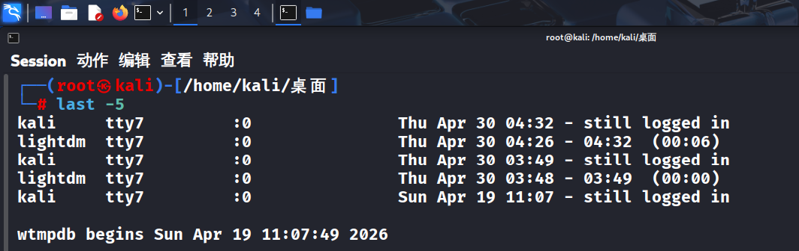

`journalctl` 是 Kali Linux 中查看系统日志的核心工具，基于 systemd 日志系统。常用命令包括：

| 功能 | 命令 |
|---|---|
| 查看所有日志 | `sudo journalctl` |
| 本次启动日志 | `sudo journalctl -b` |
| 实时跟踪 | `sudo journalctl -f` |
| 指定服务日志 | `sudo journalctl -u ssh` |
| 时间段查询 | `sudo journalctl --since "1 hour ago"` |
| 错误级别日志 | `sudo journalctl -p err` |
| 关键词搜索 | `sudo journalctl --grep="Failed"` |

在终端输入以下命令，验证输出效果并截图到实验报告中。查看本次启动成功的服务（前 20 个）：

```bash
sudo journalctl -b | grep "Started" | head -20
```

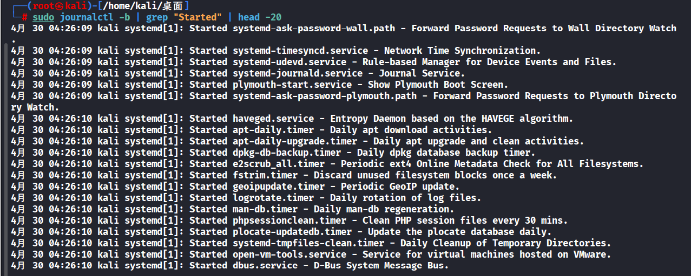

查看 SSH 登录失败记录：

```bash
sudo journalctl --grep="Failed password" -n 20
```

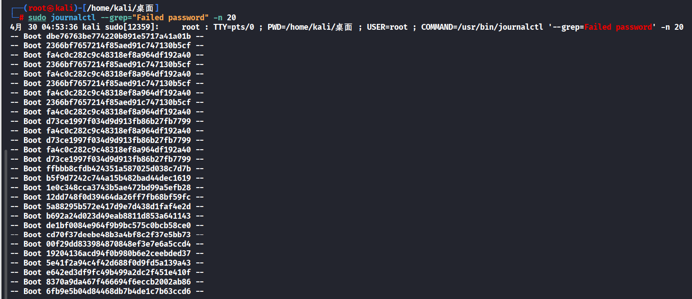

查看最近 1 小时的认证日志：

```bash
sudo journalctl -u ssh --since "1 hour ago" --no-pager
```

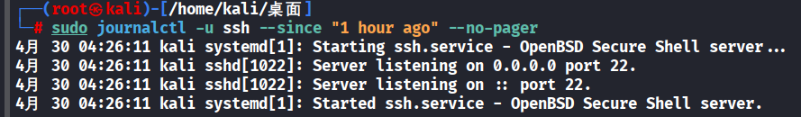

检查内核启动过程中的错误信息：

```bash
sudo dmesg | grep -i error
```


### 1.2 分析认证日志（登录记录）

查看 SSH 服务的最近 30 条认证记录：

```bash
sudo cat /var/log/auth.log | grep "sshd" | tail -30
```

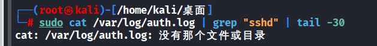

Kali 默认不再把认证日志写入 `/var/log/auth.log`，因此该命令报「没有那个文件或目录」，认证记录需改由 `journalctl -u ssh` 查询。

### 1.3 使用 journalctl 高级过滤

查看 SSH 服务最近 1 小时的完整日志（不分页显示）：

```bash
sudo journalctl -u ssh --since "1 hour ago" --no-pager
```

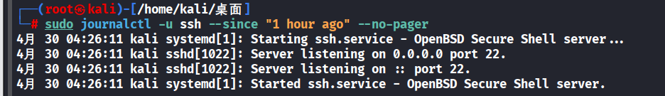

搜索包含「Failed password」的日志（最近 20 条）：

```bash
sudo journalctl --grep="Failed password" -n 20
```

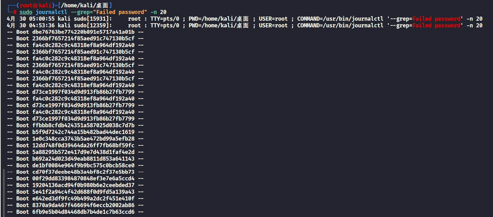

## 任务二：Windows 日志分析（使用样本文件）

使用 Windows 事件日志样本进行实验分析。该部分实验不一定需要在 Kali Linux 中进行，如果本机有相应工具，也可在本地 Windows 完成；本部分演示内容以本地 Windows 运行为主，需要提前安装好 Python 环境，这里使用的是 Anaconda 来构建 Python 虚拟环境。

### 2.0 使用 Windows 11 本地事件查看器（图形界面方式）

**步骤 1：打开事件查看器**

- 点击任务栏搜索图标（或按 Win + S）
- 输入「事件查看器」或「Event Viewer」
- 点击搜索结果中的「事件查看器」应用

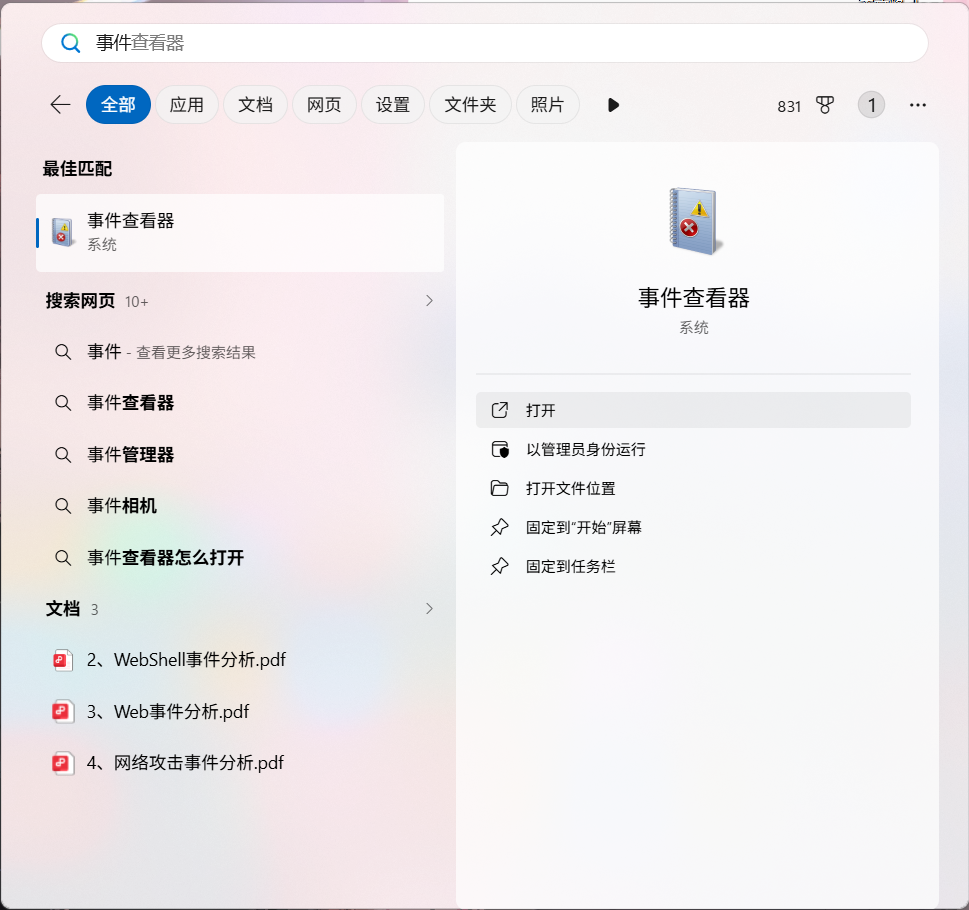

**步骤 2：导航到安全日志**

在事件查看器左侧导航栏进入「Windows 日志 → 安全」。

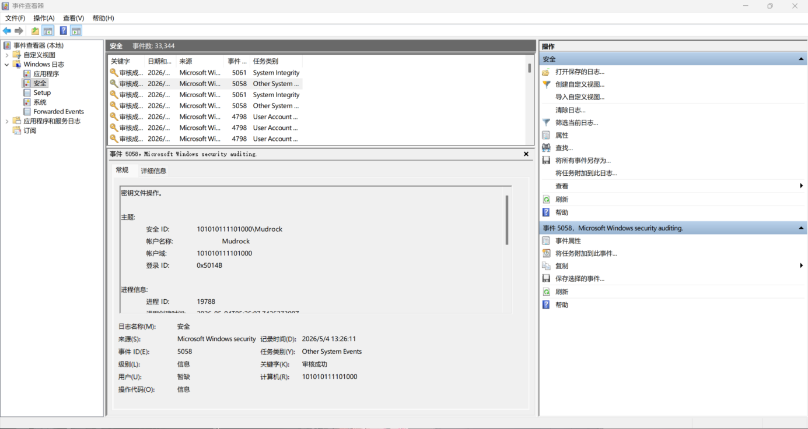

> 注意：首次查看「安全」日志时，若提示「无法找到事件」，说明当前未启用安全审计策略。可通过本地安全策略（secpol.msc）→ 本地策略 → 审核策略 → 启用「审核登录事件」。

**步骤 3：查看登录事件（4624/4625）**

- 点击「安全」日志后，右侧会显示所有安全事件列表
- 在右侧「操作」面板点击「筛选当前日志...」
- 在弹出窗口的「事件ID」输入框中输入：4624,4625
  - 4624：登录成功
  - 4625：登录失败
- 点击「确定」，系统将只显示登录相关事件

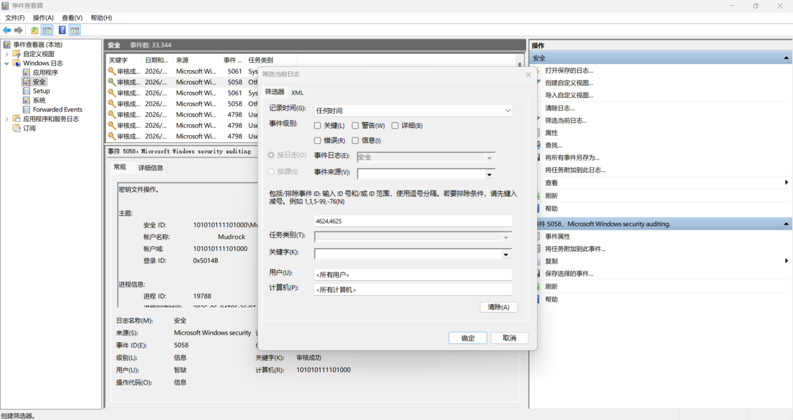

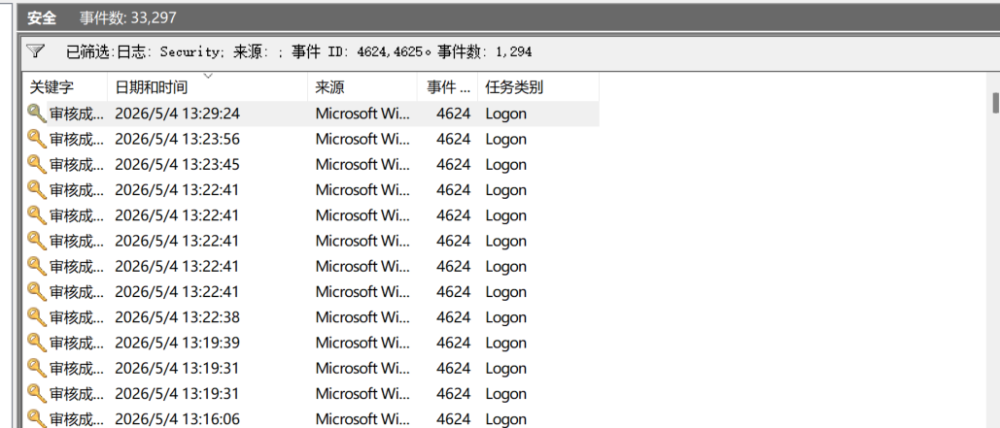

**步骤 4：查看事件详情**

双击任意事件（如事件 ID 4624），弹出「事件属性」窗口。关键字段查看：

- 常规选项卡：
  - Subject（发起者）：谁尝试登录
  - TargetUserName（目标用户名）：登录的账号
  - LogonType（登录类型）：2（交互式）、3（网络）、10（远程桌面）
  - IpAddress（源IP）：来自哪个 IP 地址
  - ProcessName：通过什么程序登录（如 chrome.exe、svchost.exe）
- 详细信息选项卡：可查看 XML 格式的原始数据

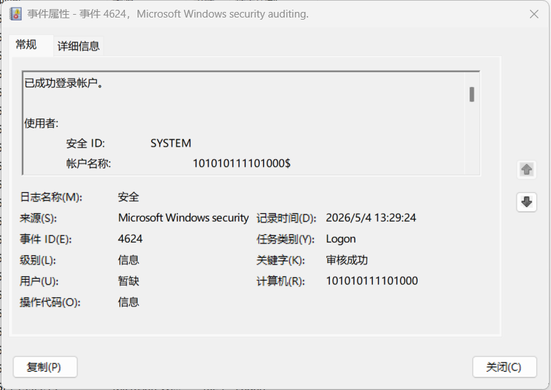

**步骤 5：导出日志（供后续 Python 分析）**

如需导出日志用于 2.2 节的 Python 脚本分析：

- 在「安全」日志上右键 → 「将所有事件另存为...」
- 选择保存类型为「事件文件 (*.evtx)」
- 命名文件（如 my-security-log.evtx），保存到桌面
- 在 2.2 节的 Python 脚本中，将文件路径修改为导出的文件路径即可分析自己的日志

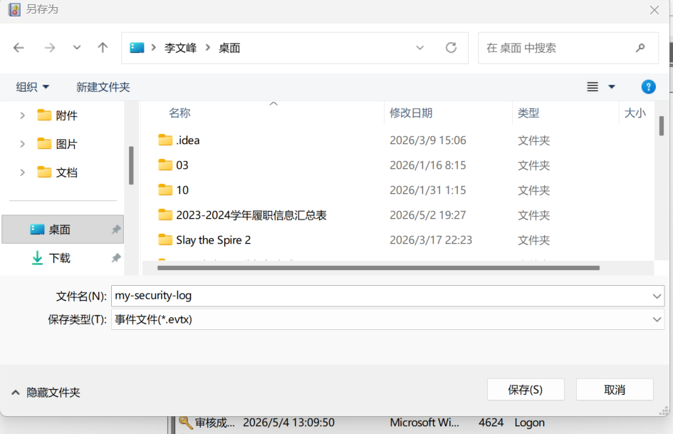

### 2.1 下载 Windows 日志样本文件

注意，实验 2.1 不会使用到 2.0 中的样本文件，请按以下实验操作步骤操作。实验选用推荐样本来自 EVTX-ATTACK-SAMPLES 项目：

GitHub 地址：https://github.com/sbousseaden/EVTX-ATTACK-SAMPLES

实验中提供的日志文件分别为：

- `CA_4624_4625_LogonType2_LogonProc_chrome.evtx`（Credential Access 目录）
  - 唯一同时包含 4624（登录成功）和 4625（登录失败）事件的文件
  - 包含 Chrome 相关的交互式登录（Logon Type 2）成功和失败记录
  - 适合分析登录失败和暴力破解场景
  - 下载链接：https://github.com/sbousseaden/EVTX-ATTACK-SAMPLES/raw/master/Credential%20Access/CA_4624_4625_LogonType2_LogonProc_chrome.evtx
- `LM_WMI_4624_4688_TargetHost.evtx`（Lateral Movement 目录）
  - 包含 WMI 横向移动产生的 4624 登录成功事件（Logon Type 3 网络登录）
  - 事件数量丰富，适合分析横向移动登录行为
  - 下载链接：https://github.com/sbousseaden/EVTX-ATTACK-SAMPLES/raw/master/Lateral%20Movement/LM_WMI_4624_4688_TargetHost.evtx

这些样本文件包含 Event ID 4624（登录成功）、4625（登录失败）等安全事件。

### 2.2 在 Windows 系统使用 Python 脚本进行日志解析

创建 python 脚本 `log-lab-exp1-analysis-Evtx1.py`，用于统计两类登录事件的数量：

```python
import Evtx.Evtx as evtx
from xml.dom import minidom

# 使用下载的样本文件路径
# evtx_file = "LM_WMI_4624_4688_TargetHost.evtx"
evtx_file = "CA_4624_4625_LogonType2_LogonProc_chrome.evtx"

success_count = 0
fail_count = 0

try:
    with evtx.Evtx(evtx_file) as log:
        for record in log.records():
            xml_data = record.xml()

            # 统计登录成功事件 (Event ID 4624)
            if "4624" in xml_data:
                success_count += 1
                if success_count <= 5:  # 显示前5条
                    print(f"[登录成功] 时间: {record.timestamp()}")

            # 统计登录失败事件 (Event ID 4625)
            elif "4625" in xml_data:
                fail_count += 1
                if fail_count <= 5:  # 显示前5条
                    print(f"[登录失败] 时间: {record.timestamp()}")

    print(f"\n========== 统计结果 ==========")
    print(f"登录成功次数 (Event ID 4624): {success_count}")
    print(f"登录失败次数 (Event ID 4625): {fail_count}")
    print(f"总计: {success_count + fail_count} 条安全事件")

except FileNotFoundError:
    print(f"错误: 找不到文件 {evtx_file}")
    print("请确保已下载EVTX-ATTACK-SAMPLES样本文件")
except Exception as e:
    print(f"解析错误: {e}")
```

执行后显示分析日志文件的 4624 和 4625 情况：解析 `CA_4624_4625_LogonType2_LogonProc_chrome.evtx` 统计到登录成功 3 次、登录失败 1 次，共 4 条安全事件；解析 `LM_WMI_4624_4688_TargetHost.evtx` 统计到登录成功 1294 次、登录失败 1 次，共 1295 条安全事件。

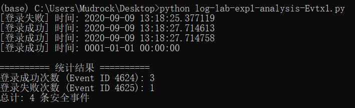

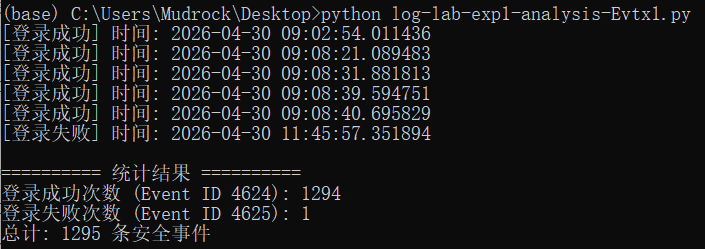

再创建第二个脚本，用于提取最近登录记录的关键字段：

```python
import Evtx.Evtx as evtx
import re

# 使用下载的样本文件路径
evtx_file = "LM_WMI_4624_4688_TargetHost.evtx"
# evtx_file = "CA_4624_4625_LogonType2_LogonProc_chrome.evtx"

print("========== 最近登录记录详情 ==========\n")

try:
    with evtx.Evtx(evtx_file) as log:
        count = 0
        for record in log.records():
            xml_data = record.xml()

            if "4624" in xml_data and count < 5:
                # 提取关键信息
                time_match = re.search(r'<TimeCreated SystemTime="([^"]+)"', xml_data)
                user_match = re.search(r'<Data Name="TargetUserName">([^<]+)</Data>', xml_data)
                ip_match = re.search(r'<Data Name="IpAddress">([^<]+)</Data>', xml_data)

                print(f"记录 {count+1}:")
                print(f"  时间: {time_match.group(1) if time_match else 'N/A'}")
                print(f"  用户: {user_match.group(1) if user_match else 'N/A'}")
                print(f"  来源IP: {ip_match.group(1) if ip_match else 'N/A'}")
                print("-" * 40)
                count += 1
except Exception as e:
    print(f"错误: {e}")
```

执行后显示分析日志文件的情况，输出前 5 条登录记录的时间、用户与来源 IP：

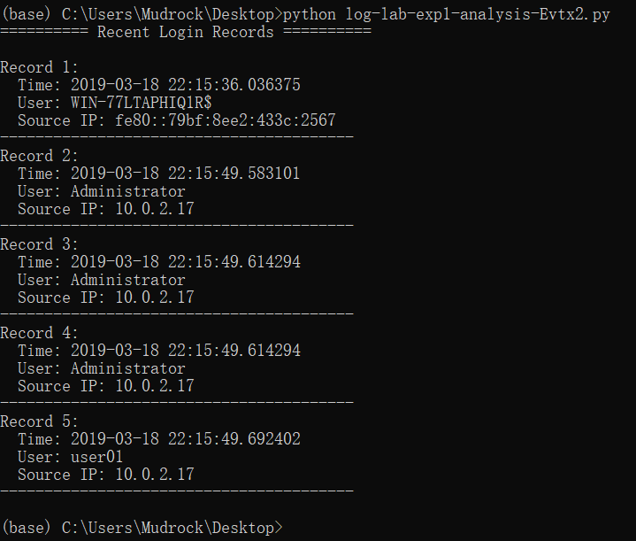

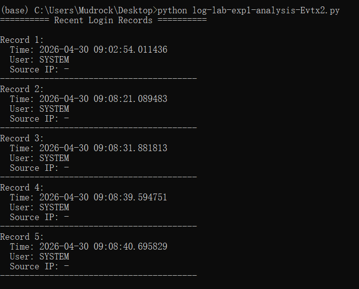

### 2.3 在 Kali Linux 系统使用 Python 脚本进行日志解析

Kali Linux 中自带有 python 3.13，运行以下命令安装 python-evtx 库：

```bash
sudo apt install -y python3-evtx
```

创建 2.2 中的 python 脚本，并运行 Python 脚本分析登录事件（结果应与 2.2 中一致）：

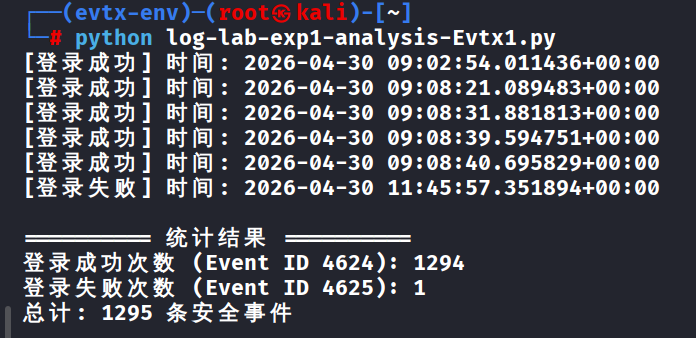

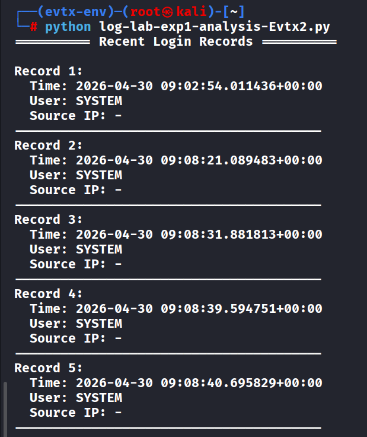

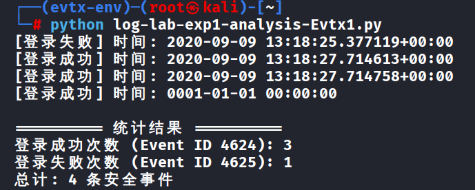

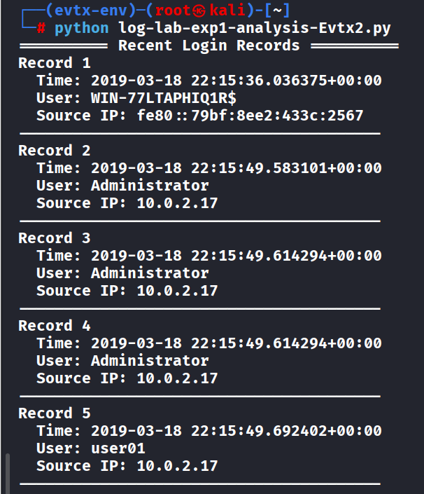

### 2.4 分析 EVTX-ATTACK-SAMPLES 项目中的其他日志文件

针对 4624 事件，查找其他带有 4624 关键字的日志文件，下载后使用上面的两个 python 分析脚本进行分析，并对分析结果进行截图。推荐尝试 `security_4624_4673_token_manip.evtx` 和 `DE_RDP_Tunneling_4624.evtx` 文件。

`security_4624_4673_token_manip.evtx`：统计到登录成功 1 次、登录失败 0 次，共 1 条安全事件，并输出该条登录记录的详情。

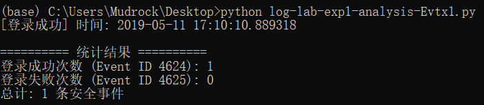

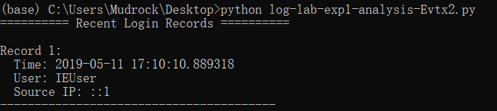

`DE_RDP_Tunneling_4624.evtx`：统计到登录成功 18 次、登录失败 0 次，共 18 条安全事件，并输出前 5 条登录记录详情。

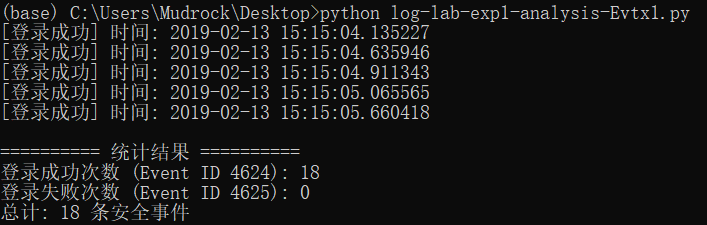

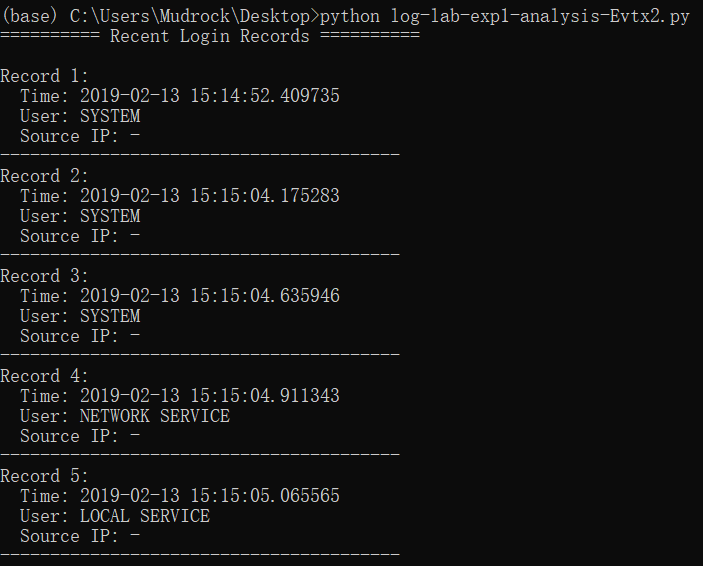

## 测试/调试及实验结果分析

### Linux 日志测试

`last -5` 输出最近 5 次登录记录；`journalctl -b | grep "Started" | head -20` 过滤出 20 个启动成功的服务；`journalctl --grep="Failed password"` 检索到 SSH 登录失败记录。

调试：无 sudo 权限导致 journalctl 报错，添加后解决；7-Zip 版本低导致镜像解压失败，升级后修复。

### Windows 日志测试

事件查看器筛选 4624（登录成功）、4625（登录失败），可查看用户、IP、登录类型等字段。

Python 脚本解析两类 Windows 日志样本的结果如下：

| 样本文件 | 登录成功（4624） | 登录失败（4625） | 总计 |
|---|---|---|---|
| CA_4624_4625_LogonType2_LogonProc_chrome.evtx | 3 | 1 | 4 |
| LM_WMI_4624_4688_TargetHost.evtx | 1294 | 1 | 1295 |

调试：路径错误导致 FileNotFoundError，修正后运行；pip 安装 python-evtx 超时，切换清华源解决。

## 实验结论

本实验达成预定目标：掌握了 Linux 本地日志查看工具链（last 查看登录历史、journalctl 过滤 systemd 日志、dmesg 排查内核错误）；理解了 Windows 日志格式与分析方法（.evtx 文件结构、事件 ID 4624/4625 含义），并能通过 Python 脚本实现 evtx 日志的自动化解析与统计。

## 实验体会

1、**Linux 日志分析心得**：journalctl 是基于 systemd 的统一日志管理工具，相比传统分散在 /var/log 下的日志文件，其支持按启动会话（-b）、服务（-u ssh）、时间（--since "1 hour ago"）、错误级别（-p err）等多维度过滤，大幅提升了日志查询效率；last 命令简洁轻量，适合快速排查异常登录。

2、**Windows 日志分析心得**：事件查看器的图形界面适合单条事件的手动溯源，但面对海量日志时效率低下；Python 结合 python-evtx 库可实现批量解析、自动统计（如暴力破解的失败次数统计）和关键字段提取，更适合规模化安全分析场景。

3、**问题与能力提升**：实验中解决了 VirtualBox 启动失败（BIOS 开启 VT-x 虚拟化）、GitHub 样本下载慢（使用 ghproxy 镜像加速）等问题，提升了环境配置与故障排查能力；后续可扩展分析权限提升（4672）、进程创建（4688）等其他 Windows 安全事件，完善日志分析维度。

---

### 实验流程图

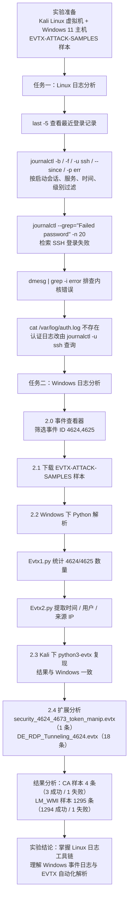

### 总体思路总结

- 日志入口：Linux 侧以 systemd 的 `journalctl` 为核心，按启动会话、服务、时间、级别四个维度过滤；Windows 侧以事件查看器 + 事件 ID 筛选为入口。
- 关键事件：登录类安全事件只有两个关键 ID——4624（登录成功）与 4625（登录失败），配合 LogonType、TargetUserName、IpAddress 三个字段即可还原一次登录行为。
- 自动化：python-evtx 把「人工翻日志」变成「脚本统计 + 字段提取」，LM_WMI 样本 1295 条记录用脚本秒级完成统计，人工翻查几乎不可行。
- 注意点：Kali 中 `/var/log/auth.log` 已不再写入认证日志，需改用 `journalctl -u ssh`；Windows 首次查看安全日志需先启用审核策略。
