---
AIGC:
    Label: "1"
    ContentProducer: 001191440300708461136T1XGW3
    ProduceID: 278e15af09c947df43b62560d322c33a_dc208a5bb40611f1812e525400248c00
    ReservedCode1: VMse/Pfg6b6SPNZnOyEn/QMt4qZZiWcRKbcd11GKyXiSmR2cedyc0m0J7P8rytZALv/g4PkKRYA59C77Aw71N1jhS0rS6UnQiXnyA0IXheBAJljcMoP7BC9sFyIjkRLKd5ivIl0u0EbydlgWzTjMUZbvwAg7jXCI8j3WU0Vwp04IT6/mVz/TaW1HUZU=
    ContentPropagator: 001191440300708461136T1XGW3
    PropagateID: 278e15af09c947df43b62560d322c33a_dc208a5bb40611f1812e525400248c00
    ReservedCode2: VMse/Pfg6b6SPNZnOyEn/QMt4qZZiWcRKbcd11GKyXiSmR2cedyc0m0J7P8rytZALv/g4PkKRYA59C77Aw71N1jhS0rS6UnQiXnyA0IXheBAJljcMoP7BC9sFyIjkRLKd5ivIl0u0EbydlgWzTjMUZbvwAg7jXCI8j3WU0Vwp04IT6/mVz/TaW1HUZU=
title: 日志收集与分析系统操作
published: 2026-09-19
pinned: false
description: 记录「日志收集与分析系统操作」实验的完整过程：在 Kali Linux 中用 Docker Compose 部署 Loki + Promtail + Grafana，实现本地 journald 日志的实时采集、集中存储与可视化展示，再通过 Grafana Explore 与自定义 LogQL 查询、Dashboard 面板完成日志级别分布统计与错误/警告趋势监控。
tags: [日志分析, Loki, Promtail, Grafana, Docker]
category: 日志审计
licenseName: ''
author: Mudrock
sourceLink: ''
slug: log-collection-loki-grafana
image: ./images/LogAuditExp2/log-01.png
---


记录「日志收集与分析系统操作」实验的完整过程：在 Kali Linux 中用 Docker Compose 部署 Loki + Promtail + Grafana，实现本地 journald 日志的实时采集、集中存储与可视化展示，再通过 Grafana Explore 与自定义 LogQL 查询、Dashboard 面板完成日志级别分布统计与错误/警告趋势监控。

## 实验目的与原理

**实验目的**：部署 Loki 日志系统，实现本地日志集中化（实时采集、存储查询、可视化展示）。

**实验原理**：在 Kali Linux 中部署 Loki + Grafana，用以收集和查看本地虚拟机系统的日志记录。经过实验 2 的操作，学生应该能够初步熟悉如何部署 Loki + Grafana，并为后续实验 3、4 的靶机日志收集与查看、基于 AI 算法的日志检测与分析等实验做好准备。

## 实验软硬件环境

- Kali Linux 虚拟机（以 VirtualBox 为例）
- Docker 与 Docker Compose（用于拉取并编排 grafana/loki:2.9.4、grafana/grafana:10.3.1、grafana/promtail:2.9.4 三个容器镜像）

## 任务一：部署 Loki + Grafana（以 Docker Compose 的方式）

### 步骤1：创建实验目录结构

```bash
# 创建实验目录
mkdir -p ~/log-lab/exp2
cd ~/log-lab/exp2

# 创建子目录
mkdir -p grafana-provisioning/datasources
mkdir -p grafana-provisioning/dashboards
mkdir -p loki-data
```

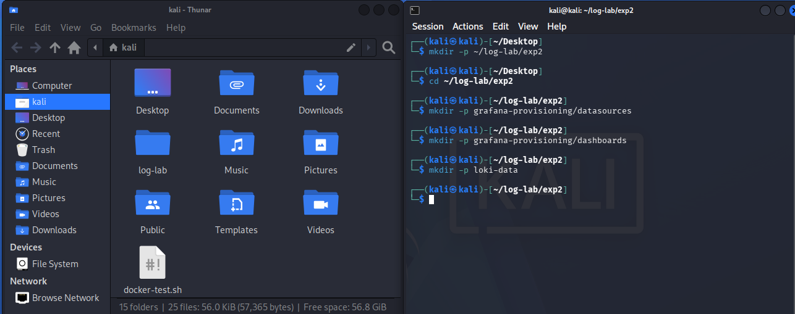

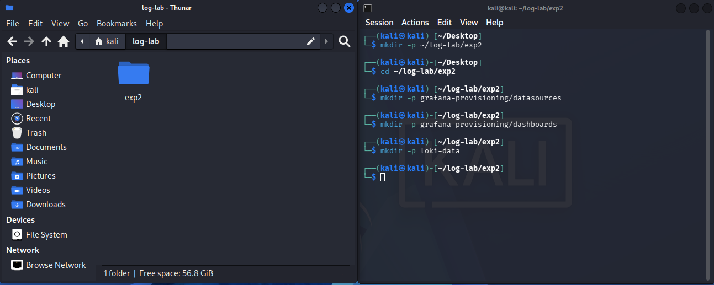

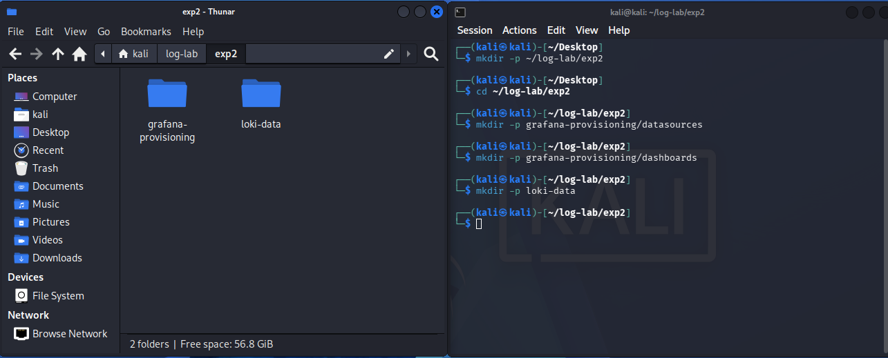

### 步骤2：拉取所需 Docker 镜像

```bash
# 拉取Loki、Grafana、Promtail镜像
docker pull grafana/loki:2.9.4
docker pull grafana/grafana:10.3.1
docker pull grafana/promtail:2.9.4

# 验证镜像已下载
docker images | grep grafana
```

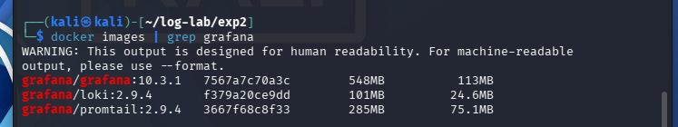

### 步骤3：创建 docker-compose.yml

注意：因为 Kali Linux 中 rsyslog 默认没开启，所以这里使用的配置为添加 Kali Linux 中使用的日志工具 journald 的日志目录挂载，如果要使用在一般的 Linux，以下命令需要作出相应修改。

使用以下命令，创建 docker-compose.yml：

```yaml
cat > docker-compose.yml <<'EOF'
version: '3.8'

services:
  loki:
    image: grafana/loki:2.9.4
    container_name: loki
    ports:
      - "3100:3100"
    volumes:
      - ./loki-config.yml:/etc/loki/local-config.yaml
      - loki-data:/loki
    command: -config.file=/etc/loki/local-config.yaml
    restart: unless-stopped
    networks:
      - loki-network
    healthcheck:
      test: ["CMD-SHELL", "wget --no-verbose --tries=1 --spider http://localhost:3100/ready || exit 1"]
      interval: 10s
      timeout: 5s
      retries: 5

  grafana:
    image: grafana/grafana:10.3.1
    container_name: grafana
    ports:
      - "3000:3000"
    environment:
      - GF_SECURITY_ADMIN_USER=admin
      - GF_SECURITY_ADMIN_PASSWORD=admin123
      - GF_USERS_ALLOW_SIGN_UP=false
    volumes:
      - grafana-data:/var/lib/grafana
      - ./grafana-provisioning:/etc/grafana/provisioning
    restart: unless-stopped
    networks:
      - loki-network
    depends_on:
      loki:
        condition: service_healthy

  promtail:
    image: grafana/promtail:2.9.4
    container_name: promtail
    volumes:
      - /var/log/journal:/var/log/journal:ro
      - /run/log/journal:/run/log/journal:ro
      - /etc/machine-id:/etc/machine-id:ro
      - ./promtail-config.yml:/etc/promtail/config.yml
    command: -config.file=/etc/promtail/config.yml
    restart: unless-stopped
    networks:
      - loki-network
    depends_on:
      - loki

networks:
  loki-network:
    driver: bridge

volumes:
  grafana-data:
  loki-data:
EOF
```

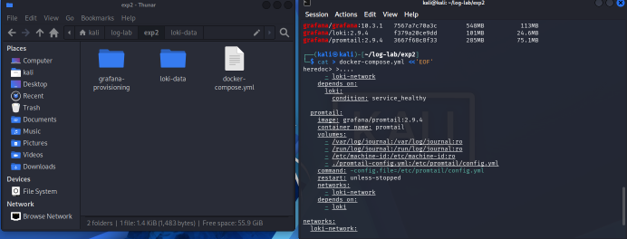

### 步骤4：创建 Loki 配置文件

```yaml
cat > loki-config.yml <<'EOF'
auth_enabled: false

server:
  http_listen_port: 3100
  grpc_listen_port: 9095

common:
  path_prefix: /loki
  storage:
    filesystem:
      chunks_directory: /loki/chunks
      rules_directory: /loki/rules
  replication_factor: 1
  ring:
    kvstore:
      store: inmemory

ingester:
  lifecycler:
    ring:
      kvstore:
        store: inmemory
      replication_factor: 1
  chunk_idle_period: 5m
  chunk_retain_period: 30s
  wal:
    dir: /loki/wal

schema_config:
  configs:
    - from: 2020-10-24
      store: boltdb-shipper
      object_store: filesystem
      schema: v11
      index:
        prefix: index_
        period: 24h

storage_config:
  boltdb_shipper:
    active_index_directory: /loki/boltdb-shipper-active
    cache_location: /loki/boltdb-shipper-cache
    cache_ttl: 24h
    shared_store: filesystem
  filesystem:
    directory: /loki/chunks

compactor:
  working_directory: /loki/boltdb-shipper-compactor
  shared_store: filesystem

limits_config:
  reject_old_samples: true
  reject_old_samples_max_age: 168h
  ingestion_rate_mb: 16
  ingestion_burst_size_mb: 32

chunk_store_config:
  max_look_back_period: 0s

table_manager:
  retention_deletes_enabled: false
  retention_period: 0s
EOF
```

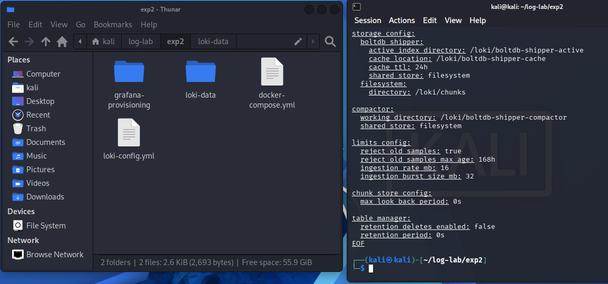

### 步骤5：创建 Promtail 配置文件

注意：因为 Kali Linux 中 rsyslog 默认没开启，所以这里使用的配置为添加 Kali Linux 中使用的日志工具 journald 的日志目录挂载，如果要使用在一般的 Linux，以下命令需要作出相应修改。

使用以下命令，创建 promtail 配置文件：

```yaml
cat > promtail-config.yml <<'EOF'
server:
  http_listen_port: 9080
  grpc_listen_port: 0

positions:
  filename: /tmp/positions.yaml

clients:
  - url: http://loki:3100/loki/api/v1/push

scrape_configs:
  - job_name: journal
    journal:
      max_age: 12h
      labels:
        job: systemd-journal
        host: kali-linux
    relabel_configs:
      - source_labels: ['__journal__systemd_unit']
        target_label: 'unit'
      - source_labels: ['__journal__hostname']
        target_label: 'hostname'
      - source_labels: ['__journal__transport']
        target_label: 'transport'
      - source_labels: ['__journal_priority_keyword']
        target_label: 'level'
EOF
```

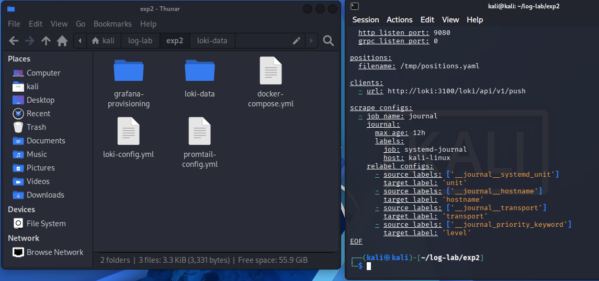

### 步骤6：创建 Grafana 数据源自动配置

```yaml
cat > grafana-provisioning/datasources/loki.yml <<'EOF'
apiVersion: 1

datasources:
  - name: Loki
    type: loki
    access: proxy
    url: http://loki:3100
    isDefault: true
    editable: false
    jsonData:
      maxLines: 1000
      derivedFields:
        - name: "IP Address"
          matcherRegex: "from\\s+(\\d+\\.\\d+\\.\\d+\\.\\d+)"
          url: "$${__value.raw}"
EOF
```

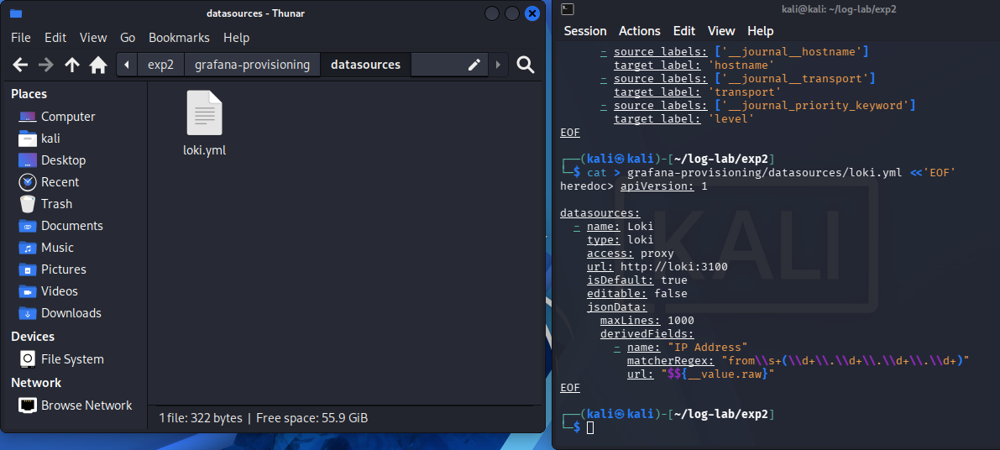

### 步骤7：启动服务

```bash
# 确保在exp2目录
cd ~/log-lab/exp2

# 启动所有服务（后台运行）
docker-compose up -d
```

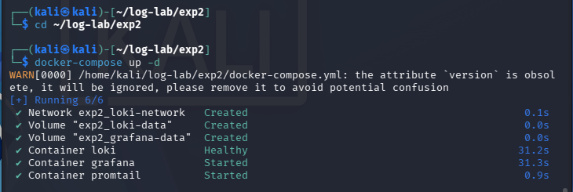

```bash
# 查看启动状态
docker-compose ps
```

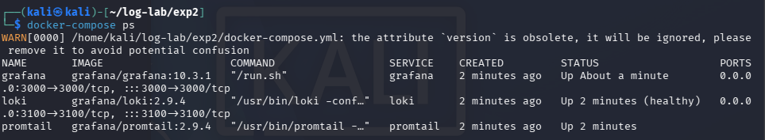

```bash
# 查看日志（排查问题）
docker-compose logs -f
```

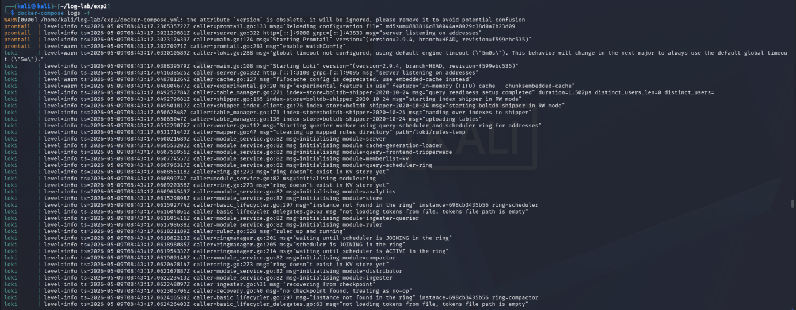

### 步骤8：验证服务

```bash
# 等待10秒后检查Loki状态
curl http://localhost:3100/ready

# 预期输出：ready
```

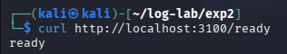

```bash
# 检查Grafana
curl -I http://localhost:3000/login

# 预期输出：HTTP/1.1 200 OK
```

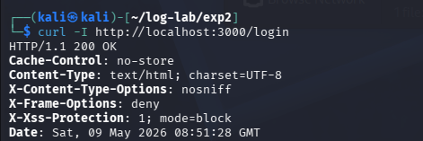

```bash
# 查看Promtail日志确认正常
docker-compose logs -f promtail

# 预期输出：
# level=info ts=... caller=journaltargetmanager.go:... msg="starting journal target"
# level=info ts=... caller=journaltarget.go:... msg="receiving journal entries"
```

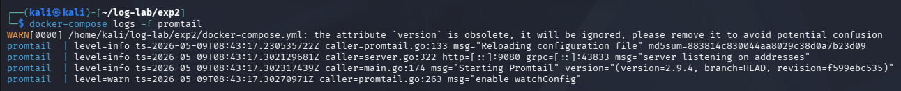

验证日志采集：

```bash
# 检查Loki是否收到journal日志
curl -s "http://localhost:3100/loki/api/v1/label/job/values"

# 预期输出：systemd-journal
```

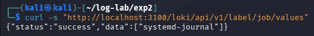

生成测试日志验证：

```bash
# 产生系统日志
logger "TEST_MESSAGE_FOR_LOKI_JOURNALD_$(date +%s)"
sudo logger -p auth.warning "SUDO_TEST_AUTH_LOG_$(date +%s)"

# 查看journald确认
journalctl -n 10 --no-pager | grep TEST_MESSAGE

# 等待5秒后查询Loki
sleep 5

# 查询Loki（修正版）
curl -s -G \
  --data-urlencode 'query={job="systemd-journal"} |= "TEST_MESSAGE"' \
  --data-urlencode "start=$(date -d '5 minutes ago' +%s)000000000" \
  --data-urlencode "end=$(date +%s)000000000" \
  --data-urlencode 'limit=5' \
  "http://localhost:3100/loki/api/v1/query_range" | jq -r '.data.result[].values[][1]'
```

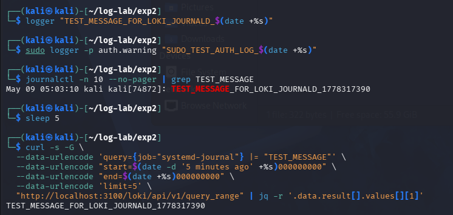

### 步骤9：访问 Grafana

在 Kali 本机访问：

```bash
# 打开浏览器访问
http://localhost:3000
```

如果在宿主机访问（端口转发已配置）：

```text
http://127.0.0.1:3000
```

登录信息：

- 用户名：admin
- 密码：admin123

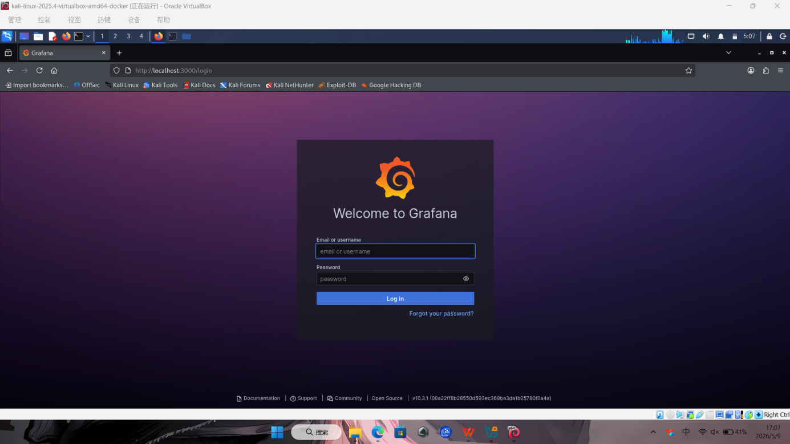

成功登录后的界面：

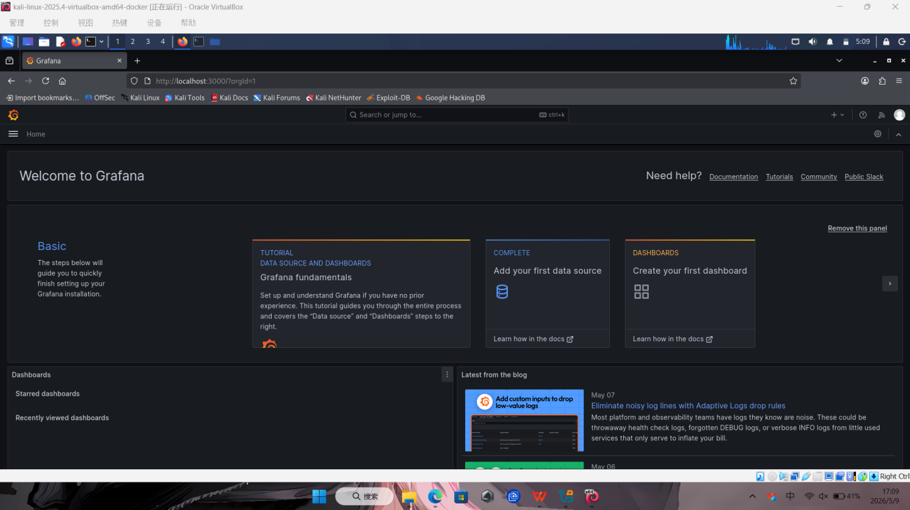

### 步骤10：验证 Loki 数据源

登录 Grafana 后，点击左侧 ☰ → Connections → Data Sources，确认 Loki 已存在且状态为 Working（绿色）。

如未自动配置，手动添加：

1. 点击 Add data source
2. 选择 Loki
3. URL 填写：http://loki:3100
4. 点击 Save & Test

Loki 数据源配置正常的界面如图：

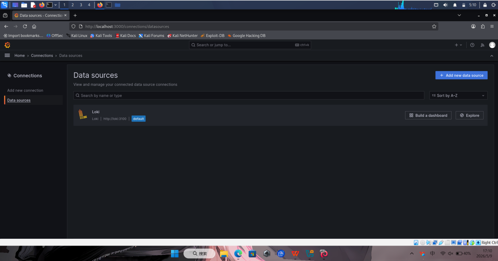

### 步骤11：测试日志查询

点击左侧 Explore 图标（指南针），选择 Loki 数据源：

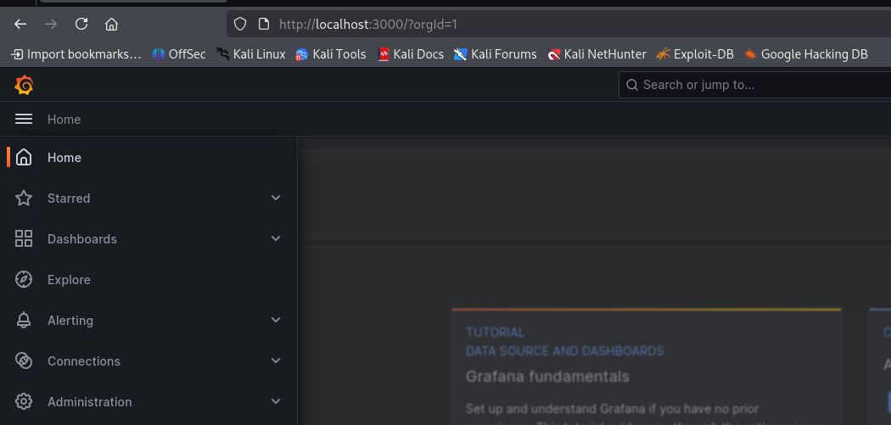

```text
# 查询所有journal日志
{job="systemd-journal"}，如图：
```

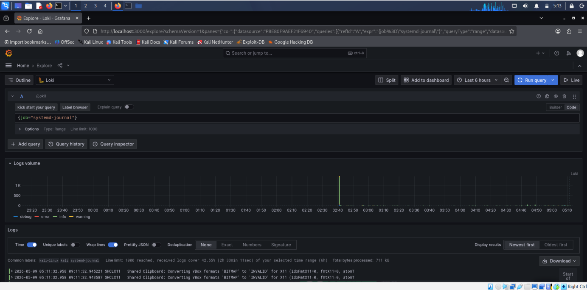

```text
# 按服务单元过滤
{job="systemd-journal", unit="ssh.service"}
{job="systemd-journal", unit="docker.service"}，执行结果如图：
```


```text
# 按日志级别过滤
{job="systemd-journal", level="err"}
{job="systemd-journal", level="warning"}，执行结果如图：
```

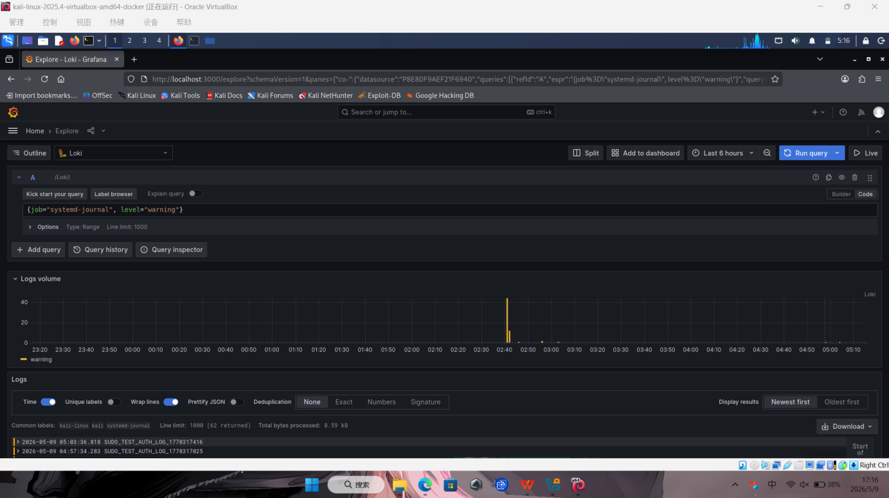

```text
# 按主机名过滤
{job="systemd-journal", hostname="kali"}
```

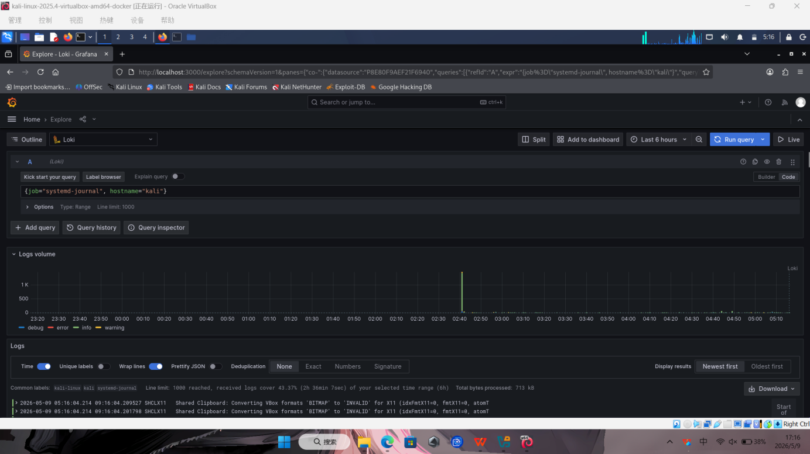

```text
# 搜索特定关键词
{job="systemd-journal"} |= "sudo"
{job="systemd-journal"} |= "TEST"
{job="systemd-journal"} |= "failed"，执行结果如图：
```

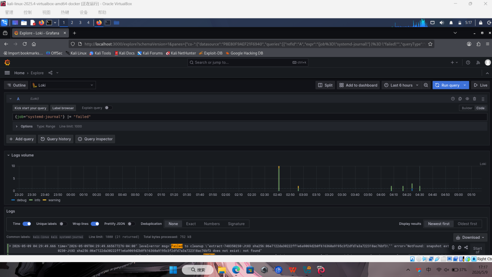

注意，上述查询命令大部分应该是可以成功的，失败的原因大概率在于系统没执行过该服务，比如 ssh。

## 任务二：Grafana 实时监控日志情况

### 步骤1：创建 Dashboard

1. 登录 Grafana：http://localhost:3000（admin/admin123）
2. 点击左侧 ☰ → Dashboards
3. 点击右上角 New → New Dashboard
4. 点击 Add visualization（添加第一个 Panel）

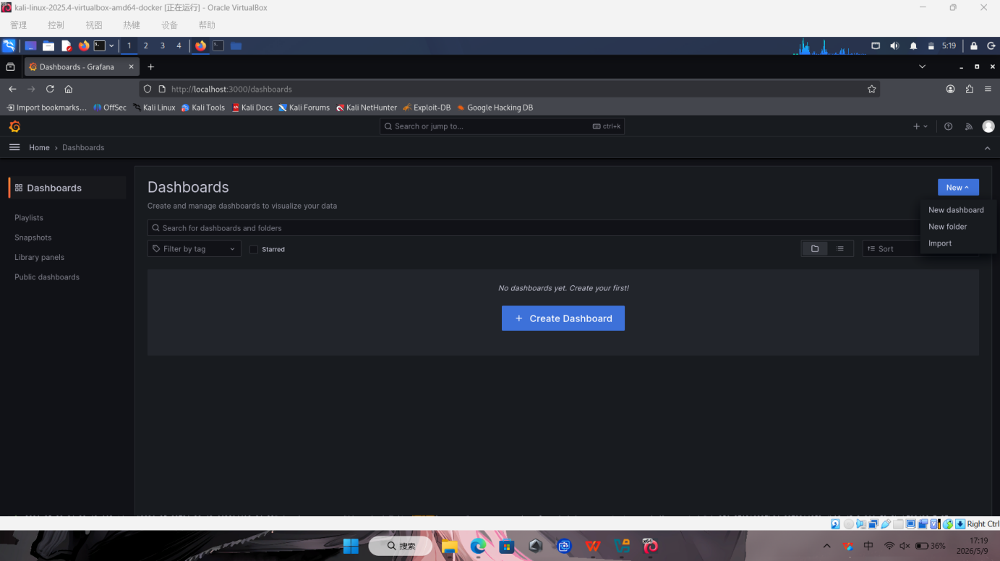

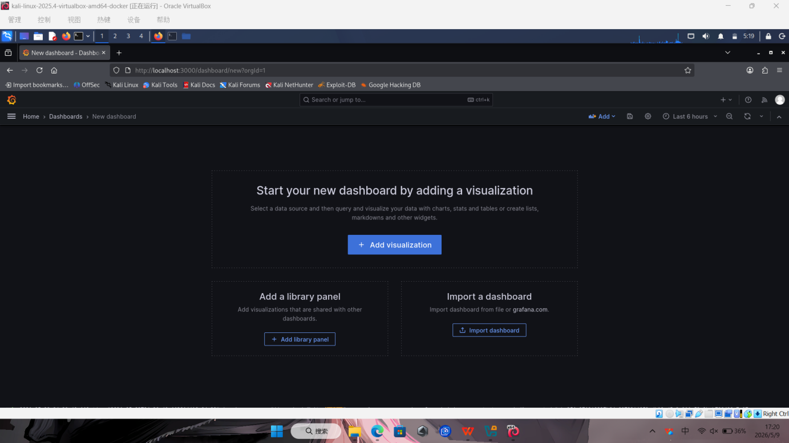

### 步骤2：创建 Panel 1 —— 日志级别分布（Stat 图表）

配置面板的查询命令：

| Query | LogQL | Legend |
|---|---|---|
| A | `sum(count_over_time({job="systemd-journal", level="err"}[12h]))` | 错误 |
| B | `sum(count_over_time({job="systemd-journal", level="warning"}[12h]))` | 警告 |
| C | `sum(count_over_time({job="systemd-journal", level="info"}[12h]))` | 信息 |

配置面板的显示信息：

| 设置项 | 值 |
|---|---|
| Title | 日志级别分布 |
| Visualization | Stat |
| Orientation | Horizontal |
| Color scheme | Classic palette |

设置 Legend 名称：

- Query A → Options → Legend: ❌ 错误
- Query B → Options → Legend: ⚠️ 警告
- Query C → Options → Legend: ℹ️ 信息

设置选项和呈现效果如图：

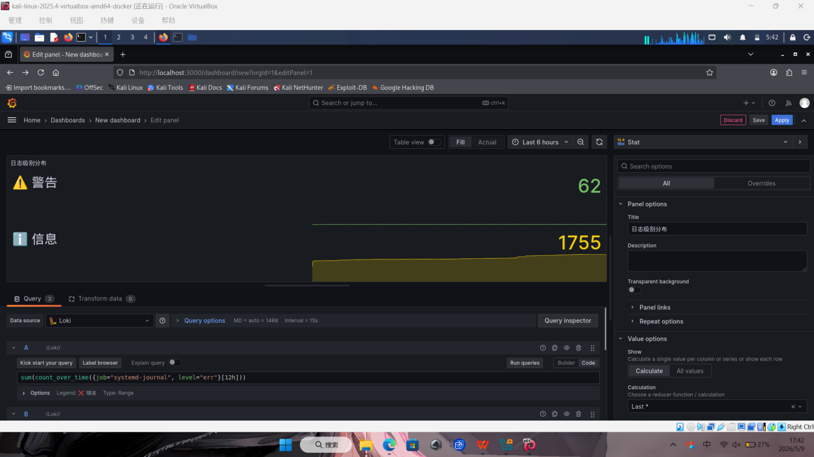

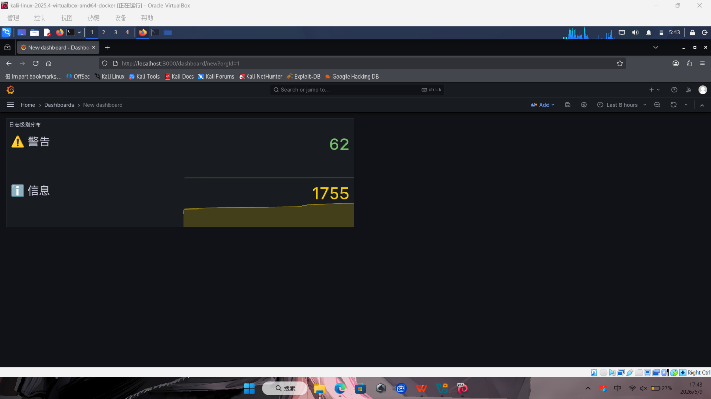

### 步骤3：创建 Panel 2 —— 错误与警告趋势（Time series）

点击右上角 Add → Visualization。

配置查询：

| Query | LogQL | Legend |
|---|---|---|
| A | `sum(rate({job="systemd-journal", level="err"}[10m]))` | 错误日志 |
| B | `sum(rate({job="systemd-journal", level="warning"}[10m]))` | 警告日志 |

设置 Legend 名称：

- Query A → 右侧 Options → Legend: ❌ 错误日志
- Query B → 右侧 Options → Legend: ⚠️ 警告日志

配置显示：

| 设置项 | 值 |
|---|---|
| Title | 错误与警告趋势 |
| Visualization | Time series |
| Line width | 2 |
| Fill opacity | 20 |
| Point size | 5 |

配置 Legend（右侧边栏）：

- Visibility: ✓ 显示
- Mode: Table
- Placement: Bottom
- Values: [x] Last [x] Mean

显示效果如图：

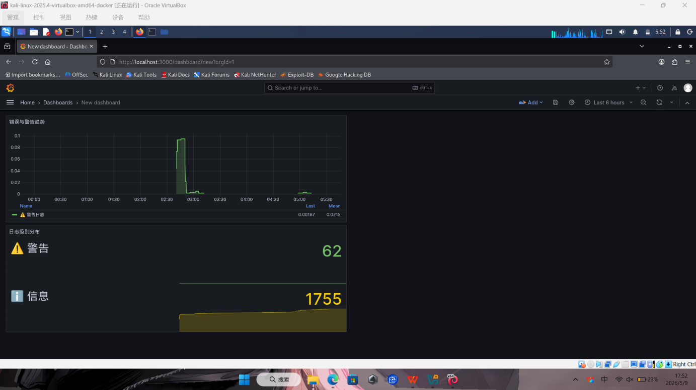

### 步骤4：保存 Dashboard

1. 点击右上角 Save dashboard（💾 图标）
2. Dashboard name: Kali-Journal-Logs
3. Description: Kali Linux journald日志监控
4. 点击 Save

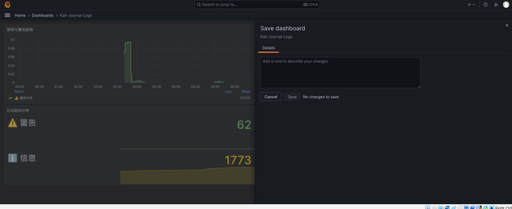

### 步骤5：导出 JSON（实验报告用）

1. 点击设置图标（⚙️）→ JSON Model
2. 点击 Download 保存为 kali-journal-dashboard.json，或复制 JSON 内容保存

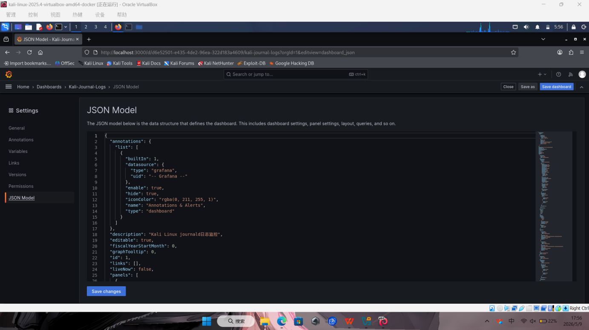

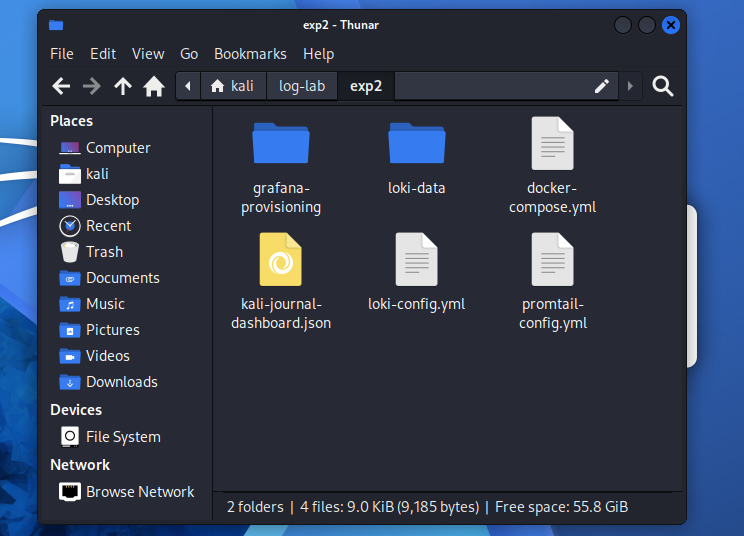

### 步骤6：完成实验，关闭浏览器并停止 docker compose 服务

在终端对应的文件夹 log-lab/exp2 输入 `docker-compose stop`，确保所有容器均关闭，否则在进行后续实验的时候其依然在后台运行，占用相关端口，导致后续的实验无法正常进行。

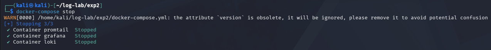

## 测试/调试及实验结果分析

任务 1 部署过程中，首先通过 `mkdir -p` 命令成功创建了 `~/log-lab/exp2` 目录及子目录 `grafana-provisioning/datasources`、`grafana-provisioning/dashboards`、`loki-data`。接着执行 `docker pull` 命令拉取所需镜像，通过 `docker images | grep grafana` 验证，确认 grafana/loki:2.9.4、grafana/grafana:10.3.1、grafana/promtail:2.9.4 三个镜像均已下载完成。随后创建 docker-compose.yml、loki-config.yml、promtail-config.yml 及 Grafana 数据源配置文件，内容符合实验手册要求，针对 Kali Linux 的 journald 日志采集进行了正确的目录挂载配置。

启动服务时，在 exp2 目录下执行 `docker-compose up -d`，通过 `docker-compose ps` 查看容器状态，loki、grafana、promtail 均为 Up 状态；查看 promtail 日志，输出 “starting journal target” 和 “receiving journal entries”，表明日志采集功能正常。验证环节，`curl http://localhost:3100/ready` 返回 “ready”，说明 Loki 服务就绪；`curl -I http://localhost:3000/login` 返回 HTTP/1.1 200 OK，确认 Grafana 可访问。通过 logger 命令生成测试日志 “TEST_MESSAGE_FOR_LOKI_JOURNALD_xxx”，`journalctl -n 10 --no-pager | grep TEST_MESSAGE` 能查到该日志，等待 5 秒后用 curl 查询 Loki 接口，结合 jq 工具成功返回测试日志内容，验证了日志从采集到存储的全流程正常。

任务 2 创建 Grafana 面板时，首先在 Explore 界面用 `{job="systemd-journal"}` 查询所有 journal 日志，再用按级别、单元等过滤的 LogQL 语句测试，均能返回正确结果。创建“日志级别分布”Stat 面板时，输入三个 LogQL 查询（分别对应错误、警告、信息级别），设置 Legend 为中文，可视化类型为 Stat、水平排列、经典配色，面板正确显示了各级别的日志数量。创建“错误与警告趋势”Time series 面板时，使用 rate 函数计算 10 分钟内的错误和警告日志速率，设置 Line width 为 2、Fill opacity 为 20、Point size 为 5，Legend 显示在底部并展示 Last 和 Mean 值，面板正常展示了趋势曲线。

调试过程中曾遇到 curl 查询 Loki 时提示 “Command 'jq' not found”，通过 `sudo apt install jq` 安装后解决问题；初始拉取 Docker 镜像速度较慢，通过配置国内镜像加速器后拉取速度显著提升。

## 实验结论

本次实验成功通过 Docker Compose 部署了 Loki + Promtail + Grafana 日志系统，实现了 Kali Linux 本地 journald 日志的实时采集、集中存储和可视化展示。Promtail 正确挂载了 Kali 的 journal 日志目录，将日志推送到 Loki 存储；Grafana 自动配置了 Loki 数据源，通过自定义 LogQL 查询和面板配置，实现了日志级别分布统计和错误/警告趋势的可视化，达到了实验目标。

## 实验体会

1、**部署层面**：通过本次实验，初步掌握了 Docker Compose 多容器应用的部署方法，理解了 Loki 日志系统的核心组件（Loki 存储、Promtail 采集、Grafana 可视化）的协作流程，熟悉了针对 journald 日志的 Promtail 配置方式。

2、**查询与可视化层面**：在 Grafana 面板配置过程中，学会了使用 LogQL 进行日志聚合查询（如 count_over_time、rate 函数），以及调整可视化选项（如 Stat、Time series 的类型设置，Legend 命名，配色方案等）。

3、**问题与能力提升**：实验中遇到的 jq 工具缺失、镜像拉取慢等问题，让我意识到依赖管理和环境配置的重要性，通过排查和解决这些问题，提升了故障排查能力。本次实验为后续实验 3（靶机日志收集）和实验 4（AI 日志分析）打下了坚实基础，让我对日志系统的实际应用有了更直观的认识。

---

### 实验流程图


```mermaid
graph TD
    A["实验准备<br/>Kali Linux 虚拟机 + Docker/Compose"] --> B["任务一：部署 Loki + Grafana"]
    B --> B1["创建实验目录 ~/log-lab/exp2<br/>grafana-provisioning / loki-data"]
    B1 --> B2["docker pull 拉取三镜像<br/>loki:2.9.4 / grafana:10.3.1 / promtail:2.9.4"]
    B2 --> B3["编写 docker-compose.yml<br/>loki + grafana + promtail 三服务"]
    B3 --> B4["编写 loki-config.yml<br/>boltdb-shipper + filesystem 存储"]
    B4 --> B5["编写 promtail-config.yml<br/>挂载 journald 日志目录并重写标签"]
    B5 --> B6["编写 datasources/loki.yml<br/>Grafana 数据源自动配置"]
    B6 --> B7["docker-compose up -d 启动服务"]
    B7 --> B8["验证：/ready 返回 ready<br/>/login 返回 200 OK"]
    B8 --> B9["logger 生成测试日志<br/>curl + jq 查询 Loki 验证采集链路"]
    B9 --> C["任务二：Grafana 日志监控"]
    C --> C1["Explore 中用 LogQL 过滤查询<br/>unit / level / hostname / 关键词"]
    C1 --> C2["Panel 1：日志级别分布（Stat）<br/>count_over_time 统计 err/warning/info"]
    C2 --> C3["Panel 2：错误与警告趋势（Time series）<br/>rate 计算 10 分钟日志速率"]
    C3 --> C4["保存 Dashboard：Kali-Journal-Logs"]
    C4 --> C5["导出 JSON：kali-journal-dashboard.json"]
    C5 --> D["docker-compose stop 停止容器<br/>结论：journald 日志采集-存储-可视化链路打通"]
```

### 总体思路总结

- 组件分工：Promtail 负责采集（挂载 `/var/log/journal`、`/run/log/journal` 与 `/etc/machine-id`），Loki 负责存储与索引（boltdb-shipper + filesystem），Grafana 负责查询与可视化，三者通过 `loki-network` 桥接网络互联。
- 配置自动化：Grafana 数据源通过 `grafana-provisioning/datasources/loki.yml` 自动注入，容器启动后无需手动添加数据源即可直接用 Loki 查询。
- 查询入口：Explore 界面是验证 LogQL 的主入口，标签（job/unit/level/hostname）+ 管道过滤（`|=`）组合即可快速定位某一服务或某一类级别的日志。
- 可视化要点：Stat 面板适合表达“各级别日志数量”这类聚合值，Time series + rate 适合表达“错误/警告随时间变化的趋势”，Legend 命名与单位决定面板可读性。
- 注意点：`version` 字段在较新版本的 docker-compose 中已废弃（会有 WARN 提示）；实验结束必须 `docker-compose stop`，否则容器继续占用 3000/3100 端口影响后续实验。
